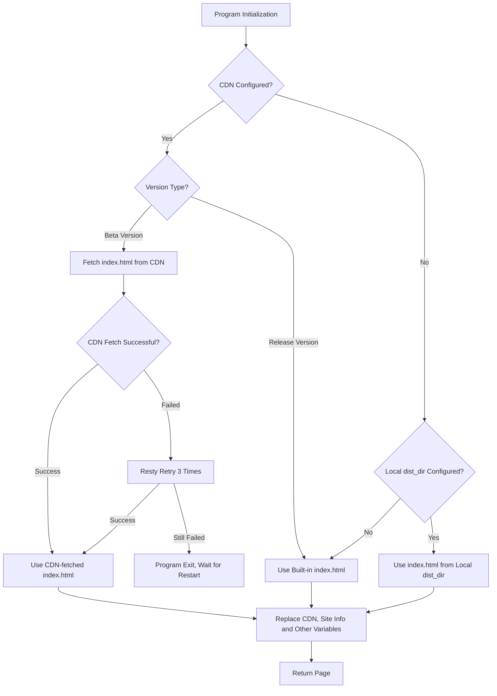
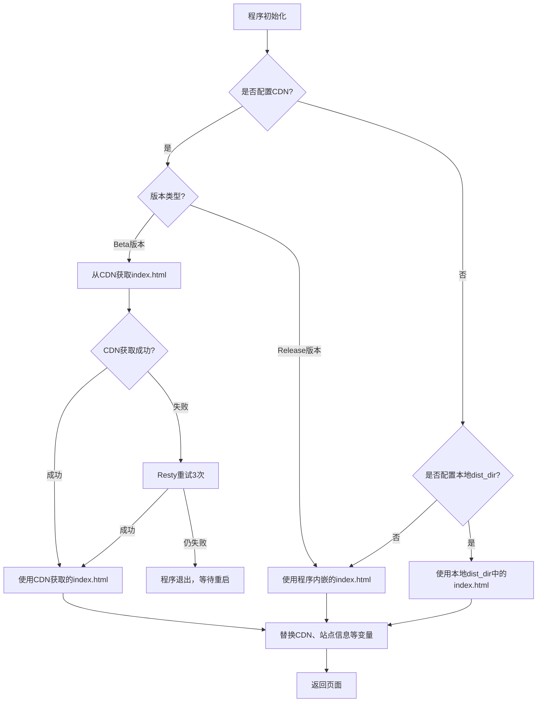

---
title:
  en: Configuration
  zh-CN: 配置文件
categories:
  - configuration
# A page can have multiple tags
top: 70
---

### Initial config { lang="en" }

### 初始配置 { lang="zh-CN" }

::: en
::: tip
After modifying the configuration file, restart OpenList for changes to take effect

- Windows/macOS: `<openlist dir>/data/config.json`
- Linux: one-click script directory, `/opt/openlist/data/config.json` or `<openlist dir>/data/config.json`
- Docker: `<docker container dir>/data/config.json`
- OpenWrt: modify config on server if using `luci-app-openlist` , otherwise `<openlist dir>/data/config.json`
- Other: `<openlist dir>/data/config.json`

:::

::: zh-CN
::: tip
`config.json` 内配置文件修改后都需要重启 OpenList 才会生效

- Windows/macOS: `<openlist dir>/data/config.json`
- Linux：一键脚本路径 `/opt/openlist/data/config.json`，手动安装 `<openlist dir>/data/config.json`
- Docker: `<docker container dir>/data/config.json`
- OpenWrt: 如果使用 `luci-app-openlist`，请在网页修改，否则为 `<openlist dir>/data/config.json`
- Other: `<openlist dir>/data/config.json`

:::

```json
{
  "force": false,
  "site_url": "",
  "cdn": "",
  "jwt_secret": "random_generated",
  "token_expires_in": 48,
  "database": {
    "type": "sqlite3",
    "host": "",
    "port": 0,
    "user": "",
    "password": "",
    "name": "",
    "db_file": "data\\data.db",
    "table_prefix": "x_",
    "ssl_mode": "",
    "dsn": ""
  },
  "meilisearch": {
    "host": "http://localhost:7700",
    "api_key": "",
    "index_prefix": ""
  },
  "scheme": {
    "address": "0.0.0.0",
    "http_port": 5244,
    "https_port": -1,
    "force_https": false,
    "cert_file": "",
    "key_file": "",
    "unix_file": "",
    "unix_file_perm": "",
    "enable_h2c": false
  },
  "temp_dir": "data\\temp",
  "bleve_dir": "data\\bleve",
  "dist_dir": "",
  "log": {
    "enable": true,
    "name": "data\\log\\log.log",
    "max_size": 50,
    "max_backups": 30,
    "max_age": 28,
    "compress": false,
    "filter": {
      "enable": false,
      "filters": [
        {
          "cidr": "",
          "path": "/ping",
          "method": ""
        },
        {
          "cidr": "",
          "path": "",
          "method": "HEAD"
        },
        {
          "cidr": "",
          "path": "/dav/",
          "method": "PROPFIND"
        }
      ]
    }
  },
  "delayed_start": 0,
  "max_connections": 0,
  "max_concurrency": 64,
  "tls_insecure_skip_verify": true,
  "tasks": {
    "download": {
      "workers": 5,
      "max_retry": 1,
      "task_persistant": false
    },
    "transfer": {
      "workers": 5,
      "max_retry": 2,
      "task_persistant": false
    },
    "upload": {
      "workers": 5,
      "max_retry": 0,
      "task_persistant": false
    },
    "copy": {
      "workers": 5,
      "max_retry": 2,
      "task_persistant": false
    },
    "decompress": {
      "workers": 5,
      "max_retry": 2,
      "task_persistant": false
    },
    "decompress_upload": {
      "workers": 5,
      "max_retry": 2,
      "task_persistant": false
    },
    "allow_retry_canceled": false
  },
  "cors": {
    "allow_origins": ["*"],
    "allow_methods": ["*"],
    "allow_headers": ["*"]
  },
  "s3": {
    "enable": false,
    "port": 5246,
    "ssl": false
  },
  "ftp": {
    "enable": false,
    "listen": ":5221",
    "find_pasv_port_attempts": 50,
    "active_transfer_port_non_20": false,
    "idle_timeout": 900,
    "connection_timeout": 30,
    "disable_active_mode": false,
    "default_transfer_binary": false,
    "enable_active_conn_ip_check": true,
    "enable_pasv_conn_ip_check": true
  },
  "sftp": {
    "enable": false,
    "listen": ":5222"
  },
  "last_launched_version": "OpenList version"
}
```

## Field Explanation { lang="en" }

## 字段说明 { lang="zh-CN" }

### force

::: en
By default OpenList reads the configuration from environment variables, set this field to `true` to force OpenList to read config from the configuration file.
<br/>
:::
::: zh-CN
程序会优先从环境变量中读取配置，设置 `force` 为 `true` 会使程序忽略环境变量强制读取配置文件。
<br/>
:::

### site_url

::: en
The address of your OpenList server, such as `https://pan.example.com`. This address is essential for some features, and thus thry may not work properly if unset:

- thumbnailing `LocalStorage`
- previewing site after setting web proxy
- displaying download address after setting web proxy
- reverse-proxying to site sub directories
- ...

Do not include the slash \(`/`\) at the end of the address. For example:

```diff
+ "site_url": "https://openlist.example.com",
- "site_url": "https://openlist.example.com/",
```

:::
::: zh-CN
你的网站 URL，比如 `https://pan.example.com`，这个地址会在程序中的某些地方使用，如果不设置这个字段，一些功能可能无法正常工作，比如

- 本地存储的缩略图
- 开启 web 代理后的预览
- 开启 web 代理后的下载地址
- 反向代理至二级目录
- ...

URL 链接结尾请勿携带 `/` ，参照如下示例，否则也将无法使用上述功能或出现异常

```diff
+ "site_url": "https://openlist.example.com",
- "site_url": "https://openlist.example.com/",
```

:::

### cdn

::: en
The address of the CDN. Included `$version` values will be dynamically replaced by the version of OpenList. Existing dist resources are hosted on both npm and GitHub, which can be found at:
:::
::: zh-CN
CDN 地址，如果要使用 CDN，可以设置该字段，`$version` 会被动态替换为 `Openlist-Frontend` 的实际版本。
:::

- https://www.npmjs.com/package/@openlist-frontend/openlist-frontend
- https://github.com/OpenListTeam/Openlist-Frontend

::: en
Thus it is possible to use any npm or ~~GitHub~~ CDN path for this field. For example:
:::
::: zh-CN
所以你可以使用任何 npm 或 ~~GitHub~~ CDN 作为路径，例如：
:::

- `https://registry.npmmirror.com/@openlist-frontend/openlist-frontend/$version/files/dist/`
- `https://unpkg.com/@openlist-frontend/openlist-frontend@$version/dist/`
- `https://cdn.jsdelivr.net/npm/@openlist-frontend/openlist-frontend@$version/dist/`
- `https://fastly.jsdelivr.net/npm/@openlist-frontend/openlist-frontend@$version/dist/`
- `https://gcore.jsdelivr.net/npm/@openlist-frontend/openlist-frontend@$version/dist/`
- `https://jsd.onmicrosoft.cn/npm/@openlist-frontend/openlist-frontend@$version/dist/`

- ~~`https://cdn.jsdelivr.net/gh/OpenListTeam/OpenList-Frontend@$version/dist/`~~
- ~~`https://jsd.onmicrosoft.cn/gh/OpenListTeam/OpenList-Frontend@$version/dist/`~~

::: en
Keep empty to use dist resources embedded in the program.
:::
::: zh-CN
您也可以将其设置为空以使用程序内置 dist。
:::

#### CDN for Beta version { lang="en" }

#### Beta 版本使用 CDN { lang="zh-CN" }

::: en
Since the frontend uses Vite for building, the generated JS files use a hash naming strategy. When code changes occur, the built file names change, making `index.html` files from different versions incompatible with each other.

The OpenList backend needs to load `index.html` into memory for processing, including inserting code and modifying variables. If deployed only through Pages with modified API addresses, it would result in missing functionality and routing failures.

To solve this problem, we've added the ability to fetch `index.html` from CDN for Beta versions and self-built versions, ensuring that JS files and `index.html` are properly matched.

- **Release version**: Static resources are loaded through NPM CDN with fixed versions, so there's no need to request from CDN - the built-in `index.html` can be used directly
  - Note: Some NPM CDNs (like npmmirror) may prohibit access to HTML files, but Release versions don't depend on CDN's `index.html`, so they're unaffected
- **Beta version**: Updates frequently, OpenListTeam doesn't upload to NPM, and no CDN is provided for Beta versions

Since Beta versions don't have NPM CDN provided by OpenListTeam, you need to deploy it yourself:

1. **Deploy frontend build artifacts**
   - Deploy build artifacts to a CDN platform (you can use Cloudflare Pages, EdgeOne Pages, etc.)
   - Configure necessary CORS headers, for example of `edgeone.json`:
     ```json
     {
       "headers": [
         {
           "source": "/*",
           "headers": [
             {
               "key": "Access-Control-Allow-Origin",
               "value": "*"
             },
             {
               "key": "Access-Control-Allow-Methods",
               "value": "GET, OPTIONS"
             },
             {
               "key": "Access-Control-Allow-Headers",
               "value": "Content-Type"
             }
           ]
         },
         {
           "source": "/**/*.mjs",
           "headers": [
             {
               "key": "Content-Type",
               "value": "application/javascript"
             }
           ]
         }
       ]
     }
     ```
   - Recommend using "copy + overwrite" deployment method, retaining old version resource files to ensure compatibility for versions not rebooted

2. **Configure backend**
   - Add CDN configuration in `config.json`
   - The program will automatically fetch the latest `index.html` from CDN when starting

3. **Version updates**
   - When you need to update the frontend, simply restart the backend program

Here's a diagram for better understanding:



:::

::: zh-CN
由于前端采用 Vite 构建，生成的 JS 文件使用哈希命名策略。当代码发生变更时，构建后的文件名会改变，这导致不同版本间的 `index.html` 文件无法互相兼容。

OpenList 后端需要将 `index.html` 加载到内存中进行处理，包括插入代码、修改变量等操作。如果仅通过 Pages 部署并修改 API 地址，会导致功能缺失和路由失效。

为解决这个问题，我们为 Beta 版本和自构建版本添加了从 CDN 获取 `index.html` 的功能，这样可以确保 JS 文件和 `index.html` 配套。

- **Release 版本**：静态资源通过 NPM CDN 加载，版本固定，因此无需向 CDN 请求，可直接使用内置的 `index.html`
  - 注意：某些 NPM CDN（如 npmmirror）可能禁止访问 HTML 文件，但 Release 版本不依赖 CDN 的 `index.html`，因此不受影响
- **Beta 版本**：更新频繁，OpenListTeam 不会上传 NPM，不提供 Beta 版本的 CDN

由于目前 OpenList 的 Beta 版本没有可用的 CDN，您需要自行部署：

1. **部署前端构建产物**
   - 将构建产物部署到 CDN 平台（可使用 Cloudflare Pages、EdgeOne Pages 等）
   - 配置必要的 CORS 标头，如下方的 `edgeone.json`
     ```json
     {
       "headers": [
         {
           "source": "/*",
           "headers": [
             {
               "key": "Access-Control-Allow-Origin",
               "value": "*"
             },
             {
               "key": "Access-Control-Allow-Methods",
               "value": "GET, OPTIONS"
             },
             {
               "key": "Access-Control-Allow-Headers",
               "value": "Content-Type"
             }
           ]
         },
         {
           "source": "/**/*.mjs",
           "headers": [
             {
               "key": "Content-Type",
               "value": "application/javascript"
             }
           ]
         }
       ]
     }
     ```
   - 可以使用"复制+覆盖"方式部署，保留旧版本资源文件，确保兼容未重启的版本
2. **配置后端**
   - 在 `config.json` 中添加 CDN 配置
   - 程序启动时会自动从 CDN 获取最新的 `index.html`
3. **版本更新**
   - 需要更新前端时，只需重启后端程序即可

可以参考以下流程图便于理解:



:::

### jwt_secret

::: en
The secret used to sign the JWT token, randomly generated on first run.
<br/>
:::
::: zh-CN
用于签署 JWT 令牌的密钥，第一次启动时随机生成。
<br/>
:::

### token_expires_in

::: en
User login expiration time, in hours.
:::
::: zh-CN
用户登录过期时间，单位：小时
:::

### database

::: en
The database configuration, which is by default `sqlite3`. Available options are `sqlite3`, `mysql` and `postgres`.

- The database options do not need to be modified if using `sqlite3`.

```json
  "database": {
    "type": "sqlite3",  //database type
    "host": "",         //database host
    "port": 0,          //database port
    "user": "",         //database account
    "password": "",     //database password
    "name": "",         //database name
    "db_file": "data\\data.db",     //Database location, used by sqlite3
    "table_prefix": "x_",           //database table name prefix
    "ssl_mode": "",     //To control the encryption options during the SSL handshake, the parameters can be searched by themselves, or check the answer from ChatGPT below
    "dsn": ""           // https://github.com/alist-org/alist/pull/6031
  },
```

:::

::: zh-CN
数据库配置，默认是 `sqlite3`，也可以使用 `mysql` 或者 `postgres`。

- 如果不使用 `MySQL` 或者 `postgres`，配置文件数据库选项不用修改

```json
  "database": {
    "type": "sqlite3",  //数据库类型
    "host": "",         //数据库地址
    "port": 0,          //数据库端口号
    "user": "",         //数据库账号
    "password": "",     //数据库密码
    "name": "",         //数据库库名
    "db_file": "data\\data.db",     //数据库位置,sqlite3使用的
    "table_prefix": "x_",           //数据库表名前缀
    "ssl_mode": "",     //来控制SSL握手时的加密选项,参数自行搜索，或者查看下方来自ChatGPT的回答
    "dsn": ""           // https://github.com/alist-org/alist/pull/6031
  },
```

:::

::: en
::: details Expand to view details of `ssl_mode`
Leave blank if you do not understand what this is; no effective help can be given easily.
In MySQL, the `ssl_mode` parameter is used to specify the authentication mode of the SSL connection. Here are a few common options:

- `DISABLED`: Disable SSL connections.
- `PREFERRED`: Use an SSL connection if server has SSL enabled, and otherwise fallback to a normal connection.
- `REQUIRED`: Force to use SSL connection and fail if the server does not support SSL connection.
- `VERIFY_CA`: Force to use SSL connection and verify the authenticity of the server certificate.
- `VERIFY_IDENTITY`: Force to use an SSL connection and verify the authenticity of the server certificate and that the name matches the connecting hostname.
  Additional, MySQL 5.x and 8.x have differences. If you are using databases provided by service providers, BTFM. If you deployed the database yourself, STFW.
  In PostgreSQL, the `ssl_mode` parameter is used to specify how the client uses SSL connections. Here are a few common options:
- `disable`: Disable SSL connections.
- `allow`: Allow SSL connections.
- `prefer`: Use an SSL connection if server has SSL enabled, and otherwise fallback to a normal connection.
- `require`: Force to use SSL connection and fail if the server does not support SSL connection.
- `verify-ca`: Force to use SSL connection and verify the authenticity of the server certificate.
- `verify-full`: Force to use an SSL connection and verify the authenticity of the server certificate and that the name matches the connecting hostname.

**The above information is from ChatGPT, so the accuracy has not been verified**

:::

::: zh-CN
::: details 展开查看 `ssl_mode` 参数选项
如果不知道如何填，默认空白即可，不用修改，不填不能用的话自行研究，无法提供太多有效的帮助
在 MySQL 中，`ssl_mode` 参数是用于指定 SSL 连接的验证模式。以下是几种常见的选项：

- `DISABLED`: 禁用 SSL 连接。
- `PREFERRED`: 如果服务器启用了 SSL，则使用 SSL 连接；否则使用普通连接。
- `REQUIRED`: 必须使用 SSL 连接，如果服务器不支持 SSL 连接，则连接失败。
- `VERIFY_CA`: 必须使用 SSL 连接，并验证服务器证书的可信性。
- `VERIFY_IDENTITY`: 必须使用 SSL 连接，并验证服务器证书的可信性和名称是否与连接的主机名匹配。
- `true`：必须使用 SSL 连接，并验证服务器证书的可信性和名称是否与连接的主机名匹配。
- `false`：禁用 SSL 连接（默认）
- `skip-verify`：必须使用 SSL 连接但跳过验证服务器证书
- `preferred`：如果服务器启用了 SSL，则使用 SSL 连接（跳过验证服务器证书）；否则使用普通连接
  MySQL 5.x 和 8.x 也不一样。如果使用服务商提供的免费/收费数据库，服务商会有文档说明。自己部署的数据库那自己肯定知道。
  在 PostgreSQL 中，`ssl_mode` 参数用于指定客户端如何使用 SSL 连接。以下是几种常见的选项：
- `disable`: 禁用 SSL 连接。
- `allow`: 允许使用 SSL 连接，但不需要。
- `prefer`: 如果服务器启用了 SSL，则使用 SSL 连接；否则使用普通连接。
- `require`: 必须使用 SSL 连接，如果服务器不支持 SSL 连接，则连接失败。
- `verify-ca`: 必须使用 SSL 连接，并验证服务器证书的可信性。
- `verify-full`: 必须使用 SSL 连接，并验证服务器证书的可信性和名称是否与连接的主机名匹配。

**以上信息来自 ChatGPT，未验证真实性/实用性/准确性:**
:::

::: en
::: details Notes on modifying the database when there is already data

1. If you change the `sqlite` database to `mysql` database, it is first recommended to use the backup and recovery method.
2. If you directly import `sqlite` data into `mysql`, you can view this video tutorial: [View tutorial](https://www.bilibili.com/video/BV1iV4y1T7kh)
   - Because when directly importing the cloud disk database table, the time of `sqlite` and the time of `mysql` are filled in differently, an error will be reported [please check the precautions and how to solve it](https://www.bilibili.com/video/BV1iV4y1T7kh?t=343.7)

:::

::: zh-CN
::: details 已有数据情况下修改数据库注意事项

1. 如果将`sqlite`数据库改为`mysql`数据库优先推荐使用备份再恢复的方法
2. 如果直接将`sqlite`的数据导入到`mysql`可以查看此视频教程：[查看教程](https://www.bilibili.com/video/BV1iV4y1T7kh)
   - 因为直接导入云盘数据库表时`sqlite`的时间和`mysql`的时间填写方式不同会提示报错 [请查看注意事项如何解决](https://www.bilibili.com/video/BV1iV4y1T7kh?t=343.7)

:::

### meilisearch

::: en

```json
  "meilisearch": {
    "host": "http://localhost:7700",    //Use `meilisearch` link, the default is the local machine
    "api_key": "",                      //Please check the `meilisearch` documentation
    "index_prefix": ""                  //Please check the `meilisearch` documentation
  },
```

- Documentation link：https://www.meilisearch.com/docs
- Reference Links：https://github.com/AlistGo/alist/discussions/6830

:::

::: zh-CN

```json
  "meilisearch": {
    "host": "http://localhost:7700",    //使用`meilisearch`的链接，默认使用的是本机
    "api_key": "",                      //请查阅`meilisearch`文档
    "index_prefix": ""                  //请查阅`meilisearch`文档
  },
```

- 文档链接：https://www.meilisearch.com/docs
- 参考链接：https://github.com/AlistGo/alist/discussions/6830

:::

### scheme

::: en
The configuration of scheme. Set this field if using HTTPS.

- Remember to copy the certificate file to the data directory. Config example:

```json
  "scheme": {
    "address": "0.0.0.0",   // The http/https address to listen on, default `0.0.0.0`
    "http_port": 5244,      // The http port to listen on, default `5244`, if you want to disable http, set it to `-1`
    "https_port": -1,       // The https port to listen on, default `-1`, if you want to enable https, set it to non `-1`
    "force_https": false,   // Whether the HTTPS protocol is forcibly, if it is set to True, the user can only access the website through HTTPS
    "cert_file": "data\\cert.crt",  // Path of cert file
    "key_file": "data\\key.key",    // Path of key file
    "unix_file": "",        // Unix socket file path to listen on, default empty, if you want to use unix socket, set it to non empty
    "unix_file_perm": "",   // Unix socket file permission, set to the appropriate permissions
    "enable_h2c": false		// Support HTTP/2 Cleartext (H2C) protocol for alist's http service. The cleartext HTTP/2 protocol supports nginx's grpc_pass after it is enabled - https://github.com/AlistGo/alist/pull/8294
  },
```

:::

::: zh-CN
协议配置，如果要使用 HTTPS，可以设置该字段。

- 填写示例：记得把证书文件丢到 data 目录里面才会识别到喔~

```json
  "scheme": {
    "address": "0.0.0.0",   // 要监听的 http/https 地址，默认为 0.0.0.0
    "http_port": 5244,      // 监听的 http 端口,默认的 '5244',如果你想禁用 http,将其设置为 '-1'
    "https_port": -1,       // https 端口监听,默认的 '-1',如果你想启用 https,将其设置为非 '-1'
    "force_https": false,   // 是否强制使用 HTTPS 协议,如果设置为 true ,则用户只能通过 HTTPS 访问该网站
    "cert_file": "data\\cert.crt",  // 证书文件路径
    "key_file": "data\\key.key",    // 证书密钥文件路径
    "unix_file": "",        // Unix 监听套接字文件路径,默认的空的,如果你想使用 Unix socket,将其设置为非空
    "unix_file_perm": "",   // Unix 监听套接字文件，设置为合适的权限
    "enable_h2c": false		// 为 openlist 的 http 服务支持 HTTP/2 Cleartext (H2C) 协议。明文的 HTTP/2 协议,开启后支持 nginx 的 grpc_pass - https://github.com/AlistGo/alist/pull/8294
  },
```

:::

### temp_dir

::: en
The directory to keep temporary files. By default OpenList uses `data/temp`.
:::
::: zh-CN
用于存放临时文件的目录。默认情况下，OpenList 使用 `data/temp`。
:::

::: en
::: danger
temp_dir is a temporary folder exclusive to alist. In order to prevent OpenList from generating garbage files when being interrupted, the directory will be cleared every time OpenList starts, so do not store anything in this directory or map this directory & subdirectories to directories in use when using Docker.
:::

::: zh-CN
::: danger
temp_dir 为 OpenList 独占的临时文件夹，为避免程序中断产生垃圾文件会在每次启动时清空，故请不要手动在此文件夹内放置任何内容，也不要在使用 docker 时将此文件夹及其子文件夹映射至正在使用的文件夹。
:::

### bleve_dir

::: en
Where data is stored when using **`bleve`** index.
:::
::: zh-CN
你使用 **`bleve`** 索引时,数据存放的位置
:::

### dist_dir

::: en
If this option is set, the front-end files in the defined **local** external folder will be used as a priority.

- Supports using front-end files from an external folder
- Supports using other front-end files, while the back-end continues to use the original version of the application

Upload the front-end files (dist) to the application's `data` folder, then fill in:

:::

::: zh-CN
如果设置此项，优先使用定义的**本地**外部文件夹下的前端文件。

- 支持使用外部文件夹中的前端文件
- 支持使用其它前端文件，后端继续使用原版应用

将前端文件（dist）上传到应用的 `data` 文件夹下，然后填写：

:::

```json
  "dist_dir": "data/dist",
```

### log

::: en
The log configuration. Set this field to save detailed logs of disable.

```json
  "log": {
    "enable": true,					// Whether OpenList should store logs
    "name": "data\\log\\log.log",	// The path and name of the log file
    "max_size": 10,					// the maximum size of a single log file, in MB. After reaching the specified size, the file will be automatically split.
    "max_backups": 5,				// the number of log backups to keep. Old backups will be deleted automatically when the limit is exceeded.
    "max_age": 28,					// The maximum number of days preserved in the log file, the log file that exceeds the number of days will be deleted
    "compress": false,			// Whether to enable log file compression functions. After compression, the file size can be reduced, but you need to decompress when viewing, and the default is to close the state false
    "filter": {             // skip some logs output, not enable by default
      "enable": false,
      "filters": [            // preset example
        {
          "cidr": "",
          "path": "/ping",    // Health check
          "method": ""
        },
        {
          "cidr": "",
          "path": "",
          "method": "HEAD"    // HEAD request
        },
        {                     // WebDav metadata
          "cidr": "",
          "path": "/dav/",
          "method": "PROPFIND"
        }
      ]
  },
```

Each filter acts as the following object:

```json
{
    "cidr": "",
    "path": "",     // http path，If it starts with“/”, it is an absolute path; if it doesn't start with“/”, it is a relative path
    "method": ""    // HTTP/webdav method, in uppercase
}
```

Take note of the startup log to confirm the load, as detailed in the source code `server/middlewares/filtered_logger.go`.

:::

::: zh-CN
日志配置，如果要查看详细日志（或禁用它），可以设置该字段。

```json
  "log": {
    "enable": true,					// 开启日志记录功能，默认为开启状态 true
    "name": "data\\log\\log.log",	// 日志文件的路径和名称
    "max_size": 10,					// 单个日志文件的最大大小，单位为 MB。达到指定大小后会自动切分文件
    "max_backups": 5,				// 保留的日志备份数量，超过数量会自动删除旧的备份
    "max_age": 28,					// 日志文件保存的最大天数，超过天数的日志文件会被删除
    "compress": false,			// 是否启用日志文件压缩功能。压缩后可以减小文件大小，但查看时需要解压缩，默认为关闭状态 false
    "filter": {             // 按条件过滤日志功能，默认不开启
      "enable": false,
      "filters": [            // 预设例子
        {
          "cidr": "",
          "path": "/ping",    // 健康检查
          "method": ""
        },
        {
          "cidr": "",
          "path": "",
          "method": "HEAD"    // HEAD 请求
        },
        {                     // WebDav 元数据
          "cidr": "",
          "path": "/dav/",
          "method": "PROPFIND"
        }
      ]
    }
  },
```

过滤器每行为如下对象：

```json
{
    "cidr": "",
    "path": "",     // http path，如果 / 开头则是绝对路径，没有 / 开头则是相对路径
    "method": ""    // http/webdav 方法，记得大写
}
```

注意查看启动日志以确认加载情况，具体实现详见源代码 `server/middlewares/filtered_logger.go`.

:::

### delayed_start

::: en
Whether to delay OpenList startup.

**Time unit: second**

Generally this option is used when OpenList is configured to auto-start. The reason is that sometimes network takes some time to connect, so drivers requiring cannot start correctly after OpenList starts.
:::

::: zh-CN
是否延时启动，一般此功能常用于 OpenList 开机自启动选项。

**单位：秒**

因为有时候网络连接的慢，导致 OpenList 启动过快后需要网络连接的驱动无法连接导致无法正常打开。
:::

### max_connections

::: en
The maximum amount of connections at the same time. The default is 0, which is unlimited.

- 10 or 20 is recommended for general devices such as N1(S905D).
- Usage Scenarios: the device will crash if the device is bad at concurrency when picture mode is enabled.

:::

::: zh-CN
同时连接的最大数量。默认值为 0，表示无限制。

- 对于性能一般的设备，如 N1（S905D），推荐设置为 10 或 20。
- 使用场景：当启用图片模式时，如果设备的并发能力较差，设备可能会崩溃。

:::

### max_concurrency

::: en
Limit the maximum concurrency of local agents. The default value is 64, and 0 means no limit.
:::

::: zh-CN
限制本地代理的最大并发，默认为64，0为不限制。
:::

### tls_insecure_skip_verify

::: en
Whether not to verify the SSL certificate.

If there is a problem with the certificate of the website used when this option is not enabled (such as not including the intermediate certificate, having the certificate expired, or forging the certificate, etc.), the service will not be available.

When this option is enabled, please ensure the program is running in a safe network environment.
:::

::: zh-CN
是否不验证 SSL 证书。

如果在未启用此选项时使用的网站证书存在问题（如未包含中间证书、证书过期或证书伪造等），服务将无法使用。

启用此选项时，请确保在安全的网络环境中运行程序。
:::

### tasks

::: en
Configuration for background task threads.

```json
  "tasks": {
    "download": {
      "workers": 5,
      "max_retry": 1,
      "task_persistant": false
    },
    "transfer": {
      "workers": 5,
      "max_retry": 2,
      "task_persistant": false
    },
    "upload": {
      "workers": 5,
      "max_retry": 0,
      "task_persistant": false
    },
    "copy": {
      "workers": 5,
      "max_retry": 2,
      "task_persistant": false
    },
    "decompress": {
      "workers": 5,
      "max_retry": 2,
      "task_persistant": false
    },
    "decompress_upload": {
      "workers": 5,
      "max_retry": 2,
      "task_persistant": false
    },
    "allow_retry_canceled": false
  },
```

- **workers**: Number of task threads.
- **max_retry**: Number of retries.
  - 0: Retries disabled.
- **download**: Download task when downloading offline
- **transfer**: upload transfer task after offline download is completed
- **upload**: upload task
- **copy**: copy the task
- **decompress**：decompress the task
- **decompress_upload**：decompress upload the task
- **task_persistant**：The task is persistent and will not be cancelled after restarting `OpenList`
  - **download**：false
  - **transfer**：false
  - **upload**：false
  - **copy**：false
  - **decompress**：false
  - **decompress_upload**：false
- **allow_retry_canceled**：Allow users to retry previously canceled tasks

---

A new **transmission** configuration path is added to the background configuration: `/@manage/settings/traffic`

- Supports limiting the number of threads and transmission uplink and downlink rates of **6 tasks**
- **https://github.com/AlistGo/alist/pull/7948**
  Operation principle: If `settings/traffic` does not have a thread number field (first run or just upgraded from an old version), `settings/traffic` will be initialized with the value of the config configuration file. If `settings/traffic` has a value, the thread configuration information of config will be ignored
- **https://github.com/AlistGo/alist/pull/7948#issuecomment-2775174617**
- Summary: For newly installed or upgraded versions, the values will be read from the configuration file to initialize the `traffic` configuration information. Subsequent modifications to the thread only need to be modified in the background.

:::

::: zh-CN
后台任务线程数量配置。

```json
  "tasks": {
    "download": {
      "workers": 5,
      "max_retry": 1,
      "task_persistant": false
    },
    "transfer": {
      "workers": 5,
      "max_retry": 2,
      "task_persistant": false
    },
    "upload": {
      "workers": 5,
      "max_retry": 0,
      "task_persistant": false
    },
    "copy": {
      "workers": 5,
      "max_retry": 2,
      "task_persistant": false
    },
    "decompress": {
      "workers": 5,
      "max_retry": 2,
      "task_persistant": false
    },
    "decompress_upload": {
      "workers": 5,
      "max_retry": 2,
      "task_persistant": false
    },
    "allow_retry_canceled": false
  },
```

- **workers**：任务线程数量
- **max_retry**：重试次数
  - 0：禁用重试
- **download**：离线下载时的下载任务
- **transfer**：离线下载时上传中转的任务
- **upload**：上传任务
- **copy**：复制任务
- **decompress**：解压
- **decompress_upload**：解压上传
- **task_persistant**：任务持久化，重启 `OpenList` 后任务不会取消
  - **download**：false
  - **transfer**：false
  - **upload**：false
  - **copy**：false
  - **decompress**：false
  - **decompress_upload**：false
- **allow_retry_canceled**：允许用户重试之前取消的任务

---

在后台配置中新增一个 **Transmission** 配置路径：`/@manage/settings/traffic`

- 支持限制 **6 种任务** 的线程数和传输上下行速率
- **https://github.com/AlistGo/alist/pull/7948**
  运行原理：如果 `settings/traffic` 没有线程数字段（第一次运行或者刚从旧版本升级），会用config配置文件的值初始化 `settings/traffic`，如果 `settings/traffic` 有值就会忽略config的线程配置信息
- **https://github.com/AlistGo/alist/pull/7948#issuecomment-2775174617**
- 总结：新安装或者新升级的版本，会先从配置文件读取数值来初始化 `传输` 配置信息，后续修改线程只需要在后台修改就可以

:::

### cors

::: en
Configuration for Cross-Origin Resource Sharing (CORS).

```json
  "cors": {
    "allow_origins": [
      "*"
    ],
    "allow_methods": [
      "*"
    ],
    "allow_headers": [
      "*"
    ]
  }
```

- **allow_origins**: Allowed sources.
- **allow_methods**: Allowed request methods.
- **allow_headers**: Allowed request headers.

Use it to understand it by yourself, and then configure it. If you do n’t know, please do n’t modify it at will. Use the default configuration.
:::

::: zh-CN
**跨源资源共享**配置

```json
  "cors": {
    "allow_origins": [
      "*"
    ],
    "allow_methods": [
      "*"
    ],
    "allow_headers": [
      "*"
    ]
  }
```

- **allow_origins**：允许的源
- **allow_methods**：允许的请求方法
- **allow_headers**：允许的请求头

具体使用方式自行了解进行配置，如果不了解请勿随意修改，使用默认配置就可以。
:::

### S3

::: en

```json
  "s3": {
    "enable": false,
    "port": 5246,
    "ssl": false
  }
```

- `enable`：Whether the S3 function is enabled, the default is not enabled
- `port`：port
- `SSL`：Enable the HTTPS certificate, not enabled by default

Function introduction: [Click to view](../guide/advanced/s3.md)

:::

::: zh-CN

```json
  "s3": {
    "enable": false,
    "port": 5246,
    "ssl": false
  }
```

- `enable`：S3功能是否启用，默认未启用
- `port`：端口号
- `SSL`：启用HTTPS证书，默认未启用

功能介绍：[点击查看](../guide/advanced/s3.md)

:::

### ftp

::: en

```json
  "ftp": {
    "enable": false,
    "listen": ":5221",
    "find_pasv_port_attempts": 50,
    "active_transfer_port_non_20": false,
    "idle_timeout": 900,
    "connection_timeout": 30,
    "disable_active_mode": false,
    "default_transfer_binary": false,
    "enable_active_conn_ip_check": true,
    "enable_pasv_conn_ip_check": true
  },
```

- `enable`: Whether the **ftp** function is enabled, not enabled by default
- `listen`: port number
- `find_pasv_port_attempts`: maximum number of attempts to re-find a port due to port conflicts during passive transmission
- `active_transfer_port_non_20`: enable ports other than 20 as active transmission ports
- `idle_timeout`: maximum idle time (seconds) when there is no client request
- `connection_timeout`: connection timeout
- `disable_active_mode`: disable active transmission mode
- `default_transfer_binary`: transfer in binary mode by default
- `enable_active_conn_ip_check`: perform IP check on the client side of the TCP connection of the data stream in active transmission mode
- `enable_pasv_conn_ip_check`: perform IP check on the client side of the TCP connection of the data stream in passive transmission mode

Other instructions: [Click to view](../guide/advanced/ftp.md)
:::

::: zh-CN

```json
  "ftp": {
    "enable": false,
    "listen": ":5221",
    "find_pasv_port_attempts": 50,
    "active_transfer_port_non_20": false,
    "idle_timeout": 900,
    "connection_timeout": 30,
    "disable_active_mode": false,
    "default_transfer_binary": false,
    "enable_active_conn_ip_check": true,
    "enable_pasv_conn_ip_check": true
  },
```

- `enable`：**ftp** 功能是否启用，默认未启用
- `listen`：端口号
- `find_pasv_port_attempts`：被动传输时因端口冲突而重新寻找端口的最大尝试次数
- `active_transfer_port_non_20`：启用20以外的端口作为主动传输端口
- `idle_timeout`：客户端无请求情况下的最长待机时间（秒）
- `connection_timeout`：连接超时时间
- `disable_active_mode`：禁用主动传输模式
- `default_transfer_binary`：默认以二进制模式传输
- `enable_active_conn_ip_check`：主动传输模式下对数据流TCP连接的客户端进行IP检查
- `enable_pasv_conn_ip_check`：被动传输模式下对数据流TCP连接的客户端进行IP检查

其它说明：[点击查看](../guide/advanced/ftp.md)
:::

### sftp

::: en

```json
  "sftp": {
    "enable": false,
    "listen": ":5222"
  }
```

- `enable`: Whether the **sftp** function is enabled, not enabled by default
- `listen`: port number

Other instructions: [Click to view](../guide/advanced/ftp.md)
:::

::: zh-CN

```json
  "sftp": {
    "enable": false,
    "listen": ":5222"
  }
```

- `enable`：**sftp** 功能是否启用，默认未启用
- `listen`：端口号

其它说明：[点击查看](../guide/advanced/ftp.md)
:::
