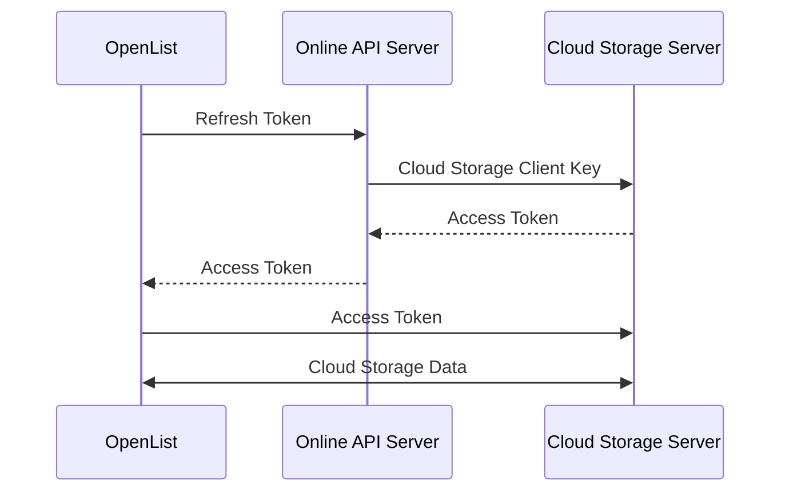
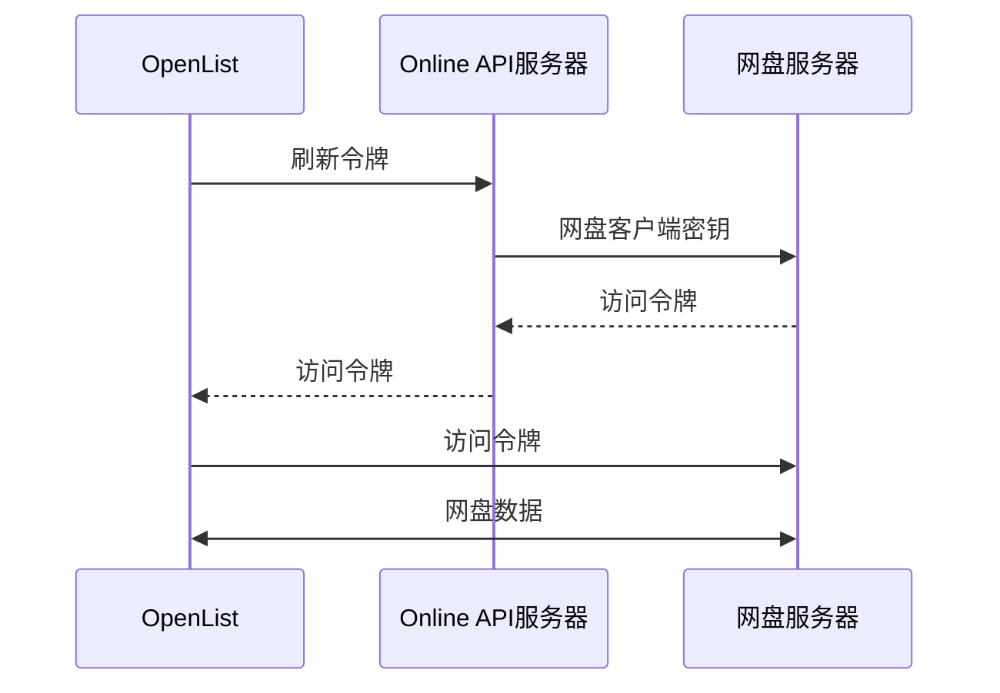

---
title:
  en: OpenList APIpage
  zh-CN: OpenList APIpage
categories:
  - ecosystem
  - eco_offical
top: 970
---

## Why the APIpage is needed { lang="en"}
## APIpage是什么 { lang="zh-CN" }

### [OpenListTeam/OpenList-APIPages](https://github.com/OpenListTeam/OpenList-APIPages)

:::en
[OpenListTeam/OpenList-APIPages](https://github.com/OpenListTeam/OpenList-APIPages) is a utility website led by [@PIKACHUIM](https://github.com/PIKACHUIM) and collaboratively developed with other [main contributors](https://github.com/OpenListTeam/OpenList-APIPages/graphs/contributors). The frontend is primarily used for initial authorization and get refresh token of cloud storage clients, while the backend mainly supports a feature called "Online API", which enables remote
:::
:::zh-CN
[OpenListTeam/OpenList-APIPages](https://github.com/OpenListTeam/OpenList-APIPages)是一个由 [@PIKACHUIM](https://github.com/PIKACHUIM)牵头，和其他[主要贡献者](https://github.com/OpenListTeam/OpenList-APIPages/graphs/contributors)共同协作完成的工具型网站，前端主要用于实现对网盘客户端的初始授权和刷新令牌，而后端则主要支撑了一个名为“在线API”的功能，可以在保护开发者客户端密钥的前提下，实现对用户令牌的远程刷新功能。 

:::

## Why the APIpage is needed { lang="en"}
## 为什么需要APIpage { lang="zh-CN" }

:::en
Cloud Storage Background:

- Most domestic cloud storage services do not provide official API access to individuals, or the application process is cumbersome, which is not conducive to rapid deployment.
- According to the cloud storage providers' management requirements, the obtained client keys must not be leaked.
- User authorization is in the form of refresh tokens, which need to be periodically combined with client keys to obtain refreshed access tokens from the cloud storage servers.
- API calls require the user's latest access tokens.

Solution:

- Community volunteers provide qualification certification and apply for API access permissions from cloud storage officials.
- Use relay servers to protect client keys.
- Periodically send refresh tokens to designated relay servers, which use built-in client keys to refresh access tokens.
- The relay server sends access tokens back to the OpenList client.

The relay server described above is the backend functionality of the Online API server/APIpage, which works as follows:

The frontend part of APIpage also solves the following problems:

- Initial authorization verification for different cloud storage services.
- Authorization while protecting built-in client keys.
- Authorization with custom client keys.
- Providing callback addresses for custom client keys.
- Other practical functions for cloud storage mounting.

:::
:::zh-CN
网盘背景：

- 大部分国内网盘没有对个人开放官方API调用的权限，或者申请过程繁琐，不利于快速部署。
- 针对申请下来的客户端密钥，根据网盘方的管理要求，不得外泄。
- 用户授权为刷新令牌，需要定期配合客户端密钥向网盘服务器获取刷新后的访问令牌。
- 调用API需要用户最新的访问令牌。

解决方案：

- 由社区中的志愿者提供资质认证，向网盘官方申请API调用权限。
- 利用中转服务器，保护客户端密钥。
- 定期向指定的中转服务器发送刷新令牌，中转服务器利用内置的客户端密钥，刷新访问令牌
- 中转服务器将访问令牌发送回OpenList客户端。
上述描述的中转服务器，就是在线API服务器/Online API 服务器/APIpage的后端部分功能，其工作原理如下：

APIpage的前端部分同时解决了如下问题：

- 不同网盘的初始授权验证。
- 在保护内置客户端密钥的情况下的授权。
- 自定义客户端密钥下的授权。
- 提供自定义客户端密钥下的的回调地址。
- 其他网盘挂载的实用功能。

:::

## How to use APIpage { lang="en"}
## 如何使用APIpage { lang="zh-CN" }

<WorkInProgress />

## When the APIpage is not needed { lang="en"}
## 什么时候不需要APIpage { lang="zh-CN" }
:::en
:::tip
For ordinary users, we strongly recommend using API servers provided by the community to reduce deployment difficulty.

If you encounter failures in the network section, we recommend that you resolve.

:::
:::zh-CN
:::tip
对于普通用户，我们强烈建议使用由社区提供的API服务器以降低部署难度。

如果在网络部分遇到故障，我们建议您先行解决网络问题。

:::
:::en
If you choose not to use community-provided servers or deploy your own server, please verify the following content:

- 1. Have completely read the documentation related to the corresponding cloud storage driver.
- 2. Have completely read the open API development documentation provided by the corresponding cloud storage service.
- 3. Can read and understand the project code, have certain debugging capabilities, and can understand the corresponding logs and error messages.
- 4. Fully understand the rights granted to you by AGPLv3 and the parts we should be responsible for.
- 5. Can use basic GitHub functions and know how to **correctly** submit issues/pull requests to us.
- 6. Please remember that we have no way to solve your network problems.

:::
:::zh-CN
如果您选择不使用社区提供的服务器，或者自己部署服务器，请对照一下内容进行核实

- 1.完整阅读了对应网盘驱动相关内容的文档。
- 2.完整阅读了对应网盘的提供的开放API开发文档。
- 3.可以阅读并理解项目代码，并有一定的debug能力，能看懂对应的日志及其报错。
- 4.完全理解AGPLv3授予您的权力和我们应该负责的部分。
- 5.可以使用GitHub的基本功能，知道如何**正确的**向我们提交issue/pull request.
- 6.请记住，我们没有任何办法可以解决您遇到的网络问题。

:::

### APIpage Deployment Tutorial { lang="en"}
### APIpage的部署教程 { lang="zh-CN" }

:::en
Under migration, please refer to: [OpenListTeam/OpenList-APIPages](https://github.com/OpenListTeam/OpenList-APIPages)
:::
:::zh-CN
迁移中，请参照：[OpenListTeam/OpenList-APIPages](https://github.com/OpenListTeam/OpenList-APIPages)
:::

## Community APIpage { lang="en"}
## 社区APIpage { lang="zh-CN" }

:::en
:::tip
The following servers are built and provided by community volunteers. Once used, user authorization credentials will inevitably be sent to the servers over the network. This project is licensed under AGPLv3 and only guarantees to provide the source code "as is". Users should verify the deployed content at their own discretion.
:::
:::zh-CN
:::tip
以下服务器由社区志愿者搭建并提供服务，一旦使用将不可避免的将用户授权凭证通过网络形式发送至服务器，本项目根据AGPLv3许可，只保证在源代码层面按“原样”提供，对于部署后的内容，请用户自行甄别。
:::

- [api.oplist.org](https://api.oplist.org/)
- [api.oplist.org.cn](https://api.oplist.org.cn/)

......

:::en
[Welcome to submit more community servers](https://github.com/OpenListTeam/OpenList-Docs/pulls)

:::
:::zh-CN
[欢迎提交更多社区服务器](https://github.com/OpenListTeam/OpenList-Docs/pulls)

:::
