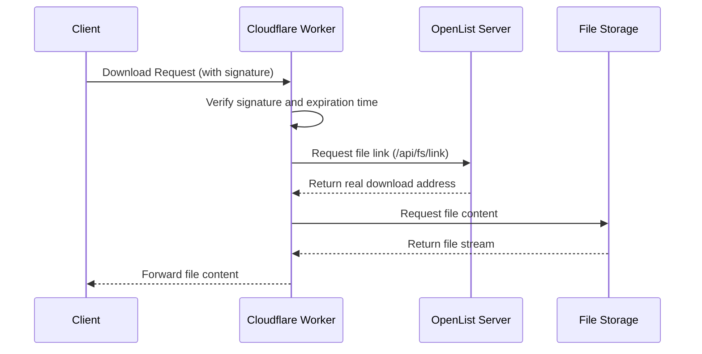
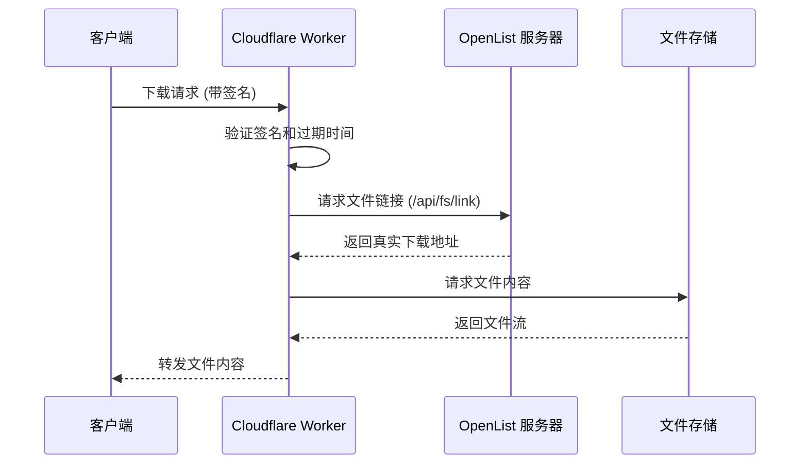

---
title:
  en: OpenList Proxy
  zh-CN: OpenList Proxy
categories:
  - ecosystem
  - eco_official
top: 960
---

## What is OpenList Proxy { lang="en" }

## OpenList Proxy 是什么 { lang="zh-CN" }

:::en
[**OpenList Proxy**](https://github.com/OpenListTeam/OpenList-Proxy) is a simple implementation for proxying OpenList's **download traffic**. With this tool, you can isolate the server traffic of the OpenList deployment from the traffic required for downloads, thereby reducing the traffic consumption of the main server or speeding up downloads.

:::
:::zh-CN
[**OpenList Proxy**](https://github.com/OpenListTeam/OpenList-Proxy)，是一个用于代理OpenList的**下载流量**的简易实现，通过该工具，可以将部署OpenList的服务器流量和下载所需要的流量隔离开，从而降低对主服务器的流量消耗或加快下载速度。

:::

## How to use OpenList Proxy { lang="en" }

## 如何使用 OpenList Proxy { lang="zh-CN" }

:::en
For OpenList Proxy, we provide two deployment methods:

- cf-worker
- Binary File Deployment

:::
:::zh-CN
对于OpenList Proxy，我们提供了两种部署方式

- cf-worker
- 二进制文件部署

:::

### Cloudflare Worker { lang="en" }

### ~~科赋锐~~Cloudflare Worker { lang="zh-CN" }

:::en
:::tip
In the new version, environment-based configuration has been introduced. Please configure the environment variables as required after deployment.

Do not use "/" at the end of the address. 

:::
:::zh-CN
:::tip
在新版本中引入了基于环境的配置，请在部署完成后按照要求配置好环境变量。

地址末尾不要使用“/”。

:::

:::en
- Simple Worker Deployment Tutorial On the Cloudflare homepage, select "Workers and Pages", 
  then click "Create" and choose "Start from Hello World!". 
  After deployment, select "Edit Code", go to here, replace the code, and click "Deploy" again.

- (Optional) Configure Domain Go to the Worker configuration page, click "Settings", then click "Add" next to Domains and Routes. Enter the configured subdomain. Use a CNAME record for the corresponding subdomain to point to the workers.dev domain.

- Configure Environment Variables Go to the Worker configuration page, 
  click "Settings", then select "Add" next to Variables and Secrets.
  Copy the following into the variable names:
  ```env
  ADDRESS=https://your-openlist-server.com
  TOKEN=your-api-token-here
  WORKER_ADDRESS=https://your-worker-address
  DISABLE_SIGN=false
  ```

- ADDRESS is the address of your OpenList instance, only ports 443 and 80 are supported. 
  WORKER_ADDRESS is the address of the Worker. If you have bound a custom domain, use the custom domain. This is also the proxy address needed in OpenList. 
  If DISABLE_SIGN is set to true, Proxy will not verify signatures, and anyone who knows the file path and Proxy address can access the file. Please use with caution. 
  It is recommended to set TOKEN as a secret type. In OpenList, go to Settings → Others at the bottom; this token is long-term valid and has full permissions for OpenList.

- CDN Configuration Suggestion: Keep ADDRESS and WORKER_ADDRESS configured as the origin addresses.


:::
:::zh-CN
- 部署worker简易教程
  在Cloudflare的主页选择“Workers 和 Pages”，然后点击“创建”，选择“从Hello World！开始”
  部署完成后选择“编辑代码”，进入[这里](https://github.com/OpenListTeam/OpenList-Proxy/blob/main/openlist-proxy.js)，将代码替换后再次点击“部署”。

- （可选）配置域名
  到Worker的配置界面，点击“设置”，点击域和路由后的“添加”
  填入配置的子域名
  并在对应的子域名使用CNAME链接至对应的workers.dev域名

- 环境变量配置
  到Worker的配置界面，点击“设置”，选择“变量和机密”后面的“添加”。
  在变量名称中复制如下内容
  ```env
  ADDRESS=https://your-openlist-server.com
  TOKEN=your-api-token-here
  WORKER_ADDRESS=https://your-worker-address
  DISABLE_SIGN=false
  ```
  `ADDRESS`为OpenList的地址，只支持443端口和80端口。
  `WORKER_ADDRESS`为Worker的地址，如果绑定到了自定义域名，请使用自定义的域名。也是在OpenList中需要的代理地址。
  `DISABLE_SIGN`设置为`true`的话，Proxy将不会验证签名，任何知晓文件路径和Proxy地址的人都可以获取到文件，请谨慎开启。
  建议将`TOKEN`设置为密钥类型，在OpenList的设置-->其他的最下面，该密钥长期有效，且相当于拥有OpenList的所有权限。

- 对于CDN的配置建议：`ADDRESS`、`WORKER_ADDRESS`配置保留为源站地址。

:::

### Binary File Deployment { lang="en" }

### 二进制文件部署 { lang="zh-CN" }

:::en

Download the [binary package](ttps://github.com/OpenListTeam/OpenList-Proxy/releases) and run the command `./alist-proxy -help` to learn how to use it.
:::
:::zh-CN
下载[二进制包](https://github.com/OpenListTeam/OpenList-Proxy/releases)后，使用`./alist-proxy -help`命令自行学习使用。

:::

## How OpenList Proxy Works { lang="en" }

## OpenList Proxy 的工作原理 { lang="zh-CN" }

:::en
OpenList Proxy works by proxying the OpenList API to isolate the download traffic of OpenList. Its working principle is as follows:

Proxy verifies the signature and expiration time to ensure the legitimacy of the request. It then requests the file link from the OpenList server to obtain the real download address. After that, Proxy requests the file storage service for the file content and forwards it to the client.

Proxy's signature can be disabled by setting the `DISABLE_SIGN` environment variable or flag. If signature verification is disabled, Proxy will not check the signature and expiration time, allowing anyone who knows the file path and Proxy address to bypass OpenList's own signature verification (which can be configured in the management interface) to access the file. Please use this feature with caution.
:::
:::zh-CN
OpenList Proxy 通过对 OpenList 的 API 进行代理，来实现对 OpenList 的下载流量的隔离。其工作原理如下：

Proxy 通过验证签名和过期时间，确保请求的合法性。然后，它向 OpenList 服务器请求文件链接，并获取真实的下载地址。接着，Proxy 请求文件存储服务获取文件内容，并将其转发给客户端。

Proxy的签名可以通过`DISABLE_SIGN`环境变量或flag来禁用，如果禁用签名，Proxy将不会验证签名和过期时间，这样任何人都可以通过知道文件路径和Proxy地址来绕过OpenList本身的签名验证（其本身的签名可以在管理界面配置）获取文件。请谨慎开启此功能。
:::
