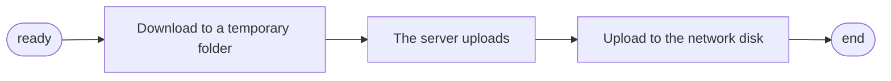

---
# This is the title of the article
title:
  en: Why
  zh-CN: 为什么
# This is the icon of the page
icon: iconfont icon-state
# This control sidebar order
top: 1
# A page can have multiple categories
categories:
  - faq
# A page can have multiple tags
---

## Why I got the error `failed get storage: can't find storage with rawPath: /` when I open web pages after install/upgrade? { lang="en" }

## 为什么我在安装/升级后打开网页时出现错误 `failed get storage: can't find storage with rawPath: /`？ { lang="zh-CN" }

::: en
Because you haven't added storage. Click the `Login` button at the bottom to log in and then click `Manage` button to enter the background and add storage on the storage page.
:::
::: zh-CN
因为你还没有添加任何存储，点击底部登录后再次点击管理进入后台在存储页面添加存储。
:::

## why i lost all my storage in v3 { lang="en" }

## 为什么我在 v3 中丢失了所有存储空间 { lang="zh-CN" }

::: en
New versions (V3 and later) are not compatible with V2, so you need to re-add your storage.
:::
::: zh-CN
新版本（V3 及更高版本）与 V2 不兼容，因此您需要重新添加存储。
:::

## Why I see `failed get aria2 version` error in log? { lang="en" }

## 为什么我在日志中看到 `failed get aria2 version` 错误？ { lang="zh-CN" }

::: en
Because you haven't installed aria2 or the settings of aria2 are wrong. Don't worry, it won't affect the use of OpenList, you can ignore it.
:::
::: zh-CN
因为你没有安装 aria2 或者 aria2 的设置不对。不用担心，它不会影响 OpenList 的使用，你可以忽略它。
:::

## why i got the error `Failed create storage in database: UNIQUE constraint failed: x_storages.mount_path` when I add new storage? { lang="en" }

## 为什么我在添加新存储时收到错误 “Failed create storage in database: UNIQUE constraint failed: x_storages.mount_path”？{ lang="zh-CN" }

::: en
I guess the error message is pretty clear. Because [mount_path](../guide/drivers/common.md#mount-path) is **UNIQUE**.  
If you see this error when adding storage, but you don't see the corresponding duplicate entry on the web page, use `Ctrl` + `F5` to force refresh page.
:::
::: zh-CN
想必错误信息表达的很清楚了。因为 [挂载路径](../guide/drivers/common.md#挂载路径) 是**独一无二**的。

如果你在添加存储时看到了这个错误，但是你并没有在管理页面看到对应的重复条目，请使用 `Ctrl` +`F5` 强制刷新页面
:::

## Why can't I preview the video or audio file? { lang="en" }

## 为什么我不能预览视频或音频文件？ { lang="zh-CN" }

::: en

- Requires a browser-supported encoding
- General browsers do not support h265 encoded video
- General browsers do not support ac3 encoded audio

In particular, for Safari:

- For cross-origin media, content-type must be the media type, not the generic application/octet-stream. So if the content-type returned by the direct link is application/octet-stream, then Safari will not be able to play.(PS: Why Can AliyunDrive play in Safari? Because the official website of the video playback is not the use of download links, but after the transcoding of AliyunDrive)
- Aliyun disk development platform driver supports online video playback (also limited to Aliyun disk open platform driver and **Aliyun Video Previewer** option player)

:::
::: zh-CN

- 需要浏览器支持的编码才可以正常预览
- 一般浏览器不支持 H.265 编码视频
- 一般浏览器不支持 AC3 编码的音频

特别是对于 Safari：

- 对于跨域媒体，content-type 必须是媒体类型，而不是通用的 application/octet-stream。所以如果直链返回的 content-type 是 application/octet-stream，那么 Safari 就无法播放了。（PS：为什么 AliyunDrive 可以在 Safari 中播放？因为官网的视频播放不是使用的下载链接，是经过 AliyunDrive 转码后的）
- 阿里云盘开发平台驱动支持在线播放视频（也仅限于阿里云盘开放平台驱动并且是 **Aliyun Video Previewer** 选项播放器）

:::

## Why can't I preview the office file? { lang="en" }

## 为什么我不能预览 Office 文件？ { lang="zh-CN" }

::: en
For microsoft office online viewers, you need:

- External network access
- The document access address cannot use ip directly, it needs to be accessed through a domain name, and the port must be port 80 / 443
- The format of the document (must be one of the following):
- Word: docx, docm, dotm, dotx
- Excel: xlsx, xlsb, xls, xlsm
- PowerPoint: pptx, ppsx, ppt, pps, pptm, potm, ppam, potx, ppsm
- Document size: Word and PowerPoint documents must be less than 10 megabytes; Excel must be less than five megabytes

:::
::: zh-CN
对于 Microsoft Office 在线查看器，您需要：

- 外部网络访问
- 文档访问地址不能直接使用 IP，需要通过域名访问，端口必须是 80/443 端口
- 文件的格式（必须是以下之一）：
- Word：docx、docm、dotm、dotx
- Excel：xlsx、xlsb、xls、xlsm
- PowerPoint：pptx、ppsx、ppt、pps、pptm、potm、ppam、potx、ppsm
- 文档大小：Word 和 PowerPoint 文档必须小于 10 MB； Excel 必须小于 5 MB

:::

## Why can't I preview the PDF file? { lang="en" }

## 为什么我不能预览 PDF 文件？ { lang="zh-CN" }

::: en

- We use `pdf.js` as the default PDF previewer. So it requires https+cors.
- https is opened for yourself, reverse proxy or provide a certificate in the configuration file
- cors provides support for related cloud disks and cannot be modified by yourself unless the agent is turned on to use the program to transfer

:::
::: zh-CN

- 我们使用 `pdf.js` 作为默认的 PDF 预览器。所以它需要 HTTPS + CORS。
- HTTPS 需要自行打开，可以使用反向代理或在配置文件中提供证书
- CORS 由相关云盘提供支持，不能自行修改，除非开启代理功能，使用程序传输
 
:::

## Why can't package​ download? { lang="en" }

## 为什么无法打包下载？{ lang="zh-CN" }

::: en
Same as pdf preview, requires https+cors support,and:

- OpenList use stream API of browser to support package download, so it requires browser support. Usually, it is supported by new browsers, such as Chrome, Firefox, Edge, etc.

:::
::: zh-CN
与 PDF 预览相同，需要 HTTPS 和 CORS 支持，并且：

- OpenList 使用浏览器的 stream API 来支持打包下载，所以需要浏览器支持。通常这个 API 会被主流浏览器支持，例如 Chrome、Firefox、Edge 等。

:::

## Why does it shows `Uploading in the backend` when I upload a file? { lang="en" }

## 为什么我上传文件时显示 `Uploading in backend`？ { lang="zh-CN" }

::: en

- All uploads of this program use server transfer, which will consume server traffic to communicate with the corresponding storage API

:::
::: zh-CN

- 本程序所有上传均使用服务器传输，会消耗服务器流量与对应存储的API通信

:::

## Why do i get `413` http code when i upload a file? { lang="en" }

## 为什么我在上传文件时得到 HTTP 413 错误？ { lang="zh-CN" }

::: en

- If you use a reverse proxy, you may need to specify the maximum upload file size(`client_max_body_size`) and timeout in the web server configuration
- Otherwise, it may happen that the upload is successful but the front end times out and there is no response

:::

::: zh-CN

- 如果使用反向代理，可能需要在配置中指定最大上传文件大小(`client_max_body_size`)和超时时间
- 否则可能会出现上传成功但回应被web服务器阻止，导致前端超时无响应的情况

:::

## Why can't I download files after add `AliyunDirve` storage and get `InvalidArgument` error? { lang="en" }

## 为什么添加了 `AliyunDrive` 存储后下载不了文件，出现 `InvalidArgument` 错误？ { lang="zh-CN" }
::: en
::: warning
This is an outdated driver that has been abandoned, is no longer maintained, and will be removed in future versions. We recommend using the officially supported Aliyundrive Open.
[**Click to view this guide**](../guide/drivers/aliyundrive_open.md)
:::

::: zh-CN
::: warning
这是一个过时的驱动，已废弃，不再维护，并将在未来的版本中删除。我们建议使用官方支持的阿里云盘Open驱动。
[**点击查看这篇说明**](../guide/drivers/aliyundrive_open.md)
:::

::: en
Due to referrer restrictions, mobile tokens must be used if you don't open any proxy.
:::
::: zh-CN
由于 referer 限制，如果您不打开程序的任何代理中转功能，则必须使用移动端的 `refresh token`
:::

## Why is the uploaded file not displayed/deleted file still/modified in the root directory does not take effect? ​ { lang="en" }

## 为什么上传的件不显示/删除的文件还在/修改根目录不生效？ { lang="zh-CN" }

::: en
There is a half-hour cache by default, which can be modified on the Add Storage page. If you need to refresh immediately, click the refresh button in the lower right corner of the directory that needs to be refreshed.
:::
::: zh-CN
默认有半个小时的缓存，可以在添加存储页面修改。如果需要立即刷新，在需要刷新的目录点击右下角的刷新按钮即可。
:::

## Why is it still incorrect although I input the password that get by `./openlist admin` in terminal? { lang="en" }

## 为什么我通过在终端输入`./openlist admin`获取的密码还是不正确？ { lang="zh-CN" }

::: en
Check whether the directory you run `./openlist admin` and start OpenList is the same. OpenList reads the configuration in the current directory where you run the program by default, so running in different directorys will result in different data being read.

---

- **Here take Windows as an example**: For example, your OpenList file is in the **`D:\Test\Alist\`** folder, and then you directly start the CMD command running window on the desktop, and then put the D drive Drag the OpenList inside to the command running window to start, and then the configuration file it generates is actually in **`C:\Windows\System32`** here (because CMD is here by default), and then you Obtaining the password is also obtaining the password in this folder. At the same time, because OpenList reads the password in the configuration file in the same directory as OpenList, it is naturally wrong for you to log in with the password.
  - 
- Solution: You need to go to the folder where OpenList is located to start or check the password, for example, the above is in **`D:\Test\Alist\`**, you have to manually go to this folder and then enter Enter the startup command or the command to view the password to obtain the correct password
  - **Windows**: After going to the directory where OpenList is located, enter CMD in the top address bar and press Enter, and then use the command to obtain the password
    - 
  - **Linux**: Use the CD command to go to the directory where OpenList is located to get the correct password

:::
::: zh-CN
检查你运行`./openlist admin`和启动OpenList的目录是否相同。 OpenListt默认会读取你运行程序的当前目录下的配置，所以在不同的目录下运行会导致读取的数据不同。

---

- **这里拿Windows举例**：例如你的OpenList文件在 **`D:\Test\Alist\`** 这个文件夹里面，然后你直接在桌面启动了CMD命令运行窗口，然后把D盘里面的OpenList拖动到命令运行窗口里面启动，然后它生成的配置文件实际上你现在的目录是在 **`C:\Windows\System32`** 这里（因为CMD默认是在这里），然后你获取密码也是获取了这个文件夹里面的密码，同时呢因为OpenList它读取的是和OpenList同级目录下的配置文件里面的密码，你去登录密码自然不对。
  - 
- 解决办法：你要到OpenList所在的文件夹里面去在启动或者查看密码，例如上面的是在 **`D:\Test\Alist\`** ，你就要手动去这个文件夹里面然后在输入启动命令或者查看密码的命令即可获取正确的密码
  - **Windows**：去OpenList所在的目录后在顶部地址栏输入 CMD回车这样然后再使用命令获取密码
    - 
  - **Linux**：使用CD命令 到OpenList所在的目录即可获取正确密码

:::

## Why does it prompt System error: SyntaxError: Invalid regular expression: /?/: Nothing to repeat { lang="en" }

## 为什么提示 System error: SyntaxError: Invalid regular expression: /?/: Nothing to repeat { lang="zh-CN" }

::: en
This is caused by the conflict between some scripts in the Tampermonkey extension and the webpage code, such as some automatic answering scripts.
Please check and disable the relevant scripts on your own.
:::
::: zh-CN
由于油猴插件中的某些脚本与网页代码冲突导致的，例如某些自动答题脚本。
请自行检查并禁用相关脚本。

:::

## What is the difference between the two uploads?\*\* { lang="en" }

## 两个上传有什么区别? { lang="zh-CN" }

::: en

1. **stream** directly puts the binary content of the file into the body, so that the backend can use very little memory, it seem to have no downsides.

2. **form** is to wrap the file into formdata and upload it. The memory used by the backend will be more, but there is no limit on the size.
   :::
   ::: zh-CN
3. **stream** 直接把文件二进制内容放进body中，这样后端可以使用很少的内存，似乎没有什么其他的缺点。

4. **form** 是把文件包裹成formdata上传，后端使用的内存会多一些，但是不限制大小。

:::

## What is the difference between the two Aria2? { lang="en" }

## 两个Aria2有什么不同? { lang="zh-CN" }

::: en

1. Background management --> Settings --> Others: **Aria2 here is used to download resources offline to the network disk**

2. Front-end interface --> Local settings (the gear in the lower right corner) --> **Aria2 here is used to download the resources in the network disk to the local, which is equivalent to a download method, everyone can use it without worrying about problems**

- As for how to use the first offline download:
  - For example, if you want to download some resources offline in the **`/OneDrive/TV/Test`** folder, you must first fill in the **address and secret key information** in the background and then manually enter the front end In this folder of the interface, you can see the **offline download** icon (a magnet style) in the lower right corner after entering it, click and enter the link you want to download offline
  - `Description`: **Offline download, copy and upload** are all in the same way. They are first downloaded from the resource **to the temporary folder of the server** and then uploaded from the **server to the corresponding network disk**
    - "Copy" can be directly transferred by the server without temporary storage for uploads that **partially do not require** to calculate the Hash value.



:::
::: zh-CN

1. 后台管理 --> 设置 --> 其他：**这里的Aria2是用于离线下载资源到网盘内**

2. 前端界面 --> 本地设置（右下角齿轮） --> **这里的Aria2是用于将网盘内的资源下载到本地，相当于一种下载方式，人人都可以用不用担心有问题**

- 至于第一个离线下载怎么使用：
  - 例如你想在 **`/天翼云盘/电视剧/测试`** 这个文件夹离线下载点儿资源，哪你就要先在后台填写好 **地址和秘钥信息** 再手动进入前端界面的这个文件夹，进去后右下角能看到 **离线下载** 图标（一个磁铁样式），点击后输入你要离线下载的链接即可
  - `说明`：**离线下载，复制，上传** ，都是一样的方式都是先由资源 **下载到服务器的临时文件夹** 再由 **服务器上传到对应的网盘**
    - “复制”对于 **部分不需要** 计算Hash值的上传是可以不临时保存的，直接由服务器中转。


:::

## RaiDrive mounts Baidu network disk, you can download files, but you cannot upload files. Throwing files to the mount directory prompts "Prompt "You need permission to perform this operation". How to solve this? { lang="en" }

## RaiDrive挂载百度网盘，可以下载文件，不能上传文件。往挂载目录丢文件提示“提示“你需要权限来执行此操作”。这个怎么解决？ { lang="zh-CN" }

::: en
Raidrive is because uploading a file will create an empty file in advance, and Baidu Netdisk does not allow the creation of an empty file.
:::
::: zh-CN
Raidrive 是因为上传文件会预先创建一个空文件 而百度网盘不允许创建空文件。
:::

## Why is the Terabox mounted successfully but the content is not displayed? { lang="en" }

## 为什么 Terabox 挂载成功了 但是不显示内容？ { lang="zh-CN" }

::: en
Because **`Terabox`** restricts IP, if you access it from a non-overseas IP, you cannot access it, and naturally the content will not be displayed.

(Overseas machines can be used. If you have to use local machines (or domestic machines) to build, you can find a way to let OpenList eat **proxy**)

**Note: Check the relevant settings to ensure that traffic related to '*.terabox.com' goes through the **proxy****
:::
::: zh-CN
因为 **`Terabox`** 限制IP，如果你是本机非海外IP访问，是无法访问的，自然不会显示内容。

（可以用海外的机器，如果非得用本机(或者国内的机器)搭建，哪你自己想办法让OpenList吃到**proxy**就可以）

**注意：检查相关设置以确保'*.terabox.com'相关流量经过**proxy****
:::

## Open OpenList prompt System error: TypeError: n.replaceAll is not a function? { lang="en" }

## 打开 OpenList 提示 System error: TypeError:n.replaceAll is not a function？ { lang="zh-CN" }

::: en
Your browser kernel version is too low, just add the following to the custom head.

```html
<!--Alist V3 suggested to add, it has been added by default, if you don't suggest adding -->
<script src="https://polyfill.io/v3/polyfill.min.js?features=String.prototype.replaceAll"></script>
```

If you think it is too slow, you can change to Ali Cloud

```html
<script src="https://polyfill.alicdn.com/v3/polyfill.min.js?features=String.prototype.replaceAll"></script>
```

:::
::: zh-CN
你的浏览器内核版本太低，将如下添加到自定义头部即可.

```html
<!--Alist V3建议添加的，已经默认添加了，如果你的没有建议加上-->
<script src="https://polyfill.io/v3/polyfill.min.js?features=String.prototype.replaceAll"></script>
```

如果嫌太慢可以换阿里云

```html
<script src="https://polyfill.alicdn.com/v3/polyfill.min.js?features=String.prototype.replaceAll"></script>
```

:::

## Too many unsuccessful sign-in attempts have been made using an incorrect username or password, Try again later. { lang="en" }

## Too many unsuccessful sign-in attempts have been made using an incorrect username or password, Try again later. { lang="zh-CN" }

::: en


If you enter the wrong password for 6 consecutive logins, it will be locked, and you can reset it by restarting OpenList.
:::
::: zh-CN


连续登录输入6次密码错误就会锁定，重启OpenList即可重置。
:::

## When adding a file to upload, there is an option of "add as task", what does it do? { lang="en" }

## 添加文件上传时，有一个“添加为任务“的选项，是做什么的? { lang="zh-CN" }

::: en

- After checking, upload to the server (the machine where OpenList is built), and then when uploaded by the server to the network disk, it seems to be visible in the background (it seems to be like this)
- You will not see it if it is not checked. For details, you can see the problem in the picture below.


:::
::: zh-CN

- 勾选后上传到服务器(搭建OpenList的机器)，再由服务器上传时到网盘时后台似乎能看到（好像是这样的）
- 未勾选不会看到，具体的大家可以看下图应该能看出什么问题.


:::

## I am asked to enter the OTP code when I log in. What is the reason? { lang="en" }

## 登陆时要求输入OTP代码，请问是什么原因? { lang="zh-CN" }

::: en
Are you logging into someone else's account? If it is your own, please enter the 2FA (two-step verification) verification code

What? Don't know the verification code? [**Click to view this guide**](../guide/advanced/2fa.md)
:::
::: zh-CN
你是不是在登录别人的账号？如果是自己的请输入2FA(两步验证)验证码

什么？不知道验证码？[**点击查看这篇说明**](../guide/advanced/2fa.md)
:::

## Use **`sqlite3`** to find that there are more than two files in the data folder, data.db-shm and data.db-wal { lang="en" }

## 使用 **`sqlite3`** 发现 data 文件夹里面出现 data.db-shm、data.db-wal 两个多的文件 { lang="zh-CN" }

::: en
These are temporary files created by SQLite in WAL mode to support database transaction processing and concurrent access. The .db-shm file is a shared memory file used to store temporary data, while the .db-wal file is a write-ahead log file that records transaction changes for rollback in case of transaction failure. These two files are associated with the .db file, and it is not recommended to delete them arbitrarily.
:::
::: zh-CN
这是SQLite在WAL模式下创建的临时文件，用于支持数据库的事务处理和并发访问。.db-shm是一个共享内存文件，用于存储临时数据，而.db-wal是一个写前日志文件，用于记录事务的变更，以便在事务失败时进行回滚。这两个文件和.db文件相关联，不建议随意删除。
:::

## **How do I set it so that visitors can only see the content after logging in?** { lang="en" }

## **想让游客登录后才能看到内容怎么设置?** { lang="zh-CN" }

::: en
There is always one of the following three versions that suits you. Eat it quickly! !

1. Point the directory seen by **`guest`** users to an empty folder, and then write a readme description, don’t ask how to do it yourself[Click to view](#how-to-create-a-completely-blank-folder)

2. Directly encrypt the root directory in the meta information

3. Directly deactivate the **`guest`** user, which will force a jump to the login page (version 3.10.1 and above) - Find a way by yourself Welcome to provide new ways~~

:::
::: zh-CN
以下三种版本总有一款适合你 快速速食用吧！！

4.  将 **`guest`** 用户看到的目录 指向一个空文件夹，然后写一个readme说明，别问怎么弄自行操作[点击查看](#如何新建一个完全空白的文件夹)
5.  在元信息直接将根目录加密码
6.  直接将 **`guest`** 用户停用，这样会强制跳转到登录页面（3.10.1及以上版本）
    - 自行寻找办法 欢迎提供新的办法~~

:::

## Baidu cloud disk unofficial download error appears "hit black userlist, hit illegal dlna" { lang="en" }

## 百度云盘非官方下载报错出现"hit black userlist , hit illeage dlna" { lang="zh-CN" }

::: en
It should be repaired harmoniously, but the interface discoverer said to wait for 24 hours to try, if it still doesn't work, it is really repaired harmoniously.

```json
{
  "error_code": 31329,
  "error_msg": "hit black userlist , hit illegal dlna",
  "request_id": 8942439159334999112
}
```

:::
::: zh-CN
应该是和谐修复了，但是接口发现者说等待24小时试试看，如果还是不行就是真的和谐修复了。

```json
{
  "error_code": 31329,
  "error_msg": "hit black userlist , hit illeage dlna",
  "request_id": 8942439159334999112
}
```

:::

## How to create a completely blank folder { lang="en" }

## 如何新建一个完全空白的文件夹 { lang="zh-CN" }

::: en
two ways

1. Mount a local storage, select the folder is empty
2. Select virtual storage and directly change **"number of files" "number of folders"** to 0, save and then ignore the pop-up interface
   - What does **Virtual Storage** do? It is generally used during testing. Don’t use it indiscriminately if you don’t understand the normal production environment....

How to add **`Readme`** instructions to an empty folder

1. If you choose local storage, you can consider throwing a Readme.md file into it. If there is an update but the refresh is slow, use the second method if it is too slow
2. Meta information Select this folder, there are instructions below to write it yourself

What is the use of creating this blank folder? It can be used in conjunction with [**How to set up visitors to access the content after logging in, use the first method**](#how-do-i-set-it-so-that-visitors-can-only-see-the-content-after-logging-in)
:::
::: zh-CN
两种方法

1. 挂载一个本地存储，选择文件夹里面是空的就可以
2. 选择虚拟存储直接将 **"文件数量" "文件夹数量"** 改成0 保存即可弹出的界面直接忽略
   - **虚拟存储**是做什么的？一般是测试的时候用的 正常生产环境不懂别乱用....

空文件夹怎么加 **`Readme`** 说明

1. 选择本地存储的话可以考虑丢一个 Readme.md 文件进去，要是有更新但是刷新的慢，嫌慢用第二条办法
2. 元信息 选择这个文件夹，下面有说明自己写就行

建这个空白文件夹有啥用？可以配合[**想让游客登录后才能看到内容怎么设置的第一条办法使用**](#想让游客登录后才能看到内容怎么设置)使用
:::

## lib64/libc.so.6: version `GLIBC_2.28' not found (required by ./openlist) or accept: function not implemented { lang="en" }

## lib64/libc.so.6: version `GLIBC_2.28' not found (required by ./openlist)或者 accept: function not implemented { lang="zh-CN" }

::: en
Consider using the **musl** version as an alternative due to the version of the **glibc** on your platform is too low,or use docker version.

:::
::: zh-CN
考虑使用 **musl** 版本作为替代，因为在您的平台上的 **glibc** 版本太低,或者使用docker版本。

:::

## What is the extra sign parameter after the file now? { lang="en" }

## 现在文件后面多了个 sign 的参数是干嘛的？ { lang="zh-CN" }

::: en
Encrypted for account security, you can view the details by [click to view](../configuration/global.md#sign-all)
:::
::: zh-CN
加密了为了账号安全一些，查看详情可以[点击查看](../configuration/global.md#签名所有)
:::

## Prompt when adding Aliyun drive (shared) Prompt Post "https://auth.aliyundrive.com/v2/account/token": net/http: TLS handshake timeout { lang="en" }

## 添加阿里云盘(分享)时提示 提示Post "https://auth.aliyundrive.com/v2/account/token": net/http: TLS handshake timeout { lang="zh-CN" }

::: en
Reason: The VPS is located outside mainland China, and IPv6 is enabled
Workaround:
**Method 1**: Add the following three items in the vps hosts and restart the network or restart the vps

- 47.94.245.197 api.aliyundrive.com

- 47.94.245.197 auth.aliyundrive.com

- 121.89.3.30 cn-beijing-data.aliyundrive.net

**Method 2**: Turn off and disable IPv6 of vps
:::
::: zh-CN
原因：VPS在中国大陆境外，且启用了IPv6
解决方法：
方法一：在vps的hosts中添加以下三条并重启网络或者重启vps

- 47.94.245.197 api.aliyundrive.com

- 47.94.245.197 auth.aliyundrive.com

- 121.89.3.30 cn-beijing-data.aliyundrive.net

方法二：关闭并且禁用vps的IPv6
:::

## 123 When the cloud disk is mounted, json: cannot unmarshal string into Go struct field TokenResp.data of type struct { Token string "json:\"token\"" } { lang="en" }

## 123云盘挂载时出现 json: cannot unmarshal string into Go struct field TokenResp.data of type struct { Token string "json:\"token\"" } { lang="zh-CN" }

::: en


There is a high probability that your device that builds OpenList is temporarily blocked, frozen, blocked, or restricted. Don't mount it yet, wait a few hours and try again or wait a day

(Conclusions from the above questions have been tested)
:::
::: zh-CN


大概率是你的这台搭建OpenList的设备 暂时被 拉黑，冻结，封禁，限制了。先不要挂载了，等几个小时再试试看或者等一天

（以上问题已经经过测试得出的结论）
:::

## Why doesn't PikPak have a name { lang="en" }

## 为何 PikPak 下载文件不显示文件名？ { lang="zh-CN" }

::: en
Because PikPak's server does not set the filename in the `content-disposition` header, this is a PikPak problem and not an OpenList, so it cannot be fixed
:::
::: zh-CN
因为 PikPak 的服务器在 content-disposition 头中没有设置文件名，所以这是 PikPak 的问题 而不是 OpenList，故无法解决
:::

## How to query your own OpenList version number { lang="en" }

## 如何查询自己的OpenList版本号 { lang="zh-CN" }

::: en

1. Use the command `openlist version`, the console will output
2. OpenList Manage --> Settings --> Site --> `Version` option

Why is the old version of OpenList still after the update? Generally, docker encounters this problem. You can [**refer to this**](../guide/installation/docker.md#update)
:::
::: zh-CN

1. 使用命令 `openlist version`，控制台会输出
2. OpenList后台 --> 设置 --> 站点 --> `版本`选项

为什么更新后还是旧版的OpenList，一般遇到这个问题的都是docker，可以[**参考这个**](../guide/installation/docker.md#更新)
:::

## OpenList's download "Download" option suddenly blank, no content { lang="en" }

## OpenList的下载"Download"选项突然空白，没有内容 { lang="zh-CN" }

::: en
Check your plug-ins, whether there are ad blocking plug-ins, for example: **AdGuard** and others

Through the console, it is found that "**https://g.alicdn.com/IMM/office-js/1.1.5/aliyun-web-office-sdk.min.js**" has been blocked,

Maybe other links are blocked, manually add the blocked domain name to the whitelist or close the plug-in, or it may be that the plug-in is convulsed


:::
::: zh-CN
检查你的插件，是否有广告拦截插件，例如：**AdGuard**等其他的

通过控制台发现"**https://g.alicdn.com/IMM/office-js/1.1.5/aliyun-web-office-sdk.min.js**" 被拦截了，

也许拦截了其它链接，手动将被拦截域名添加到白名单或者关闭插件，也可能是插件抽风了

:::
