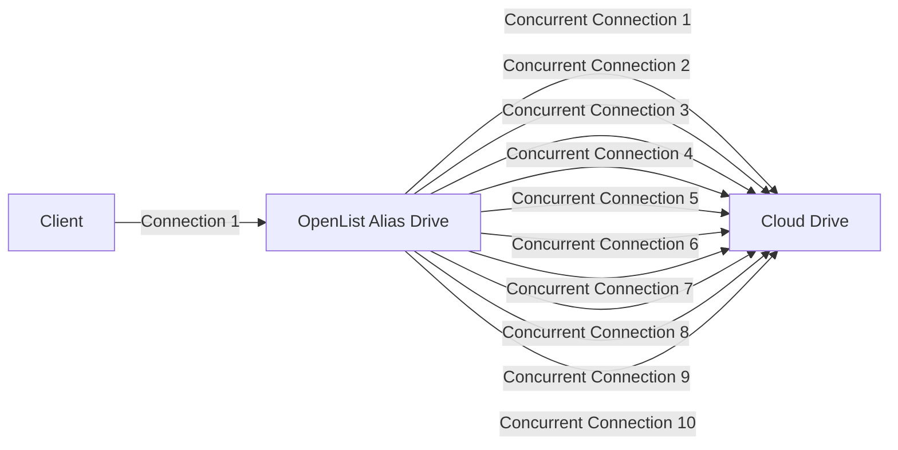

---
title:
  en: Alias
  zh-CN: 别名
categories:
  - guide
  - advanced
top: 120
---

::: en

**Alias** is a feature that allows multiple different cloud drives or storage paths to be merged into a unified directory. By combining paths, content from different cloud drives or folders can be displayed in the same interface, simplifying access and management.

Except for the **`Download Preview (Read-Only)`** operation, other actions such as **Copy, Delete, Rename, Offline Download, and Upload** are not supported.

For example: Cloud Drive Account 1 and Cloud Drive Account 2 both contain a folder named `Movies`, but the contents of these folders may not be identical.

- **Previously (Virtual Path)**:

  You could only mount them to two different paths separately, like:
  - `Cloud Drive 1/Movies`, `Cloud Drive 2/Movies`
  - `Movies/Cloud Drive 1`, `Movies/Cloud Drive 2`

- **Now (Alias)**:

  An aggregated folder (Movies) is provided, which can contain content from both Cloud Drive 1 and Cloud Drive 2 simultaneously.

**Display Rules for Folder Content:**

1. **Same-name Merging**: Files (or folders) with the same name will be automatically merged into one.
2. **Same-name Priority**: When accessing resources, the file (or folder) at the top (earlier) position in the path will be accessed.
   - If files with the same name are merged, when you click **`Play` or `Download`**, the file at the top of the path list (the one using the 302 mode) will be prioritized.

Next, let's explain the **`Same-name Priority²`** access rule. It’s highly recommended to check out the examples.

Let's start with a diagram:


In the diagram, we can see that two different folders are merged into one. Files and folders with the same name are also combined, and unique ones are displayed separately.

Example explanations:

- **Example 1**: `riluo.jpg` is unique to Cloud Drive 1, so it is shown separately.
- **Example 2**: Both folders contain a `video` folder, but the contents of these folders will be merged. Subfolders also follow the **same-name merging** display rule.
  - Both folders contain two videos, but one of them has the same name. After merging according to the **same-name merging** rule, three video files will be displayed in total.

:::
::: zh-CN

**别名（Alias）** 是一种将多个不同云盘或存储路径合并为一个统一目录的功能。通过路径合并，来自不同云盘或文件夹的内容可以在同一界面中展示，从而简化访问和管理。

除了 **`下载预览（只读）`** 操作外，其他操作如 **复制、删除、重命名、离线下载、上传** 均不支持。

例如：云盘账号1和云盘账号2中都包含一个名为`电影`的文件夹，但两者的内容未必完全相同。

- **`以前（虚拟路径）`**：

  在此模式下，您只能将文件夹分别挂载在不同的路径上，例如：
  - `云盘1/电影`、`云盘2/电影`
  - `电影/云盘1`、`电影/云盘2`

- **`现在（别名）`**：

  现在通过 **Alias**，可以创建一个聚合的文件夹（如`电影`），其中同时包含来自云盘1和云盘2的内容。

**展示时文件夹内容规则如下：**

1. **同名合并**：同名的文件夹或文件会自动合并为一个。
2. **同名优先**：在访问时，如果多个文件夹包含同名文件，系统将优先访问路径列表中排在前面的文件夹。
   - 当您点击 **`播放` 或 `下载`** 时，系统会优先调用路径列表中最前面使用302模式的文件。

为了更清楚理解 **`同名优先²`** 规则，建议查看以下示例。

我们先看一张示意图：


在图中，两个不同的文件夹被合并为一个文件夹。同名的文件和文件夹会自动合并，而独有的文件则单独展示。

**示例说明：**

- **例1**：`riluo.jpg` 仅存在于云盘1中，因此显示为独有文件。
- **例2**：两个文件夹都有一个名为`video`的子文件夹。合并后，两个`video`文件夹的内容会合并展示。若其中有同名文件（例如`movie.mp4`），合并后最终展示3个视频文件。

:::

## Filling Method { lang="en" }

## 填写方式 { lang="zh-CN" }

::: en
There are two ways to fill in:

1. The first one is that you can only fill in the path of the subfolder and the folder with the same name must be used at the end. It is not recommended to use :x:
   - Paths filling example:
   ```
   /file1/locala
   /file2/localb
   ```
2. The second is to directly mount the root folder path, using the `renaming` method, it is strongly recommended to use :heavy_check_mark:
   - Paths filling example:

   ```
   #Example 1 Directly write the root folder
   merge: /file1
   merge: /file2

   #Example 2 Mount different path folders for merging
   merge: /file1/localtest233
   merge: /file2/videos/TV series
   merge: /file3 2/TV/Domestic TV Series/Station XX
   ```

According to the second method, we can `merge` and display different folders, which is convenient and quick.
:::

::: zh-CN
填写方式有两种：

1. 第一种是只可以填写子文件夹路径并且最后结尾时必须同名文件夹才可以，不推荐使用 :x:
   - `路径`填写示例：
     ```
     /目录1/目录a
     /目录2/目录b
     ```
2. 第二种是可以直接挂载根文件夹ID，利用`重命名`的方式，强烈推荐使用 :heavy_check_mark:
   - `路径`填写示例：

     ```
     #示例1 直接写根文件夹
     合并显示:/目录1
     合并显示:/目录2

     #示例2 挂载不同路径文件夹进行合并
     合并显示:/目录1/本地测试233
     合并显示:/目录2/视频/电视剧
     合并显示:/目录2/电视/国产电视剧/某某台
     ```

根据第二种这样我们可以将不同的文件夹进行合并显示，方便快捷。
:::

---

::: en
Example 1. Fill in the access according to the following path(302 mode has priority)

```
local: /localtest/local1
local: /localtest/local2
local: /localtest/local3
local: /localtest/local4
```

- 1, if there is a video 1 2 3 4, each visit is `1`
  - If 1 3 4 uses the local proxy and 2 uses `302`, call 2 first
- 2, a video 3 4 yes then every visit is `3`
  - If 3 uses a local proxy and 4 uses `302`, call 4 first

:::

::: zh-CN
例1、 根据下面路径填写访问(302模式有优先权)

```
本地:/本地测试/本地1
本地:/本地测试/本地2
本地:/本地测试/本地3
本地:/本地测试/本地4
```

1. 一个视频 1 2 3 4 都有的话每次访问的是 `1`
   - 如果1 3 4 使用的本地代理，2 使用的`302`，优先调用 2

2. 一个视频 3 4 有 那么每次访问的都是`3`
   - 如果 3 使用的本地代理，4 使用的`302`，优先调用 4

:::

---

::: en

Example 2. Fill in the access according to the following path(302 mode has priority)

```
local: /localtest/local4
local: /localtest/local3
local: /localtest/local2
local: /localtest/local1
```

1. if a video has 1 2 3 4, each visit is `4`
   - If 1 3 4 uses the local proxy and 2 uses `302`, call 2 first

2. a video 3 4 has then every visit is `4`
   - If 4 uses a local proxy and 2 uses `302`, call 2 first

:::

::: zh-CN
例2、根据下面的路径填写访问(302模式有优先权)

```
本地:/本地测试/本地4
本地:/本地测试/本地3
本地:/本地测试/本地2
本地:/本地测试/本地1
```

1. 一个视频 1 2 3 4 都有的话每次访问的是 `4`
   - 如果1 3 4 使用的本地代理，2 使用的`302`，优先调用 2

2. 一个视频 2 4 有 那么每次访问的都是`4`
   - 如果 4 使用的本地代理，2 使用的`302`，优先调用 2

:::

---

::: en
Example 3. Fill in the access according to the following path(302 mode has priority)

Of course, it is not limited to only 2 folders, just write according to personal needs

```
Local test:/local1/video
Local test:/local2/video
Test other:/test3/images
Test other:/test4/video/tv
```

1. local1 local2 merged together
   - If 2 uses a local proxy and 1 uses `302`, call 2 first

2. Test 3 and Test 4 merged together

- If 3 uses a local proxy and 4 uses `302`, call 4 first

3.  In the above two cases, two different folders will appear for display, which will be displayed as follows without interfering with each other


:::

::: zh-CN

例3、根据下面的路径填写访问(302模式有优先权)

当然了不限于只有2个文件夹，根据个人需求来写即可

```
本地测试:/本地1/video
本地测试:/本地2/video
测试其他:/测试3/images
测试其他:/测试4/video/电视
```

1. 本地1 本地2 合并在一起了
   - 如果2 使用的本地代理，1 使用的`302`，优先调用 2

2. 测试3 测试4 合并在一起了
   - 如果3 使用的本地代理，4 使用的`302`，优先调用 4

3. 以上两种情况会出现两个不同的文件夹来展示，会如下展示，不会互相干扰


:::

## The download method to use { lang="en" }

## 使用的下载方式 { lang="zh-CN" }

::: en
​When adding **`alias`**, `Web Proxy` and `Webdav Policy` are not modified by default. The storage path filled in the Paths path can be `302`, `Local Proxy`, `Download Proxy URL`, three modes Mixed Playback Mixed Playback is possible.

​If you checked `Web Proxy`, the storage filled in by the Paths path, if there is a 302 mode playback, it will be played in transit (local proxy mode) at that time, and it will become a proxy mode. If the Webdav policy is also changed, it will also change.

​Of course, it is up to you to choose whether to change the mode.
:::
::: zh-CN
​添加 **`别名-alias`** 时 `Web代理` 和 `Webdav策略` 默认不修改的情况下 Paths路径填写的存储路径可以 `302`，`本地代理`，`下载代理URL`，三种模式混合播放可以进行混合播放。

​如果你勾选了`Web代理` ，Paths路径填写的存储 如果有302模式播放的 到时候都会进行中转(本地代理模式)播放，变成代理模式，Webdav策略如果也进行了改动也会进行变化。

​当然，是否选择更换模式您自己进选择。
:::

### What if you don’t know how the cloud disks you added are different? { lang="en" }

### 如果你不知道你添加的云盘是什么方式怎么办? { lang="zh-CN" }

::: en

1. You can go to the bottom of the corresponding document to view the document, there is a flow chart description
   - If there is a 302, the 302 method is used by default. If there are only local proxy and download proxy URLs, the default is to use the local proxy, provided that you have not manually selected
2. You can check when adding storage, select the corresponding storage to view, for example, let’s check the methods of Alibaba Cloud and 115 respectively
   - As you can see from the figure below, Alibaba Cloud Disk has the option of `web proxy`, and `webdav policy` defaults to 302. It can be judged that Alibaba Cloud Disk uses the 302 method by default
   - As you can see from the figure below, the 115 network disk does not have the option of `web proxy`, and the `webdav strategy` defaults to the local proxy. It can be judged that the 115 network disk uses the local proxy mode by default
     

:::

::: zh-CN

1. 可以前往文档的相对应的文档最底部查看，有一份流程图说明
   - 如果有302的就是默认使用302方式，如果只有本地代理和下载代理URL默认的就是使用本地代理，前提是你没有进行手动选择
2. 可以前往添加存储时进行查看，选择对应的存储进行查看，例如我们查看一下阿里云和115分别是什么方式
   - 从下图中看到，阿里云盘有 `web代理`选择，`webdav策略`默认是302，可以判断出阿里云盘默认使用的是302方式
   - 从下图中看到，115网盘没有 `web代理`选择，`webdav策略`默认是本地代理，可以判断出115网盘默认使用的是本地代理方式
     

:::

## other instructions { lang="en" }

## 其他说明 { lang="zh-CN" }

::: en

If you are using `Windows`, the following situation will occur, and folders with different capitalization will also be regenerated.

For example, Local 1 and Local 2 have a lowercase v for `video` respectively, and the folder OneDrive has an uppercase V `Video` folder.

Then a lowercase video folder will be generated, which contains only `local 1, local 2` files merged by two folders.

At the same time, the uppercase `Video` will gather the files of the three folders.

This is because Windows is case-insensitive, video and Video will be considered as the same folder, you will not have this problem if you switch to Linux or Mac.

Aliases are not supported for load balancing for the time being (if it is supported later, the document will be modified here, if it is not modified, it is not yet supported).

:::

::: zh-CN
如果你是使用的`Windows`，会出现如下情况，有大小写不同的文件夹也会进行二次生成。

例如本地1，本地2 分别有 `video` 小写的v ，文件夹 OneDrive 有一个大写的 V `Video` 文件夹。

然后会生成一个小写的 `video` 文件夹里面只有 `本地1，本地2` 两个的文件夹所合并的文件。

同时大写的 `Video` 里面 会集合三个文件夹的文件

这是因为 Windows 大小写不敏感，video和Video会被认为是同一个文件夹，你换成 Linux 或者 Mac 就不会有这个问题了

暂时不支持别名进行负载均衡（后期若支持了这里会进行文档修改，如果没有修改就是还不支持）

:::

## Proxy Range { lang="en" }

## 代理 Range { lang="zh-CN" }

::: en
You need to enable `Web Proxy` or` Webdav Native Proxy` to take effect. Currently only applicable to：`alias`、`139Yun`、`OpenList V3`.

- The `139Yun` driver, when this option is enabled, can resolve issues that occur when a proxy is enabled but the download link does not return the correct HTTP status code, such as problems with video playback or lack of support for resume downloads.
- The `Alias` driver is added to meet specific use cases, for example, when `139Yun` uses a 302 redirect. By enabling the `Alias` proxy, downloads can use `139Yun` with the 302 redirect, while video playback can use the proxy-enabled `Alias`, reducing unnecessary load.
- The `AList V3` driver is added to support server-side AList mounting with `139Yun` using a 302 redirect. Locally, AList can be mounted via the proxy-enabled `AList V3` to access the server's AList for video playback, etc., to avoid consuming server bandwidth. This also allows for data-free video streaming on mobile networks.

:::

::: zh-CN
需要先启用 `Web代理` 或者 `Webdav本地代理` 才会生效。目前仅适用于：`别名`、`中国移动云盘`、`OpenList V3`。

- `139Yun` 驱动开启这个选项后，可解决即使开启代理但下载链接没有返回正确的http状态码导致的一些问题，例如视频无法播放、不支持断点续传等
- `Alias` 驱动添加是为了满足某些场景，例如 `139Yun` 走302， 然后通过 开启代理的 `Alias` 后，下载用 `139Yun` 走302，播放视频用 开启代理的 `Alias`，减少不必要的负载
- `AList V3` 驱动添加是为了 服务器的alist挂载 `139Yun` 走302，然后本地的alist通过 开启代理的 `AList V3` 挂载 服务器的alist 播放视频等，达到不消化服务器流量的目的，移动卡还能免流

:::

## Protect same name { lang="en" }

## 同名保护 { lang="zh-CN" }

::: en
Now alias supports the two operations of `Delete` and` Rename`，**By default, use**.

File names like file names may appear in the alias. For folders with the same folder name, you cannot `Delete` or `Rename` when the `Protect same name` is opened.

:::

::: zh-CN
现在别名支持 `删除`、`重命名`两个操作，**默认开启**。

别名中可能会出现文件名一样的文件，对于文件夹名一致的文件夹，在`同名保护`开启状态下无法删除或者重命名。
:::

### Protect same name Use for example { lang="en" }

### 同名保护使用举例 { lang="zh-CN" }

::: en
We fill in the two folders of `a` and` b` to the alias options.

```
a/          b/                  alias
a/1.png     b/1.png             alias/1.png
a/2.mp3     b/2.mp3             alias/2.mp3
a/3.mp4     b/3.mp4     ---->   alias/3.mp4
a/4.mkv     b/4.mkv     ---->   alias/4.mkv
a/5.bin     b/6.css             alias/5.bin ---> According to the rule, aliases in directories listed earlier take precedence, and files with different names in separate folders are given priority.
                                alias/6.css
```

If we attempt to Rename or Delete a file named `1.png` while the `Protect same name` feature is enabled, the following message will be displayed in the top right corner:

<div style="color: red; display: flex; justify-content: center; align-items: center; border: 3px solid red;">
    <ul style="list-style-type: none;">
        <li><i class="fa-solid fa-circle-exclamation">&nbsp;</i><b>same-name files cannot be Rename</b></li><br/>
        <li><i class="fa-solid fa-circle-exclamation">&nbsp;</i><b>same-name files cannot be Delete</b></li>
    </ul>
</div>

If we turn off the options of `Protect Same Name`, change to` a/1.png` to `a/11.png` will become the following display

- Because both folders a and b contain the same files, "rename" and "download" will prioritize the folder listed first when filling out the form. Similarly, renaming conflicts will be resolved by modifying the file in the folder listed first.

```
a/          b/                  alias
a/1.png     b/1.png             alias/11.png
a/2.mp3     b/2.mp3             alias/2.mp3
a/3.mp4     b/3.mp4     ---->   alias/3.mp4
a/4.mkv     b/4.mkv     ---->   alias/4.mkv
a/5.bin     b/6.css             alias/5.bin
                                alias/1.png  ---> Because the b folder is in the rear, the file list display is relatively backward
                                alias/6.css
```

If you really do n’t understand, you can test it yourself and then install the production environment by yourself

:::

::: zh-CN

我们分别将 `a`和`b`两个文件夹填写到别名选项中

```
a/          b/                  alias
a/1.png     b/1.png             alias/1.png
a/2.mp3     b/2.mp3             alias/2.mp3
a/3.mp4     b/3.mp4     ---->   alias/3.mp4
a/4.mkv     b/4.mkv     ---->   alias/4.mkv
a/5.bin     b/6.css             alias/5.bin ---> 根据规则别名目录靠前的，不同文件夹中不同名的文件靠前
                                alias/6.css
```

如果我们在 `同名保护` 开启状态下把同名文件 `1.png` 进行重名名或者删除会提示如下信息在右上角

<div style="color: red; display: flex; justify-content: center; align-items: center; border: 3px solid red;">
    <ul style="list-style-type: none;">
        <li><i class="fa-solid fa-circle-exclamation">&nbsp;</i><b>same-name files cannot be Rename / 同名文件无法重命名</b></li><br/>
        <li><i class="fa-solid fa-circle-exclamation">&nbsp;</i><b>same-name files cannot be Delete / 同名文件无法删除</b></li>
    </ul>
</div>

如果我们把 `同名保护` 选项关闭，将 `a/1.png`改成 `a/11.png` 会变成如下展示

- 因为a/b两个文件夹都有一样的文件，`重命名`和`下载`一样优先下载填写时候靠前的文件夹，同理重名修改也是先修改靠前文件夹中的文件

```
a/          b/                  alias
a/1.png     b/1.png             alias/11.png
a/2.mp3     b/2.mp3             alias/2.mp3
a/3.mp4     b/3.mp4     ---->   alias/3.mp4
a/4.mkv     b/4.mkv     ---->   alias/4.mkv
a/5.bin     b/6.css             alias/5.bin
                                alias/1.png  ---> 因为b文件夹靠后，所以文件列表展示页靠后
                                alias/6.css
```

实在不懂 可以自行本地测试一下再进行生产环境实装

:::

## Download concurrency, Download part size { lang="en" }

## 下载并发、下载分片大小 { lang="zh-CN" }

::: en
**Storage Settings:**

- Alias (Alias) Drive
- Local Proxy
- Path: / Cloud Drive Mount Path
- Download Concurrency: 10
- Download Chunk Size: 1024

**Effect:**

- Client → OpenList Alias Drive: Uses 1 connection
- OpenList Alias Drive → Cloud Drive: Supports 10 concurrent connections, with actual concurrency limited by the cloud drive.



- Single-threaded speed is slower, but it supports concurrency: Using the alias drive allows concurrent downloads, significantly improving speed.
- Video watching and download acceleration: The experience is enhanced by increasing concurrency.
- Copying from alias drive to other drives: File transfer is also accelerated in this case.

**Friendly Reminder:** Please do not abuse this feature. Excessive use may cause abnormal activity on the cloud drive account, and you will bear the consequences.

**Configuration Options:**

- max_concurrency: Sets the maximum concurrency for the local proxy. The default is 64, and setting it to 0 means no limit on concurrency.

:::
::: zh-CN
**存储设置：**

- 别名 (Alias) 驱动
- 本地代理
- 路径：/云盘挂载路径
- 下载并发数：10
- 下载分片大小：1024

**效果：**

- 客户端 → OpenList 别名驱动：使用1个连接
- OpenList 别名驱动 → 云盘：支持10个并发连接，实际并发数受云盘限制

```
mermaid
graph LR
A[客户端] -->|连接1| B[OpenList别名驱动]

    B -->|并发连接1| C[云盘]
    B -->|并发连接2| C
    B -->|并发连接3| C
    B -->|并发连接4| C
    B -->|并发连接5| C
    B -->|并发连接6| C
    B -->|并发连接7| C
    B -->|并发连接8| C
    B -->|并发连接9| C
    B -->|并发连接10| C
```

- 单线程速度较慢，但支持并发：通过别名驱动可实现并发下载，显著提升速度
- 视频观看、下载加速：通过并发连接提升体验
- 从别名驱动复制到其他驱动：同样能够加速文件传输

**温馨提示**：请勿滥用该功能，过度使用可能导致云盘账号异常，后果自负。

**配置选项：**

- `max_concurrency`：设置本地代理的最大并发数，默认为 64，设置为 0 表示不限制并发数。

:::
