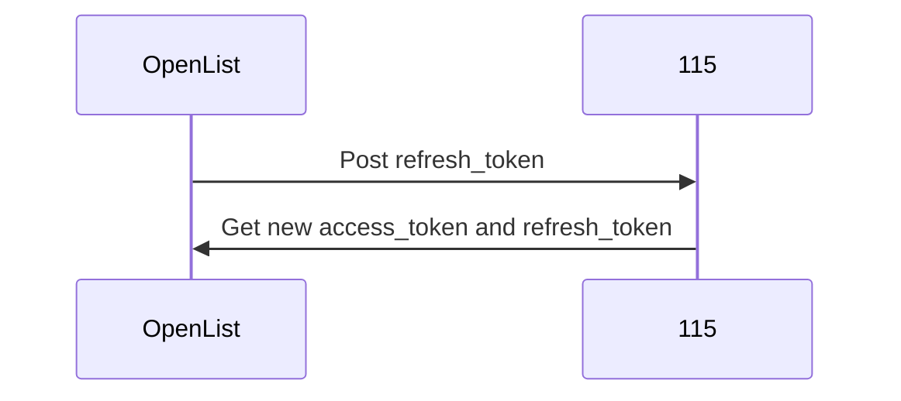
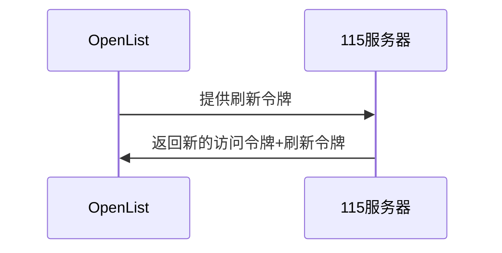
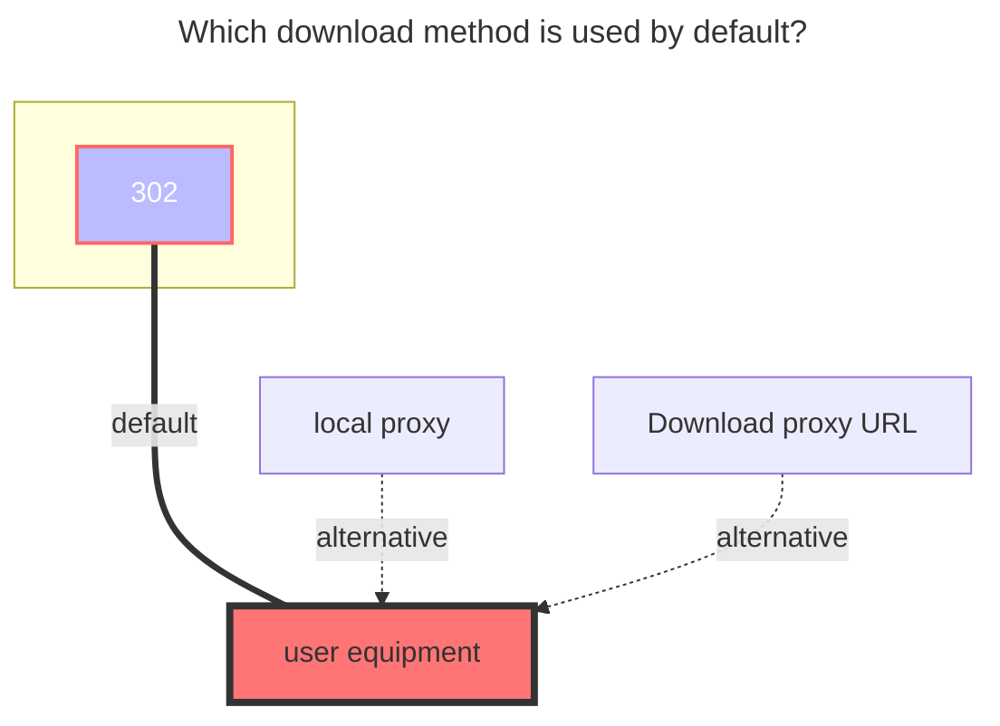
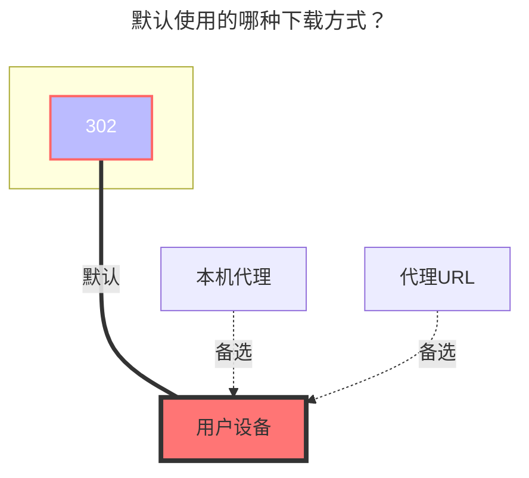

---
title:
  en: 115 Open
  zh-CN: 115 开放平台
# This is the icon of the page
icon: iconfont icon-state
# This control sidebar order
top: 500
# A page can have multiple categories
categories:
  - guide
  - drivers
---

::: en
::: tip
Developed with the official [**115 Open Platform API**](https://open.115.com)
:::
::: en
::: danger Please read the precautions carefully
Please use your account in a standardized manner. Do not use it for distribution services including but not limited to **`multi-person sharing`**, **`image hosting, software hosting`** and **`video external links to video websites for playback`**, as well as some other irregular uses not mentioned above. You will be responsible for the consequences of your account being blocked.
:::

::: zh-CN
::: tip
使用官方 [**115开放平台 API**](https://open.115.com) 开发
:::
::: zh-CN
::: danger 请仔细阅读注意事项
请规范使用帐号，包含但不限于 **`多人共享使用`**、**`图床、软件床`** 和 **`视频外链到视频网站播放`** 等分发服务以及一些没有提到的不规范使用的方式导致帐号被封禁的，后果自负
:::

## 1. Necessary Conditions { lang="en" }

## 1. 必要条件 { lang="zh-CN" }

::: en
An **115** account is required.
:::
::: en
::: warning Note
The speed and stability are related to the local network environment, the network environment of the 115 server, and the performance of the machine running OpenList.
:::

::: zh-CN
必须有 **115** 的帐号
warning 注意事项
速度与稳定性与本地网络环境，115 服务器的网络环境以及 OpenList 的运行机器的性能有关
:::

## 2. Preparation for Access { lang="en" }

## 2. 准备接入 { lang="zh-CN" }

### 2.1. Register an Application on the Open Platform (optional; no need to create if using the built-in key pair of OpenList/public welfare server/self-built server) { lang="en" }

### 2.1. 开放平台注册应用（可选，如果使用OpenList/公益服务器/自建服务器内置的密钥对，则不用创建） { lang="zh-CN" }

::: en
::: tip
Please register the application according to the requirements of the 115 Open Platform.
:::
::: en
Open Platform address: [115 Open Platform: https://open.115.com](https://open.115.com)
:::
::: zh-CN
::: tip
请根据115 开放平台的要求注册应用
:::
::: zh-CN
开放平台地址: [115 开放平台:https://open.115.com ](https://open.115.com)
:::

### 2.2. Obtain Tokens { lang="en" }

### 2.2. 获取令牌 { lang="zh-CN" }

::: en

1. Visit [api.oplist.org](https://api.oplist.org) **⚠️ If using a public welfare server/self-built server, visit the address of the public welfare server/self-built server**.

2. Select **115 Network Disk Verification** from the drop-down box.

   

   

3. If you are using the built-in key pair of `OpenList (or public welfare server/self-built server)` (i.e., you do not have application information from the 115 Open Platform), please configure according to `3.1`, `3.2`, and `3.3`:

   3.1. Check `Use parameters provided by OpenList`.

   3.2. Leave both `Client ID (ClientID/AppID)` and `Application Secret (AppKey/Secret)` blank.

   3.3. Click the `Get Token` button.

   

   

4. If you are using your own created OAuth client ID and secret, please configure according to `4.1`, `4.2`, and `4.3`:

   4.1. Do not check `Use parameters provided by OpenList`.

   4.2. Enter your `AppId` in `Client ID` and your `AppSecret` in `Application Secret`.

   4.3. Click the `Get Token` button.

   

   

5. In the pop-up window, log in to your 115 account and authorize OpenList to access your 115 network disk.

   

6. After successful authorization, the page will display your `Access Token` and `Refresh Token`. Please copy and save these two tokens.

   

   

:::

::: zh-CN

1. 访问[api.oplist.org](https://api.oplist.org) **⚠️如果使用公益服务器/自建服务器，请访问公益服务器/自建服务器的地址**

2. 在下拉框中选择 **115 验证网盘**

   

   

3. 如果你使用的是 `OpenList （或者公益服务器/自建服务器）`内置的密钥对（即：自身没有115开放平台的应用信息），请按照`3.1`、`3.2`和`3.3`进行配置

   3.1. **勾选**`使用 OpenList 提供的参数`。

   3.2. `客户端ID（ClientID/AppID）`和`应用秘钥 (AppKey/Secret)`均**留空**

   3.3. 点击`获取Token`按钮。

   

   

4. 如果你使用的是自己创建的 OAuth 客户端 ID 和密钥，请按照`4.1`、`4.2`和`4.3`进行配置

   4.1. **不要**勾选`使用 OpenList 提供的参数`。

   4.2. 在`客户端ID`中填写你的`AppId`，在`应用密钥`中填写你的`AppSecret`

   4.3. 点击`获取Token`按钮。

   

   

5. 在弹出的窗口中，登录你的 115 账号，并授权 OpenList 访问你的 115 网盘。

   

6. 授权成功后，页面会显示你的 `访问令牌（Access Token）` 和 `刷新令牌（Refresh Token）`，请复制并保存这两个令牌。

   

   

:::

## 3. Adding 115 Network Disk to OpenList { lang="en" }

## 3. 在OpenList中添加115网盘 { lang="zh-CN" }

### 3.1. Configuration Instructions { lang="en" }

### 3.1. 配置说明 { lang="zh-CN" }

#### 3.1.1. Root Folder ID { lang="en" }

#### 3.1.1. 根文件夹 ID { lang="zh-CN" }

::: en
The default root directory ID is: `0`

Open the 115 network disk official website, and when clicking to enter the folder to be set, click the number after `cid` in the URL.

For example, <https://115.com/?cid=249163533602609229&offset=0&tab=&mode=wangpan>

The `root folder ID` of this folder is `249163533602609229`.
:::
::: zh-CN
默认根目录ID为：`0`

打开 115 网盘官网，点击进入要设置的文件夹时点击 URL 中 `cid`后面的数字

如 <https://115.com/?cid=249163533602609229&offset=0&tab=&mode=wangpan>

这个文件夹的 `根文件夹ID` 即为 `249163533602609229`<br/>
:::

### 3.2. Start Adding { lang="en" }

### 3.2. 开始添加 { lang="zh-CN" }

::: en

1. Open the management interface of OpenList and click `Storage` in the left menu.

2. On the storage list page, click the `Add Storage` button in the upper right corner.

3. Select the driver as `115 Open Platform`.

   

   

4. Enter the mounting path, such as: `115`.

5. Enter the root folder ID obtained above in `Root Folder ID` (please refer to [3.1.1. Root Folder ID](#_3-1-1-root-folder-id)).

6. Enter the obtained `Refresh Token` and `Access Token` in the refresh token (if not obtained, please refer to [2. Preparation for Access](#_2-preparation-for-access)).

   - 115's token refresh mechanism does not require AppKey and has IP-based rate limiting, so it is implemented using [local logic](https://github.com/OpenListTeam/115-sdk-go).

7. Click the `Add` button to complete adding the 115 network disk.

:::
::: zh-CN

1. 打开 OpenList 的管理界面，点击左侧菜单中的`存储`。

2. 在存储列表页面，点击右上角的`添加存储`按钮。

3. 选择驱动为`115 开放平台`。

   

   

4. 输入挂载路径，如：`115`。

5. 在`根文件夹 ID`中填写上面获取的根文件夹 ID（请参考[3.1.1.根文件夹 ID](#_3-1-1-根文件夹-id)）。

6. 刷新令牌中填写上面获取的`刷新令牌`和`Access token`（如未获取，请参考[2. 准备接入](#_2-准备接入)）。

   - 115的令牌刷新机制不需要AppKey，且有针对IP的频控，故使用[本地逻辑](https://github.com/OpenListTeam/115-sdk-go)实现。

7. 点击`添加`按钮，完成115网盘的添加。

:::

### 3.3. Method for Refreshing Access Token { lang="en" }

### 3.3. 当前AccessToken刷新的方式 { lang="zh-CN" }

::: en



:::
::: zh-CN




## 4. Notes { lang="en" }

## 4. 注意事项 { lang="zh-CN" }

::: en
::: warning Handling Method for Token Leakage
If the Token is accidentally leaked, you can go to the 115 device login management to解除应用授权 (revoke application authorization).

- 115 APP: [iOS, Android] versions need to be ≥ 35.11.0
- 115 Web端: [https://115.com/?mode=device_manage](https://115.com/?mode=device_manage)

  When it expires, the following content will be prompted:

  ```json
  failed get objs: failed to list objs: code: 40140116, message: no auth
  ```

An account can obtain two `Refresh tokens` in the same application. After the third acquisition, the first obtained `Refresh token` will expire. Using the first `Refresh token` will prompt the above error.
:::
::: zh-CN
::: warning Token 泄漏后处理方法
如果不小心泄漏了 Token，可以前往115设备登录管理解除应用授权

- 115 APP：【**iOS** 、**Android**】版本 需要 ≥ 35.11.0
- 115 网页端：**https://115.com/?mode=device_manage**

  失效后会提示如下内容：

  ```json
  failed get objs: failed to list objs: code: 40140116, message: no auth
  ```

一个帐号可以在同一个应用获取两次`Refresh token`，第三次获取后第一次获取到的`Refresh token`就会失效，使用第一个`Refresh token`会提示上面的错误
:::

## 5. Using Other APP IDs to Obtain Refresh Tokens (Not Yet Implemented) { lang="en" }

## 5. 使用其他 APP ID 获取刷新令牌（尚未实现） { lang="zh-CN" }

::: en
::: tip
Under development, the tutorial has not been updated yet. Stay tuned!
:::

::: zh-CN
::: tip
开发中, 教程暂未更新, 敬请期待!
:::

## 6. Mobile QR Code Authorization PKCE Mode (Not Yet Implemented) { lang="en" }

## 6. 手机扫码授权PKCE模式（尚未实现） { lang="zh-CN" }

::: en
::: tip
Under development, the tutorial has not been updated yet. Stay tuned!
:::

::: zh-CN
::: tip
开发中, 教程暂未更新, 敬请期待!
:::

## 7. Default Download Method Used { lang="en" }

## 7. 默认使用的下载方式 { lang="zh-CN" }

::: en



:::
::: zh-CN



:::
