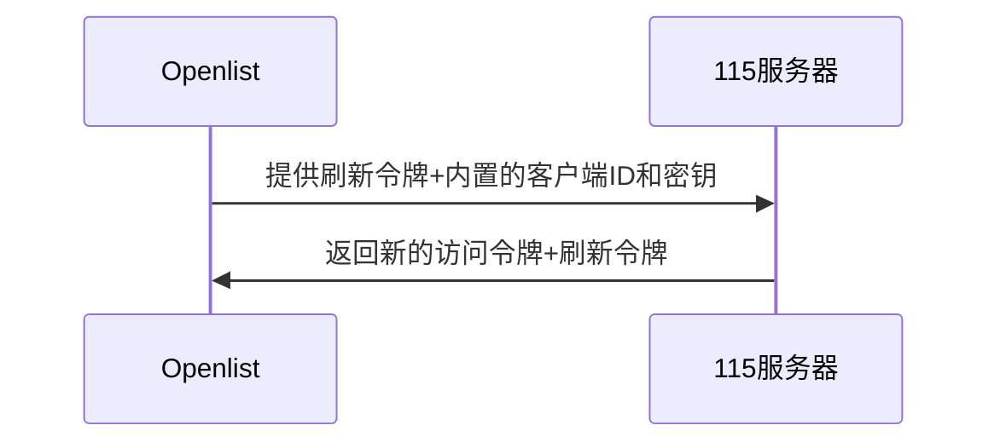
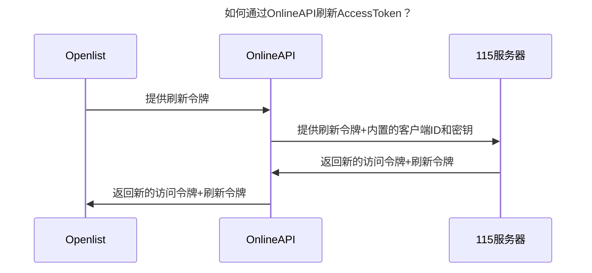
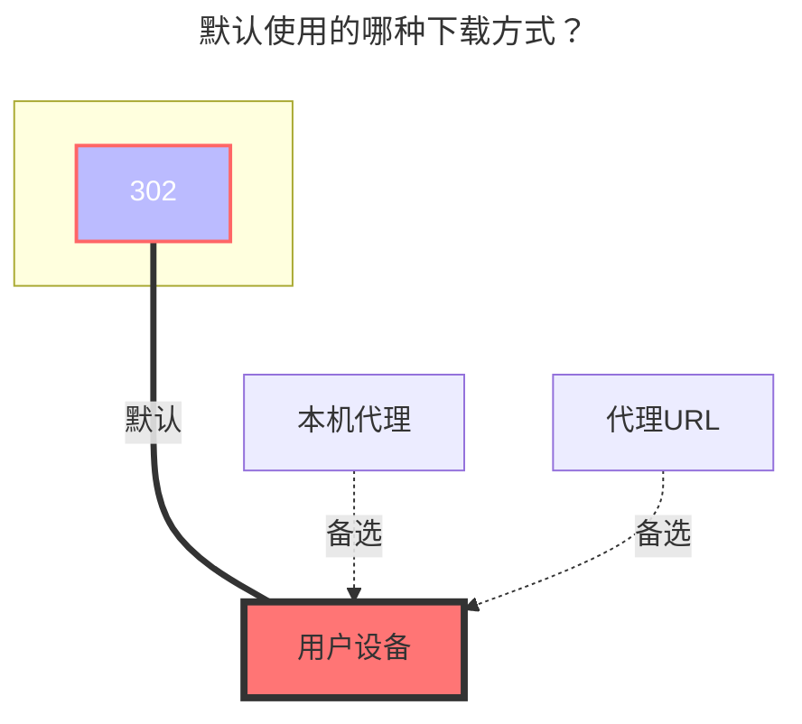

::: tip
使用官方 [**115开放平台 API**](https://open.115.com) 开发
:::

::: danger 请仔细阅读注意事项

请规范使用帐号，包含但不限于 **`多人共享使用`**、**`图床、软件床`** 和 **`视频外链到视频网站播放`** 等分发服务以及一些没有提到的不规范使用的方式导致帐号被封禁的，后果自负

:::

<br/>

## 1.必要条件

必须有 **115** 的帐号
::: warning 注意事项
速度与稳定性与本地网络环境，115 服务器的网络环境以及 OpenList 的运行机器的性能有关
:::

## 2.准备接入

### 2.1.开放平台注册应用（可选，如果使用OpenList/公益服务器/自建服务器内置的密钥对，则不用创建）

::: tip
请根据115 开放平台的要求注册应用
:::
开放平台地址: [115 开放平台:https://open.115.com ](https://open.115.com)

### 2.2.**获取令牌**

1. 访问[api.oplist.org](https://api.oplist.org) **⚠️如果使用公益服务器/自建服务器，请访问公益服务器/自建服务器的地址**
2. 在下拉框中选择 **115 验证网盘**


3. 如果你使用的是 `OpenList （或者公益服务器/自建服务器）`内置的密钥对（即：自身没有115开放平台的应用信息），请按照`3.1`、`3.2`和`3.3`进行配置
   3.1. **勾选**`使用 OpenList 提供的参数`。
   3.2. `客户端ID（ClientID/AppID）`和`应用秘钥 (AppKey/Secret)`均**留空**
   3.3. 点击`获取Token`按钮。


4. 如果你使用的是自己创建的 OAuth 客户端 ID 和密钥，请按照`4.1`、`4.2`和`4.3`进行配置
   4.1. **不要**勾选`使用 OpenList 提供的参数`。
   4.2. 在`客户端ID`中填写你的`AppId`，在`应用密钥`中填写你的`AppSecret`
   4.3. 点击`获取Token`按钮。


5. 在弹出的窗口中，登录你的 115 账号，并授权 OpenList 访问你的 115 网盘。


6. 授权成功后，页面会显示你的 `访问令牌（Access Token）` 和 `刷新令牌（Refresh Token）`，请复制并保存这两个令牌。


## 3.在OpenList中添加115网盘

### 3.1. 配置说明

#### 3.1.1.**根文件夹 ID**

默认根目录ID为：`0`<br/>
打开 115 网盘官网，点击进入要设置的文件夹时点击 URL 中 `cid`后面的数字<br/>
如 <https://115.com/?cid=249163533602609229&offset=0&tab=&mode=wangpan><br/>
这个文件夹的 `根文件夹ID` 即为 `249163533602609229`<br/>

### 3.2.开始添加

1. 打开 Alist 的管理界面，点击左侧菜单中的`存储`。
2. 在存储列表页面，点击右上角的`添加存储`按钮。
3. 选择驱动为`115 开放平台`。
   
   
4. 输入挂载路径，如：`115`。
5. 在`根文件夹 ID`中填写上面获取的根文件夹 ID（请参考[3.1.1.根文件夹 ID](#_3-1-1-根文件夹-id)）。
6. 刷新令牌中填写上面获取的`刷新令牌`和`Access token`（如未获取，请参考[2. 准备接入](#_2-准备接入)）。
7. 如果你使用的是 `OpenList （或者公益服务器/自建服务器）`提供的 OAuth 客户端 ID 和密钥，请按照`7.1`和`7.2`进行配置
   7.1. 在`Use online api`中勾选，表示使用 OpenList 提供的在线 API。
   7.2. Api url address填写为 `https://api.oplist.org/115cloud/renewapi`，如果是`公益服务器/自建服务器`，请填写对应的服务器地址。


8. 如果你使用的是自己创建的 OAuth 客户端 ID 和密钥，请按照`8.1`和`8.2`进行配置
   8.1. 在`Use online api`中不勾选，表示使用自建的 OAuth 客户端 ID 和密钥。
   8.2. 在`客户端ID`中填写你的`Oauth 客户端 ID`，在`客户端密钥`中填写你的`Oauth 客户端密钥`


9. 点击`添加`按钮，完成115网盘的添加。

## 4.关于`Use online api`选项的说明

### 4.1.自身有密钥的情况下，AccessToken刷新的方式



### 4.2.自身没有密钥的情况下，AccessToken刷新的方式



## 5.**注意事项**

::: warning Token 泄漏后处理方法

如果不小心泄漏了 Token，可以前往115设备登录管理解除应用授权

- 115 APP：【**iOS** 、**Android**】版本 需要 ≥ 35.11.0
- 115 网页端：**https://115.com/?mode=device_manage**

失效后会提示如下内容：

```json
failed get objs: failed to list objs: code: 40140116, message: no auth
```

一个帐号可以在同一个应用获取两次`Refresh token`，第三次获取后第一次获取到的`Refresh token`就会失效，使用第一个`Refresh token`会提示上面的错误

:::

<br/>

## 6.使用其他 APP ID 获取刷新令牌（尚未实现）

::: tip
开发中, 教程暂未更新, 敬请期待!
:::

## 7.手机扫码授权PKCE模式（尚未实现）

::: tip
开发中, 教程暂未更新, 敬请期待!
:::

## 8.默认使用的下载方式


