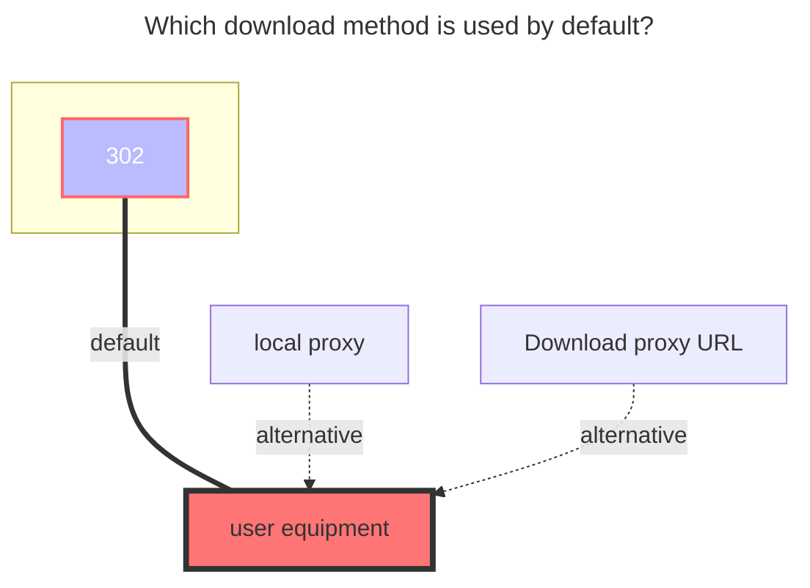
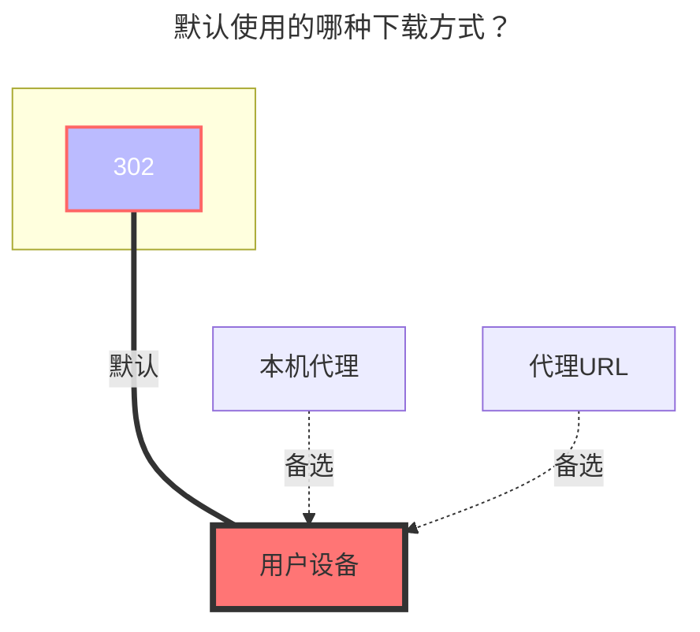

---
title:
  en: 123 Pan / Share / Link
  zh-CN: 123 网盘 / 分享 / 直链
# This is the icon of the page
icon: iconfont icon-state
# This control sidebar order
top: 420
# A page can have multiple categories
categories:
  - guide
  - drivers
---

## Personal { lang="en" }

## 个人 { lang="zh-CN" }

::: en
Free user 1G traffic download, unlimited upload, multi-IP sharing is prohibited
:::

::: zh-CN
免费用户 1G 流量下载，上传不限制，禁止多IP共享使用
:::

::: en
::: warning

```json
failed get objs: failed to list objs:当前账号存在安全风险，请使用短信验证码或者微信进行登录。
```

solution:

- This is because the 123 cloud disk officially prohibits the mounting on strange devices, If you are mounted locally, `or` Windows Server server mount `to open the 123 cloud disk web page to log in or modify a password once

:::

::: zh-CN
::: warning
挂载提示：

```json
failed get objs: failed to list objs:当前账号存在安全风险，请使用短信验证码或者微信进行登录。
```

解决方案：

- 这是由于 123 云盘官方禁止在陌生设备挂载，如果你是在`本地挂载`或者`Windows Server服务器挂载`可以在本地打开 123 云盘网页登录一下或者修改一次密码

:::

::: en
https://www.123pan.com/

Just fill in the account password.
:::

::: zh-CN
https://www.123pan.com/

只需填写账户密码即可。

:::

### 用户名 { lang="zh-CN" }

### Username { lang="en" }

::: en
The mobile phone number used to log in
:::
::: zh-CN
用于登录的手机号码
:::

### 密码 { lang="zh-CN" }

### Password { lang="en" }

::: en
The password used to log in
:::
::: zh-CN
用于登录的密码
:::

### 根文件夹 ID { lang="zh-CN" }

### Root folder file_id { lang="en" }

::: en
Enter the folder you want to mount, the last string of the official website URL, such as:
:::
::: zh-CN
输入要挂载的文件夹，官网 URL 的最后一串，如：
:::


### 使用建议 { lang="zh-CN" }

### Recommendations { lang="en" }

::: en

- It seems that the 123 API has a limited number of loads each time, so if you load hundreds of files in a folder at one time, an error may be reported
- It is recommended to A useful approach is not to put too many sub-items in the same folder.

:::

::: zh-CN

- 貌似 123 的 API 每次加载的数量有限，故如果你一个文件夹内一次性加载几百个文件，可能会报错
- 建议不用在每个文件夹内放置太多子文件/文件夹

:::

## 直链 { lang="zh-CN" }

## Link { lang="en" }

::: en
only adapted to the authentication function, the link also needs to be filled in by yourself, like [UrlTree](/guide/drivers/url_tree), fill in the direct link copied in 123 direct link.
:::
::: zh-CN
仅适配了鉴权功能，链接也需要自己填写，像[地址树一样](/guide/drivers/url_tree.md)，把在 123 直链复制的直链填写进去即可
:::

::: en
::: danger Please read this reminder carefully
Since 123 Cloud Disk Direct Link is a paid service with a storage quota, if you decide to add more storage, please ensure you set up passwords, metadata, and other protective measures to prevent malicious traffic.

After configuring these settings, test them in incognito mode to confirm everything is working correctly. If you fail to implement adequate anti-theft measures and experience malicious traffic overload, you will be held responsible for the consequences.

:::

::: zh-CN
::: danger 请仔细阅读此提醒
由于123云盘直链是付费服务并有限制额度，如果您添加123直链存储，请及时设置密码、元信息等安全措施，以防止恶意刷流量。

设置完成后，请先在无痕模式下进行测试，确保防盗措施已正确设置。如未设置妥当，导致被恶意刷流量，后果自负。
:::

::: en
First open **`123 Cloud Disk Direct Link Management`**: **https://www.123pan.com/DirectLink** Set an authentication key in the lower right corner, and then turn on the authentication status switch


- Open Settings 123 Cloud Disk Settings: **https://www.123pan.com/Setting** and find the account ID [`1` label in the picture below]
- How to activate direct link? (You need to activate membership to use it)
  - Find the folder you want to open, right-click on `Enable Direct Link Space`, and after opening it, you will see a link icon in the folder [Tag `2` in the picture below]
- How to get a direct link to a file? [Tag `3` in the picture below]
  - Enter the folder that has 'enabled direct link space', find the file you need to obtain, right-click 'Get direct link', and fill in the OpenList configuration after obtaining it.
    

:::

::: zh-CN
首先打开 **`123云盘直链管理`**: **https://www.123pan.com/DirectLink** 右下角自己设置一个鉴权秘钥，然后打开鉴权状态开关


- 打开设置 123云盘设置 : **https://www.123pan.com/Setting** ，找到帐号ID【下图`1`号标签】
- 如何开启直链？（需要开启会员才能用）
  - 找到要开启的文件夹右键点击`启用直链空间`，开启后就会看到文件夹有一个链接图标【下图`2`号标签】
- 如何获取文件直链？【下图`3`号标签】
  - 进入已经`启用直链空间`的文件夹，找到需要获取的文件右键`获取直链链接`，获取到后填写到OpenList配置內
    

:::

### 填写示例 { lang="zh-CN" }

### Fill in example { lang="en" }

::: en

- **Origin urls**：Fill in the direct link to the files we copied one by one
  - It supports creating different folders like [UrlTree](/guide/drivers/url_tree), and supports filling in the file size and modification time (four options are provided for use, like the UrlTree filling, refer to the second example of the picture below)
  - File size unit: `B` bytes. For example, if you want to write a 1MB file, it is 1048567 bytes. You can search for the specific byte conversion in your browser (you can leave it blank).
  - File modification time: It is `Unix timestamp`. You can search in the browser for the specific conversion (you can leave it blank).

  Fill in the format:

  ```txt
  [FileSize:][Modified:]URL
  127451136:1694101621:https://vip.123pan.cn/1812xxx499/123-link-Test/linuxqq_3.2.0-16736_mips64el.deb
  [FileSize:]URL
  134847488:https://vip.123pan.cn/1812xxx499/123-link-Test/linuxqq_3.2.0-16736_loong64.deb
  [Modified:]URL
  1694101621:https://vip.123pan.cn/1812xxx499/123-link-Test/linuxqq_3.2.0-16736_arm64.AppImage
  URL
  https://vip.123pan.cn/1812xxx499/123-link-Test/linuxqq_3.2.0-16736_x86_64.AppImage
  ```

- **Private key**：
  - You can set up the direct link management page yourself and turn it on. Please turn it on.
- **Uid**：
  - Account ID in the account settings page
- **Valid duration**：
  - The file direct link validity period, in minutes, is filled in by default to 30 minutes

:::

::: zh-CN

- **来源链接**：填写我们一条一条复制的文件直链
  - 支持像[地址数](/guide/drivers/url_tree)那样新建不同文件夹，支持填写文件大小和修改时间（提供四种方案可以使用，像地址树填写参考下方图片的图二示例）
  - 文件大小单位：为`B`字节,例如1MB的文件要写，1048567，具体字节换算自己在浏览器搜索（可以不写）
  - 文件修改时间：为`Unix timestamp-时间戳`，具体如何换算可以在浏览器搜索（可以不写）

  填写格式：

  ```
  [文件字节大小:][文件时间戳:]URL
  127451136:1694101621:https://vip.123pan.cn/1812xxx499/123-link-Test/linuxqq_3.2.0-16736_mips64el.deb
  [文件字节大小:]URL
  134847488:https://vip.123pan.cn/1812xxx499/123-link-Test/linuxqq_3.2.0-16736_loong64.deb
  [文件时间戳:]URL
  1694101621:https://vip.123pan.cn/1812xxx499/123-link-Test/linuxqq_3.2.0-16736_arm64.AppImage
  URL
  https://vip.123pan.cn/1812xxx499/123-link-Test/linuxqq_3.2.0-16736_x86_64.AppImage
  ```

- **鉴权秘钥**：
  - 直链管理页面自己设置，并开启，请必须开启
- **用户Uid**：
  - 帐号设置页面內 帐号ID
- **有效期**：
  - 文件直链有效期，单位为分钟，默认填充为30分钟

:::


## 分享 { lang="zh-CN" }

## Share { lang="en" }

::: en
Fill in the driver's **`share key`** and optional **`share password`** (if there is a password, you need to fill in), the root folder ID defaults to `0` to display all files
:::
::: zh-CN
填写驱动的 **`分享key`** 和选填 **`分享密码`** (如果有密码需要填写)，根文件夹ID默认为`0`显示全部文件
:::

### 填写示例 { lang="zh-CN" }

### Fill in the example { lang="en" }

::: en

:::
::: zh-CN

:::

### Share Password { lang="en" }

### 分享密码 { lang="zh-CN" }

::: en
Fill in if you have it, don't if you don't
:::
::: zh-CN
有就填写，没有就不用
:::

### Root folder file_id { lang="en" }

### 根文件夹 ID { lang="zh-CN" }

::: en
The ID of the root directory of the shared link is `0`, displaying all files

If you only want to display a certain folder, open the developer mode (F12) to clear all requests (maybe 123 prohibits debug debugging, you need to close this by yourself to continue)

Find the request on the right side of the picture in the upper-level directory request of the directory you want to display, then click `Response`, find the format button `{}` below and format it, and you can see the relevant directory ID.

If you are not sure whether the directory ID is correct or not, there is a directory name under the directory ID


:::
::: zh-CN
分享链接根目录ID是`0`，展示全部文件

如果只想展示某个文件夹，打开开发者模式(F12)清空全部请求（可能123禁止debug调试需要自己关闭这个才能继续）

在想展示的目录上级目录请求內找到图片中右侧的请求，然后点击`响应`，找到下面的格式化按钮`{}`格式化一下，即可看到相关的目录ID，

如果不确定目录ID对不对目录ID下方有目录名称


:::

## The default download method used { lang="en" }

## 默认使用的下载方式 { lang="zh-CN" }

::: en



:::

::: zh-CN



:::
