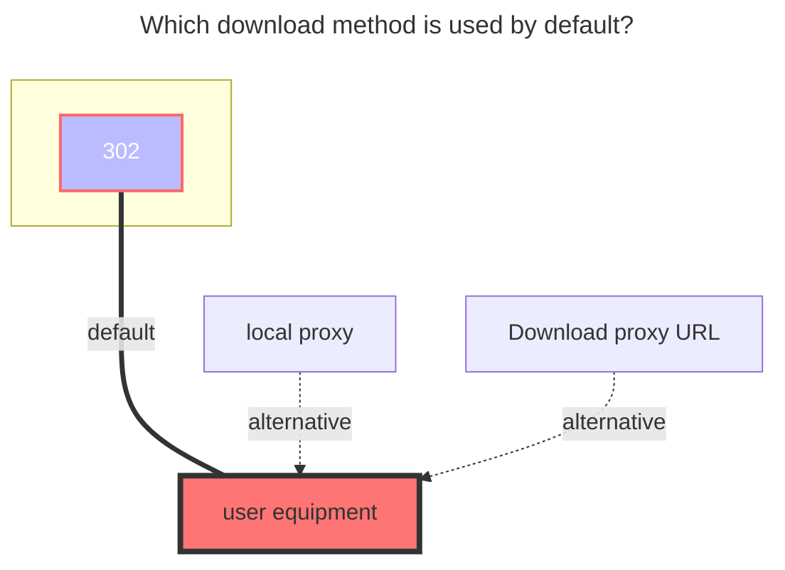
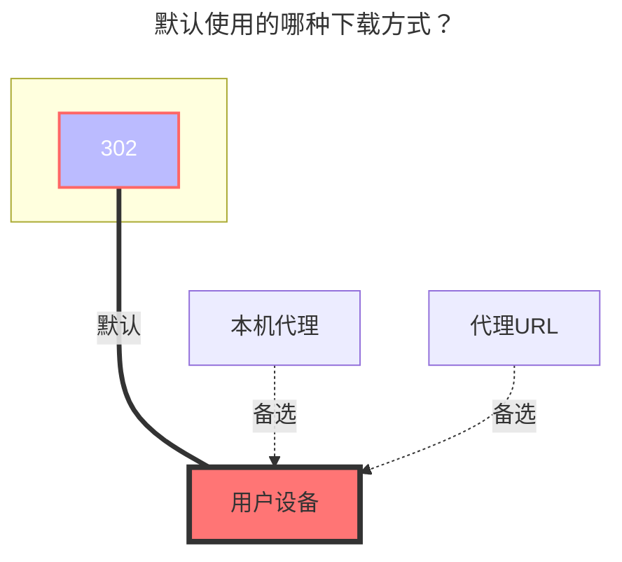

---
title:
  en: 123 Open
  zh-CN: 123 开放平台
# This is the icon of the page
icon: iconfont icon-state
# This control sidebar order
top: 421
# A page can have multiple categories
categories:
  - guide
  - drivers
---

::: en
::: warning
⚠️Note that the public and private keys of 123 Cloud Disk OpenAPI directly connect to the applicant's cloud disk, so you **must use your client id and client secret**.

- Application method: https://www.123pan.com/developer

:::
::: zh-CN
::: warning
⚠️注意，123云盘OpenAPI的公私钥直通申请人的网盘，所以**必须使用自己的公钥和私钥**

- 申请方式: https://www.123pan.com/developer

:::

## 获取Token { lang="zh-CN" }

## GetToken { lang="en" }

::: zh-CN
打开[https://api.oplist.org/](https://api.oplist.org/)

> 如果是使用社区或者自建的api服务，请打开对应的地址

- 选择`123 网盘 (OAuth2) 跳转登录`
- 输入`客户端ID（ClientID/AppID）`
- 输入`应用秘钥 (AppKey/Secret)`
- 点击`获取Token`

点击后，界面下方的访问令牌中将会出现`https://open-api.123pan.com/api/v1/access_token?client_id=你的客户端ID&clientSecret=你的客户端密钥`

> 这就是访问令牌

:::

::: en
Open [https://api.oplist.org/](https://api.oplist.org/)

> If using a community or self-built API service, please open the corresponding address

- Choose the ``123 网盘 (OAuth2) 跳转登录`
- Enter the `Client ID (ClientID/AppID)`
- Enter the `Application Secret (AppKey/Secret)`
- Click `Get Token`

After clicking, the access token at the bottom of the interface will display `https://open-api.123pan.com/api/v1/access_token?client_id=your client ID&clientSecret=your client secret`

> This is the access token

:::

## 在OpenList中添加 { lang="zh-CN" }

## Add in OpenList { lang="en" }

### 刷新令牌 { lang="zh-CN" }

### RefreshToken { lang="en" }

::: zh-CN
**留空**
:::
::: en
**keep it empty**
:::

### 客户端ID { lang="zh-CN" }

### Client ID { lang="en" }

::: zh-CN
填入你的客户端ID
:::
::: en
Enter your client ID
:::

### 客户端密钥 { lang="zh-CN" }

### Client Secret { lang="en" }

::: zh-CN
填入你的客户端密钥
:::
::: en
Enter your client secret
:::

### 访问令牌 { lang="zh-CN" }

### AccessToken { lang="zh-CN" }

::: zh-CN
填入上面获取的访问令牌
:::
::: en
Enter the access token obtained above
:::

### Root Folder ID { lang="en" }

### 根文件夹 ID { lang="zh-CN" }

::: en
The default root directory ID is: `0` 
Open the official website of 123 Cloud Drive, navigate to the folder you want to set, and then click the number following `homeFilePath` in the URL. 
For example, <https://www.123pan.com/?homeFilePath=123456> 
The `root folder ID` of this folder is `123456`.
:::
::: zh-CN
默认根目录ID为：`0` 
打开 123 网盘官网，点击进入要设置的文件夹时点击 URL 中 `homeFilePath`后面的数字 
如 <https://www.123pan.com/?homeFilePath=123456> 
这个文件夹的 `根文件夹ID` 即为 `123456` 
:::

## The default download method used { lang="en" }

## 默认使用的下载方式 { lang="zh-CN" }

::: en

:::

::: zh-CN

:::
