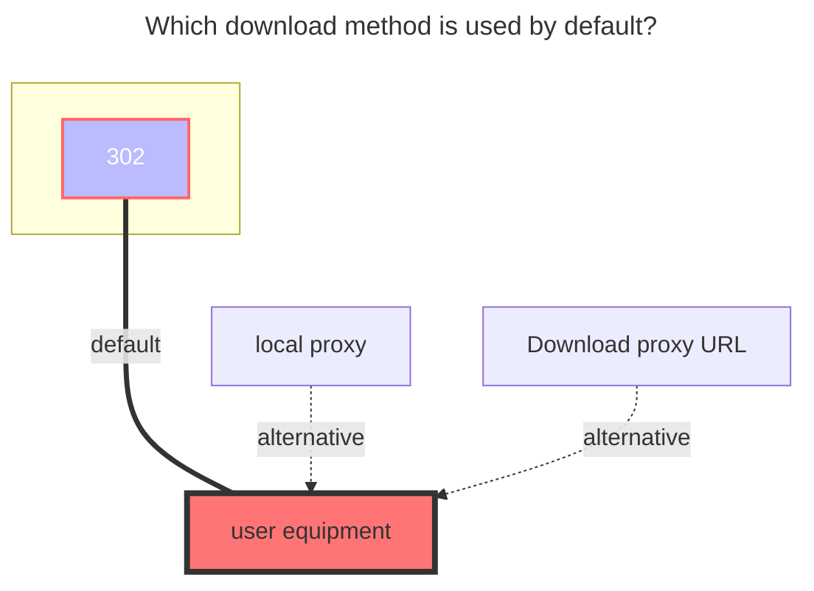
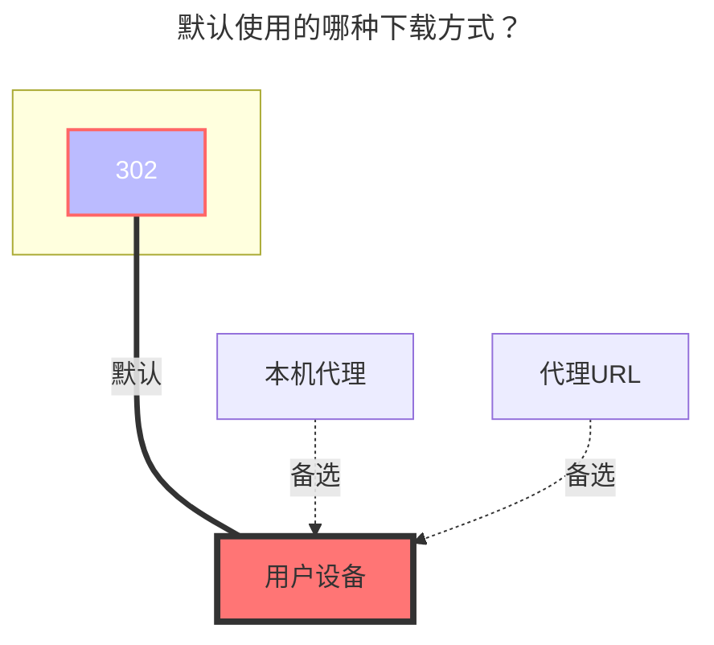

---
title:
  en: 139Yun
  zh-CN: 中国移动云盘
# This is the icon of the page
icon: iconfont icon-state
# This control sidebar order
top: 440
# A page can have multiple categories
categories:
  - guide
  - drivers
---

::: en
Cloud disk address: **<https://yun.139.com/>**
:::
::: en
::: warning
The openlist version must be greater than `v3.41.0` to use this tutorial.
:::
::: en
::: tip
Parameters can be obtained from the browser DevTools -> Network by [searching keywords](#search-keywords).
:::

::: zh-CN
云盘地址：**<https://yun.139.com/>**
:::
::: zh-CN
::: warning
OpenList版本必须大于 `v3.41.0` 版本才能使用本教程！
:::
::: zh-CN
::: tip
相关参数可通过 浏览器开发工具 -> 网络 -> 请求 [搜索关键词](#搜索关键词)获取！
:::

## Proxy Range { lang="en" }

## 代理 Range { lang="zh-CN" }

::: en
You need to enable `Web Proxy` or`WebDAV Native Proxy` first.
After enabling this option, it can resolve some issues caused by server not returning the correct HTTP status codes
even when a proxy is enabled, such as videos being unable to play, lack of support for resumable downloads, etc.
 
:::
::: zh-CN
需要先启用 `Web 代理` 或者 `WebDAV 本地代理` 才会生效。
开启这个选项后，可解决即使开启代理但下载链接没有返回正确的 HTTP 状态码导致的一些问题，例如视频无法播放、不支持断点续传等问题。
 
:::

## Authorization { lang="en" }

## Authorization { lang="zh-CN" }

::: en
Update the method of authentication, please get `Authorization` to fill in
:::
::: en
::: warning
Fill in the content starting after the Basic and a space, **do not include Basic**!
:::

::: zh-CN
已更换鉴权方式，请获取 `Authorization` 进行填写。
:::
::: zh-CN
::: warning
只需要填写 Basic 空格后面开始的内容，**不要包含 Basic**！
:::

## Type { lang="en" }

## 类型 { lang="zh-CN" }

::: en
OpenList currently supports 4 types of cloud storage:

- Personal New: New API
  - Note: The account has been migrated to a new personal cloud by the end of 2024
  - Use the PUT method to directly connect to EOS multipart uploads
- Family: My Family -> Family Files
  - Limit: The Family Cloud does not support copying, moving, or renaming folders, and files cannot be uploaded to the root directory
  - Use the POST method to resumable uploads
- Group: Shared Group
  - Limit: Shared groups do not support copying and uploading
- Personal: The old personal cloud, which is a thing of the past. If you're still using it, please contact customer service to upgrade.

:::

::: zh-CN
OpenList 目前支持挂载 4 种类型：

- 新个人云：新 API
  - 注意：移动已于 2024 年底迁移账号到新的个人云
  - 新的个人云使用 PUT 方法直连 EOS 分片上传
- 家庭云：我的家庭 -> 家庭文件
  - 限制：家庭云不支持复制、移动、重命名文件夹，根目录无法上传文件
  - 家庭云使用 POST 方法断点续传
- 共享群：共享群组
  - 限制：共享群组不支持复制、上传
- 个人云：旧的个人云，已成为历史，如果还在使用，请联系客服升级

:::

## Root folder ID { lang="en" }

## 根文件夹ID { lang="zh-CN" }

::: en
Specifies the directory to be mounted.
:::

::: zh-CN
文件夹ID，用于指定挂载的目录。
:::

::: en
::: warning
Please remember to clear or change this Root folder ID after changed the Type!
:::

::: zh-CN
::: warning
更改类型后请记得清空或修改根文件夹ID！
:::

::: en

- Personal New: `/`. It can be left blank and it will be filled in automatically.
  - If you want to list a folder separately, please enter the folder ID.
- Family: If the root directory is empty, all files are filed.
  - If you want to list a folder separately, please enter the folder ID.
- Group: If the root directory is empty, the group ID will be automatically filled. It is recommended to enter the folder ID that you manually obtained.
  - If you want to list a folder separately, please enter the folder ID.
  - Note: If you want to mount a group created by others, be sure to fill in the folder ID that you manually obtained, otherwise there will be an infinite loop in the first-level folder.
- Personal: `root`. It can be left blank and it will be filled in automatically. All will be listed, covering 18 items (check it yourself). Normal files are in **My Folder**.
  - If the write folder ID is listed in the normal root folder.

:::

::: zh-CN

- 新个人云：`/`，可以为空会自动填写，会将所有的都列出来
  - 若想挂载单独某个文件夹，请填写文件夹ID。
- 家庭云：根目录为空就是全部文件
  - 若想挂载单独某个文件夹，请填写文件夹ID。
- 共享群：为空会自动填写群组ID，建议填写手动获取的文件夹ID
  - 若想挂载单独某个文件夹，请填写文件夹ID。
  - 注意：如果想挂载别人创建的共享群，请务必填写手动获取的文件夹ID，否则会出现在一级文件夹无限循环的问题。
- 个人云：`root`，可以为空会自动填写，会将所有的都列出来，涵盖18项(自行查看)，正常文件在 **我的文件夹** 这个里面
  - 如果写文件夹ID列出的是正常的根目录文件夹

:::

## Cloud ID { lang="en" }

## Cloud ID { lang="zh-CN" }

::: en
Personal cloud does not need to fill in, **Family / Group cloud is dedicated**.

- Family: family ID, **cannot be empty**
- Group: group ID, **cannot be empty**

:::

::: zh-CN
用于区分特殊存储的ID。个人云不需要填写，**家庭云、共享群专用**。

- 家庭云：家庭云ID，**不能为空**
- 共享群：群组ID，**不能为空**

:::

## Custom upload part size { lang="en" }

## 自定义上传分片大小 { lang="zh-CN" }

::: en
The upload part size (bytes) can be customized by the user, and if there is a performance issue, please adjust it yourself. Set '0' to 100 MB by default.

- The current upload part size on the web is 20 MB (20971520).
- The [EOS documentation](https://ecloud.10086.cn/op-help-center/api/article/40933) used by the new version of the Personal Cloud states that "objects larger than > 5 GB cannot be uploaded", so the upload part size should not exceed 5 GB.

:::

::: zh-CN
可供用户自定义分片大小，单位是字节，如果出现性能问题请自行调整，设置 `0` 默认为 100 MB。

- 目前网页端的分片大小为 20 MB（20971520）。
- 新版个人云所使用的 [EOS 文档](https://ecloud.10086.cn/op-help-center/api/article/40933) 中说明“无法上传大小大于> 5 GB 的对象”，故分片大小不要超过 5 GB。

:::

## Other { lang="en" }

## 其他 { lang="zh-CN" }

::: en

- Other information is taken from the request, which has changed from cookie to obtaining `Authorization`
  - The new personal cloud can be obtained in another way. See the picture example of [Personal new](#personal-new)
- If you can't find the load on the bottom of the request information, go to the top `on the top of the upper row, marked the purple highlight

:::

::: zh-CN

- 其他信息取自请求，已经从获取cookie改变成获取`Authorization`
  - 新个人云可以通过另外的方式获取详情查看[新个人云](#新个人云)的图片示例
- 请求信息中底部找不到`载荷`，就去顶部`上面一排`，标记了紫色高亮

:::

### Search keywords { lang="en" }

### 搜索关键词 { lang="zh-CN" }

::: en
Pay attention to the keywords, use it below to get **`authorization`**, **Root folder ID** and **Cloud ID**

- Personal Cloud: **getDisk**
- Family Cloud: **queryContentList**
- Personal New: hcy/file/**list**
  - Headers - `Authorization`
  - Payload - `parentFileId`: folder ID
- Family: **queryContentList**
  - Headers - `Authorization`
  - Payload - `cloudID`: family ID
  - Payload - `catalogID`: folder ID
  - Response - `data.path`: full folder ID
- Group: **queryGroupContentList**
  - Headers - `Authorization`
  - Payload - `groupID`: group ID
  - Payload - `path`: full folder ID
- Personal: **getDisk**

:::
::: zh-CN
注意查看关键词，获取 **`Authorization`** 、**根文件夹ID**、**Cloud ID**时使用

- 新个人云：hcy/file/**list**
  - 标头 - `Authorization`
  - 载荷 - `parentFileId`：文件夹ID
- 家庭云：**queryContentList**
  - 标头 - `Authorization`
  - 载荷 - `cloudID`：家庭云ID
  - 载荷 - `catalogID`：文件夹ID
  - 响应 - `data.path`：完整文件夹ID
- 共享群：**queryGroupContentList**
  - 标头 - `Authorization`
  - 载荷 - `groupID`：群组ID
  - 载荷 - `path`：完整文件夹ID
- 个人云：**getDisk**

:::

### Personal new: { lang="en" }

### 新个人云： { lang="zh-CN" }

::: en
Choose one of the following methods to find `Authorization` and `Folder ID`

If you want to view the directory ID of a subfolder, please enter the subfolder first and then view the new request, otherwise the old directory ID will still be displayed.
:::

::: zh-CN
以下查找 `Authorization` 和 `子文件夹ID` 的方法二选一

如果你想查看子文件夹的目录ID，请先进入子文件夹后在查看新的请求，否则还是之前旧的目录ID
 
:::

### Personal cloud: { lang="en" }

### 个人云： { lang="zh-CN" }

### Family cloud: { lang="en" }

### 家庭云： { lang="zh-CN" }

::: en

::: details Teaching video
Although the video is V2 version, the way to obtain the directory ID and the cloud ID is the same.

**<https://www.bilibili.com/video/BV1US4y1w79a>**

From the previous way to get cookies, now replaced it with `Authorization`，You can see the [Fill in the Example](#openlist-fill-in-examples) tutorial below
:::

::: zh-CN

::: details 详细教学视频
虽然视频是V2版本，但是获取目录ID 和 Cloud ID的方式一样，

**<https://www.bilibili.com/video/BV1US4y1w79a>**

现在已经从获取Cookie的方式变成了获取`Authorization`，获取方式可以看下方[填写示例](#填写示例)教程
:::

### OpenList fill in examples: { lang="en" }

### OpenList挂载填写示例： { lang="zh-CN" }

::: en

- ==`Authorization`Just fill in the content of the start after the basic space==
- The new personal cloud folder ID will automatically change after you enter the folder. Just open whichever folder you need, and then get the value of `currentCatalogID`^Figure_3^
  
  
  

:::
::: zh-CN

- ==`Authorization`只需要填写Basic空格后面开始的内容==
- 新个人云文件夹ID，你进入文件夹后会自动变化，你需要哪个文件夹ID就进入哪个文件夹，然后获取`currentCatalogID`^图3^的值就可以
  
  
  

:::

### 默认使用的下载方式 { lang="zh-CN" }

### The default download method used { lang="en" }

::: en

:::

::: zh-CN

:::
