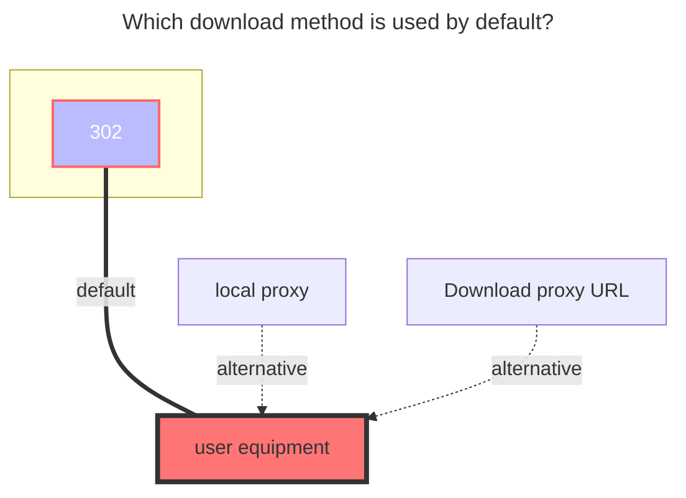
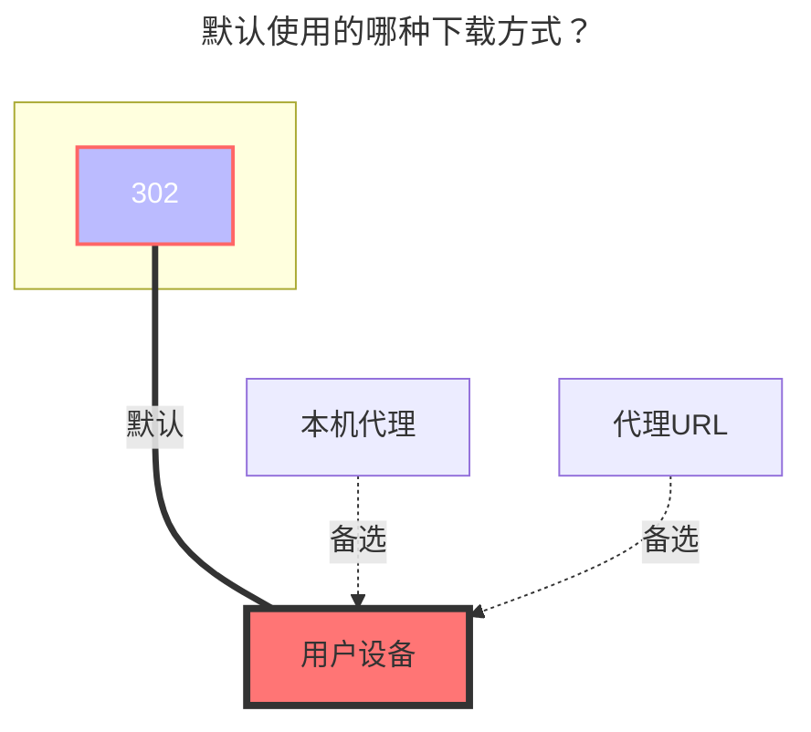

---
title:
  en: 163 Music Drive
  zh-CN: 网易云音乐云盘
icon: iconfont icon-state
# This control sidebar order
top: 250
# A page can have multiple categories
categories:
  - guide
  - drivers
---

::: en
163 Music Drive can only upload music and other operations on the mobile phone, and the web page cannot operate
 
:::
::: zh-CN
网易云音乐云盘需要在手机端才可以进行上传音乐等操作，网页端无法操作
 
:::

## **Cookie** { lang="en" }

## **Cookie** { lang="zh-CN" }

::: en
Open **https://music.163.com** and then open the F12 developer mode
Open a request at will, just carry the `Cookie` to find the following two parameters and fill in the OpenList` Cookie`

- **\_\_csrf** 、**MUSIC_U**
  
   
  :::
  ::: zh-CN
  进入 **https://music.163.com** 然后打开F12开发者模式
  随意打开一个请求只要携带 `Cookie` 找到以下两个参数填写进OpenList的 `Cookie` 中就可以使用
- **\_\_csrf** 、**MUSIC_U**
  
   
  :::

## **Song Limit** { lang="en" }

## **歌曲获取上限** { lang="zh-CN" }

::: en
You can only get 200 songs by default. If you exceed you, you can modify this option
 
:::
::: zh-CN
默认只能获取200首歌曲，如果你超出可以修改此选项
 
:::

### **Precautions** { lang="en" }

### **注意事项** { lang="zh-CN" }

::: en

1. If there are many list files, it is recommended to open pagination loading, otherwise it will not be loaded
2. Cloud space can only upload audio format files, and cannot upload other format files
    
   :::
   ::: zh-CN
3. 如果列表文件很多，建议开启分页加载
4. 云空间只可以上传音频格式文件，无法上传其它格式文件
    
   :::

### **The default download method used** { lang="en" }

### **默认使用的下载方式** { lang="zh-CN" }

::: en

:::
::: zh-CN

:::
