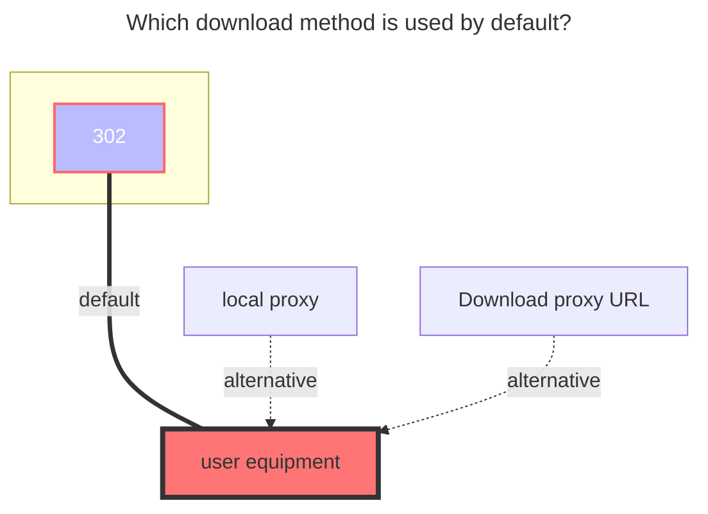
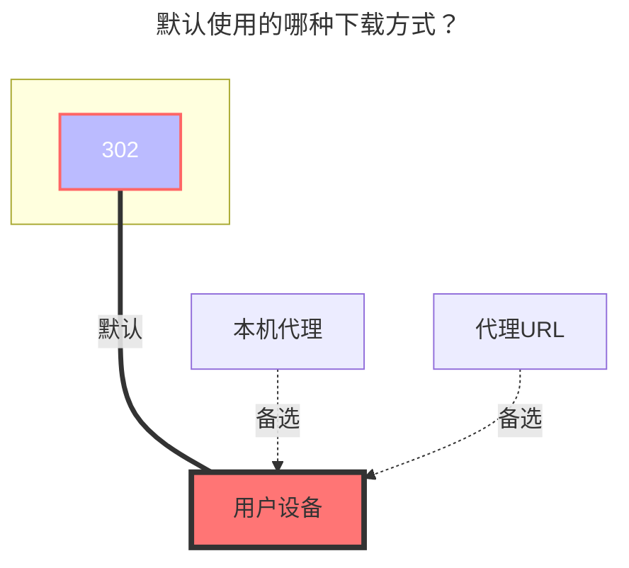

---
title:
  en: 189Cloud
  zh-CN: 电信天翼云盘
icon: iconfont icon-state
# This control sidebar order
top: 460
# A page can have multiple categories
categories:
  - guide
  - drivers
# A page can have multiple tags
tag:
  - Storage
  - Guide
  - '302'
# this page is sticky in article list
sticky: true
# this page will appear in starred articles
star: true
---

::: en
::: tip
The web -side login has been replaced with sliding verification code, **no longer supports OCR or manual input**. If the verification code needs to be used, please use the add `Cookie` to log in

This interface is a reverse-engineered interface and may become invalid at any time due to official risk control or blocking. Please follow relevant PRs for the latest updates.
:::
::: zh-CN
::: tip
Web 端登录已更换为滑动验证码，**不再支持 OCR 与手动输入**，若需要验证码请使用 `添加 Cookie 进行登录` 或使用 `天翼云盘客户端` 驱动
如遇 **设备 ID 不存在，需要二次设备校验**，请前往 `Android` 端天翼云盘 APP 的设置关闭设备锁
:::

## 189CloudTV { lang="zh-CN" }

::: zh-CN
使用天翼网盘的TV接口，挂载步骤最少。

1. 挂载时选择189CloudTV（当前未确定正式翻译），登录相关的参数留空，如果你不确定，**只填写挂载路径即可**。

2. 点击保存后只需要返回存储管理界面，可以自行选择扫码登录或者点击链接转跳登录（对于链接登录，如果你不确定，建议**右键链接选择新窗口打开**）。

3. 进入后选择短信登录，登录完成后返回存储管理界面，禁用再启用该存储后即可正常使用（可能需要刷新网页）。

:::

## 189CloudTV { lang="en" }

::: en
Uses the TV interface of Tianyi Cloud Drive, with the fewest mounting steps.

1. When mounting, select 189CloudTV. Leave the login parameters blank. If you are unsure, **just fill in the mount path**.

2. After clicking save, simply return to the storage management page. You can choose to log in by scanning a QR code or click the link to log in (for link login, if you are unsure, it is recommended to **right-click the link and open it in a new window**).

   

3. After entering, select SMS login. Once logged in, return to the storage management page. Disable and re-enable the storage to use it normally (you may need to refresh the page).

   

:::

## 个人云 { lang="zh-CN" }

## Personal Cloud { lang="en" }

### Username { lang="en" }

### 用户名 { lang="zh-CN" }

::: en
the phone number used to log in
:::
::: zh-CN
用于登录的电话号码
:::

### 密码 { lang="zh-CN" }

### Password { lang="en" }

::: en
password for login
:::

::: zh-CN
登录密码
:::

### 根文件夹ID { lang="zh-CN" }

### Root folder ID { lang="en" }

::: en
The string at the end of the official website url, such as:

- https://cloud.189.cn/web/main/file/folder/-11 -> `-11`
- https://cloud.189.cn/web/main/file/folder/71398114617385472 -> `71398114617385472`

  

:::

::: zh-CN
官网 URL 末尾的字符串，如：

- https://cloud.189.cn/web/main/file/folder/-11 -> `-11`
- https://cloud.189.cn/web/main/file/folder/71398114617385472 -> `71398114617385472`

  

:::

### 家庭云中转 { lang="zh-CN" }

### Family transfer { lang="en" }

::: en
Give 189 cloud disk adds Personal's `Family Transfer option`, which is convenient for users without VIP, and a large number of family cloud spaces upload.

- Note: The old upload interface family cloud will still limit the upload quantity, so `Rapid upload` and ` Old Upload` will not take effect

:::
::: zh-CN
为189云盘增加个人云使用`家庭云中转选项`，方便不开会员且家庭云空间小情况下大量上传。

- 注：旧的上传接口家庭云依然会限制上传量，所以`秒传选项`和`旧的上传方式`不生效

:::

## 家庭云 { lang="zh-CN" }

## Family Cloud { lang="en" }

::: en
(Alone 189 CloudPC Plate Client Drive) Use a computer browser, open the developer tool (F12), switch the emulation device and select the mobile device

Open https://h5.cloud.189.cn/main.html#/family, enter the folder you want to mount, you can see the request in the network, and then find the required parameters:
:::

::: zh-CN
（天翼云盘客户端驱动专用）使用电脑浏览器，打开开发者工具（F12），切换仿真设备选择手机设备

打开https://h5.cloud.189.cn/main.html#/family ，进入你想挂载的文件夹，可在网络中看到请求，然后找到所需参数：
:::

### OpenList挂载填写示例： { lang="zh-CN" }

### OpenList fill in examples： { lang="en" }

#### 天翼云盘 { lang="zh-CN" }

#### 189 Cloud { lang="en" }

::: en
Fill in the account^1^and password^2^,Then click one request in the request, just bring `Cookies`, click on one at will Then fill in,Cookie expires time is unknown
:::

::: zh-CN
填写帐号^1^和密码^2^，然后在请求中随便点击一个请求随意点击一个携带`Cookie`^3^的参数复制填写，Cookie有效期未知。
:::

#### 天翼云盘客户端 { lang="zh-CN" }

#### 189 CloudPC { lang="en" }

::: en
Video reference: **https://www.bilibili.com/video/BV16A4y197De**
:::
::: zh-CN
视频参考：**https://www.bilibili.com/video/BV16A4y197De**
:::

## 建议 { lang="zh-CN" }

## suggestion { lang="en" }

::: en
It is recommended to use the Tianyi cloud disk client first, [**Notes click to view.**](../../faq/howto.md#when-adding-tianyi-cloud-disk-client-storage-prompt-need-img-validate-code-verification-code)
:::
::: zh-CN
建议首选使用天翼云盘客户端，[**注意事项点击查看**](../../faq/howto.md#添加-天翼云盘客户端-存储时-提示-need-img-validate-code-验证码)
:::

### 默认使用的下载方式 { lang="zh-CN" }

### The default download method used { lang="en" }

::: en

:::

::: zh-CN

:::
