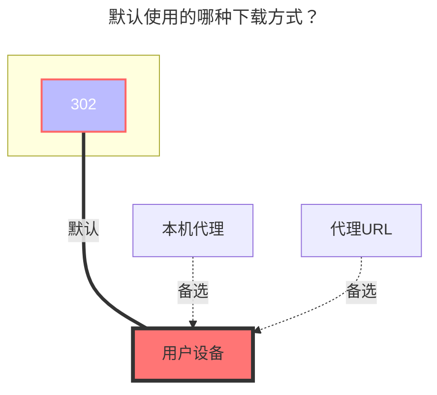

:::tip

阿里云盘 Open 基于官方授权 API 开发。

:::

:::danger 请仔细阅读注意事项

1. ==此工具获取的刷新令牌仅可以用于 **阿里云盘开放平台** 存储挂载方式==

2. OpenList 挂载时填写的 token 也应该是这个工具提供的，之前方式获取的不可以

3. 暂不适用于其他，同时也仅限用于 OpenList 使用

4. 同一 IP 在 =={{ minutes }}== 分钟内请求 =={{ max }}== 次，会出现 **Too Many Requests** :no_entry_sign:避免滥用，请勿滥用:no_entry_sign:

   - 查看文件看视频下载不算，上述的分钟和次数是动态的
   - 新增优化：**只会在请求发现令牌过期时去刷新令牌，更新 重启 编辑如果令牌仍然有效则不会去刷新。**

5. 在线播放视频提示：**`ExceedCapacityForbidden`** 错误，容量超限限制播放，需要扩容或者删除不必要的文件释放空间,[查看详情](#四、)

6. <i class="fa-solid fa-seal-exclamation fa-beat" style="color: #ff0000;"></i> **==请勿将阿里云盘进行公开分享，禁止帐号被多IP访问，若进行分享后帐号被冻结后果自负== <i class="fa-solid fa-seal-exclamation fa-beat" style="color: #ff0000;"></i> 添加存储后请及时设置元信息等措施防止被{其他人/爬虫}恶意[访问/分享]导致帐号被冻结，其他云盘也一样防止被冻结/封号**

7. 禁止使用阿里云盘搭建==包括但不限于== **`图床、软件床`** 和 **`视频外链到视频网站播放`** 等分发服务以及一些没有提到的不规范使用的方式，若违反被`冻结/封号`后果自负，并无法解除。

:::

## 1.必要条件

必须有 **阿里云盘** 的帐号
::: warning 注意事项
速度与稳定性与OpenList 的运行机器的性能/网络、阿里云盘服务器的负载有关
:::

## 2.准备接入

### 2.1.开放平台注册应用（可选，如果使用OpenList/公益服务器/自建服务器内置的密钥对，则不用创建）

::: tip
请根据阿里云盘开放平台的要求注册应用
:::
开放平台地址: [阿里云盘开放平台:https://www.alipan.com/developer/f](https://www.alipan.com/developer/f)

### 2.2.**获取令牌**

1. 访问[api.oplist.org](https://api.oplist.org) **⚠️如果使用公益服务器/自建服务器，请访问公益服务器/自建服务器的地址**
2. 在下拉框中选择 **阿里云盘 应用登录**

3. 如果你使用的是 `OpenList （或者公益服务器/自建服务器）`内置的密钥对（即：自身没有阿里云盘开放平台的应用信息），请按照`3.1`、`3.2`和`3.3`进行配置
   3.1. **勾选**`使用 OpenList 提供的参数`。
   3.2. `客户端ID（ClientID/AppID）`和`应用密钥 (AppKey/Secret)`均**留空**
   3.3. 点击`获取Token`按钮。

4. 如果你使用的是自己创建的 OAuth 客户端 ID 和密钥，请按照`4.1`、`4.2`和`4.3`进行配置
   4.1. **不要**勾选`使用 OpenList 提供的参数`。
   4.2. 在`客户端ID`中填写你的`AppId`，在`应用密钥`中填写你的`AppSecret`
   4.3. 点击`获取Token`按钮。

5. 在弹出的窗口中，扫码登录你的阿里云盘。
   
6. 授权成功后，页面会显示你的 `访问令牌（Access Token）` 和 `刷新令牌（Refresh Token）`，请复制并保存这两个令牌。
   
   

## 3.在 OpenList 中添加阿里云盘

### 3.1.开始添加

1. 打开 OpenList 的管理界面，点击左侧菜单中的`存储`。
2. 在存储列表页面，点击右上角的`添加存储`按钮
3. 选择驱动为`阿里云盘(Oauth2)`。
4. 输入挂载路径，如：`aliyun-drive`。
5. 在`根文件夹 ID`中填写上面获取的根文件夹 ID，如果使用根目录，请填写`root`。见[配置说明/根文件夹 ID](#_3-2-1-根文件夹-id)。
   
   
6. 在刷新令牌中填写上面获取的刷新令牌（如未获取，请参考[准备接入](#_2-准备接入)）。
7. 如果你使用的是 `OpenList （或者公益服务器/自建服务器）`提供的 OAuth 客户端 ID 和密钥，请按照`7.1`、`7.2`和`7.3`进行配置
   7.1. **勾选**`Use online api`。
   7.2. `客户端ID（ClientID/AppID）`和`应用密钥 (AppKey/Secret)`均**留空**。
   7.3. 在`Api url address`中填写 `https://api.oplist.org/alicloud/renewapi`，如果是`公益服务器/自建服务器`，请填写对应的服务器地址。
   
   
8. 如果你使用的是自己创建的 OAuth 客户端 ID 和密钥，请按照`8.1`、`8.2`和`8.3`进行配置
   8.1. **不要**勾选`Use online api`。
   8.2. 在`客户端ID（ClientID/AppID）`中填写你的`AppId`，在`应用密钥 (AppKey/Secret)`中填写你的`AppSecret`。见[配置说明/客户端 ID，密钥](#_3-2-2-客户端-id-密钥)。
   8.3. `Api url address`留空
   
   
9. 在`秒传`选项中，选择是否启用秒传功能（可选）。 见[配置说明/秒传](#_3-2-3-秒传)。
10. 在`移除方式`中，选择删除文件的方式（可选），默认是回收站。见[配置说明/移除方式](#_3-2-4-移除方式)。
11. 在`云盘类型`中，选择云盘类型（可选），默认是`默认`类型。见[配置说明/云盘类型](#_3-2-5-云盘类型)。
12. 在`Livp 下载格式`中，选择下载实况照片的格式（可选），默认是`Jpeg`。见[配置说明/Livp 下载格式](#_3-2-6-livp-下载格式)。
13. 在`内部上传`中，选择是否启用内部上传（可选），默认是关闭。见[配置说明/内部上传](#_3-2-7-内部上传)。
14. 点击`添加`按钮，完成阿里云盘的添加。

### 3.2.配置说明

#### 3.2.1.**根文件夹 ID**

默认为`root`，展示全部云盘内容，若只想展示某文件夹內内容，可以改为`file_id `

打开阿里云盘官网，点击进入要设置的文件夹时点击 URL 后面的字符串

如 https://www.alipan.com/drive/folder/5fe01e1830601baf774e4827a9fb8fb2b5bf7940

这个文件夹的 file_id 即为 `5fe01e1830601baf774e4827a9fb8fb2b5bf7940`

 

#### 3.2.2.**客户端 ID，密钥**

正常用户不需要填写为空即可，如果自己申请了官方授权也可以使用自己的进行填写，为空时默认使用 OpenList 提供的。

- 如果使用自己的开发者帐号，Oauth令牌链接也要修改，同时也要使用自己开发者帐号ID和密钥获取刷新令牌

 

#### 3.2.3.**秒传**

- **v.3.22.1** 版本 新增功能

就是秒传，需要在挂载时，需要启用`秒传`，要秒传的前提是阿里云盘已经有这个文件才可以进行秒传否则就是普通的上传

秒传计算的是文件`sha1`值(应该没错)不需要你计算,你只需要上传即可上传好了会自动帮你计算然后上传完成

- 使用的是阿里云盘官方API提供的接口，查看 :point_right: [**秒传逻辑**](https://www.yuque.com/aliyundrive/zpfszx/ezlzok#y7lyH)

---

- **v.3.27.0** 版本 增强秒传：可以直接通过复制方式来和`115网盘`进行相互秒传文件
  - 前提是要从阿里云盘秒传到115的文件，115已经存在，否则就是正常复制任务。
  - 如果将115的文件秒传到阿里云盘，需要将阿里云盘的秒传选项打开否则为正常模式上传

如果要使用秒传来上传文件建议在自己家用电脑本地搭建一个OpenList添加一个`本地存储`和`阿里云盘`进行复制秒传这样节省资源。

 

#### 3.2.4.**移除方式**

不进行设置默认是删除到回收站內了，如果空间不够需要自己手动清理回收站/若删错文件请前往阿里云盘官网客户端进行找回恢复

- **回收站**：在OpenList删除后进入网盘回收站，会占用云盘空间，但是后期如果误删可以找回。
- **删除**：直接删除不会停留在回收站，不会占用云盘空间，但是后期如果误删不能找回。
  - 注：请勿泄露自己阿里云盘Open获取的Token， 若不小心泄露请立刻：
  - **打开-阿里云盘-app-我的-右上角设置齿轮-隐私设置-授权管理-点击-openlist-进行查看和解除授权**
  - 再重新扫码授权换新的刷新令牌，同时解除授权后之前获取的都会失效，以保护您账号的安全==

 

#### 3.2.5.**云盘类型**

云盘类型可以选择，可以自己的需求选择不同类型，使用 v3.25.1及以上版本的OpenList添加驱动时进行设置，默认选择的是`默认`类型

- **默认**：有达人等级用户默认展示的是`非备份文件`内容，没有达人等级用户默认展示的是`备份文件`内容

- **资源库**：对应云盘的`非备份文件内容`
- **备份盘**：对应云盘的`备份文件`

202407 --> 阿里云盘更新 `6.0` 版本后，备份盘变更为备份文件和全部文件合并在一起了，但是在OpenAPI方面还是区分 `资源库` 和 `备份盘` 类型

 

#### 3.2.6.**Livp 下载格式**

即 IOS`实况`照片因为非IOS系统无法解析，然后就无法下载，现根据自己的需求是需要`Jpeg`还是`Mov`

- Jpeg：就是`实况`照片所展示的封面
- Mov：长按`实况`照片的视频画面

 

#### 3.2.7.**内部上传**

如果你部署 OpenList 的服务器是阿里云北京地区ECS，打开此开关可以提升文件上传速度。不符合要求的服务器请不要打开此开关，否则会出现无法上传的问题。

- **内部上传**非北京地区的阿里云ECS可以使用吗？不能，因为阿里云盘在使用北京地区的对象存储

 

## 4.**其他说明**

### 4.1.权限范围

> OpenList 仅获取了 云盘用户 (**名称 头像 ¹**)，(**访问文件权限 ²**)和(**写入文件权限 ³**)，未获取手机号权限
>
> 详情可以通过以下两种方式查看
>
> 1. 扫码获取刷新令牌时的**提示**
> 2. #### 打开 **阿里云盘 APP --> 我的 -->右上角设置齿轮 --> 隐私设置 --> 授权管理 --> 点击 OpenList** 进行查看
>
>    - 若不使用了可以随时手动解除权限

### 4.2.关于视频播放

> 默认使用的是阿里云盘自带播放器 - **Aliyun Video Previewer**
>
> 上传到云盘的视频，会经过转码服务转成 H.264 编码的视频流。（好处是 IOS 可以播放了...嗯 应该是这样）
>
> - 新上传到云盘的视频，默认只预转码视频的前 30s。第一次播放时会触发完整的视频转码。转码后的视频会缓存，之后再次触发播放不需要重新转码。
> - 不足 30s 的视频不会触发预转码，只会在第一次播放时开始转码。
> - 实时转码需要一定时间。
> - 画质分别为：LD|SD|HD|FHD|QHD

### 4.3.Office 全家桶文件无法查看

> Q：阿里云盘Open怎么看不了 Office 全家桶类型的文件
>
> A：~~因为阿里云盘未开放相关API故暂时无法查看~~（敬请期待）

### 4.4.字幕加载

> Q：如何加载字幕？
>
> A：阿里云盘open 需要使用 **Aliyun Video Previewer**播放器，然后暂时"**只支持转码 mkv 封装的 srt、vtt 文本格式字幕**"
>
> - 目前只支持转码 eng、jpn、chi 三种语言，其他语言会丢失

### 4.5.常见问题

1. ExceedCapacityForbidden

> Q：在线播放阿里云盘视频无法播放，提示：**`ExceedCapacityForbidden`** 错误
> A：**用户容量超限**，限制播放，需要扩容或者删除不必要的文件释放空间
>
> - 在openlist中提示：`ExceedCapacity Forbidden: Execeed Capactity Forbidden`
> - 在阿里云盘查看视频提示：`云盘可用空间不足`

2. 转码中，请稍后重试

> Q：在阿里云盘查看视频提示 `转码中，请稍后重试` 和 在OpenList挂载提示：`failed link: failed get link: UserNotAllowedAccessResource:user not allowed access resource for violation`
>
> A：代表帐号已经被冻结（以前都是直接无法登录），具体情况请查看顶部的红色内容注意事项

## 5.**默认使用的下载方式**

