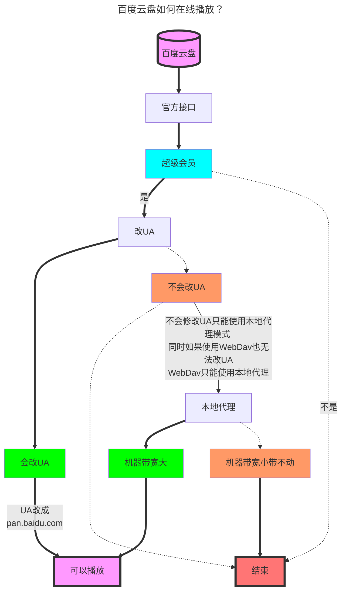
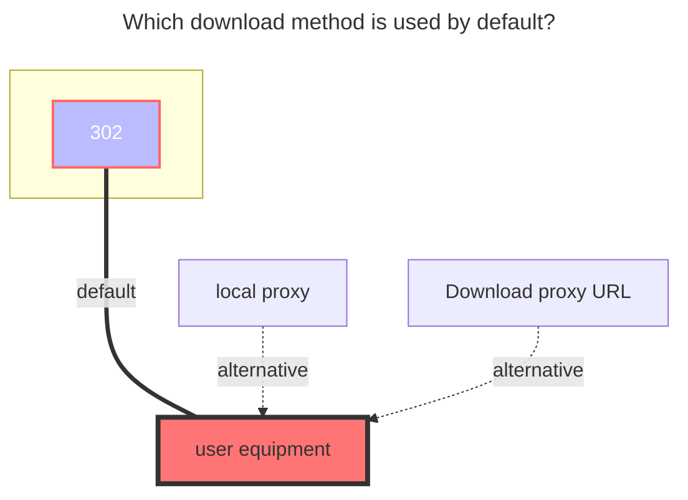
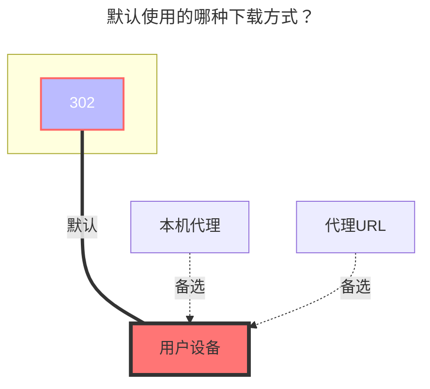

---
title:
  en: Baidu Netdisk
  zh-CN: 百度网盘
icon: iconfont icon-state
# This control sidebar order
top: 410
# A page can have multiple categories
categories:
  - guide
  - drivers
# A page can have multiple tags
tag:
  - Storage
  - Guide
  - '302'
  - '官方'
# this page is sticky in article list
sticky: true
# this page will appear in starred articles
star: true
---

::: en
::: tip
Due to the limitation of Baidu Disk API, downloading files larger than about 20M needs to carry the header: "User-Agent": "pan.baidu.com", so when downloading files larger than 20M, you need to set the request header yourself, such as using curl:

```bash
curl -L -X GET 'YOUR_LINK' -H 'User-Agent: pan.baidu.com'
```

Or use the proxy function in this program to transfer.
:::

::: zh-CN
::: tip
由于百度网盘 API 的限制，下载大于 20M 左右的文件需要携带 header："User-Agent":"pan.baidu.com"，所以下载大于 20M 的文件时，需要设置请求头，例如使用 curl：

```bash
curl -L -X GET 'YOUR_LINK' -H 'User-Agent:pan.baidu.com'
```

或者使用本程序中的代理功能进行传输。



:::

## **Refresh token** { lang="en" }

## **刷新令牌** { lang="zh-CN" }

::: en
**Currently, there are three methods to obtain a Baidu Netdisk refresh token:**

- All methods require you to [click here](https://api.oplist.org/) to obtain the refresh token. The **first method** requires developer permissions, while the **latter two** do not.
  - **1.** If you have Baidu Netdisk developer permissions, please select **"Baidu Netdisk Auth Login"**, and in the Baidu Netdisk developer app backend, set the callback URL to the one provided on the webpage. After clicking "Get Token," you will automatically receive a refresh token. You can then configure your own `client_id` and `client_secret` in OpenList.  
    
  - **2.** This method uses a built-in API call via our intermediary server to refresh the access token. It is already available online. Simply check the option to use the parameters provided by OpenList, click "Get Token," and you will receive a refresh token. In the storage configuration page of OpenList, enable the "Use Online API" option, and enter the refresh token to start using it.  
      
    The basic principle of the online API is illustrated in the diagram below:  
    
  - **3.** If you do not have Baidu Netdisk developer permissions but somehow have access to an app’s `client_id` and `client_secret`, please select **"Baidu Netdisk OOB Authentication"**. By default, this method uses the client parameters from the "ES File Explorer" app, but you can also input your own `client_id` and `client_secret`. After clicking "Get Token," wait patiently as you are redirected to the Baidu authorization page. Log in and authorize the app, then copy the authorization code and return to the original webpage to input the code as instructed to obtain the refresh token. In the storage configuration page of OpenList, fill in the `client_id` and `client_secret` to start using the service.  
     

:::

::: zh-CN

- **目前你有三种方法获取百度网盘的刷新令牌**
- 全部都要[点击这里](https://api.oplist.org/) 来获取刷新令牌。第一种需要开发者权限，后**两种**不需要。
  - **1**、如果你有百度网盘开发者权限，请选择“百度网盘 验证登录”，并在百度网盘开发者应用后台里填入配置回调地址为该网页提供的回调地址。点击获取token后即可自动获取刷新令牌，并在openlist中配置您自己的cilent_id和cilent_secret。
    
  - **2**、内置API调用的实现方式，利用我们建立的服务器中转刷新access_token，目前已经上线，勾选使用OpenList提供的参数，点击获取token即可获得刷新令牌。在OpenList的存储配置界面，打开使用online api选项，经刷新令牌填入即可使用。
    
    对于online api的原理，大体可以由下图说明：
    
  - **3**、如果你没有百度网盘开发权限，但是你又莫名其妙的掌握有某个APP的id和secret，请选择“百度网盘 OOB验证”，目前默认使用es文件浏览器的客户端参数进行配置，您也可以选择使用自己的获取到的cilent_id和cilent_secret参数，点击获取token后耐心等待跳转百度页面，登录授权后复制授权码，回到原网页按照提示即可获取刷新令牌。在OpenList的存储配置界面将cilent_id和cilent_secret填入即可使用。
    

:::

## **Root folder path** { lang="en" }

## **根文件夹ID** { lang="zh-CN" }

::: en
The root foler to mount, defaults to `/`

- Mount a folder separately, according to the following format, `/` is the root directory, just extend to that directory if you want to mount that directory
  - /folder_A/....../folder_x
    <br/>

:::

::: zh-CN
要挂载的根文件夹，默认为`/`

- 单独挂载某文件夹，按照下面格式，`/`是根目录，想挂载那个目录就延伸到那个目录就可以
  - /文件夹-A/……/文件夹-x
    <br/>

:::

## ~~**Custom crack ua**~~ { lang="en" }

## ~~**自定义破解ua**~~ { lang="zh-CN" }

::: en
~~[**UA used when using 【Native Proxy & Crack API】**](https://github.com/alist-org/alist/issues/5602#issuecomment-1831188682)~~ The unofficial interface is no longer available
<br/>
:::
::: zh-CN
~~[**使用【本地代理 & Crack API】时候使用的UA**](https://github.com/alist-org/alist/issues/5602#issuecomment-1831188682)~~ 非官方接口已无法使用
<br/>
:::

## **Download api** { lang="en" }

## **下载接口** { lang="zh-CN" }

::: en

- Official: The official interface, very stable, but for larger files, UA needs to be modified and the speed is slow (SVIP speed fast)
- Crack: unofficial interface，**Seems to be no longer available** ~~You must modify the UA and some files may not have a speed limit, but it will be unstable (not guaranteed 100%availability) Need to use a version greater than `3.19.0`~~
  - ~~==Need to change the UA to`netdisk`==，Modification method refer to [add-user-agent-user-example](#add-user-agent-usage-example)~~
  - ~~Or turn on the Web proxy, you do not need to modify the UA (you need a large broadband to use it stably)~~
  - ~~It is limited to play/download **`video (only tested in the mp4 format other formats are not tested)`**,If it is other format files, such a prompt will appear~~
  - ~~This is not a mistake, this is a limit, please do not panic.~~
- Crack video: unofficial video interface, dedicated to playing videos, the following errors will occur in non-video formats, which is normal
  - The browser also needs to modify the UA: `pan.baidu.com` or `netdisk` In short, if it is not the browser User-Agent, the video can be played.
  - The specific situation is the same as the previous unofficial interface usage
  - ==The continuous use time is unknown, and 100% availability is not guaranteed==

```json{2-4,7-9}
{
	error_code: 31119,
	error_msg: "hit black userlist , hit illeage dlna",
	request_id: 541111111111111140
},
{
	error_code: 31329,
	error_msg: "hit black userlist , hit illeage dlna",
	request_id: 921111381111111100
}
```

<br/>
:::
::: zh-CN
- Official: 官方接口，很稳定，但是文件比较大，需要修改UA，速度慢 (SVIP速度快)
- Crack: 非官方接口，**似乎已经无法使用了**~~现在也需要修改UA且部分文件可能不限速，但是会不稳定（不保证100%可用性）需要使用大于`3.19.0`的版本~~
  - ~~==需要将UA改成`netdisk`==，修改方法参考下方[添加-user-agent-使用示例](#添加-user-agent-使用示例)~~
  - ~~或者开启Web代理（需要大宽带才能带的动）~~
  - ~~WebDav播放不需要修改UA，可以直接302播放~~
  - ~~仅限于播放/下载 **`视频(只测试了mp4格式其他格式未测试)`**，其他类型文件的会出现下方提示~~
  - ~~如果出现下面的提示请勿担心，这不是错误不是Bug，这只是限制，请勿填写`issue`上报.~~
- Crack video：非官方视频接口，播放视频专用，非视频格式会出现以下错误 是正常情况
  - 浏览器查看也需要修改UA：`pan.baidu.com` 或者 `netdisk` 总之不是浏览器 User-Agent 都能播放视频
  - 具体情况和之前的非官方接口用法一样
  - ==可以持续使用时间未知，不保证100%可用性==
```json{2-4,7-9}
{
	error_code: 31119,
	error_msg: "hit black userlist , hit illeage dlna",
	request_id: 541111111111111140
}
{
	error_code: 31329,
	error_msg: "hit black userlist , hit illeage dlna",
	request_id: 921111381111111100
}
```
<br/>
:::

## **Add "User-Agent" usage example** { lang="en" }

### **添加 "User-Agent" 使用示例** { lang="zh-CN" }

::: en
::: danger If you don't know how to set "User-Agent" see here
==The following methods are limited to Baidu super member users==
==Prompt again The following methods are limited to Baidu super member users==
It will only be useful if a member finishes modifying **`"User-Agent"`** (choose official and 302)
If you don’t change **`"User-Agent"`**, you can enable ==Web Agent==, the disadvantage is that you need to build an Alist machine for transfer, that is to say, you need a large broadband to help you transfer

<div>
    <p style="text-align: center;"><span>Tutorial on how to modify UA in web page 302 mode: <br/></span>On the left is<span style="color:red;font-weight: bold;font-size: xx-large;">『Official』</span>API，On the right is the<span style="color:blue;font-weight: bold;font-size: xx-large;">『Crack video』</span>API</p>
    <div class="image-preview">
        <video width="360" height="240" controls>
            <source src="https://r2.izyt.cc/alist/baidu/%E7%99%BE%E5%BA%A6%E5%AE%98%E6%96%B9%E6%8E%A5%E5%8F%A3.mp4" type="video/mp4">
        </video>
        <video width="360" height="240" controls>
            <source src="https://r2.izyt.cc/alist/baidu/%E7%99%BE%E5%BA%A6%E9%9D%9E%E5%AE%98%E6%96%B9%E6%8E%A5%E5%8F%A3.mp4" type="video/mp4">
        </video>
    </div>
</div>
:::
::: zh-CN
::: danger 如果你不会设置 "User-Agent" 请看这里
==以下方法仅限于有百度超级会员用户使用==
==再次提示 以下方法仅限于有百度超级会员用户使用==
有会员改完 **`"User-Agent"`** 才会有用（选择官方和302）
如果不改 **`"User-Agent"`**，可以开启 ==Web代理==，缺点是需要你搭建OpenList的机器中转，也就是说你需要大宽带帮你中转
<div>
    <p style="text-align: center;"><span>网页302模式修改UA教程 : <br/></span>左侧为<span style="color:red;font-weight: bold;font-size: xx-large;">『官方』</span>接口，右侧为<span style="color:blue;font-weight: bold;font-size: xx-large;">『非官方-已无法使用』</span>接口</p>
    <div class="image-preview">
        <video width="360" height="240" controls>
            <source src="https://r2.izyt.cc/alist/baidu/%E7%99%BE%E5%BA%A6%E5%AE%98%E6%96%B9%E6%8E%A5%E5%8F%A3.mp4" type="video/mp4">
        </video>
        <video width="360" height="240" controls>
            <source src="https://r2.izyt.cc/alist/baidu/%E7%99%BE%E5%BA%A6%E9%9D%9E%E5%AE%98%E6%96%B9%E6%8E%A5%E5%8F%A3.mp4" type="video/mp4">
        </video>
    </div>
</div>
:::

### Web plugin { lang="en" }

### 网页插件 { lang="zh-CN" }

::: zh-CN

- 使用浏览器插件修改的好处是 可以直接在线播放，当然了下载也是可以的。
  例<Badge text="1" type="info" vertical="middle" />：实在不会的可以看看一个Web网页端的例子： **https://www.bilibili.com/video/BV1UA4y1X7J8**
  例<Badge text="2" type="info" vertical="middle" />：另一款插件方法涵盖360，Chrome，Edge： **https://youtu.be/PP6b0WSzYMc**
  
  :::
  ::: en
- The advantage of using a browser plug-in to modify is that it can be played directly online, of course, downloading is also possible.
  Example <Badge text="1" type="info" vertical="middle" />: If you really don’t know it, you can take a look at an example on the web page: **https://www.bilibili.com/video/BV1UA4y1X7J8**
  Example <Badge text="2" type="info" vertical="middle" />: Another plugin method covering 360, Chrome, Edge: **https://youtu.be/PP6b0WSzYMc**
  
  :::

### Aria2 { lang="en" }

### Aria2 { lang="zh-CN" }

::: zh-CN

1. 先照着下图设置好 **`"User-Agent"`**，然后在**右下角**的按钮选项，点击**齿轮**(本地设置)，配置好参数
2. 然后在右下角打开第三个按钮选项（**打开复选框**），打开后去列表选择我们要下载的文件，
3. 把我们需要下载的文件**进行勾选**，勾选好后下方会出现**一排按钮**，选择右侧第二个选项下载里面有一个**发送到Aria2**
   如果你使用了网页修改 **`"User-Agent"`**，可以不配置 ==**Aria2**== 的`UA`，直接推送到Aria2也能下载
   
   :::
   ::: en
4. First follow the figure below to set the **`user-agent" `**, and then click the button option in the lower right corner, click ** gear ** (local settings) to configure the parameters well
5. Then open the third button option in the lower right corner (**Open the check box**), and then go to the list to select the file we want to download
6. Select the files we need to download. After selecting, there will be a row of buttons. Select the second option on the right. One is sent to Aria2.
   If you use the webpage to modify the **`user-agent`**, you do not need to configure the `UA` of ==**Aria2**==, and you can download it directly to Aria2
   
   :::

### Motrix { lang="en" }

### Motrix { lang="zh-CN" }

::: en

1. First follow the figure below to set the **`user-agent" `**, and then click the button option in the lower right corner, click ** gear ** (local settings) to configure the parameters well
2. Then open the third button option in the lower right corner (**Open the check box**), and then go to the list to select the file we want to download
3. Select the files we need to download. After selecting, there will be a row of buttons. Select the second option on the right. One is sent to Aria2.
   If you use the webpage to modify the **`user-agent`**, you do not need to configure the `UA` of ==**Motrix**==, and you can download it directly to Aria2

- Motrix Download link：[Motrix Official website](https://motrix.app/)，[Motrix-GitHub](https://github.com/agalwood/Motrix)
  
  <br/>
  :::

::: zh-CN

1. 先照着下图设置好 **`"User-Agent"`**，然后在**右下角**的按钮选项，点击**齿轮**(本地设置)，配置好参数
2. 然后在右下角打开第三个按钮选项（**打开复选框**），打开后去列表选择我们要下载的文件，
3. 把我们需要下载的文件**进行勾选**，勾选好后下方会出现**一排按钮**，选择右侧第二个选项下载里面有一个**发送到Aria2**
   如果你使用了网页修改 **`"User-Agent"`**，可以不配置 ==**Motrix**== 的`UA`，直接推送到Aria2也能下载

- Motrix下载链接：[Motrix官网](https://motrix.app/)，[Motrix-GitHub](https://github.com/agalwood/Motrix)
  
  :::

## **Upload Config** { lang="en" }

## **上传配置** { lang="zh-CN" }

::: en
Official Documentation: [百度网盘开放平台 - 上传 - 能力说明](https://pan.baidu.com/union/doc/3ksg0s9ye)

> Baidu Netdisk requires that each slice be uploaded within 30 seconds, so excessively high concurrency during file uploads may result in a significant number of failures.

- Upload Threads: The number of slices to upload concurrently.
- Upload API: The domain endpoint used for uploading.
- Custom Upload Slice Size: Allows you to specify the size of each slice. Note that there are limitations, and this feature is available to VIPs only.
- Low Bandwidth Upload Mode: Attempts to address the frequent `Client.Timeout exceeded while awaiting headers` errors encountered in low upload bandwidth scenarios (e.g., residential broadband). When enabled, it uses the smallest possible slice size.
  <br/>

:::

::: zh-CN
官方文档：[百度网盘开放平台 - 上传 - 能力说明](https://pan.baidu.com/union/doc/3ksg0s9ye)

> 百度网盘要求在 30s 内完成单个分片的上传，所以上传文件时并发过高可能会导致大量失败。

- 上传线程：同时上传几个分片
- 上传 API：上传的域名端点
- 自定义上传分片大小：用于指定分片大小，有限制，仅会员可用
- 低上传带宽模式：尝试解决低上传带宽场景（如家宽）下，频繁出现 `Client.Timeout exceeded while awaiting headers` 的问题。开启后会使用尽可能小的分片大小。
  <br/>

:::

## **The default download method used** { lang="en" }

## **默认使用的下载方式** { lang="zh-CN" }

::: en



:::
::: zh-CN



:::
