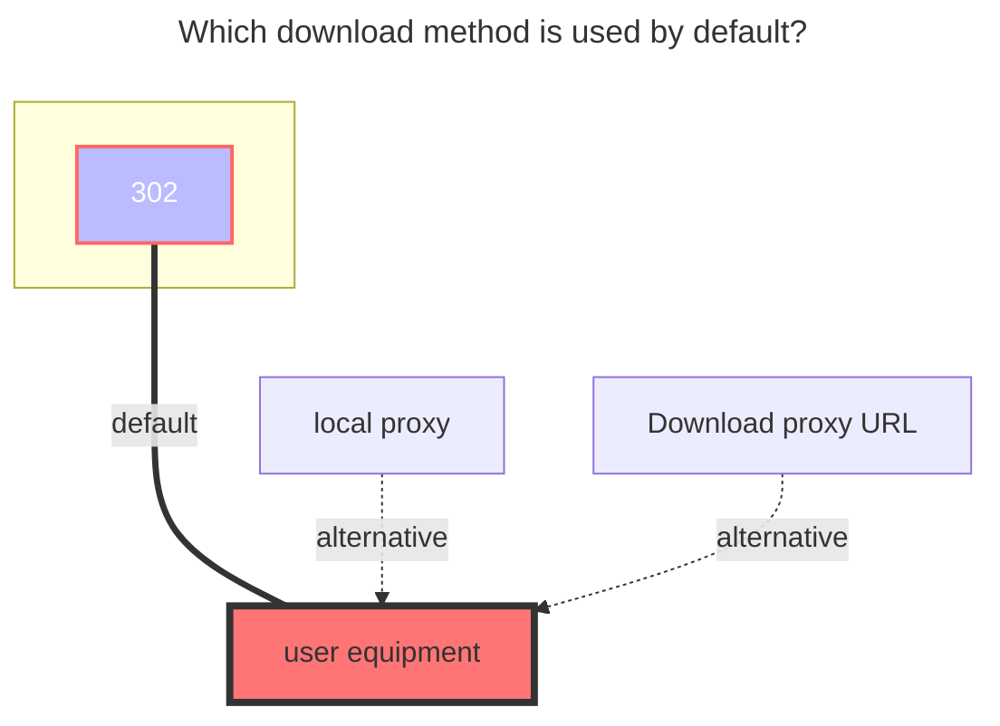
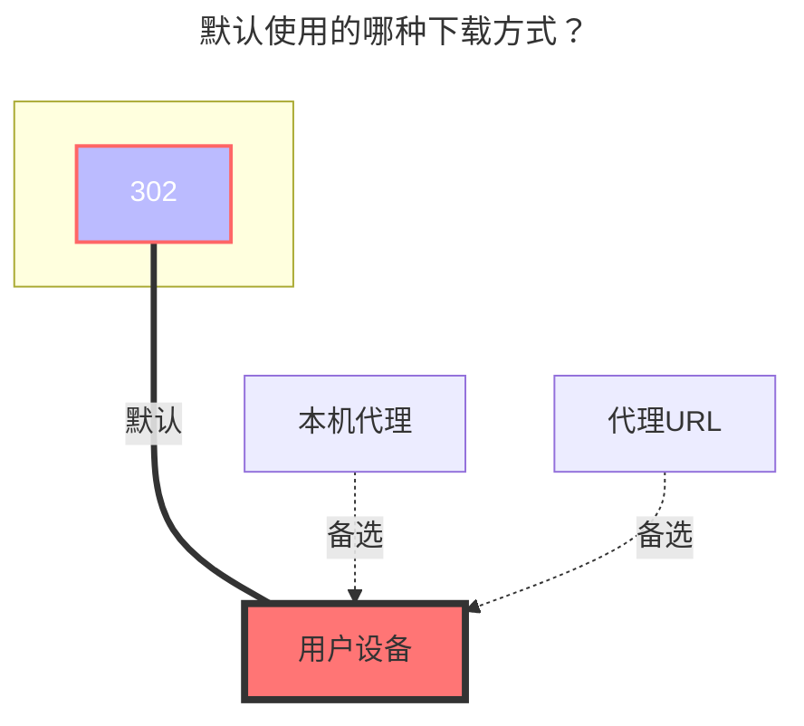

---
title:
  en: Baidu Photo
  zh-CN: 一刻相册
icon: iconfont icon-state
# This control sidebar order
top: 400
# A page can have multiple categories
categories:
  - guide
  - drivers
# A page can have multiple tags
tag:
  - Storage
  - Guide
  - '302'
# this page is sticky in article list
sticky: true
# this page will appear in starred articles
star: true
---

## Cookie

::: en
Log in to [Baidu Photo](https://photo.baidu.com), open F12, and find any request containing the `Cookie` value. Copy it.
:::

::: zh-CN
登录 [一刻相册](https://photo.baidu.com) 打开F12随意找到一个携带 `Cookie` 值的请求进行复制就可以
:::

## Album ID { lang="en" }

## 相薄ID { lang="zh-CN" }

::: en

**When left blank, all albums in the root directory are displayed by default.**

If you want to mount a single album, fill in the following:

- The **Album ID** should be: {album_id}|{tid}
  Example: `4021858707431029901|316519298447849660`
  - **{album_id}**: After entering the album you want to mount, check the top URL for the ID after `/album`. This is the **{album_id}**.
    - Example: [https://photo.baidu.com/photo/web/album/4021858707431029901](https://photo.baidu.com/photo/web/album/4021858707431029901)
    - **4021858707431029901** is the **{album_id}**

  - **{tid}**: Access [this link](https://photo.baidu.com/youai/album/v1/list?limit=1000) to obtain the **{tid}**
    - Once on the page, press `Ctrl+F` and search for the ID above. A few lines below you’ll find the corresponding **{tid}**.

:::

::: zh-CN
**默认为空时,直接显示根目录全部相册.**

如果挂载单个相册时需填写如下内容

- 相薄ID 应填：`{album_id}|{tid}` 示例：`4021858707431029901|316519298447849660`
  - `{album_id}` ：进入你需要挂载的相册后,查看顶部链接/album 后的ID就是 `{album_id}`
    - https://photo.baidu.com/photo/web/album/4021858707431029901
    - **4021858707431029901**就是 `{album_id}`

  - `{tid}`：访问 **https://photo.baidu.com/youai/album/v1/list?limit=1000** 获取
    - 进入界面后`Ctrl+F`搜索上面的ID,在下面数几行就可以看到对应的 `{tid}`

:::

## Display Type { lang="en" }

## 展示类型 { lang="zh-CN" }

::: en
Choose according to your needs.
:::

::: zh-CN
根据自己的需求选择
:::

## Delete Source Files { lang="en" }

## 删除源文件 { lang="zh-CN" }

::: en
By default, it only removes the album, not permanently deletes the files. If you enable this option, the files will be permanently deleted after removal. Be cautious when enabling this.
:::

::: zh-CN
默认只是移除相册，并非真正删除，如果开启此选项删除文件后将会彻底删除，谨慎开启
:::

## The default download method used { lang="en" }

## 默认使用的下载方式 { lang="zh-CN" }

::: en

:::
::: zh-CN

:::
