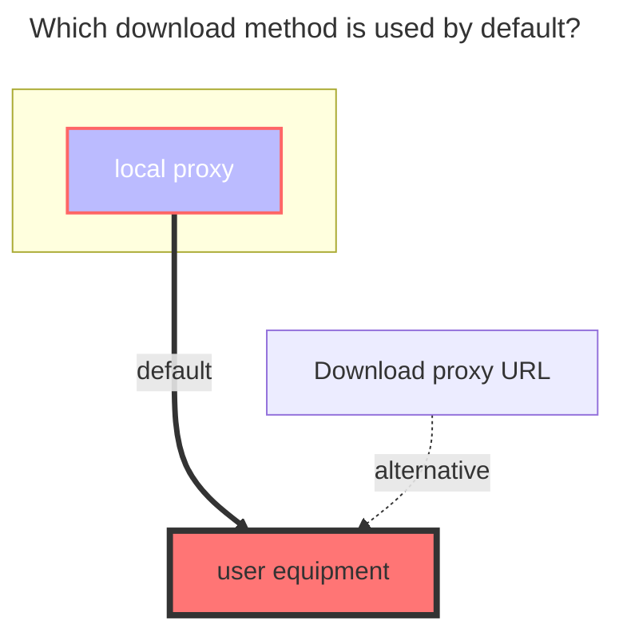
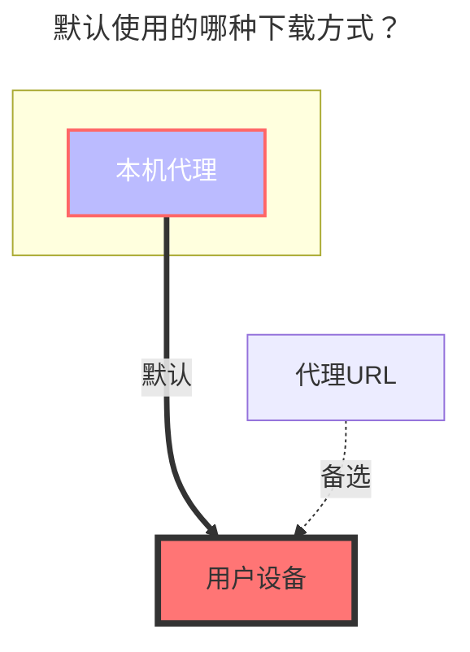

---
title:
  en: ChaoxingxingGroupCloud
  zh-CN: 超星星小组盘
icon: iconfont icon-state
# This control sidebar order
top: 280
# A page can have multiple categories
categories:
  - guide
  - drivers
# A page can have multiple tags
tag:
  - Storage
  - Guide
  - '本地代理'
# this page is sticky in article list
sticky: true
# this page will appear in starred articles
star: true
---

::: en
chaoxingxing group cloud is also affiliated with chaoxingxing. After logging in to chaoxingxing, you can see a group under the left sidebar.

Official website link：**https://i.chaoxing.com**
:::
::: zh-CN
超星星小组盘也是隶属于超星星，登录超星星后在左侧侧边栏下方能看到一个小组。

官网链接：**https://i.chaoxing.com**
:::

### Username Password { lang="en" }

### 用户名 密码 { lang="zh-CN" }

::: en
chaoxingxing account and password
:::
::: zh-CN
超星星的帐号密码
:::

### Bbsid { lang="en" }

### Bbsid { lang="zh-CN" }

::: en
Follow the example process below to obtain

:::
::: zh-CN
按照下面示例流程获取

:::

### Root Folder ID { lang="en" }

### 根文件夹ID { lang="zh-CN" }

::: en
The default is `-1`. For other subfolder ID acquisition methods, see the example below.

- Search the keyword `getResourceList` in the request. For convenience, we can directly search `list` and see it. Then we enter the folder we need to mount. After entering the folder, we can find the `folder id by looking at the request.`

  

:::
::: zh-CN
默认为`-1`，其它子文件夹ID获取方式看下图示例

- 在请求中搜索关键词`getResourceList`，为了方便我们可以直接搜索 `list`也可以看到，然后我们进入我们需要挂载的文件夹，进文件夹后再去看请求就可以找到`子文件夹ID`

  

:::

### The default download method used { lang="en" }

### 默认使用的下载方式 { lang="zh-CN" }

::: en

:::
::: zh-CN

:::
