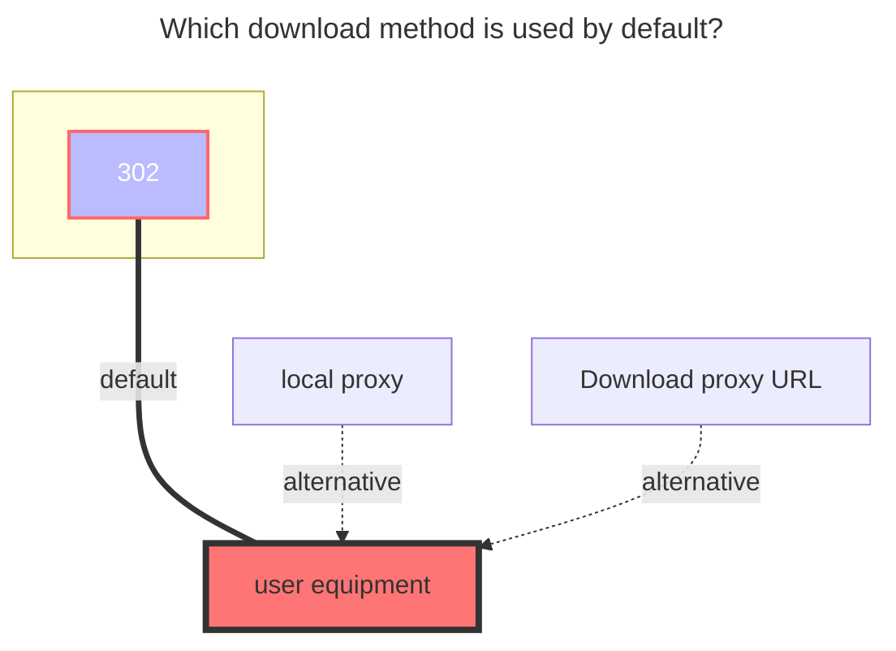
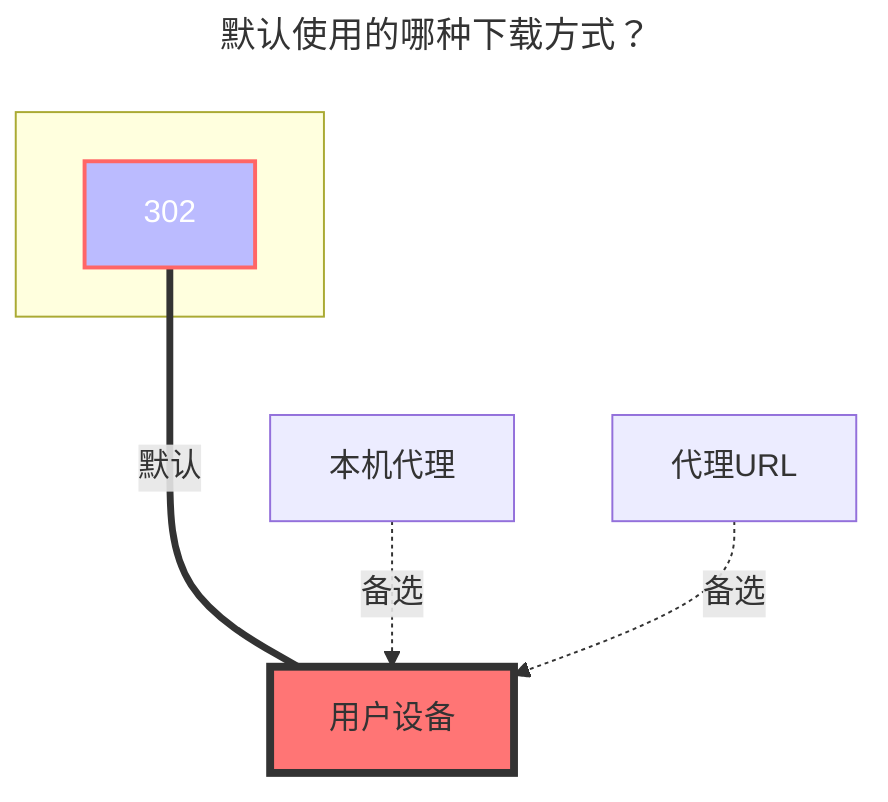

---
title:
  en: Cloudreve V3
  zh-CN: Cloudreve V3
icon: iconfont icon-state
# This control sidebar order
top: 70
# A page can have multiple categories
categories:
  - guide
  - drivers
# A page can have multiple tags
tag:
  - Storage
  - Guide
  - '本地代理'
  - '302'
# this page is sticky in article list
sticky: true
# this page will appear in starred articles
star: true
---

## Parameters { lang="en" }

## 参数说明 { lang="zh-CN" }

### Address { lang="en" }

### 地址 { lang="zh-CN" }

::: en
The address of the Cloudreve V3 server, such as: `https://www.example.com`. It is better to remove the slash `/` after it.
:::
::: zh-CN
Cloudreve V3 服务器的地址，如：`https://www.example.com`，最好删掉后面的斜线`/`。
:::

### Authentication { lang="en" }

### 鉴权 { lang="zh-CN" }

::: en
Cloudreve V3 supports authentication using Cookie. The mounting authentication methods are divided into:

1. `Username` + `Password`: Automatically uses the login interface to obtain Cookie, there might be issues with CAPTCHA.
2. `Cookie` Only: Can be temporarily used but will expire and cannot be renewed. Parameters can be found from browser requests or Local Storage.
3. [Reference](../drivers/common.html#Reference): Fill in `ref:/{mount path}` in `Remark`: Reference authentication, tokens, etc., from "Mounted Storage".

::: tip Steps to get cookie:
Only the string following cloudreve-session= is required.
:::

::: zh-CN
Cloudreve V3 使用 Cookie 进行鉴权，这意味着挂载鉴权方式分为：

1. `用户名`+`密码`：会自动使用登录接口获取 Cookie，存在验证码问题
2. 仅 `Cookie`：参数可从浏览器请求或者本地 Cookie 中找到，有效期未知
3. [引用](../drivers/common.html#引用)：`备注`填写 `ref:/{挂载路径}`，从 `已挂载的存储` 中引用认证、令牌等

::: tip Cookie 获取方法：
仅需要 `cloudreve-session=` 后面一串即可。
:::

### Root Folder Path { lang="en" }

### 根文件夹路径 { lang="zh-CN" }

::: en
Default is `/`, which can be obtained from the `?path=` in the web link. The obtained parameters may need to be [URL decoded](https://www.google.com/search?q=URL+decode).
:::
::: zh-CN
默认为：`/`，可从网页链接的 `?path=` 中获取。获取到的参数可能需要 [URL 解码](https://www.bing.com/search?q=URL+%E8%A7%A3%E7%A0%81)。
:::

### Enable Folder Size { lang="en" }

### 启用缩略图和文件夹大小 { lang="zh-CN" }

::: en
Enable Cloudreve V3 server to calculate the size of each folder and generate thumbnails for each file. Enabling this feature may cause server errors or slow performance, and it is `disabled` by default.
:::
::: zh-CN
让 Cloudreve V3 服务端统计每个文件夹的大小并为每个文件生成略缩图，启用可能会造成服务端报错、运行缓慢，默认禁用。
:::

### Custom UA { lang="en" }

### 自定义 UA { lang="zh-CN" }

::: en
Used to customize the `User-Agent` header information used in requests. Leaving it blank will use OpenList default settings.
:::
::: zh-CN
用于自定义请求使用的 `User-Agent` 头部信息。留空为 OpenList 默认。
:::

## Upload { lang="en" }

## 上传 { lang="zh-CN" }

::: en
The supported storage policies for uploading are as follows:

- Local storage
- Slave storage
- OneDrive
- S3

Upload storage policies can be set within Cloudreve V4 web interface by entering the corresponding folder (requires the server to be Cloudreve Pro).
:::

::: zh-CN
支持上传到的存储策略如下：

- 本机存储
- 从机存储
- OneDrive
- S3

上传的存储策略请在 Cloudreve V3 网页端进入相应文件夹中进行设置（需要服务端为 Cloudreve Pro）。
:::

## The default download method used { lang="en" }

## 默认使用的下载方式 { lang="zh-CN" }

::: en

:::
::: zh-CN

:::
