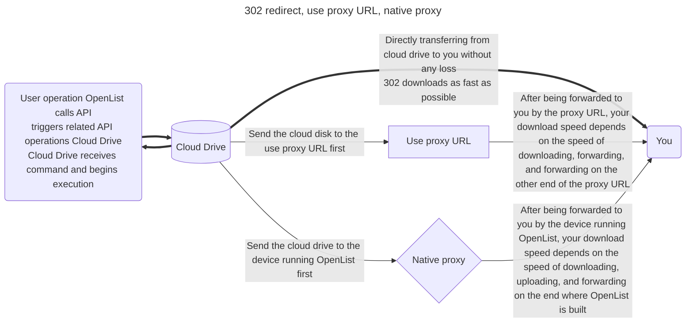
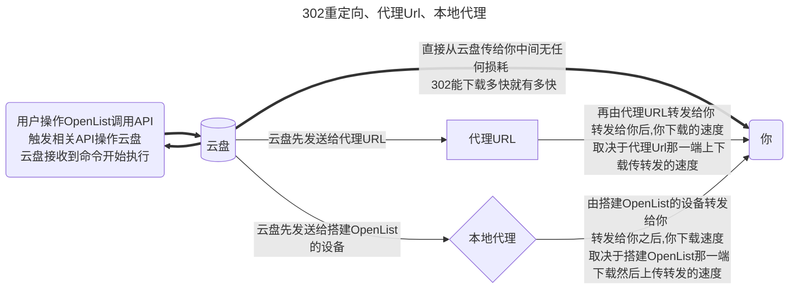

---
title:
  en: Common
  zh-CN: 通用项
icon: iconfont icon-state
# This control sidebar order
top: 530
# A page can have multiple categories
categories:
  - guide
  - drivers
# A page can have multiple tags
tag:
  - Storage
  - Guide
# this page is sticky in article list
sticky: true
# this page will appear in starred articles
star: true
---

## Mount Path { lang="en" }

## 挂载路径 { lang="zh-CN" }

::: en
The unique identifier for the mount point, the name displayed externally, and the location where it should be mounted. If you want to mount it to the root directory, please enter `/`.
:::

::: zh-CN
挂载项的唯一标识，对外展示的名称，要挂载到的位置。如果要挂载到根目录，请填写 `/`。
:::


::: en
::: danger
You cannot use duplicate mount path names, otherwise, the following error will occur:

```json
Failed to create storage in database: UNIQUE constraint failed: x_storages.mount_path
```

Solution: Use [aliases](./alias.md) to aggregate multiple mount points.
:::

::: zh-CN
::: danger
不能使用重复的挂载路径名称，否则会报错：

```json
Failed create storage in database: UNIQUE constraint failed: x_storages.mount_path
```

解决方法：使用 [别名](./alias.md) 对多个挂载项目进行聚合。
:::

::: en
::: danger
The mount path name is a required field and cannot be left empty, or the following error will occur:

```json
Key: 'Storage.MountPath' Error: Field validation for 'MountPath' failed on the 'required' tag
```

Solution: If you want to mount to the root directory, please enter `/`.
:::

::: zh-CN
::: danger
挂载路径名称是必填项，不能为空，否则会报错：

```json
Key: 'Storage.MountPath' Error:Field validation for 'MountPath' failed on the 'required' tag
```

解决方案：如果要挂载到根目录，请填写 `/`。
:::

## Order { lang="en" }

## 序号 { lang="zh-CN" }

::: en
When mounting multiple drives, this is used for sorting. The smaller the number, the further to the front. Negative numbers can also be used.
:::
::: zh-CN
当挂载多个驱动时，用于排序。越小越靠前。可以填写负数。
:::

## Remark { lang="en" }

## 备注 { lang="zh-CN" }

::: en
You can add notes for easier management.
:::
::: zh-CN
您可以添加备注，以方便管理。
:::

### Reference { lang="en" }

### 引用 { lang="zh-CN" }

::: en
Rreference authentication, tokens, etc., from the **"Mounted Storage"** to enable sharing the same token between multiple cloud drives.

Currently, the following cloud drives are supported:

- 139Yun
- AliyundriveOpen
- 189CloudPC
- 123PanShare（ref 123Pan）
- Cloudreve V3 / V4

**How to use**: In the storage settings, set the first line of **Remark** to: **ref:/mount_path**

**Important**: `ref:/` should be in lowercase letters and symbols.
:::

::: zh-CN
从 `已挂载的存储` 中引用认证、令牌等，实现同一个 Token 多个网盘使用。

目前支持如下网盘：

- 中国移动云盘
- 阿里云盘Open
- 天翼云盘客户端
- 123云盘分享（引用123云盘）
- Cloudreve V3 / V4

**使用方法**：在存储设置中将`备注(Remark)`的第一行设置为：**ref:/挂载路径**

**注意事项**：`ref:/` 为小写英文和符号
:::


## Enable signing { lang="en" }

## 启用签名 { lang="zh-CN" }

::: en
Sign and encrypt files (no password required), only valid for this driver, if other signatures are not enabled and `signature all` and `meta-information encryption` are not set, others will not be signed.

Usage scenario: I don't want to enable all signatures, and I don't want to set metadata encryption. I just want to sign and encrypt a certain driver to prevent it from being scanned.

Scope of influence: `Settings-->Global-->Signature All` > `Metainformation Directory Encryption` > `Single Driver Signature`.
:::
::: zh-CN
对文件进行签名加密(不会需要密码)，仅对本驱动生效，如果别的没启用签名也没设置`签名全部`和`元信息加密`其他的不会进行签名。

使用场景：不想开启全部签名，也不想设置元信息加密，只想对某驱动进行签名加密防止被扫。

影响范围：`设置-->全局-->签名所有` > `元信息目录加密` > `单驱动签名`
:::

## Disable index { lang="en" }

## 禁用索引 { lang="zh-CN" }

::: en
Allow users to disable storage indexing.

- For example, if you enable `Ignore Index` in the index options, you no longer need to configure it after enabling `Disable Index`, which is more convenient.

:::

::: zh-CN
允许用户禁用存储索引。

- 例如索引选项中的`忽略索引`，启用`禁用索引`后不需要再去配置了，这样也更方便一些

:::

### Cache Expiration { lang="en" }

## 缓存过期 { lang="zh-CN" }

::: en
Cache time of directory structure.
:::
::: zh-CN
目录结构的缓存时间。
:::

## Web proxy { lang="en" }

## Web 代理 { lang="zh-CN" }

::: en
Whether the web preview,download and the direct link go through the transfer. If you open this, recommended you set [site_url](../../configuration/configuration.md#site-url-1) so that OpenList can works fine.
:::
::: zh-CN
网页预览、下载和直接链接是否通过中转。如果你打开此项，建议你设置[site_url](../../configuration/configuration.md#site-url-1)，以帮助OpenList更好的工作。
:::

::: en
::: tip

- **Web proxy Strategies:** It is a strategy when using the webpage. The default is a local agent. If you fill in the proxy URL and enable the web agent to use the proxy URL
- **Webdav policy Strategies:** It is an option to use the webdav function
  - If there are 302 options default to 302, if there is no 302 option default to the local agent, if you want to use the agent URL, please fill in and manually switch to the proxy URL strategy

The two are different configurations.

:::

::: zh-CN
::: tip

- **Web代理**：是使用网页时候的策略，默认为本地代理，如果填写了代理URL并且启用了Web代理使用的是代理URL
- **WebDAV策略**：是在使用WebDAV功能时候的选项，
  - 如果有302选项默认为302，如果没有302选项默认为本地代理，如果要使用代理URL请填写并且手动切换到代理URL策略

两者是不同的配置。

:::

## Webdav policy { lang="en" }

## WebDAV 策略 { lang="zh-CN" }

::: en

- **302 redirect:** redirect to the real link
  - Although it does not consume traffic, it is not recommended to share and use it.
- **use proxy URL:** redirect to proxy URL
  - It will consume the traffic of the agent URL
- **native proxy:** return data directly through local transit(best compatibility)
  - The traffic of the construction of OpenList device will consume

:::

::: zh-CN

- **302 重定向**：重定向到真实链接
  - 虽然不会消耗流量，但是不建议共享使用，有封禁账户的风险
- **使用代理 URL**：重定向到代理 URL
  - 会消耗搭建代理URL的流量
- **本机代理**：直接通过本地中转返回数据（最佳兼容性）
  - 会消耗搭建OpenList设备的流量

:::

### Description of three modes { lang="en" }

### 三种模式说明 { lang="zh-CN" }

::: en



:::

::: zh-CN



:::

## Download proxy URL { lang="en" }

## 下载代理 URL { lang="zh-CN" }

::: en
When the proxy is turned on without filling in this field, the local machine will be used for transfer by default.
:::

::: zh-CN
开启代理时不填写此字段，默认使用本机进行传输。
:::

### 1. Cloudflare Workers { lang="en" }

### 1. Cloudflare Workers { lang="zh-CN" }

::: en
Here’s the translation:

You can use Cloudflare Workers as a proxy. Simply fill in your Cloudflare Workers address here.

The code to set up Workers can be found at [https://github.com/OpenListTeam/OpenList-Proxy/blob/main/openlist-proxy.js](https://github.com/OpenListTeam/OpenList-Proxy/blob/main/openlist-proxy.js). When using it, you need to replace the following variables:

- `ADDRESS`: Your OpenList address, which must include the protocol header and should not end with a `/`. For example, `https://pan.example.com`.

- `TOKEN`: The [Token](../../configuration/other.md#token) of the admin account, which can be found in the “Other Settings” section of the OpenList admin page.

- `WORKER_ADDRESS`: Your Worker address, which is usually the same as the **Download Proxy URL**.

  :warning: Cloudflare Workers free CDN support is only compatible with **http80** and **https443** ports (whether domestic or international), as tested by group members.

When filling in the **Download Proxy URL** in the OpenList backend configuration, the link should not end with a `/`.

Detailed text tutorial: <https://anwen-anyi.github.io/index/11-durl.html>
:::

::: zh-CN
可以使用 Cloudflare Workers 做代理，这里填写您的 Cloudflare Workers 地址即可。

搭建 Workers 代码可以在 https://github.com/OpenListTeam/OpenList-Proxy/blob/main/openlist-proxy.js 找到，实际使用时需要替换其中的这几个变量：

- `ADDRESS`: 你的 OpenList 地址，必须加上协议头，后面不能跟 `/`。如 `https://pan.example.com`；

- `TOKEN`: 即管理员账户的 [Token](../../configuration/other.md#token)，可在 OpenList 管理页面中进入“其他设置”得到；

- `WORKER_ADDRESS`: 你的 Worker 地址，通常与 **下载代理URL** 相同。

  :warning: Cloudflare Workers 免费 CDN 支持兼容（不论国内还是国外）的只有 **http80端口** 和 **https443端口**，来自群友测试

在 OpenList 后台挂载配置时 填写 **下载代理URL** 时候的 链接结尾 不可以带 `/`

详细文字教程：<https://anwen-anyi.github.io/index/11-durl.html>
:::

### 2. Universal Binary { lang="en" }

### 2. 通用二进制 { lang="zh-CN" }

::: en
You can use another machine as a proxy. Download the program from https://github.com/OpenListTeam/OpenList-Proxy/releases and check the usage instructions with `./openlist-proxy -help`.

Detailed text tutorial: <https://anwen-anyi.github.io/index/11-durl.html>
:::

::: zh-CN
您可以使用另一台机器进行代理，在 https://github.com/OpenListTeam/OpenList-Proxy/releases 下载程序并通过 `./openlist-proxy -help` 查看使用方法。

详细文字教程：<https://anwen-anyi.github.io/index/11-durl.html>
:::

### 3. Developing on your own { lang="en" }

### 3. 自行开发 { lang="zh-CN" }

::: en
You can develop your own proxy program. The general steps are as follows:

- When downloading, it will request `PROXY_URL/path?sign=sign_value`.
- In the proxy program, validate the `sign`. The calculation method for `sign` is:

```js
const to_sign = `${path}:${expireTimeStamp}`
const _sign = safeBase64(hmac_sha256(to_sign, TOKEN))
const sign = `${_sign}:${expireTimeStamp}`
```

`TOKEN` is the [Token](../../configuration/other.md#token) of the administrator account, which can be obtained in the “Other Settings” section of the OpenList management page.

- After validating the signature, request `HOST/api/fs/link` to obtain the file URL and the request headers to include.
- Use the information to make the request and handle the response.

:::

::: zh-CN

你可以开发自己的代理程序，一般步骤是：

- 下载时会请求 `PROXY_URL/path?sign=sign_value`
- 在代理程序中验证 `sign`，`sign` 的计算方法为：

```js
const to_sign = `${path}:${expireTimeStamp}`
const _sign = safeBase64(hmac_sha256(to_sign, TOKEN))
const sign = `${_sign}:${expireTimeStamp}`
```

`TOKEN` 即管理员账户的 [Token](../../configuration/other.md#token)，可在 OpenList 管理页面中进入“其他设置”得到。

- 验证签名正确后，请求 `HOST/api/fs/link`，可以得到文件的 URL 和要携带的请求头
- 使用信息请求和返回

:::

## Sort related { lang="en" }

## 排序相关 { lang="zh-CN" }

::: en

- **Sort by**: Sort by what
- **Sort direction**: Whether the sort direction is ascending or descedning

:::

::: zh-CN

- **排序方式**：按什么排序
- **排序方向**：排序方向是升序还是降序

:::

::: en
::: info
Some drives use their own sorting method, which may be different.
:::
::: zh-CN
::: info
有些驱动器使用自己的排序方法，可能会有所不同。
:::

## Extract folder { lang="en" }

## 提取文件夹 { lang="zh-CN" }

::: en

- **Extract to front**: put all folders to the front when sorting
- **Extract to back**: put all folders to the back when sorting

:::
::: zh-CN

- **提取到前面**：排序时将所有文件夹放在前面
- **提取到后面**：排序时将所有文件夹放在后面

:::
