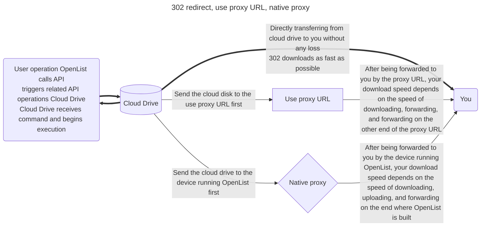
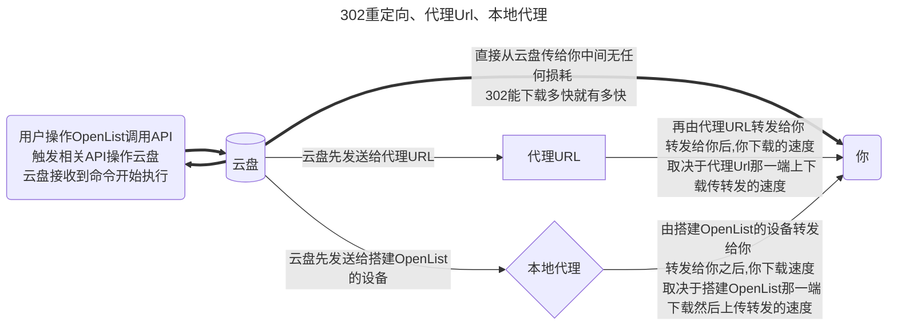

---
title:
  en: Common
  zh-CN: 通用项
icon: iconfont icon-state
# This control sidebar order
top: 530
# A page can have multiple categories
categories:
  - guide
  - drivers
# A page can have multiple tags
tag:
  - Storage
  - Guide
# this page is sticky in article list
sticky: true
# this page will appear in starred articles
star: true
---

## **Mount Path** { lang="en" }

## **挂载路径** { lang="zh-CN" }

::: en
Unique identifier, the name displayed to the outside world, that is, the location to be mounted. If you want to mount to the root directory, it is `/`


Repeated use of mount path name

```json
Failed create storage in database: UNIQUE constraint failed: x_storages.mount_path
```

The mount path name is not filled in

```json
Key: 'Storage.MountPath' Error:Field validation for 'MountPath' failed on the 'required' tag
```

<br/>
:::
::: zh-CN
唯一标识，对外展示的名称，要挂载到的位置，如果要挂载到根目录，就是 `/`


挂载路径名称重复使用
```json
Failed create storage in database: UNIQUE constraint failed: x_storages.mount_path
```
挂载路径名称没有填写
```json
Key: 'Storage.MountPath' Error:Field validation for 'MountPath' failed on the 'required' tag
```
<br/>
:::

## **Order** { lang="en" }

## **序号** { lang="zh-CN" }

::: en
When there are multiple accounts, it is used for sorting, The smaller the more forward
<br/>
:::
::: zh-CN
当有多个账户时，用于排序，越小越靠前，可以填写负数
<br/>
:::

## **Remark** { lang="en" }

## **备注** { lang="zh-CN" }

::: en
Anything you want to fill in, which is just for reminding you what this storage is
:::
::: zh-CN
随便你想填什么，只是提醒你这个存储是什么
:::

### **Reference** <Badge text="≥ 3.42.0" type="info" vertical="middle" /> { lang="en" }

### **引用** <Badge text="≥ 3.42.0" type="info" vertical="middle" /> { lang="zh-CN" }

::: en
Reference authentication, tokens, etc. from `Mounted Storage`, and use the same token for multiple network disks
Currently only the following network disks are supported:

- 139Yun
- AliyundriveOpen
- 189CloudPC
- 123PanShare（ref 123Pan）
- Cloudreve V3 / V4
  In the storage settings, set the first line of `Remark` to: **ref:/mount path**
- https://github.com/AlistGo/alist/pull/7805
  
  <br/>
  :::
  ::: zh-CN
  从 `已挂载的存储` 中引用认证、令牌等，同一个Token多个网盘使用
  目前仅支持如下网盘：
- 中国移动云盘
- 阿里云盘Open
- 天翼云盘客户端
- 123云盘分享（引用123云盘）
- Cloudreve V3 / V4
  在存储设置中将`备注(Remark)`的第一行设置为：**ref:/挂载路径**
- https://github.com/AlistGo/alist/pull/7805
  
  <br/>
  :::

## **Enable signing** { lang="en" }

## **启用签名** { lang="zh-CN" }

::: en
Sign and encrypt files (no password required), only valid for this driver, if other signatures are not enabled and `signature all` and `meta-information encryption` are not set, others will not be signed
Usage scenario: I don't want to enable all signatures, and I don't want to set metadata encryption. I just want to sign and encrypt a certain driver to prevent it from being scanned.
Scope of influence: `Settings-->Global-->Signature All` > `Metainformation Directory Encryption` > `Single Driver Signature`
<br/>
:::
::: zh-CN
对文件进行签名加密(不会需要密码)，仅对本驱动生效，如果别的没启用签名也没设置`签名全部`和`元信息加密`其他的不会进行签名
使用场景：不想开启全部签名，也不想设置元信息加密，只想对某驱动进行签名加密防止被扫
影响范围：`设置-->全局-->签名所有` > `元信息目录加密` > `单驱动签名`
<br/>
:::

## **Disable index** { lang="en" }

## **禁用索引** { lang="zh-CN" }

::: en
Allow users to disable storage indexing.

- For example, if you enable `Ignore Index` in the index options, you no longer need to configure it after enabling `Disable Index`, which is more convenient.
  [alist#7730](https://github.com/AlistGo/alist/pull/7730)、[alist-web#219](https://github.com/AlistGo/alist-web/pull/219)
  <br/>
  :::
  ::: zh-CN
  允许用户禁用存储索引。
- 例如索引选项中的`忽略索引`，启用`禁用索引`后不需要再去配置了，这样也更方便一些
  [alist#7730](https://github.com/AlistGo/alist/pull/7730)、[alist-web#219](https://github.com/AlistGo/alist-web/pull/219)
  <br/>
  :::

### **Cache Expiration** { lang="en" }

## **缓存过期** { lang="zh-CN" }

::: en
Cache time of directory structure.
<br/>
:::
::: zh-CN
<br/>
:::

## **Web proxy** { lang="en" }

## **Web 代理** { lang="zh-CN" }

::: en
Whether the web preview,download and the direct link go through the transfer. If you open this, recommended you set [site_url](../../configuration/configuration.md#site-url-1) so that alist can works fine.
:::
::: zh-CN
网页预览、下载和直接链接是否通过中转。如果你打开此项，建议你设置[site_url](../../configuration/configuration.md#site-url-1)，以帮助alist更好的工作。
:::

---

::: en

- Web proxy Strategies ：It is a strategy when using the webpage. The default is a local agent. If you fill in the proxy URL and enable the web agent to use the proxy URL
- Webdav policy Strategies：It is an option to use the webdav function
  - If there are 302 options default to 302, if there is no 302 option default to the local agent, if you want to use the agent URL, please fill in and manually switch to the proxy URL strategy
    The two are different configurations
    <br/>

:::

::: zh-CN

- Web代理：是使用网页时候的策略，默认为本地代理，如果填写了代理URL并且启用了Web代理使用的是代理URL
- WebDAV策略：是在使用WebDAV功能时候的选项，
  - 如果有302选项默认为302，如果没有302选项默认为本地代理，如果要使用代理URL请填写并且手动切换到代理URL策略
    两者是不同的配置
    <br/>

:::

## **Webdav policy** { lang="en" }

## **WebDAV 策略** { lang="zh-CN" }

::: en

- 302 redirect: redirect to the real link
- use proxy URL: redirect to proxy URL
- native proxy: return data directly through local transit(best compatibility)

---

- 302 redirect：Although it does not consume traffic, it is not recommended to share and use it.
- use proxy URL：It will consume the traffic of the agent URL
- native proxy：The traffic of the construction of Alist device will consume
  :::
  ::: zh-CN
- 302 重定向：重定向到真实链接
- 使用代理 URL：重定向到代理 URL
- 本机代理：直接通过本地中转返回数据（最佳兼容性）

---

- 302重定向：虽然不会消耗流量，但是不建议共享使用，有封禁账户的风险
- 代理URL：会消耗搭建代理URL的流量
- 本地代理：会消耗搭建OpenList设备的流量
  :::

### **Description of three modes** { lang="en" }

### **三种模式说明** { lang="zh-CN" }

::: en



:::

::: zh-CN



:::

## Download proxy URL { lang="en" }

## **下载代理 URL** { lang="zh-CN" }

::: en
When the proxy is turned on without filling in this field, the local machine will be used for transfer by default.Two proxy methods are provided:
:::

::: zh-CN
开启代理时不填写此字段，默认使用本机进行传输。提供了下面两种代理方式：
:::

### 1.cloudflare workers { lang="en" }

### 1.cloudflare workers { lang="zh-CN" }

::: en
You can use `cloudflare workers` for proxy, just fill in the `cloudflare workers` address here.
The workers code can be found at https://github.com/OpenListTeam/openlist-proxy/blob/main/openlist-proxy.js. in:

- ADDRESS: your Alist address, The protocol header must be added, and cannot be followed by /. Such as `https://pan.example.com`;
- TOKEN: you can get in `Other settings` in your Alist manage page;
- WORKER_ADDRESS: your worker address, which should normally be same as **Download proxy URL**.
  :warning: Cloudflare Workers free CDN only supports (regardless of domestic or foreign) **http80 port** and **https443 port**, from group friend test
- When mounting the configuration in the Alist background, fill in the **download proxy URL** at the end of the link without `/`
  If you do n’t understand [**Disassembled for details**](https://anwen-anyi.github.io/index/11-durl.html)
  :::
  ::: zh-CN
  可以使用 Cloudflare Workers 做代理，这里填写 Workers 地址即可。
  Workers 代码可以在 https://github.com/OpenListTeam/OpenList-Proxy/blob/main/openlist-proxy.js 找到，实际使用时需要替换其中的这两个变量：
- `ADDRESS`: 你的 OpenList 地址，必须加上协议头，后面不能跟 `/`。如 `https://pan.example.com`；
- `TOKEN`: 即管理员账户的 [Token](../../configuration/other.md#token)，可在 OpenList 管理页面中进入“其他设置”得到；
- `WORKER_ADDRESS`: 你的 Worker 地址，通常与 **下载代理URL** 相同。
  :warning: Cloudflare Workers 免费 CDN 支持兼容(不论国内还是国外)的只有 **http80端口** 和 **https443端口**，来自群友测试
- 在 OpenList 后台挂载配置时 填写 **下载代理URL** 时候的 链接结尾 不可以带 `/`
  若看不懂[**有拆解详细**](https://anwen-anyi.github.io/index/11-durl.html)的教程
  :::

### 2.Universal Binary { lang="en" }

### 2.通用二进制 { lang="zh-CN" }

::: en
You can also use another machine for proxying, download the program at https://github.com/OpenListTeam/OpenList-Proxy/releases
`./openlist-proxy -help` to see how to use it.
If you don’t understand, there are detailed [**video tutorial**](https://www.bilibili.com/video/BV17N411S7fg/)
You can even develop your own proxy program, the general steps are:

- When downloading, it will request `PROXY_URL/path?sign=sign_value`
- Verify sign in the proxy program, the calculation method of sign is:

```js
const to_sign = `${path}:${expireTimeStamp}`
const _sign = safeBase64(hmac_sha256(to_sign, TOKEN))
const sign = `${_sign}:${expireTimeStamp}`
```

The `TOKEN` is the [token](../../config/other.md#token) of admin user.

- After verifying the sign is correct, requesting `HOST/api/fs/link`, you can get the URL of the file and the request header to be carried
- Use the information to request and return
  <br/>
  :::
  ::: zh-CN
  也可以使用另一台机器进行代理，在 https://github.com/OpenListTeam/OpenList-Proxy/releases 下载程序并通过 `./openlist-proxy -help` 查看使用方法。
  如果不懂有详细[**视频教程**](https://www.bilibili.com/video/BV17N411S7fg/)
  你甚至可以开发自己的代理程序，一般步骤是：
- 下载时会请求 `PROXY_URL/path?sign=sign_value`
- 在代理程序中验证 `sign`，`sign` 的计算方法为：

```js
const to_sign = `${path}:${expireTimeStamp}`
const _sign = safeBase64(hmac_sha256(to_sign, TOKEN))
const sign = `${_sign}:${expireTimeStamp}`
```

`TOKEN` 即管理员账户的 [Token](../../configuration/other.md#token)，可在 OpenList 管理页面中进入“其他设置”得到。

- 验证签名正确后，请求 `HOST/api/fs/link`，可以得到文件的 URL 和要携带的请求头
- 使用信息请求和返回
  <br/>
  :::

## Sort related { lang="en" }

## **排序相关** { lang="zh-CN" }

::: en

- Sort by: Sort by what
- Sort direction: Whether the sort direction is ascending or descedning
  :::
  ::: en
  ::: info
  Some drives use their own sorting method, which may be different.
  :::
  ::: zh-CN
- 排序方式：按什么排序
- 排序方向：排序方向是升序还是降序
  :::
  ::: zh-CN
  ::: info
  有些驱动器使用自己的排序方法，可能会有所不同。
  :::
  <br/>

## Extract folder { lang="en" }

## **提取文件夹** { lang="zh-CN" }

::: en

- Extract to front: put all folders to the front when sorting
- Extract to back: put all folders to the back when sorting
  :::
  ::: zh-CN
- 提取到前面：排序时将所有文件夹放在前面
- 提取到后面：排序时将所有文件夹放在后面
  :::
