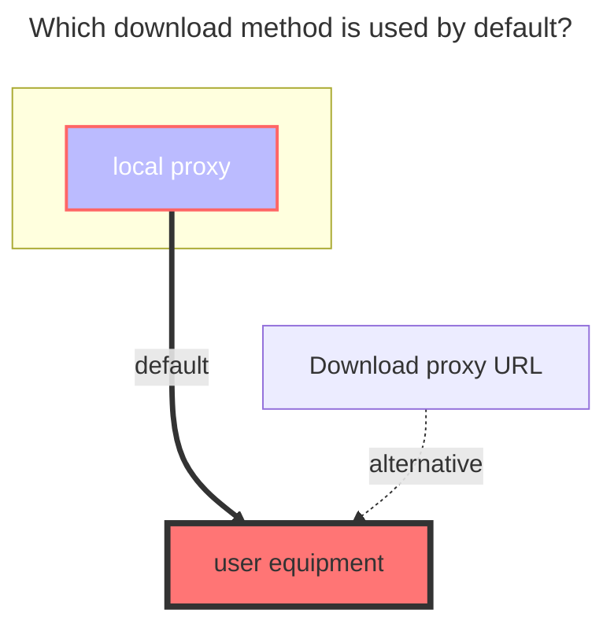
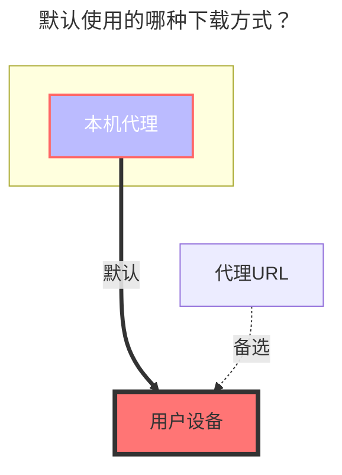

---
title:
  en: Crypt
  zh-CN: Crypt(加密)
icon: iconfont icon-state
# This control sidebar order
top: 360
# A page can have multiple categories
categories:
  - guide
  - drivers
# A page can have multiple tags
tag:
  - Storage
  - Guide
  - '本地代理'
# this page is sticky in article list
sticky: true
# this page will appear in starred articles
star: true
---

## **introduce** { lang="en" }

## **介绍** { lang="zh-CN" }

::: en
What is `Crypt`?
In simple words, it's a two-password-protected safe. No one can open it without the key. The password and the salt in the configuration form the key.
::: en
::: tip

1. If you don’t know how to use this encryption/decryption driver, please read this guide carefully
2. Please test it locally to understand it fully before use in the production environment.
3. The data loss is 100% caused by configuration change. If data has been stored within Crypt, change configuration won't re-encrypt data, those data will be inaccessible to Crypt!
   ==Remind again, please read the document carefully, otherwise the data may be lost！==
   :::

::: zh-CN
`Crypt`是什么？
相当于一个两层密码的保险箱加密了，除了你自己有钥匙能打开别人谁也打不开，配置中的密码和盐值相当于钥匙
当然还有密码和盐值你自己也要保管好，如果丢失了你自己也打不开，除非你自己穷举或者猜出正确密码。
::: zh-CN
::: tip 使用提醒

1. 如果你不了解想要使用本 加/解密 驱动请仔细查看一下每个文字
2. 请先在本地使用了解一下再搬到生产环境中部署使用，否则数据丢失自行承担！
3. 数据丢失100%的因为修改了配置文件导致的，如果已经上传了文件请勿再修改配置文件，否则数据丢失自行承担！
   ==再次提醒请仔细阅读文档使用，否则数据丢失自行承担！==
   :::

## **Instruction** { lang="en" }

## **使用说明** { lang="zh-CN" }

::: en
We need to build a new **empty folder** in the driver (network disk) that has been mounted now.
Then fill in the name of our new empty folder to the `Remote path` `Crypt` driver configuration
E.g:

- Our original driving path was `/123`, we built a new `air` empty folder in the '123' directory
- Fill `Remote Path` option in `Crypt` config page with `/123/air`
- To encrypt files, you need to upload them to the newly created "Crypt" drive. Encryption will only be applied when files are uploaded to this driver.
  - Encrypted files are stored in **`remote path`** , and they can't be opened normally due to the encryption
  - If you want to open them, you need to view them in the `Crypt` Driver Folder

:::

::: zh-CN
我们只需要在现在已经挂载的驱动(网盘)中新建一个**空白文件夹**，名称随意，准备给加密(Crypt)驱动使用
然后把我们新建的空白文件夹名称填写到我们新建的`Crypt`驱动配置中的`加密后文件存储路径`选项
例如：

- 我们原本的驱动路径是`/123`，我们在123这个目录下新建了一个`air空白文件夹`
- 我们就要在`Crypt`驱动的`加密后文件存储路径`选项填写`/123/air`
- 我们上传文件需要在 新建的`Crypt`驱动目录进行上传文件才会进行加密
  - 加密文件我们去 **`加密后文件存储路径`** 查看会看到加密后的文件，无法正常打开查看
  - 如果要打开查看，我们需要在挂载的`Crypt`驱动文件夹查看

:::

## **Config Example** { lang="en" }

## **填写示例** { lang="zh-CN" }

::: en
If you don’t know how to configure, you can use the simpler default configuration as follows. The role of each configuration will be explained in detail below

:::danger Please read carefully --- very important
Once the configuration is set and started using, do not modify it, do not modify it, do not modify it!
The original [**Password**](#password) and [**Salt**](#salt) should be kept in other places. These two options will be encrypted and can't be reveled after saving.

- **If you forget the password before uploading any file, you can modify and re-fill in the password configuration**

---

If you have not uploaded any file in the Crypt, you may modify the configuration, otherwise do not modify it!!!
If you have data in Crypt, and changed the configuration, `Crypt` will try to filter out illegal files/folders, but the illegal data still exist in the remote storage

- **Illegal means data that is encrypted by another config**
  ::: en
  ::: warning
  There are 5 methods for the encryption combination, (in fact 6 types) Because only the **folder encryption is turned on, the file name is not encrypted** and the configuration does not take effect (the first one of the example below)

1. <Badge text="invalid" color="red" vertical="middle" /> Filename `Off`，Directory `true`
2. <Badge text="valid" type="tip" vertical="middle" /> Filename `Off`，Directory `false`
3. <Badge text="valid" type="tip" vertical="middle" /> Filename `Standard`，Directory `false`
4. <Badge text="valid" type="tip" vertical="middle" /> Filename `Standard`，Directory `true`
5. <Badge text="valid" type="tip" vertical="middle" /> Filename `Obfuscate`，Directory `false`
6. <Badge text="valid" type="tip" vertical="middle" /> Filename `Obfuscate`，Directory `true`
   :::
   ::: en
    
   :::
   ::: zh-CN
   如果你不懂如何配置，可以使用如下最简单默认的配置，具体每个配置的作用会在下方详细说明
   
   :::danger 请仔细阅读注意事项 --- 非常重要
   再次重申一下请勿嫌啰嗦
   在配置中一经填写保存后，请勿修改，请勿修改，请勿修改！！！重要的事情说三遍
   [**密码**](#密码) 和 [**盐值**](#盐值) 请必须记住，点击保存后这两个选项就会进行加密无法明文显示（上图明文显示是因为还未保存）

- **如果在没有上传文件之前密码忘记了可以重新填写密码配置**

---

如果你还没有在Crypt驱动內上传文件，可以修改配置，否则请勿修改！！
如果在已有数据的情况下更改配置，`Crypt`尽力过滤非法文件/目录，但非法数据不会被删除

- **非法文件/目录指的是另一种配置生成的加密数据**
  ::: zh-CN
  ::: warning
  关于加密组合一共有5种方式，（实际上是6种）因为只开启**文件夹加密，文件名不加密**这样的配置不生效（下面举例的第一种）

1. <Badge text="无效" color="red" vertical="middle" /> 文件名 `Off`，文件夹 `true`
2. <Badge text="有效" type="tip" vertical="middle" /> 文件名 `Off`，文件夹 `false`
3. <Badge text="有效" type="tip" vertical="middle" /> 文件名 `标准`，文件夹 `false`
4. <Badge text="有效" type="tip" vertical="middle" /> 文件名 `标准`，文件夹 `true`
5. <Badge text="有效" type="tip" vertical="middle" /> 文件名 `混淆`，文件夹 `false`
6. <Badge text="有效" type="tip" vertical="middle" /> 文件名 `混淆`，文件夹 `true`
   :::
   ::: zh-CN
    
   :::

### <i class="fa-solid fa-files" style="color: #409eff;"></i> **Filename encryption** { lang="en" }

### <i class="fa-solid fa-files" style="color: #409eff;"></i> **文件名加密** { lang="zh-CN" }

::: en
If you don’t understand, you can use the default configuration

- 1.**The default is `off` state**
  - Whether the file name needs to be encrypted, and the file name is encrypted after uploading
- 2.**Standard Encryption**
  - Standard encryption safety level high^(recommended)^
- 3.**Simple Obfuscate**
  - The security level is very low, but friendly to long file name. Note: for the Chinese file name, special characters will be generated. Some network disk storage may not support them
- The left side of the figure below is encrypted [**Remote path**](#remote-path)，On the right is the decrypted 'crypt` driver to view the file
  - If not enabled <Badge text="Filename" type="tip" vertical="middle" /> encryption，It will be like <Badge text="Upper left corner pic" color="rgb(216,100,69)" vertical="middle" /> A new encrypted suffix is added behind the source file（xxxxx\.xxx **.bin** ）(The suffix name can be customized)
  - If you enabled <Badge text="Filename" type="tip" vertical="middle" /> encryption，It will be like <Badge text="Lower left corner pic" color="rgb(78,130,184)" vertical="middle" /> In this way, the file name is also confused with encryption, no suffix and the original file name，others can't know what it is, but it can be viewed in `crypt`（<Badge text="The folder displayed on the right" color="rgb(0.0.0.0)" vertical="middle" />）
    
     

:::

::: zh-CN
如果看不懂可以使用默认配置

- 1.**默认为 `Off关闭`状态**
  - 文件名是否加密，作用于上传后文件名进行加密
- 2.**标准加密**
  - 标准加密安全等级高^(荐)^
- 3.**简单混淆**
  - 安全等级很低 ，对长文件名友好，但是对于中文文件名会生成特殊字符，某些网盘存储不支持特殊字符。
- 下图中左侧的加密了的 [**加密后文件存储路径**](#加密后文件存储路径)，右侧是解密后的`Crypt`驱动可以查看文件
  - 如果不开启<Badge text="文件名" type="tip" vertical="middle" />加密，就会显示<Badge text="左上角" color="rgb(216,100,69)" vertical="middle" />那样的是源文件后面新增一个加密的后缀（xxxxx\.xxx **.bin** ）(后缀名可以自定义不一定是.bin)
  - 如果开启<Badge text="文件名" type="tip" vertical="middle" />加密，就会显示<Badge text="左下角" color="rgb(78,130,184)" vertical="middle" />那样将文件名也进行了加密混淆没有了后缀和原文件名，别人就无法知道是什么了，但是可以在`Crypt`驱动（<Badge text="右侧展示的文件夹" color="rgb(0.0.0.0)" vertical="middle" />）中看到真实文件名
    
     

:::

### <i class="fa-solid fa-folder-open" style="color: #409eff;"></i> **Directory name encryption** { lang="en" }

### <i class="fa-solid fa-folder-open" style="color: #409eff;"></i> **文件夹名加密** { lang="zh-CN" }

::: en
default is `false`, i.e disabled. don't use it if you don't understand below description
When you turn on the folder encryption, you must select a **filename encryption** type. Otherwise, the folder encryption will not take effect

- The left side of the figure below is encrypted [**Remote path**](#remote-path)，On the right is the decrypted 'crypt` driver to view the file
  - If disabled <Badge text="Directory" type="tip" vertical="middle" /> encryption，It will be like<Badge text="Upper left corner pic" color="rgb(216,100,69)" vertical="middle" /> No change to folder name
  - If enabled <Badge text="Directory" type="tip" vertical="middle" /> encryption，It will be displayed<Badge text="Lower left corner pic" color="rgb(78,130,184)" vertical="middle" /> folder name is encrypted
    
     

:::

::: zh-CN
使用启用文件夹加密，默认为 `false` 未启用，看不懂可以不启用，
开启文件夹加密的同时必须选择一项**文件名加密**否则单独只开文件夹加密不生效

- 下图中左侧的加密了的 [**加密后文件存储路径**](#加密后文件存储路径)，右侧是解密后的`crypt`驱动可以查看文件
  - 如果不开启<Badge text="文件夹" type="tip" vertical="middle" />加密，就会显示<Badge text="左上角" color="rgb(216,100,69)" vertical="middle" />那样的没有任何变化的文件夹
  - 如果开启<Badge text="文件夹" type="tip" vertical="middle" />加密，就会显示<Badge text="左下角" color="rgb(78,130,184)" vertical="middle" />那样将文件夹名字也进行了加密混淆
    
     

:::

### <i class="fa-solid fa-cloud-binary" style="color: #409eff;"></i> **Remote path** { lang="en" }

### <i class="fa-solid fa-cloud-binary" style="color: #409eff;"></i> **加密后文件存储路径** { lang="zh-CN" }

::: en
It is the storage and encrypted file, which can be any driver in the driver that can be mounted
 
:::
::: zh-CN
也就是存储加密后的文件，可以是OpenList能挂载的驱动里面任意一款驱动
 
:::

### <i class="fa-solid fa-lock-keyhole" style="color: #409eff;"></i> **Password** { lang="en" }

### <i class="fa-solid fa-lock-keyhole" style="color: #409eff;"></i> **密码** { lang="zh-CN" }

::: en
Just literally meaning password
:::
::: zh-CN
就是字面意思密码
:::

### <i class="fa-solid fa-lock-keyhole" style="color: #409eff;"></i> **Salt** { lang="en" }

### <i class="fa-solid fa-lock-keyhole" style="color: #409eff;"></i> **盐值** { lang="zh-CN" }

::: en
It can be treated as the second password if you don't understand it
 
:::
::: zh-CN
也可以理解为第二个密码
 
:::

### **Encrypted suffix** { lang="en" }

### **加密后缀** { lang="zh-CN" }

::: en
Advanced options,The default is `.bin`, the custom must start with` .`, such as .abc .aaa .Psd.
If the file name is encrypted, the encryption suffix `will not be used
 
:::
::: zh-CN
高级选项，默认为`.bin`，可自定义必须要以`.`开头，例如 .abc .aaa .psd 这样的后缀
如果开启了文件名加密`加密后缀`就不会显示
 
:::

### **Filename encoding** { lang="en" }

### **文件名编码** { lang="zh-CN" }

::: en
Advanced options, non -professionals, please do not modify it. The default is **`base64`**, but the options other than **`base64`** are not tested. If you encounter problems, you need to solve it yourself.
-Dy reference [#5109](https://github.com/alist-org/alist/issues/5109)，[#5080](https://github.com/alist-org/alist/issues/5080)
 
:::
::: zh-CN
高级选项，非专业人士请勿修改，默认为 **`Base64`**，但是除了 **`Base64`** 之外的选项并没有测试，遇到问题需要自己解决。

- 参考[#5109](https://github.com/alist-org/alist/issues/5109)，[#5080](https://github.com/alist-org/alist/issues/5080)
   
  :::

## **Advanced usage** { lang="en" }

## **高级用法** { lang="zh-CN" }

::: en
Advanced usage is only applicable to those who know about **`rclone`**
If you know the **`rclone`** very well, you can check :point_right: [**rclone crypt document**](https://rclone.org/crypt) Currently fully compatible
Note: `Alist Crypt` used `filename_encoding = base64` in default. If you want to use Rclone, please config it in the advanced config. (Reason: more friendly to long filename)
Since Alist does not consider any case-insensitive internally, you may encounter problems when remote storage is case-insensitive. e.g.: use alist local driver on Windows, then use Crypt on it.
 
:::
::: zh-CN
高级用法仅适用于对 **`Rclone`** 了解的人
如果你对 **`Rclone`** 很了解可以看 :point_right: [**Rclone Crypt 文档**](https://rclone.org/crypt) 目前完全兼容
注意，`Alist Crypt`驱动默认使用了 `filename_encoding = base64` ,如果使用Rclone请在高级设置中配置此条。（理由：对长文件名更友好一些）
因为alist内部并没有对大小写**不敏感**提供支持，所以如果使用了大小写不敏感的文件系统可能会出问题，例如：windows上使用本地存储驱动，再使用Crypt
 
:::

## **Precautions** { lang="en" }

## **注意事项** { lang="zh-CN" }

::: en
When starting alist, I found that the Crypt prompts errors because Crypt can not find the relevant path when starting, You can fill in the Crypt [order](common.md#order) to make Crypt start slowly
 
:::
::: zh-CN
启动OpenList时发现Crypt提示错误，是因为Crypt靠前启动时候找不到相关路径，可以通过给Crypt驱动填写[序号](common.md#序号)让Crypt启动靠后
 
:::

## **The default download method used** { lang="en" }

## **默认使用的下载方式** { lang="zh-CN" }

::: en

:::
::: zh-CN

:::
