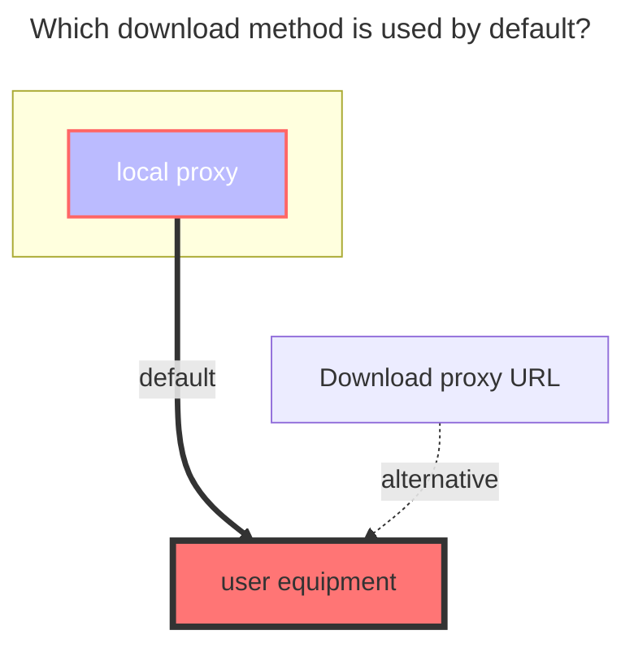
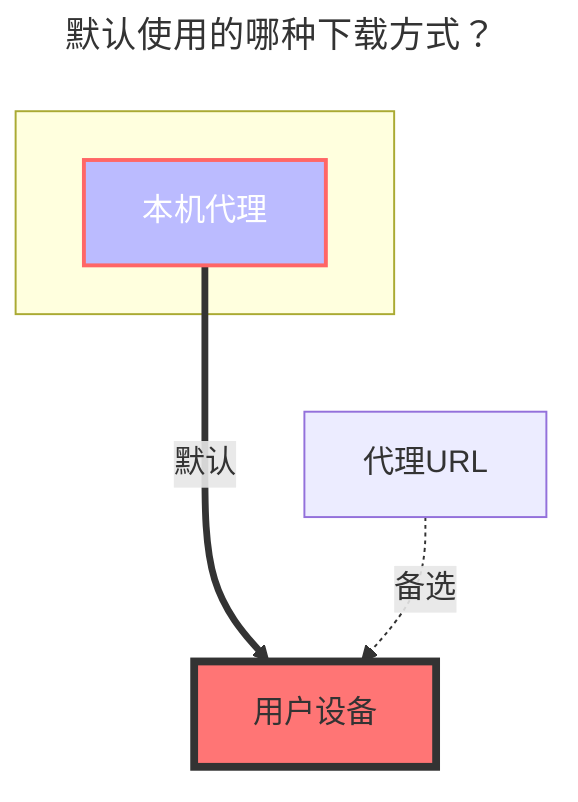

---
title:
  en: Crypt
  zh-CN: Crypt（加密）
icon: iconfont icon-state
top: 360
categories:
  - guide
  - drivers
tag:
  - Storage
  - Guide
sticky: true
star: true
---

::: en
The Crypt driver provides secure encryption for your files and folders, acting as a two-password-protected vault. Only users with the correct password and salt can access the encrypted content.

**Key Features:**

- File and folder encryption with multiple security levels
- Password and salt-based protection
- Compatible with rclone crypt
- Supports various encryption modes for filenames and directories

:::

::: zh-CN
Crypt 驱动为您的文件和文件夹提供安全加密，相当于一个双重密码保护的保险库。只有拥有正确密码和盐值的用户才能访问加密内容。

**主要特性：**

- 文件和文件夹加密，支持多种安全级别
- 基于密码和盐值的保护机制
- 与 rclone crypt 完全兼容
- 支持多种文件名和目录加密模式

:::

::: en
::: warning Important Security Notice

1. Read this guide thoroughly before using the Crypt driver
2. Test the configuration in a local environment before production deployment
3. **Never modify the configuration after storing encrypted data** - this will make data lost
4. Keep your password and salt values secure - losing them means losing access to your data

Again, please read the documentation carefully; otherwise, any data loss will be at your own risk!
:::

::: zh-CN
::: warning 重要安全提醒

1. 使用 Crypt 驱动前请仔细阅读本指南
2. 在生产环境部署前请先在本地测试配置，否则数据丢失自行承担！
3. **存储加密数据后绝不能修改配置** - 这会100%导致现有数据丢失
4. 请妥善保管您的密码和盐值 - 丢失它们将无法访问您的数据

**再次提醒请仔细阅读文档使用，否则数据丢失自行承担！**
:::

## Setup Instructions { lang="en" }

## 设置说明 { lang="zh-CN" }

::: en

1. **Create Storage Location**

   Create an **empty folder** in your existing mounted drive to store encrypted files.

2. **Configure Remote Path**

   Enter the path of the empty folder in the `Remote path` field of your Crypt driver configuration.

   **Example Configuration:**
   - Original driver path: `/123`
   - New empty folder: `/123/encrypted_storage`
   - Remote path setting: `/123/encrypted_storage`

3. **Upload Files**

   Upload files to the newly created Crypt driver mount point. Only files uploaded through the Crypt driver will be encrypted.

   **File Access:**
   - **Encrypted files**: Located in the remote path, appear scrambled and cannot be opened directly
   - **Decrypted access**: View and access files normally through the Crypt driver mount point

:::

::: zh-CN

1. **创建存储位置**

   在现有已挂载的驱动中创建一个**空文件夹**，用于存储加密后的文件。

2. **配置远程路径**

   在 Crypt 驱动配置的`远程路径`字段中填入空文件夹的路径。

   **配置示例：**
   - 原驱动路径：`/123`
   - 新建空文件夹：`/123/encrypted_storage`
   - 远程路径设置：`/123/encrypted_storage`

3. **上传文件**

   将文件上传到新创建的 Crypt 驱动挂载点。只有通过 Crypt 驱动上传的文件才会被加密。

   **文件访问方式：**
   - **加密文件**：位于远程路径中，显示为加密状态，无法直接打开
   - **解密访问**：通过 Crypt 驱动挂载点正常查看和访问文件

:::

### Basic Configuration Example { lang="en" }

### 基础配置示例 { lang="zh-CN" }

::: en
For users new to encryption, use the following default configuration:

:::

::: zh-CN
对于首次使用加密的新手用户，建议使用以下默认配置：

:::

::: en
::: danger Please make sure to read the following important notes carefully to ensure understanding!

**Important Declaration:**

- **Do not modify the configuration! Do not modify the configuration! Do not modify the configuration!** Once the configuration is saved, do not modify it again!!! This is repeated for emphasis!
- **Password** and **Salt** must be remembered! After clicking save, they will be encrypted and cannot be displayed in plain text (the plain text in the image shows the state before saving).

> [**Password Configuration Instructions**](#password)
>
> [**Salt Configuration Instructions**](#salt)

---

- **If you have not yet uploaded files within the Crypt driver**, you can modify the password and configuration. **Otherwise, do not modify!**
- After modifying the configuration, Crypt will attempt to filter illegal files/directories, but illegal data will not be automatically deleted.
  - **Illegal files/directories** refer to encrypted data generated with a different configuration.

:::

::: zh-CN
::: danger 请务必仔细阅读以下注意事项，确保理解！

**重要声明：**

- **请勿修改配置！请勿修改配置！请勿修改配置！** 配置一旦保存后，请不要再进行修改！！！重要的事情重复三遍！
- **密码** 和 **盐值** 必须牢记！点击保存后，它们将被加密，无法以明文显示（图中的明文是尚未保存前的状态）。

> [**密码配置说明**](#密码)
>
> [**盐值配置说明**](#盐值)

---

- **如果你还没有再 Crypt 驱动内上传文件**，可以修改密码和配置。**否则请勿修改！**
- 修改配置后，Crypt 会尽量过滤非法文件/目录，但非法数据不会被自动删除。
  - **非法文件/目录** 是指由不同配置生成的加密数据。

:::

::: en
::: warning
Regarding encryption combinations, there are 5 options available (actually 6), but it’s important to note that if only folder encryption is enabled without encrypting the file names, the configuration will not take effect (as shown in the first example below).

| Filename Encryption | Directory Encryption | Status     |
| ------------------- | -------------------- | ---------- |
| `Off`               | `Enabled`            | ❌ Invalid |
| `Off`               | `Disabled`           | ✅ Valid   |
| `Standard`          | `Disabled`           | ✅ Valid   |
| `Standard`          | `Enabled`            | ✅ Valid   |
| `Obfuscate`         | `Disabled`           | ✅ Valid   |
| `Obfuscate`         | `Enabled`            | ✅ Valid   |

:::

::: zh-CN
::: warning
关于加密组合，共有5种方式可供选择（实际上是6种），但需要注意的是，如果只启用文件夹加密而不加密文件名的配置将不会生效（例如下面举例的第1种情况）。

| 文件名加密          | 目录加密 | 状态    |
| ------------------- | -------- | ------- |
| `Off（关闭）`       | `启用`   | ❌ 无效 |
| `Off（关闭）`       | `禁用`   | ✅ 有效 |
| `Standard（标准）`  | `禁用`   | ✅ 有效 |
| `Standard（标准）`  | `启用`   | ✅ 有效 |
| `Obfuscate（混淆）` | `禁用`   | ✅ 有效 |
| `Obfuscate（混淆）` | `启用`   | ✅ 有效 |

:::

## Configuration Options { lang="en" }

## 配置选项 { lang="zh-CN" }

### Filename Encryption { lang="en" }

### 文件名加密 { lang="zh-CN" }

::: en
**Default:** `Disabled`

**Available Options:**

| Mode        | Security Level | Description                                                                   |
| ----------- | -------------- | ----------------------------------------------------------------------------- |
| `Off`       | None           | Files keep original names with encrypted suffix (e.g., `file.txt.bin`)        |
| `Standard`  | High           | **Recommended** - Strong encryption with good security                        |
| `Obfuscate` | Low            | Simple obfuscation, supports long filenames but may create special characters |

---

In the image below, the left side shows file **name encryption** and folder **name encryption** enabled, while the right side shows the decrypted Crypt driver where files can be viewed.

- **File name encryption not enabled**: Original name + encrypted suffix, as shown in the top left corner
- **File name encryption enabled**: Fully encrypted file name, content cannot be recognized, as shown in the bottom left corner

:::

::: zh-CN
**默认值：** `禁用`

**可用选项：**

| 模式                | 安全级别 | 说明                                               |
| ------------------- | -------- | -------------------------------------------------- |
| `Off（关闭）`       | 无       | 文件保持原名称并添加加密后缀（如：`file.txt.bin`） |
| `Standard（标准）`  | 高       | **推荐** - 强加密，具有良好的安全性                |
| `Obfuscate（混淆）` | 低       | 简单混淆，支持长文件名但可能产生特殊字符           |

---

下图中左侧开启了**文件名加密**和**文件夹名称加密**，右侧为解密后的Crypt驱动可以查看文件

- **未启用文件名加密**：原始名称 + 加密后缀，如左上角
- **启用文件名加密**：完全加密的文件名，无法识别内容，如左下角

:::

### Directory Name Encryption { lang="en" }

### 文件夹名称加密 { lang="zh-CN" }

::: en
**Default:** `Disabled`

Directory encryption requires filename encryption to be enabled. When activated, folder names are also encrypted for enhanced security.

**Configuration Combinations:**

| Filename Encryption | Directory Encryption | Status     |
| ------------------- | -------------------- | ---------- |
| `Off`               | `Enabled`            | ❌ Invalid |
| `Off`               | `Disabled`           | ✅ Valid   |
| `Standard`          | `Disabled`           | ✅ Valid   |
| `Standard`          | `Enabled`            | ✅ Valid   |
| `Obfuscate`         | `Disabled`           | ✅ Valid   |
| `Obfuscate`         | `Enabled`            | ✅ Valid   |

:::

::: zh-CN
**默认值：** `禁用`

目录加密需要先启用文件名加密。激活后，文件夹名称也会被加密以增强安全性。

**配置组合：**

| 文件名加密          | 目录加密 | 状态    |
| ------------------- | -------- | ------- |
| `Off（关闭）`       | `启用`   | ❌ 无效 |
| `Off（关闭）`       | `禁用`   | ✅ 有效 |
| `Standard（标准）`  | `禁用`   | ✅ 有效 |
| `Standard（标准）`  | `启用`   | ✅ 有效 |
| `Obfuscate（混淆）` | `禁用`   | ✅ 有效 |
| `Obfuscate（混淆）` | `启用`   | ✅ 有效 |

:::

### Remote Path { lang="en" }

### 加密后文件存储路径 { lang="zh-CN" }

::: en
The storage location for encrypted files. Can be any mountable drive supported by OpenList.
:::
::: zh-CN
加密文件的存储位置。可以是 OpenList 支持的任何可挂载驱动。
:::

### Security Parameters { lang="en" }

### 安全参数 { lang="zh-CN" }

::: en
::: danger
After saving the configuration, both password and salt values are encrypted and cannot be displayed in plain text. Store them securely in a separate location.
:::
::: zh-CN
::: danger
保存配置后，密码和盐值都会被加密，无法以明文显示。请在其他地方安全存储这些值。
:::

#### Password { lang="en" }

#### 密码 { lang="zh-CN" }

::: en
Primary encryption key. **Must be remembered** - cannot be recovered if lost.
:::
::: zh-CN
主要加密密钥。**必须牢记** - 丢失后无法恢复。
:::

#### Salt { lang="en" }

#### 盐值 { lang="zh-CN" }

::: en
Secondary encryption key, acts as an additional password layer. **Must be remembered** - cannot be recovered if lost.

If you don't know what is salt, treat it as a second password. Optional but recommended

:::
::: zh-CN
辅助加密密钥，相当于第二层密码保护。**必须牢记** - 丢失后无法恢复。

如果您不知道什么是加盐，可以视为第二个密码。可选，推荐。
:::

### Advanced Options { lang="en" }

### 高级选项 { lang="zh-CN" }

#### Encrypted Suffix { lang="en" }

#### 加密后缀 { lang="zh-CN" }

::: en
**Default:** `.bin`

Custom suffix for encrypted files (only used when filename encryption is disabled). Must start with a dot (e.g., `.abc`, `.encrypted`).
:::

::: zh-CN
**默认值：** `.bin`

加密文件的自定义后缀（仅在文件名加密禁用时使用）。必须以点开头（例如：`.abc`、`.encrypted`）。
:::

#### Filename Encoding { lang="en" }

#### 文件名编码 { lang="zh-CN" }

::: en
**Default:** `base64`

**Warning:** Only modify if you understand the implications. Other encoding options are not thoroughly tested and may cause compatibility issues.

For rclone compatibility, configure this setting in advanced options.
:::

::: zh-CN
**默认值：** `base64`

**警告：** 仅在了解其影响时才修改此设置。其他编码选项未经充分测试，可能导致兼容性问题。

为了与 rclone 兼容，请在高级选项中配置此设置。
:::

## Advanced Usage { lang="en" }

## 高级用法 { lang="zh-CN" }

### Rclone Compatibility { lang="en" }

### Rclone 兼容性 { lang="zh-CN" }

::: en
The Crypt driver is fully compatible with [rclone crypt](https://rclone.org/crypt).

**Important Notes:**

- OpenList Crypt uses `filename_encoding = base64` by default for better long filename support, configure this setting in advanced options when using with rclone
- Case-insensitive filesystems (e.g., Windows with local storage) may cause issues

:::

::: zh-CN
Crypt 驱动与 [rclone crypt](https://rclone.org/crypt) 目前完全兼容。

**重要说明：**

- OpenList Crypt 默认使用 `filename_encoding = base64` 以更好地支持长文件名，与 rclone 一起使用时请在高级选项中配置此设置
- 大小写不敏感的文件系统（如 Windows 本地存储）可能会出现问题

:::

## Troubleshooting { lang="en" }

## 故障排除 { lang="zh-CN" }

### Startup Errors { lang="en" }

### 启动错误 { lang="zh-CN" }

::: en
If Crypt shows errors during OpenList startup, it's likely because Crypt starts before its target path is available.

**Solution:** Set a higher [order number](./common.md#order) for the Crypt driver to delay its initialization.
:::

::: zh-CN
如果 Crypt 在 OpenList 启动时显示错误，可能是因为 Crypt 在其目标路径可用之前就启动了。

**解决方案：** 为 Crypt 驱动设置更高的[序号](./common.md#序号)以延迟其初始化。
:::

### Data Access Issues { lang="en" }

### 数据访问问题 { lang="zh-CN" }

::: en
If you cannot access previously encrypted data:

1. Verify that the password and salt values are correct
2. Ensure the configuration hasn't been modified
3. Check that the remote path is accessible
4. Confirm the filename encoding setting matches your original configuration

:::

::: zh-CN
如果无法访问之前加密的数据：

1. 验证密码和盐值是否正确
2. 确保配置未被修改
3. 检查远程路径是否可访问
4. 确认文件名编码设置与原始配置匹配

:::

## The default download method used { lang="en" }

## 默认使用的下载方式 { lang="zh-CN" }

::: en

:::
::: zh-CN

:::
