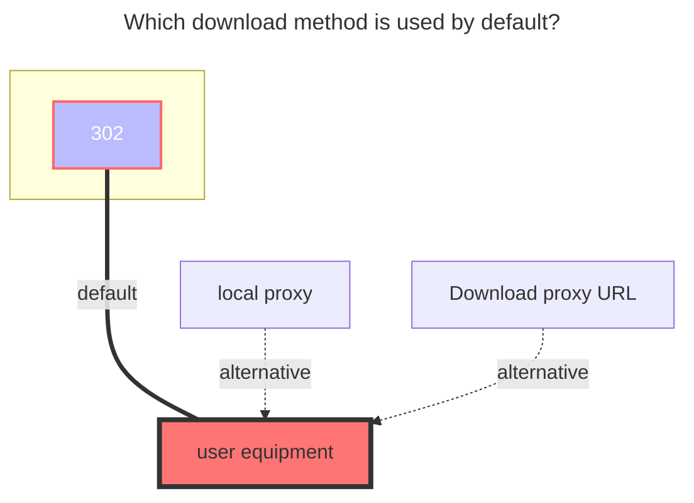
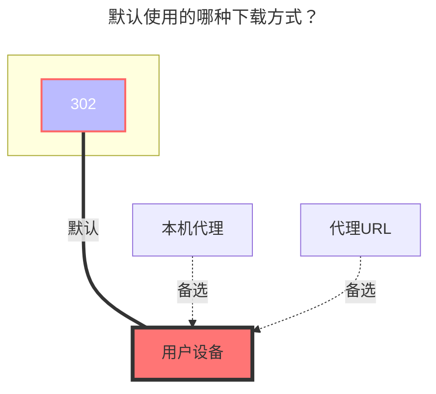

---
title:
  en: Dropbox
  zh-CN: Dropbox
icon: iconfont icon-state
# This control sidebar order
top: 100
# A page can have multiple categories
categories:
  - guide
  - drivers
# A page can have multiple tags
tag:
  - Storage
  - Guide
  - '302'
# this page is sticky in article list
sticky: true
# this page will appear in starred articles
star: true
---

::: en
Dropbox Official：https://www.dropbox.com/
:::
::: zh-CN
Dropbox官网：https://www.dropbox.com/
:::

## **Get refresh token** { lang="en" }

## **获取刷新令牌** { lang="zh-CN" }

::: en

- **This cloud drive does not support the online API mode provided by OpenList.**
  - The following tutorial applies when the option is kept disabled as shown below.  
    
  - The steps are as follows:
  - If you create your own `Client ID` and `Secret`, remember to authorize them.
  - First, [click here](https://www.dropbox.com/developers/apps?_tk=pilot_lp&_ad=topbar4&_camp=myapps) to enter the Dropbox app management page and click "Create App".
    
  - After entering the app, configure the app type as shown below.
    
  - You can get the id and secret in the red box: the upper one is the id, the lower one is the secret.
    
  - Configure the callback URL. If you are strict about permissions and do not want to use an external callback address, you can set a local address here, or use the one outside the red box.
    
  - Finally, go to the permissions configuration page to set the app's permissions.
    
  - [Click here](https://api.oplist.org/) to enter the token acquisition tool. Select Dropbox, fill in your id and secret, and after authorization you can get the refresh token.
  - In the OpenList configuration page, enter the refresh token, id, and secret to use. Note that the refresh token is about 40-50 characters long.
    
  - If you are highly privacy-conscious, Dropbox supports local callback. You can use the following script provided by GPT to quickly implement it, communicating only with Dropbox servers.
  - **Note: Since the callback address is local and you have not set up a real local callback server, please manually copy the authorization code from the browser address bar.**
  - **Please resolve Python environment issues yourself, or use the callback server provided above.**
  ```python
  import requests
  import webbrowser
  # Please replace with your own Dropbox App information
  CLIENT_ID = 'your_app_key'
  CLIENT_SECRET = 'your_app_secret'
  REDIRECT_URI = 'http://localhost:114514'
  # Step 1: Get authorization code
  auth_url = (
    f"https://www.dropbox.com/oauth2/authorize"
    f"?client_id={CLIENT_ID}"
    f"&redirect_uri={REDIRECT_URI}"
    f"&response_type=code"
    f"&token_access_type=offline"  # Required: key parameter to get refresh_token
  )
  print("👉 Please visit the following link to authorize:\n")
  print(auth_url)
  webbrowser.open(auth_url)
  auth_code = input("\n✅ After authorization, paste the code after ?code= in the redirected URL here:\n> ").strip()
  # Step 2: Exchange for access_token + refresh_token
  token_url = "https://api.dropboxapi.com/oauth2/token"
  data = {
    'code': auth_code,
    'grant_type': 'authorization_code',
    'client_id': CLIENT_ID,
    'client_secret': CLIENT_SECRET,
    'redirect_uri': REDIRECT_URI
  }
  response = requests.post(token_url, data=data)
  response.raise_for_status()
  tokens = response.json()
  # ✅ Only output the refresh token
  print("\n🎉 Success! Your Dropbox refresh_token is:\n")
  print(tokens.get("refresh_token"))
  ```
  :::
  ::: zh-CN
- **该网盘并不支持由OpenList提供的online api模式**
  以下教程适用于保持如框内所示的关闭状态
  
  - 获取方式如下
  - 自建`客户端ID`和`秘钥`时，记得授权
  - 首先[点击这里](https://www.dropbox.com/developers/apps?_tk=pilot_lp&_ad=topbar4&_camp=myapps)进入dropbox的应用管理界面，点击创建应用
    
  - 进入应用后按下图配置应用类型
    
  - 在红框里可以获得id和secret，上面是id，下面是secret。
    
  - 配置回调地址，如果你有权限洁癖，不想使用外部回调地址，可以在此处配置本地地址，或者按照红框外的来
    
  - 最后，进入权限配置界面，配置app的权限
    
  - [点击这里](https://api.oplist.org/)进入token获取工具，选择dropbox后填入自己的id和secret，完成授权后可以获得刷新令牌。
  - 在OpenList配置界面，填入刷新令牌、id和secret即可使用，注意刷新令牌的长度大致为40-50个字符。
    
  - 如果你有强烈的隐私意识，dropbox支持本地回调，可以使用以下全程由GPT提供的脚本快速实现，只和dropbox的服务器进行通信。
  - **注意：由于回调地址是本地，而你并没有建立真正的本地回调服务器，所以请自己从浏览器地址栏获取返回的权限码**
  - **请自行解决py运行的环境问题，或者使用上面搭建好的回调服务器**
  ```python
  import requests
  import webbrowser
  # 请替换为你自己的 Dropbox App 信息
  CLIENT_ID = 'your_app_key'
  CLIENT_SECRET = 'your_app_secret'
  REDIRECT_URI = 'http://localhost:114514'
  # 第一步：获取授权码
  auth_url = (
    f"https://www.dropbox.com/oauth2/authorize"
    f"?client_id={CLIENT_ID}"
    f"&redirect_uri={REDIRECT_URI}"
    f"&response_type=code"
    f"&token_access_type=offline"  # 必须：获取 refresh_token 的关键参数
  )
  print("👉 请访问以下链接进行授权：\n")
  print(auth_url)
  webbrowser.open(auth_url)
  auth_code = input("\n✅ 授权完成后，将跳转链接中的 ?code= 后面的授权码粘贴到此处：\n> ").strip()
  # 第二步：交换 access_token + refresh_token
  token_url = "https://api.dropboxapi.com/oauth2/token"
  data = {
    'code': auth_code,
    'grant_type': 'authorization_code',
    'client_id': CLIENT_ID,
    'client_secret': CLIENT_SECRET,
    'redirect_uri': REDIRECT_URI
  }
  response = requests.post(token_url, data=data)
  response.raise_for_status()
  tokens = response.json()
  # ✅ 最终只输出刷新令牌
  print("\n🎉 获取成功！你的 Dropbox refresh_token 是：\n")
  print(tokens.get("refresh_token"))
  ```
  :::

## **Root folder file_id** { lang="en" }

## **根文件夹ID** { lang="zh-CN" }

::: en
**Empty is the root directory**：display all files
**Single folder ID**：Enter the folder you need to display, copy the top link to fill in `/home` behind

:::
::: zh-CN
空为根目录：挂载全部文件
单文件夹ID：进入你需要挂载的文件夹复制顶部链接将`/home`后面的填写进去即可

:::

### **The default download method used** { lang="en" }

### **默认使用的下载方式** { lang="zh-CN" }

::: en



:::
::: zh-CN



:::
