```mermaid
---
title: 默认使用的哪种下载方式？
---
flowchart TB
    style a1 fill:#bbf,stroke:#f66,stroke-width:2px,color:#fff
    style a2 fill:#ff7575,stroke:#333,stroke-width:4px
    subgraph ide1 [ ]
    a1
    end
    a1[302]:::someclass====|默认|a2[用户设备]
    classDef someclass fill:#f96
    c1[本机代理]-.备选.->a2[用户设备]
    b1[代理URL]-.备选.->a2[用户设备]
    click a1 "../drivers/common.html#webdav-策略"
    click b1 "../drivers/common.html#webdav-策略"
    click c1 "../drivers/common.html#webdav-策略"
```

---
title:
  en: Dropbox
  zh-CN: Dropbox
icon: iconfont icon-state
# This control sidebar order
top: 100
# A page can have multiple categories
categories:
  - guide
  - drivers
# A page can have multiple tags
tag:
  - Storage
  - Guide
  - '302'
# this page is sticky in article list
sticky: true
# this page will appear in starred articles
star: true
---

::: en
Dropbox Official：https://www.dropbox.com/
:::
::: zh-CN
Dropbox官网：https://www.dropbox.com/
:::

## Get refresh token { lang="en" }

## 获取刷新令牌 { lang="zh-CN" }

::: en

- **This drive does not support the online API mode provided by OpenList.**

- The following tutorial applies when the option is kept disabled as shown below.

  

- If you create your own `Client ID` and `Secret`, remember to authorize them.

The steps are as follows:

1. First, [click here](https://www.dropbox.com/developers/apps?_tk=pilot_lp&_ad=topbar4&_camp=myapps) to enter the Dropbox app management page and click "Create App".

   

2. After entering the app, configure the app type as shown below.

   

3. You can get the id and secret in the red box: the upper one is the id, the lower one is the secret.

   

4. Configure the callback URL. If you are strict about permissions and do not want to use an external callback address, you can set a local address here, or use the one outside the red box.

   

5. Finally, go to the permissions configuration page to set the app's permissions.

   

6. [Click here](https://api.oplist.org/) to enter the token acquisition tool. Select Dropbox, fill in your id and secret, and after authorization you can get the refresh token.

7. In the OpenList configuration page, enter the refresh token, id, and secret to use. Note that the refresh token is about 40-50 characters long.


:::

::: zh-CN

- **该驱动并不支持由 OpenList 提供的 online api 模式！**

- 以下教程适用于保持如框内所示的关闭状态

  

- 自建`客户端ID`和`秘钥`时，记得授权

获取方式如下：

1. 访问：<https://www.dropbox.com/developers/apps?_tk=pilot_lp&_ad=topbar4&_camp=myapps>，进入Dropbox的应用管理界面，点击创建应用

   

2. 进入应用后按下图配置应用类型

   

3. 在红框里可以获得id和secret，上面是id，下面是secret。

   

4. 配置回调地址，如果你有权限洁癖，不想使用外部回调地址，可以在此处配置本地地址，或者按照红框外的来

   

5. 最后，进入权限配置界面，配置app的权限

   

6. 访问：<https://api.oplist.org/> 进入token获取工具，选择dropbox后填入自己的id和secret，完成授权后可以获得刷新令牌。

7. 在OpenList配置界面，填入刷新令牌、id和secret即可使用，注意刷新令牌的长度大致为40-50个字符。

   

:::

::: en
If you are highly privacy-conscious, Dropbox supports local callback. You can use the following script provided by GPT to quickly implement it, communicating only with Dropbox servers.

::: warning
Since the callback address is local and you have not set up a real local callback server, please manually copy the authorization code from the browser address bar.

**Please resolve Python environment issues yourself, or use the callback server provided above.**
:::

::: zh-CN
如果你有强烈的隐私意识，dropbox支持本地回调，可以使用以下全程由GPT提供的脚本快速实现，只和dropbox的服务器进行通信。

::: warning
由于回调地址是本地，而你并没有建立真正的本地回调服务器，所以请自己从浏览器地址栏获取返回的权限码

**请自行解决py运行的环境问题，或者使用上面搭建好的回调服务器**
:::

::: en

```python
import requests
import webbrowser
# Please replace with your own Dropbox App information
CLIENT_ID = 'your_app_key'
CLIENT_SECRET = 'your_app_secret'
REDIRECT_URI = 'http://localhost:114514'
# Step 1: Get authorization code
auth_url = (
  f"https://www.dropbox.com/oauth2/authorize"
  f"?client_id={CLIENT_ID}"
  f"&redirect_uri={REDIRECT_URI}"
  f"&response_type=code"
  f"&token_access_type=offline"  # Required: key parameter to get refresh_token
)
print("👉 Please visit the following link to authorize:\n")
print(auth_url)
webbrowser.open(auth_url)
auth_code = input("\n✅ After authorization, paste the code after ?code= in the redirected URL here:\n> ").strip()
# Step 2: Exchange for access_token + refresh_token
token_url = "https://api.dropboxapi.com/oauth2/token"
data = {
  'code': auth_code,
  'grant_type': 'authorization_code',
  'client_id': CLIENT_ID,
  'client_secret': CLIENT_SECRET,
  'redirect_uri': REDIRECT_URI
}
response = requests.post(token_url, data=data)
response.raise_for_status()
tokens = response.json()
# ✅ Only output the refresh token
print("\n🎉 Success! Your Dropbox refresh_token is:\n")
print(tokens.get("refresh_token"))
```

:::

::: zh-CN

```python
import requests
import webbrowser
# 请替换为你自己的 Dropbox App 信息
CLIENT_ID = 'your_app_key'
CLIENT_SECRET = 'your_app_secret'
REDIRECT_URI = 'http://localhost:114514'
# 第一步：获取授权码
auth_url = (
  f"https://www.dropbox.com/oauth2/authorize"
  f"?client_id={CLIENT_ID}"
  f"&redirect_uri={REDIRECT_URI}"
  f"&response_type=code"
  f"&token_access_type=offline"  # 必须：获取 refresh_token 的关键参数
)
print("👉 请访问以下链接进行授权：\n")
print(auth_url)
webbrowser.open(auth_url)
auth_code = input("\n✅ 授权完成后，将跳转链接中的 ?code= 后面的授权码粘贴到此处：\n> ").strip()
# 第二步：交换 access_token + refresh_token
token_url = "https://api.dropboxapi.com/oauth2/token"
data = {
  'code': auth_code,
  'grant_type': 'authorization_code',
  'client_id': CLIENT_ID,
  'client_secret': CLIENT_SECRET,
  'redirect_uri': REDIRECT_URI
}
response = requests.post(token_url, data=data)
response.raise_for_status()
tokens = response.json()
# ✅ 最终只输出刷新令牌
print("\n🎉 获取成功！你的 Dropbox refresh_token 是：\n")
print(tokens.get("refresh_token"))
```

:::

## Root folder file_id { lang="en" }

## 根文件夹ID { lang="zh-CN" }

::: en
**Empty is the root directory**：display all files
**Single folder ID**：Enter the folder you need to display, copy the top link to fill in `/home` behind

:::
::: zh-CN
空为根目录：挂载全部文件
单文件夹ID：进入你需要挂载的文件夹复制顶部链接将`/home`后面的填写进去即可

:::

### The default download method used { lang="en" }

### 默认使用的下载方式 { lang="zh-CN" }

::: en


:::
::: zh-CN



:::
