Dropbox官网：https://www.dropbox.com/

## **获取刷新令牌**

- **该网盘并不支持由OpenList提供的online api模式**
  以下教程适用于保持如框内所示的关闭状态
  

  - 获取方式如下
  - 自建`客户端ID`和`秘钥`时，记得授权
  - 首先[点击这里](https://www.dropbox.com/developers/apps?_tk=pilot_lp&_ad=topbar4&_camp=myapps)进入dropbox的应用管理界面，点击创建应用
    
  - 进入应用后按下图配置应用类型
    
  - 在红框里可以获得id和secret，上面是id，下面是secret。
    
  - 配置回调地址，如果你有权限洁癖，不想使用外部回调地址，可以在此处配置本地地址，或者按照红框外的来
    
  - 最后，进入权限配置界面，配置app的权限
    
  - [点击这里](https://api.oplist.org/)进入token获取工具，选择dropbox后填入自己的id和secret，完成授权后可以获得刷新令牌。
  - 在Openlist配置界面，填入刷新令牌、id和secret即可使用，注意刷新令牌的长度大致为40-50个字符。
    
  - 如果你有强烈的隐私意识，dropbox支持本地回调，可以使用以下全程由GPT提供的脚本快速实现，只和dropbox的服务器进行通信。
  - **注意：由于回调地址是本地，而你并没有建立真正的本地回调服务器，所以请自己从浏览器地址栏获取返回的权限码**
  - **请自行解决py运行的环境问题，或者使用上面搭建好的回调服务器**

  ```python
  import requests
  import webbrowser

  # 请替换为你自己的 Dropbox App 信息
  CLIENT_ID = 'your_app_key'
  CLIENT_SECRET = 'your_app_secret'
  REDIRECT_URI = 'http://localhost:114514'

  # 第一步：获取授权码
  auth_url = (
    f"https://www.dropbox.com/oauth2/authorize"
    f"?client_id={CLIENT_ID}"
    f"&redirect_uri={REDIRECT_URI}"
    f"&response_type=code"
    f"&token_access_type=offline"  # 必须：获取 refresh_token 的关键参数
  )

  print("👉 请访问以下链接进行授权：\n")
  print(auth_url)
  webbrowser.open(auth_url)

  auth_code = input("\n✅ 授权完成后，将跳转链接中的 ?code= 后面的授权码粘贴到此处：\n> ").strip()

  # 第二步：交换 access_token + refresh_token
  token_url = "https://api.dropboxapi.com/oauth2/token"
  data = {
    'code': auth_code,
    'grant_type': 'authorization_code',
    'client_id': CLIENT_ID,
    'client_secret': CLIENT_SECRET,
    'redirect_uri': REDIRECT_URI
  }

  response = requests.post(token_url, data=data)
  response.raise_for_status()

  tokens = response.json()

  # ✅ 最终只输出刷新令牌
  print("\n🎉 获取成功！你的 Dropbox refresh_token 是：\n")
  print(tokens.get("refresh_token"))
  ```

## **根文件夹ID**

空为根目录：挂载全部文件

单文件夹ID：进入你需要挂载的文件夹复制顶部链接将`/home`后面的填写进去即可


### **默认使用的下载方式**

```mermaid
---
title: 默认使用的哪种下载方式？
---
flowchart TB
    style a1 fill:#bbf,stroke:#f66,stroke-width:2px,color:#fff
    style a2 fill:#ff7575,stroke:#333,stroke-width:4px
    subgraph ide1 [ ]
    a1
    end
    a1[302]:::someclass====|默认|a2[用户设备]
    classDef someclass fill:#f96
    c1[本机代理]-.备选.->a2[用户设备]
    b1[代理URL]-.备选.->a2[用户设备]
    click a1 "../drivers/common.html#webdav-策略"
    click b1 "../drivers/common.html#webdav-策略"
    click c1 "../drivers/common.html#webdav-策略"
```


