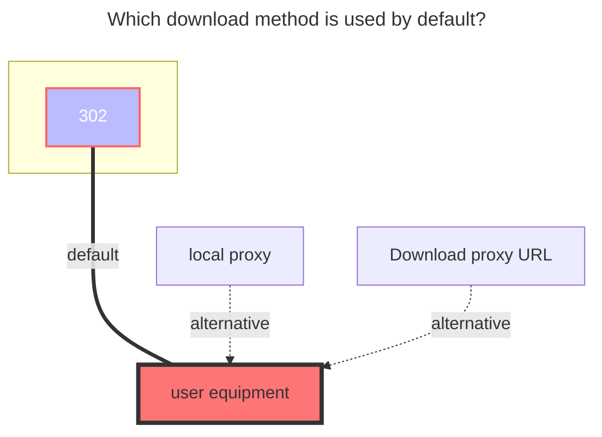
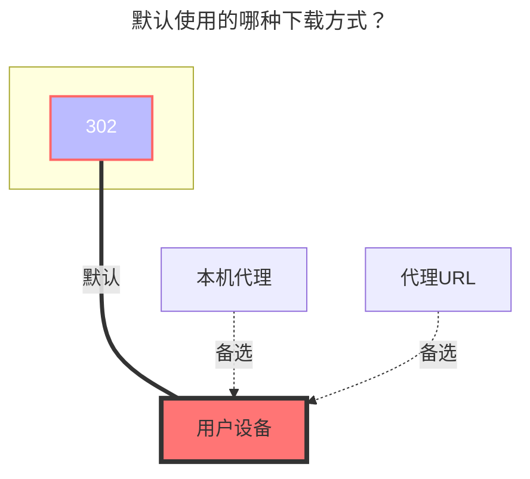

---
title:
  en: FebBox
  zh-CN: FebBox
icon: iconfont icon-state
# This control sidebar order
top: 140
# A page can have multiple categories
categories:
  - guide
  - drivers
# A page can have multiple tags
tag:
  - Storage
  - Guide
  - '302'
# this page is sticky in article list
sticky: true
# this page will appear in starred articles
star: true
---

::: en
FebBox：https://www.febbox.com

- The upload function is currently unavailable.

:::
::: zh-CN
FebBox：https://www.febbox.com

- 需要代理，直连似乎无法访问？
- 目前上传功能不可用

:::

## Root folder ID { lang="en" }

## 根文件夹ID { lang="zh-CN" }

::: en
Root directory ID, default is `0`.

Other directory IDs can be viewed in the top link address bar after entering the folder.

- **https://www.febbox.com/console#/files?parent_id=66889900**

  Then the directory ID is `66889900`

:::
::: zh-CN
根目录ID，默认为`0`。

其它目录 ID 查看进入文件夹后看顶部链接地址栏。

- **https://www.febbox.com/console#/files?parent_id=66889900**

  那这个目录 ID 就是 `66889900`

:::

## `Client_id`、`Client_secret` { lang="en" }

## 客户端 ID 和 秘钥 { lang="zh-CN" }

::: en
Generate address：**https://www.febbox.com/open/clients**

- The generated client ID and secret key are filled in in the opposite order to the OpenList, so be careful not to fill them in incorrectly.

  

:::
::: zh-CN
生成地址：**https://www.febbox.com/open/clients**

- 生成的客户端 ID 和秘钥和 OpenList 填写的顺序是相反的，注意别填错

  

:::

## User IP { lang="en" }

## 用户 IP { lang="zh-CN" }

::: en
**Optional**, the IP address of the user when downloading, quoting the official description

> IP address, Optional parameter. Supports IPv6 format. After filling in, the best download server suitable for the IP location will be selected. If not filled in, the requested IP will be used.

:::

::: zh-CN
**可选** ，用户下载时的 IP，引用官方说明

> IP 地址，可选参数。支持 IPv6 格式。填写后，将选择适合 IP 位置的最佳下载服务器。如果未填写，将使用请求的 IP。

:::

## The default download method used { lang="en" }

## 默认使用的下载方式 { lang="zh-CN" }

::: en

:::
::: zh-CN

:::
