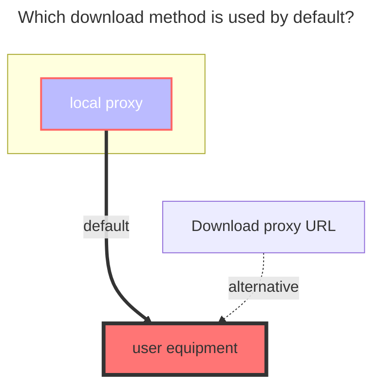
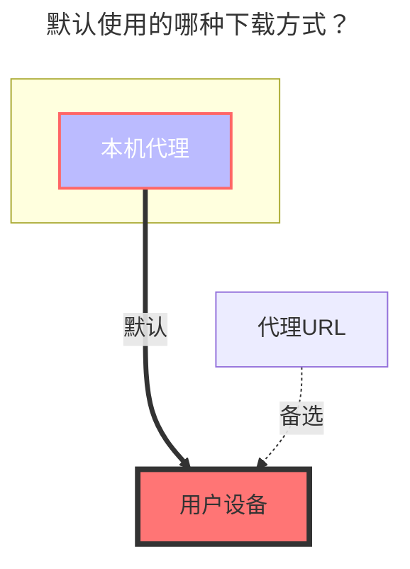

---
title:
  en: FTP
  zh-CN: FTP
icon: iconfont icon-state
# This control sidebar order
top: 180
# A page can have multiple categories
categories:
  - guide
  - drivers
# A page can have multiple tags
tag:
  - Storage
  - Guide
  - '本地代理'
# this page is sticky in article list
sticky: true
# this page will appear in starred articles
star: true
---

### **Address** { lang="en" }

## **地址** { lang="zh-CN" }

::: en
FTP address, need contains port.
:::
::: zh-CN
FTP 地址，需要包含端口。
:::

### **Username** { lang="en" }

## **用户名** { lang="zh-CN" }

::: en
FTP username
:::
::: zh-CN
FTP 用户名
:::

### **Password** { lang="en" }

## **密码** { lang="zh-CN" }

::: en
FTP password
:::
::: zh-CN
FTP 密码
:::

### **Root folder path** { lang="en" }

## **根文件夹ID** { lang="zh-CN" }

::: en
root folder , default `/`, same as local storage.
:::
::: zh-CN
根文件夹，默认 `/`，同本地存储。
:::

### **The default download method used** { lang="en" }

### **默认使用的下载方式** { lang="zh-CN" }

::: en

:::
::: zh-CN

:::
