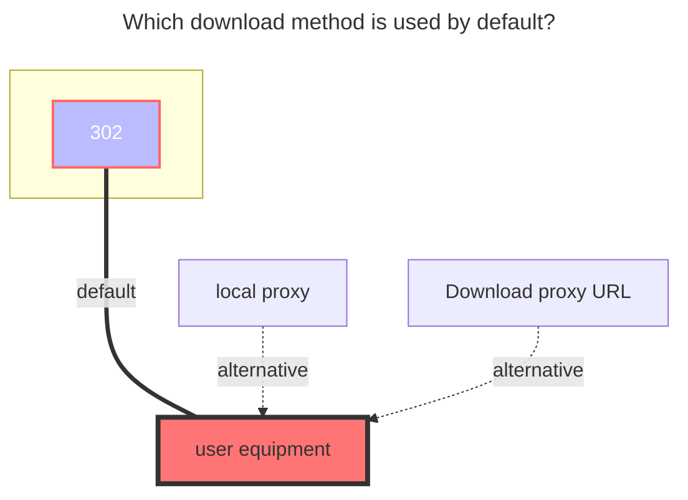
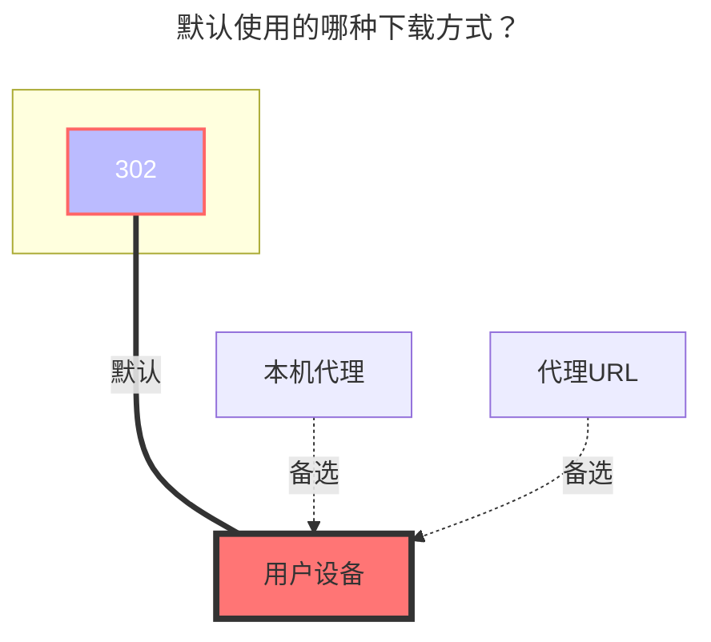

---
title:
  en: GitHub API
  zh-CN: GitHub API
icon: iconfont icon-state
# This control sidebar order
top: 30
# A page can have multiple categories
categories:
  - guide
  - drivers
# A page can have multiple tags
tag:
  - Storage
  - Guide
  - '302'
  - '官方'
# this page is sticky in article list
sticky: true
# this page will appear in starred articles
star: true
---

::: en
::: tip
GitHub API does not support operating files larger than 100MiB and folders containing more than 100,000 sub-items.

All `.gitkeep` files will be managed by the driver and will be invisible to the user.

Operations on submodules are currently not supported.
:::

::: zh-CN
::: tip
GitHub API 不支持操作 100M 或更大的文件，不支持操作含有超过 100,000 个子文件（夹）的文件夹。

本驱动会忽略仓库内的所有`.gitkeep`文件。

本驱动暂不支持操作子模块。
:::

## Token { lang="en" }

## Token { lang="zh-CN" }

::: en

1. Log in GitHub and visit <https://github.com/settings/tokens>.

2. Select `Generate new token (Classic)`

   

3. Fill the information. At least, select **repo**. And click `Generate token`.

   

4. Copy the token and paste it into the `Token` field.

   

:::
::: zh-CN

1. 登录 GitHub，访问：<https://github.com/settings/tokens>

2. 选择 `Generate new token (Classic)`

   

3. 填写信息，至少授予 `repo` 权限，然后点击 `Generate token`

   

4. 复制生成的 token，并填写到 `Token` 字段中

   

:::

## Owner { lang="en" }

## 所有者 { lang="zh-CN" }

::: en
The owner of the repository. For example, if the URL of the repository is `github.com/AAA/BBB`, fill in `AAA` here.
:::
::: zh-CN
仓库的所有者，比如仓库链接是`github.com/AAA/BBB`，这里就填`AAA`。
:::

## Repo { lang="en" }

## 仓库 { lang="zh-CN" }

::: en
The name of the repository. For example, if the URL of the repository is `github.com/AAA/BBB`, fill in `BBB` here.
:::
::: zh-CN
仓库名，比如仓库链接是`github.com/AAA/BBB`，这里就填`BBB`。
:::

## Ref { lang="en" }

## 引用 { lang="zh-CN" }

::: en
A branch, a tag or a commit SHA. Only when a branch name is filled in is the driver writable. It defaults to the default branch if not filled.
:::
::: zh-CN
分支名、tag或提交SHA，只有在填写分支名的情况下驱动才可写，不填会使用默认分支。
:::

## Gh Proxy { lang="en" }

## Gh Proxy { lang="zh-CN" }

::: en
Used to speed up downloading

- Download the content of `Raw` and `archive` and change it to `https://gh-proxy.com/raw.githubusercontent.com`

:::
::: zh-CN
用于加速下载

- 下载 `Raw`、`archive` 的内容要改成 `https://gh-proxy.com/raw.githubusercontent.com`

:::

```
https://gh-proxy.com/raw.githubusercontent.com
```

```
https://ghfast.top/raw.githubusercontent.com
```

```
https://ghproxy.net/raw.githubusercontent.com
```

## GPG private key { lang="en" }

## GPG 私钥 { lang="zh-CN" }

::: en
GPG private key, used to provide commit verifications. Verified commits will be marked with a green "Verified" label on the GitHub webpage. Use the following command to obtain it. Leave blank if verifications are not needed.

```bash
gpg --export-secret-key -a <Key Pair ID>
```

:::
::: zh-CN
GPG 私钥，用于提供提交验证功能，经验证的提交会在 GitHub 网页上被标记为绿色的“Verified”，使用以下命令获取，不需要验证功能可以留空。

```bash
gpg --export-secret-key -a <密钥对ID>
```

:::

## GPG key passphrase { lang="en" }

## GPG 私钥密码 { lang="zh-CN" }

::: en
Passphrase to the GPG private key. Leave blank if there is none.
:::
::: zh-CN
GPG 私钥的密码，没有则留空。
:::

## Committer name { lang="en" }

## 提交者名称 { lang="zh-CN" }

::: en
Custom committer name, defaulting to the owner's of the token when not filled.
:::
::: zh-CN
自定义提交者名称，不填会使用 Token 的所有者。
:::

## Committer email { lang="en" }

## 提交者邮箱 { lang="zh-CN" }

::: en
Custom committer name, defaulting to the owner's of the token when not filled.
Required when "Committer name" is filled. Required to be empty when "Committer name" is empty.
:::
::: zh-CN
自定义提交者邮箱，不填会使用 Token 的所有者。
填写“提交者名称”时必填，未填写“提交者名称”时必不填。
:::

## Author name { lang="en" }

## 作者名称 { lang="zh-CN" }

::: en
Custom author name, defaulting to the owner's of the token when not filled.
:::
::: zh-CN
自定义作者名称，不填会使用 Token 的所有者。
:::

## Author email { lang="en" }

## 作者邮箱 { lang="zh-CN" }

::: en
Custom author name, defaulting to the owner's of the token when not filled.
Required when "Author name" is filled. Required to be empty when "Author name" is empty.
:::
::: zh-CN
自定义作者邮箱，不填会使用 Token 的所有者。
填写“作者名称”时必填，未填写“作者名称”时必不填。
:::

## commit message { lang="en" }

## 提交信息 { lang="zh-CN" }

::: en
Custom commit message, supporting the following template variables：

- `UserName`: the user operating the file.
- `ObjName`: the name of the file (or the folder) operated.
- `ObjPath`: the path to the file (or the folder) operated.
- `ParentName`: the name of the parent folder of the file (or the folder) operated.
- `ParentPath`: the path to the parent folder of the file (or the folder) operated.
- `TargetName`: (when renaming) new name. (when copying and moving) the target folder name.
- `TargetPath`: (when renaming) new path. (when copying and moving) the target path.

:::

::: zh-CN
自定义提交信息，支持以下模板变量：

- `UserName`: 发起操作的用户
- `ObjName`: 被操作文件（夹）的名称
- `ObjPath`: 被操作文件（夹）的路径
- `ParentName`: 被操作文件（夹）的父文件夹名称
- `ParentPath`: 被操作文件（夹）的父文件夹路径
- `TargetName`: （重命名时）新名称（复制、移动时）目标文件夹名称。
- `TargetPath`: （重命名时）新路径（复制、移动时）目标路径

:::

### The default download method used { lang="en" }

### 默认使用的下载方式 { lang="zh-CN" }

::: en



:::
::: zh-CN



:::
