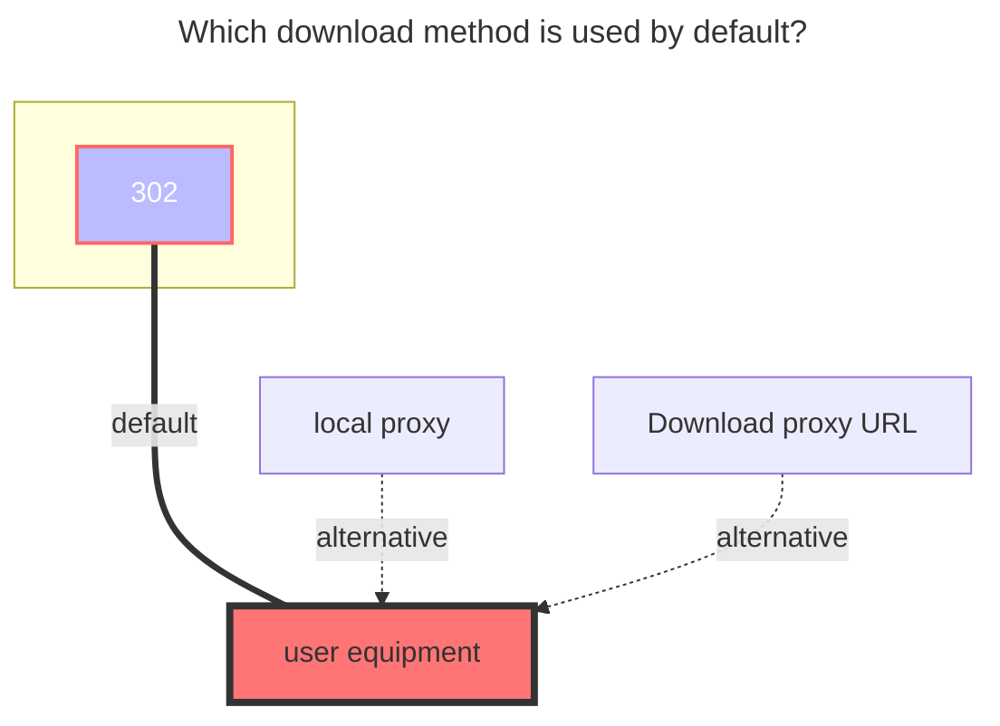
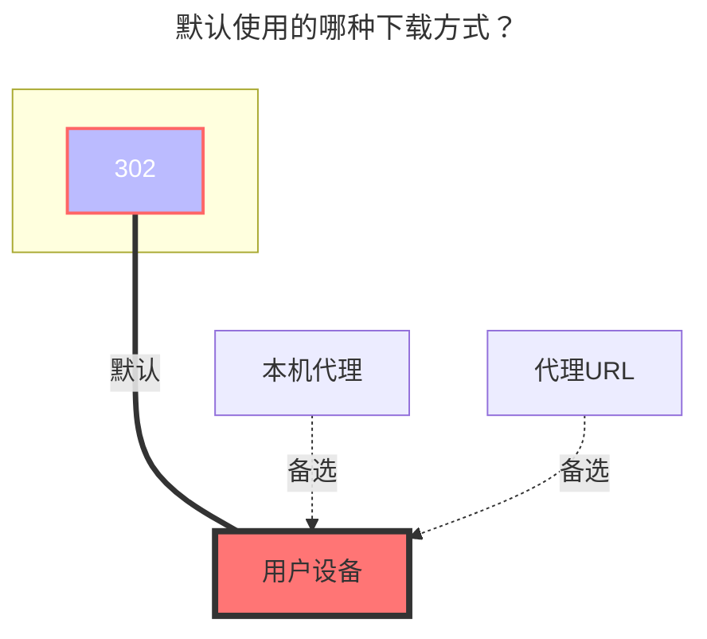

---
title:
  en: GitHub Releases
  zh-CN: GitHub Releases
icon: iconfont icon-state
# This control sidebar order
top: 20
# A page can have multiple categories
categories:
  - guide
  - drivers
# A page can have multiple tags
tag:
  - Storage
  - Guide
  - '302'
  - '官方'
# this page is sticky in article list
sticky: true
# this page will appear in starred articles
star: true
---

::: en
::: tip
GitHub API rate limits: The primary rate limit for unauthenticated requests is 60 requests per hour. Making API requests using a personal access token counts toward your personal rate limit of 5,000 requests per hour.
:::

::: zh-CN
::: tip
GitHub API 速率限制：未经身份验证的请求的主要速率限制为每小时 60 个请求。使用个人访问令牌发出 API 请求计入您每小时 5000 个请求的个人速率限制。
:::

## Repo Structure { lang="en" }

## 仓库结构 { lang="zh-CN" }

tabs#UrlTree
@tab 1
The simplest usage is to directly write `owner/repository`, only one can be filled in.
:::
tabs#UrlTree
@tab 1
最简单的用法，直接写 `所有者/仓库`，只能填一个
:::

##### Input { lang="en" }

##### 输入 { lang="zh-CN" }

::: en

```
OpenListTeam/OpenList
```

The effect is the same as the following:

```
/:openlistteam/openlist
```

@tab 2
Mount to a subdirectory, you can mount multiple repositories
:::
::: zh-CN

```
OpenListTeam/OpenList
```

与下面的写法效果一致：

```
/:OpenListTeam/OpenList
```

@tab 2
挂载到子目录，可以挂多个仓库
:::

##### Input { lang="en" }

##### 输入 { lang="zh-CN" }

::: en

```
/openlist-gh:OpenListTeam/OpenList
/openlist-frontend-gh:OpenListTeam/OpenList-Frontend
```

The leading `/` can be omitted:

```
openlist-gh:OpenListTeam/OpenList
openlist-frontend-gh:openListteam/openlist-frontend
```

:::
::: en
<br/>
:::
::: zh-CN

```
openlist-gh:OpenListTeam/OpenList
openlist-frontend-gh:openListteam/openlist-frontend
```

最前面的 `/` 可以省略：

```
openlist-gh:OpenListTeam/OpenList
openlist-frontend-gh:openListteam/openlist-frontend
```

:::
::: zh-CN
<br/>
:::

## Show README file { lang="en" }

## 显示 README、LICENSE 文件 { lang="zh-CN" }

::: en
Off switch：

```
openlist/
├── openlist-linux-amd64.tar.gz
└── openlist-windows-amd64.zip
```

On switch：

```
openlist/
├── v3.41.0/
│   ├── openlist-linux-amd64.tar.gz
│   └── openlist-windows-amd64.zip
├── v3.40.0/
│   ├── openlist-linux-amd64.tar.gz
│   └── openlist-windows-amd64.zip
├── LICENSE
├── README.md
└── README_cn.md
```

If enabled, the total size and modification time of the folder will not be displayed.
<br/>
:::
::: zh-CN
开启前：

```
openlist/
├── openlist-linux-amd64.tar.gz
└── openlist-windows-amd64.zip
```

开启后：

```
openlist/
├── v3.41.0/
│   ├── openlist-linux-amd64.tar.gz
│   └── openlist-windows-amd64.zip
├── v3.40.0/
│   ├── openlist-linux-amd64.tar.gz
│   └── openlist-windows-amd64.zip
├── LICENSE
├── README.md
└── README_cn.md
```

开启后，不显示文件夹总大小和修改时间。
<br/>
:::

## Token { lang="en" }

## 令牌 { lang="zh-CN" }

::: en
Required when accessing private repositories, and can also reduce the impact of rate limits.
Log in GitHub and visit: <https://github.com/settings/tokens>
<br/>
:::
::: zh-CN
访问私有仓库时需要，也可减少速率访问限制的影响。访问：<https://github.com/settings/tokens>
<br/>
:::

## Show all version { lang="en" }

## 显示所有版本 { lang="zh-CN" }

::: en
Off switch:

```
openlist/
├── openlist-linux-amd64.tar.gz
└── openlist-windows-amd64.zip
```

On switch：

```
openlist/
├── v3.41.0/
│   ├── openlist-linux-amd64.tar.gz
│   └── openlist-windows-amd64.zip
├── v3.40.0/
│   ├── openlist-linux-amd64.tar.gz
│   └── openlist-windows-amd64.zip
└── v3.39.4/
    ├── openlist-linux-amd64.tar.gz
    └── openlist-windows-amd64.zip
```

<br/>
:::
::: zh-CN
开启前：
```
openlist/
├── openlist-linux-amd64.tar.gz
└── openlist-windows-amd64.zip
```
开启后：
```
openlist/
├── v3.41.0/
│   ├── openlist-linux-amd64.tar.gz
│   └── openlist-windows-amd64.zip
├── v3.40.0/
│   ├── openlist-linux-amd64.tar.gz
│   └── openlist-windows-amd64.zip
└── v3.39.4/
    ├── openlist-linux-amd64.tar.gz
    └── openlist-windows-amd64.zip
```
<br/>
:::

## **Gh Proxy** { lang="en" }

## **Gh Proxy** { lang="zh-CN" }

::: en
Used to speed up downloading

- Download the content of `Releases` and change it to **https://xxxx.com/https://github.com**

```bash title="Copy"
https://gh-proxy.com/github.com
```

```bash title="Copy"
https://ghfast.top/github.com
```

```bash title="Copy"
https://ghproxy.net/github.com
```

<br/>
:::
::: zh-CN
用于加速下载
- 下载 `Releases` 的内容要改成 **https://xxxx.com/https://github.com**
```bash title="一键复制"
https://gh-proxy.com/github.com
```
```bash title="一键复制"
https://ghfast.top/github.com
```
```bash title="一键复制"
https://ghproxy.net/github.com
```
<br/>
:::

### **The default download method used** { lang="en" }

### **默认使用的下载方式** { lang="zh-CN" }

::: en



:::
::: zh-CN



:::
