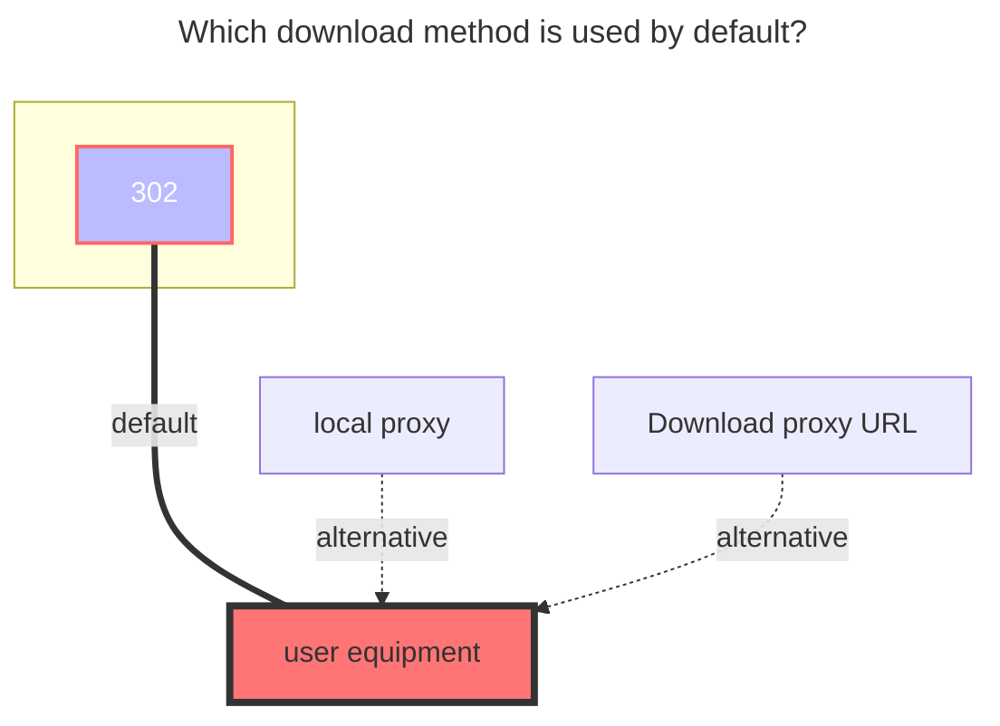
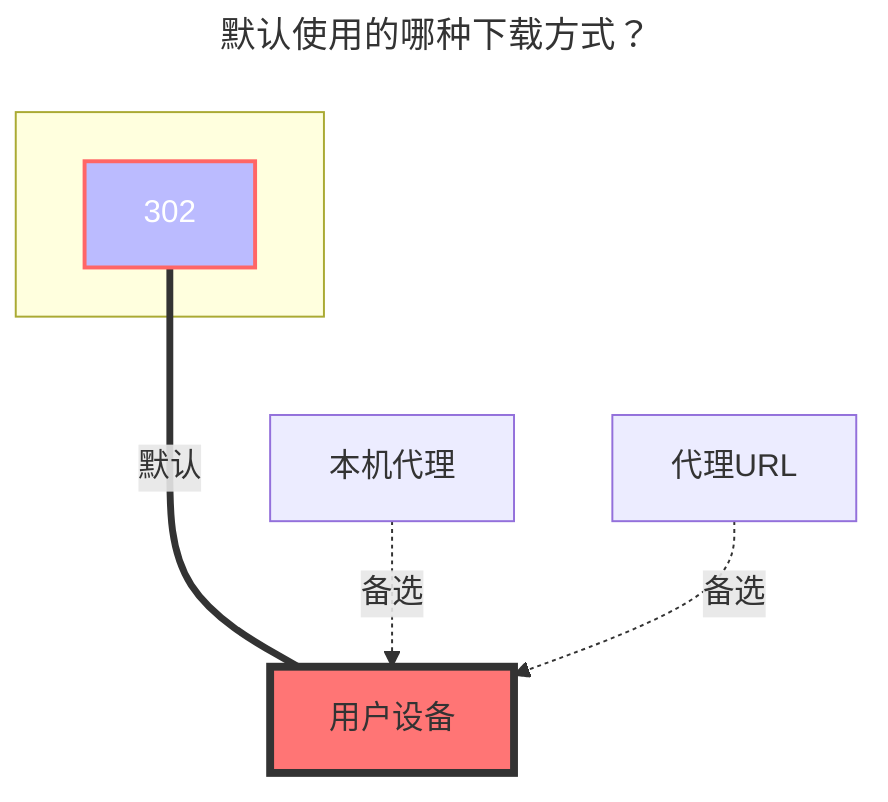

---
title:
  en: GitHub Releases
  zh-CN: GitHub 发行版
icon: iconfont icon-state
top: 20
categories:
  - guide
  - drivers
tag:
  - Storage
  - Guide
  - '302'
  - '官方'
sticky: true
star: true
---

## Overview { lang="en" }

## 概述 { lang="zh-CN" }

::: en
GitHub Releases driver allows you to mount GitHub repository releases as a file system, enabling direct access to release assets through a familiar directory structure.
:::

::: zh-CN
GitHub Releases 驱动允许您将 GitHub 仓库的发布版本挂载为文件系统，通过熟悉的目录结构直接访问发布资源。
:::

## API Rate Limits { lang="en" }

## API 速率限制 { lang="zh-CN" }

::: en
::: warning Rate Limits

- **Unauthenticated requests**: 60 requests per hour
- **Authenticated requests** (with token): 5,000 requests per hour

We recommend using a personal access token to avoid hitting rate limits.
:::

::: zh-CN
::: warning 速率限制

- **未认证请求**：每小时 60 次请求
- **已认证请求**（使用令牌）：每小时 5,000 次请求

建议使用个人访问令牌以避免触及速率限制。
:::

## Repository Configuration { lang="en" }

## 仓库配置 { lang="zh-CN" }

### Basic Usage { lang="en" }

### 基本用法 { lang="zh-CN" }

::: en
**Single Repository Mount**

Mount a single repository to the root directory:

```text
OpenListTeam/OpenList
```

This is equivalent to:

```text
/:OpenListTeam/OpenList
```

:::

::: zh-CN
**单个仓库挂载**

将单个仓库挂载到根目录：

```text
OpenListTeam/OpenList
```

等价于：

```text
/:OpenListTeam/OpenList
```

:::

### Multiple Repositories { lang="en" }

### 多个仓库 { lang="zh-CN" }

::: en
**Mount to Subdirectories**

You can mount multiple repositories to different subdirectories:

```text
/openlist-gh:OpenListTeam/OpenList
/openlist-frontend-gh:OpenListTeam/OpenList-Frontend
```

The leading `/` is optional:

```text
openlist-gh:OpenListTeam/OpenList
openlist-frontend-gh:OpenListTeam/OpenList-Frontend
```

:::

::: zh-CN
**挂载到子目录**

您可以将多个仓库挂载到不同的子目录：

```text
/openlist-gh:OpenListTeam/OpenList
/openlist-frontend-gh:OpenListTeam/OpenList-Frontend
```

前导的 `/` 可以省略：

```text
openlist-gh:OpenListTeam/OpenList
openlist-frontend-gh:OpenListTeam/OpenList-Frontend
```

:::

## Configuration Options { lang="en" }

## 配置选项 { lang="zh-CN" }

### Personal Access Token { lang="en" }

### 个人访问令牌 { lang="zh-CN" }

::: en
**When to use:**

- Required for accessing private repositories
- Recommended to avoid rate limiting issues

**How to get:**

1. Log in to GitHub
2. Visit: https://github.com/settings/tokens
3. Generate a new token with appropriate permissions
   :::

::: zh-CN
**使用场景：**

- 访问私有仓库时必需
- 建议使用以避免速率限制问题

**获取方法：**

1. 登录 GitHub
2. 访问：https://github.com/settings/tokens
3. 生成具有适当权限的新令牌
   :::

### Show All Versions { lang="en" }

### 显示所有版本 { lang="zh-CN" }

::: en
**Disabled (default):**

```
openlist/
├── openlist-linux-amd64.tar.gz
└── openlist-windows-amd64.zip
```

**Enabled:**

```
openlist/
├── v3.41.0/
│   ├── openlist-linux-amd64.tar.gz
│   └── openlist-windows-amd64.zip
├── v3.40.0/
│   ├── openlist-linux-amd64.tar.gz
│   └── openlist-windows-amd64.zip
└── v3.39.4/
    ├── openlist-linux-amd64.tar.gz
    └── openlist-windows-amd64.zip
```

When enabled, all available release versions are displayed in separate directories.
:::

::: zh-CN
**禁用（默认）：**

```
openlist/
├── openlist-linux-amd64.tar.gz
└── openlist-windows-amd64.zip
```

**启用：**

```
openlist/
├── v3.41.0/
│   ├── openlist-linux-amd64.tar.gz
│   └── openlist-windows-amd64.zip
├── v3.40.0/
│   ├── openlist-linux-amd64.tar.gz
│   └── openlist-windows-amd64.zip
└── v3.39.4/
    ├── openlist-linux-amd64.tar.gz
    └── openlist-windows-amd64.zip
```

启用后，所有可用的发布版本都会显示在单独的目录中。
:::

### Show README Files { lang="en" }

### 显示 README 文件 { lang="zh-CN" }

::: en
**Disabled (default):**

```
openlist/
├── openlist-linux-amd64.tar.gz
└── openlist-windows-amd64.zip
```

**Enabled:**

```
openlist/
├── v3.41.0/
│   ├── openlist-linux-amd64.tar.gz
│   └── openlist-windows-amd64.zip
├── v3.40.0/
│   ├── openlist-linux-amd64.tar.gz
│   └── openlist-windows-amd64.zip
├── LICENSE
├── README.md
└── README_cn.md
```

::: tip
When enabled, README and LICENSE files from the repository are displayed alongside releases. However, folder size and modification time information will not be shown.
:::

::: zh-CN
**禁用（默认）：**

```
openlist/
├── openlist-linux-amd64.tar.gz
└── openlist-windows-amd64.zip
```

**启用：**

```
openlist/
├── v3.41.0/
│   ├── openlist-linux-amd64.tar.gz
│   └── openlist-windows-amd64.zip
├── v3.40.0/
│   ├── openlist-linux-amd64.tar.gz
│   └── openlist-windows-amd64.zip
├── LICENSE
├── README.md
└── README_cn.md
```

::: tip
启用后，仓库的 README 和 LICENSE 文件会与发布版本一起显示。但是，不会显示文件夹大小和修改时间信息。
:::

## GitHub Proxy Settings { lang="en" }

## GitHub 代理设置 { lang="zh-CN" }

::: en
Use GitHub proxy services to accelerate downloads in regions with limited GitHub access.

**Configuration:**
Replace the GitHub domain with a proxy service URL:

```text
https://gh-proxy.com/github.com
```

**Available Proxy Services:**

| Service  | URL                               |
| -------- | --------------------------------- |
| GH-Proxy | `https://gh-proxy.com/github.com` |
| GHFast   | `https://ghfast.top/github.com`   |
| GHProxy  | `https://ghproxy.net/github.com`  |

::: warning
Proxy services are third-party and may have varying availability and performance.
:::

::: zh-CN
使用 GitHub 代理服务来加速在 GitHub 访问受限地区的下载。

**配置方法：**
将 GitHub 域名替换为代理服务 URL：

```text
https://gh-proxy.com/github.com
```

**可用代理服务：**

| 服务     | URL                               |
| -------- | --------------------------------- |
| GH-Proxy | `https://gh-proxy.com/github.com` |
| GHFast   | `https://ghfast.top/github.com`   |
| GHProxy  | `https://ghproxy.net/github.com`  |

::: warning
代理服务为第三方提供，可用性和性能可能存在差异。
:::

## The default download method used { lang="en" }

## 默认使用的下载方式 { lang="zh-CN" }

::: en



:::
::: zh-CN



:::
