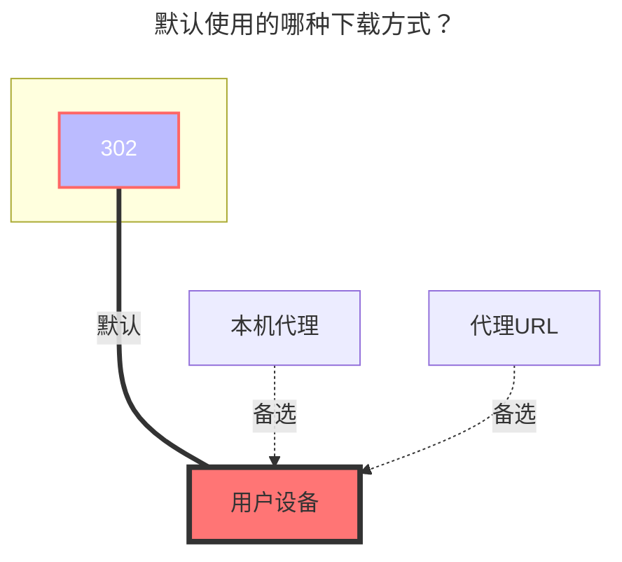

:::tip
GitHub API 速率限制：未经身份验证的请求的主要速率限制为每小时 60 个请求。使用个人访问令牌发出 API 请求计入您每小时 5000 个请求的个人速率限制。
:::

## 仓库结构

:::tabs#UrlTree
@tab 1

最简单的用法，直接写 `所有者/仓库`，只能填一个

##### 输入

```
OpenListTeam/OpenList
```

与下面的写法效果一致：

```
/:OpenListTeam/OpenList
```

@tab 2

挂载到子目录，可以挂多个仓库

##### 输入

```
openlist-gh:OpenListTeam/OpenList
openlist-frontend-gh:openListteam/openlist-frontend
```

最前面的 `/` 可以省略：

```
openlist-gh:OpenListTeam/OpenList
openlist-frontend-gh:openListteam/openlist-frontend
```

:::

<br/>

## 显示 README、LICENSE 文件

开启前：

```
openlist/
├── openlist-linux-amd64.tar.gz
└── openlist-windows-amd64.zip
```

开启后：

```
openlist/
├── v3.41.0/
│   ├── openlist-linux-amd64.tar.gz
│   └── openlist-windows-amd64.zip
├── v3.40.0/
│   ├── openlist-linux-amd64.tar.gz
│   └── openlist-windows-amd64.zip
├── LICENSE
├── README.md
└── README_cn.md
```

开启后，不显示文件夹总大小和修改时间。

<br/>

## 令牌

访问私有仓库时需要，也可减少速率访问限制的影响。访问：<https://github.com/settings/tokens>

<br/>

## 显示所有版本

开启前：

```
openlist/
├── openlist-linux-amd64.tar.gz
└── openlist-windows-amd64.zip
```

开启后：

```
openlist/
├── v3.41.0/
│   ├── openlist-linux-amd64.tar.gz
│   └── openlist-windows-amd64.zip
├── v3.40.0/
│   ├── openlist-linux-amd64.tar.gz
│   └── openlist-windows-amd64.zip
└── v3.39.4/
    ├── openlist-linux-amd64.tar.gz
    └── openlist-windows-amd64.zip
```

<br/>

## **Gh Proxy**

用于加速下载

- 下载 `Releases` 的内容要改成 **https://xxxx.com/https://github.com**

```bash title="一键复制"
https://gh-proxy.com/github.com
```

```bash title="一键复制"
https://ghfast.top/github.com
```

```bash title="一键复制"
https://ghproxy.net/github.com
```

<br/>

### **默认使用的下载方式**


