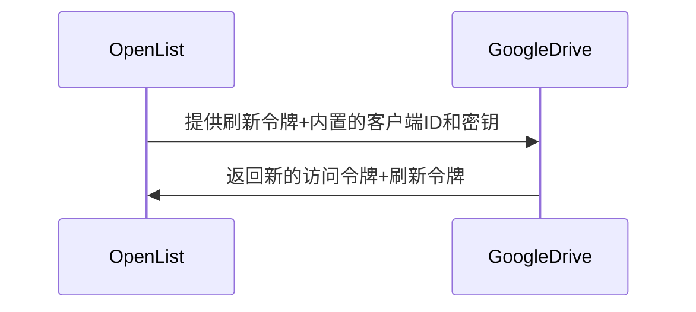
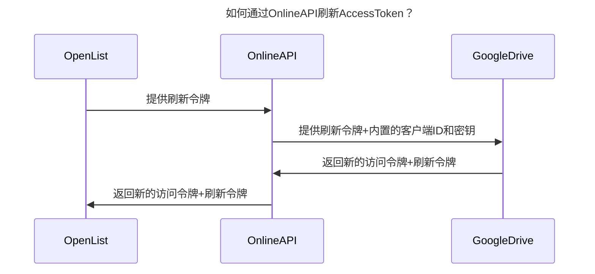
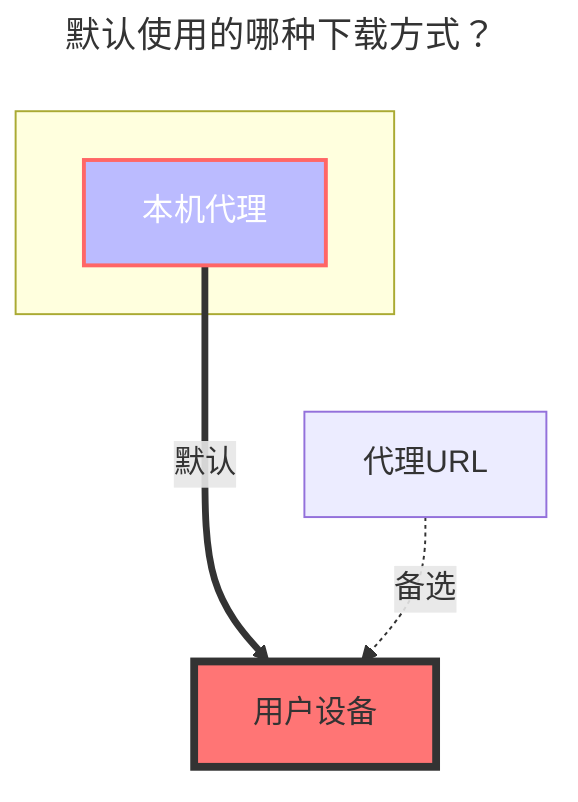

支持团队盘（根目录ID填写团队盘的目录ID）

## 1.必要条件

::: zh-CN
::: warning 注意事项

1. 搭建OpenList服务的机器首先要能连接到Google网盘才可以喔~
2. 必须启动谷歌云盘API服务，启用方式见[启用 Google Drive API 的 API](#_2-1-启用-google-drive-api-的-api)
   > 参考 [Google Workspace>Google Drive>指南](https://developers.google.com/workspace/drive/api/quickstart/js): https://developers.google.com/workspace/drive/api/quickstart/js
   > :::
   > :::

## 2.准备接入

### 2.1.启用 Google Drive API 的 API

1. 在[指南页面](https://developers.google.com/workspace/drive/api/quickstart/js)中找到`启用API`按钮，点击进入快捷开启界面，点击下一步以及确认后，即可完成开启。
2. 也可以访问[谷歌云盘API功能管理界面](https://console.cloud.google.com/apis/library/drive.googleapis.com)，在上方找到`启用`按钮，点击后等待启用完成。
3. `配额和系统限制管理`（可选）:切换到`配额和系统限制`选项卡，根据你的使用情况和需求，设置合适的配额和限制。

### 2.2.创建 OAuth 客户端（可选，如果使用OpenList/公益服务器/自建服务器，则不用创建）

1. 在[凭据界面](https://console.cloud.google.com/apis/credentials?hl=zh-cn)中，点击`创建凭据`下拉菜单，选择和点击`OAuth 客户端 ID`

2. 在弹出的窗口中，选择`Web 应用`，填写应用名称
3. 在`授权的重定向 URI`中，填写 `https://api.oplist.org/googleui/callback`，如果是自建或者公益服务，请填写对应的域名，如 `https://your-domain.com/googleui/callback`。
4. 点击`创建`按钮，完成 OAuth 客户端的创建。注：请复制和保存`客户端 ID`和`客户端密钥`，后续需要使用。

5. 将自己添加到测试用户中，在左侧找到`目标对象`菜单，点击进入后，找到`测试用户`下方的`+ Add User`按钮，点击后输入你的 Google 账号邮箱地址，点击添加即可。

6. 测试完毕后可以发布应用，在左侧找到`目标对象`菜单，点击进入后，找到`发布状态`下方的`发布应用`按钮，点击后确认发布即可完成应用发布。

### 2.3.获取`访问密钥`和`刷新密钥`

1. 打开[OpenList Google 授权页面](https://api.oplist.org/) **⚠️如果使用公益服务器/自建服务器，请访问公益服务器/自建服务器**
2. 在页面中下拉框中选择`GoogleDrive Login`

3. 如果在上面的步骤中创建了 OAuth 客户端 ID，请在下方输入框中填写刚才创建的`客户端 ID`和`客户端密钥`

否则勾选☑️使用 OpenList 提供的API。**⚠️如果使用的公益服务器/自建服务器，此时使用的是公益服务器/自建服务器内置的客户端ID和应用机密**

4. 点击`获取授权`按钮，系统会跳转到 Google 授权页面，登录你的 Google 账号，并授权 OpenList 访问你的 Google Drive。

5. 如果出现`此应用未经 Google 验证`的提示，请点击`高级`，然后点击`转至oplist.org（不安全）`继续。（如果是公益服务器/自建服务器，则此处域名以实际公益服务的域名为准，请仔细甄别）。

6. 请注意授权页面上（下图红色框内）的权限信息，确保**只是**访问你的 **谷歌云端硬盘文件**，如果在公益服务中发现该权限不仅仅是访问**谷歌云端硬盘**，请在[openlistteam/docs/issues](https://github.com/openlistteam/docs/issues)提起issues。

6. 授权成功后，系统会返回一个`刷新密钥`和`访问密钥`，请复制并保存该令牌，后续的配置中会使用。

## 3.在alist中添加谷歌云盘

### 3.1.配置说明

#### 3.1.1.**根文件夹 ID**

与阿里云盘类似，官网 URL 的最后一个字符串，如：

### 3.2.开始添加

1. 打开 Alist 的管理界面，点击左侧菜单中的`存储`。
2. 在存储列表页面，点击右上角的`添加存储`按钮。
3. 选择驱动为`谷歌云盘（Google Drive）`。

4. 输入挂载路径，如：`google-drive`。
5. 在`根文件夹 ID`中填写上面获取的根文件夹 ID，如果使用根目录，请填写`root`。
6. 刷新令牌中填写上面获取的刷新令牌（如未获取，请参考[准备接入](#_2-准备接入)）。
7. 如果你使用的是 `OpenList （或者公益服务器/自建服务器）`提供的 OAuth 客户端 ID 和密钥，请按照`7.1`和`7.2`进行配置
   7.1. 在`Use online api`中勾选，表示使用 OpenList 提供的在线 API。
   7.2. Api url address填写为 `https://api.oplist.org/googleui/renewapi`，如果是`公益服务器/自建服务器`，请填写对应的服务器地址。

8. 如果你使用的是自己创建的 OAuth 客户端 ID 和密钥，请按照`8.1`和`8.2`进行配置
   8.1. 在`Use online api`中不勾选，表示使用自建的 OAuth 客户端 ID 和密钥。
   8.2. 在`客户端ID`中填写你的`Oauth 客户端 ID`，在`客户端密钥`中填写你的`Oauth 客户端密钥`

9. 点击`添加`按钮，完成谷歌云盘的添加。

## 4.关于`Use online api`选项的说明

### 4.1.自身有密钥的情况下，AccessToken刷新的方式

### 4.2.自身没有密钥的情况下，AccessToken刷新的方式

## 5.默认使用的哪种下载方式？

