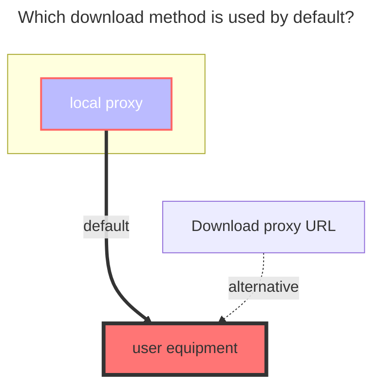
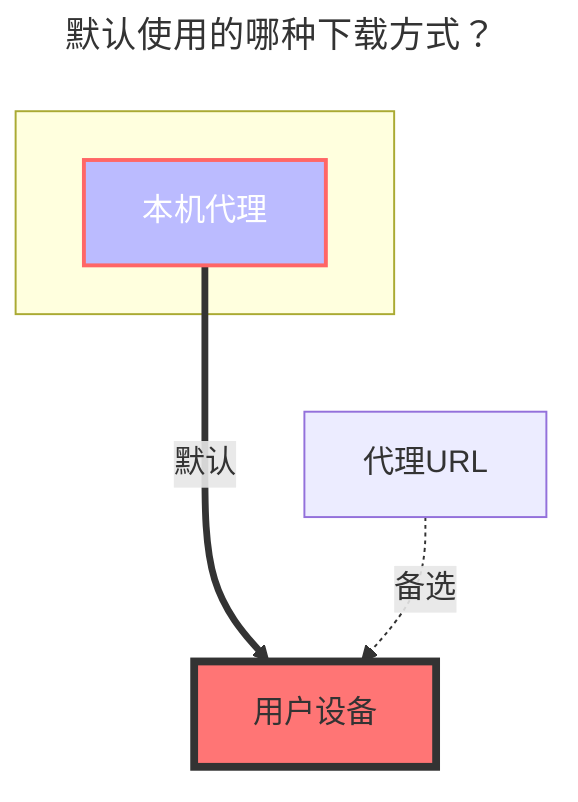

---
title:
  en: Google Photos
  zh-CN: 谷歌相册
icon: iconfont icon-state
# This control sidebar order
top: 320
# A page can have multiple categories
categories:
  - guide
  - drivers
---

::: zh-CN
::: tip
由于[谷歌相册官方于今年4月份对Library API做出的调整](https://developers.google.com/photos/support/updates?hl=zh-cn)，将谷歌相册成功挂载到openlist后，实际只能查看通过openlist上传的照片，而不能再像曾经一样查看用户通过谷歌相册官方app、网站上传的照片。
:::
::: en
::: tip
Due to the adjustments made by Google Photos to its Library API in April this year (https://developers.google.com/photos/support/updates?hl=en), after successfully mounting Google Photos to openlist, you can actually only view the photos uploaded through openlist. You can no longer view the photos uploaded by users via the official Google Photos app or website as you could before.
:::

## 根文件夹 ID { lang="zh-CN" }

## Root folder file_id { lang="en" }

::: en
The root directory is root, and other directory IDs are unknown (~~It seems that a separate album cannot be mounted~~ It has not been resolved yet [**Reference**](https://github.com/alist-org/alist/discussions/3264#discussioncomment-4874536))
:::

::: zh-CN
根目录root，其他目录ID未知( ~~貌似不能挂载单独的相册~~ 已解决下面有介绍)
:::

## 获取 client_id, client_secret { lang="zh-CN" }

## Get client_id, client_secret { lang="en" }

::: en

Get the tool https://api.oplist.org

How to get your own `client_id (client ID) client_secret (client secret key)` Go to [**Google Drive**](./googledrive.md) which article
:::
::: en
::: tip

Tip This app has not been verified by Google

You have been authorized to use an app that is currently in beta. Do not proceed unless you know the developer who invited you.

Let's click **Continue** on the left

Remember to check this option, otherwise an error will be reported, as explained in the following precautions
:::
::: en

It is more convenient now. In fact, when obtaining Google cloud disk authorization, select the album permission at the same time, and the token obtained at that time can also be used to mount the album~ kill two birds with one stone

Remember to enable **`Photos Library API`**

- https://console.cloud.google.com/apis/library/photoslibrary.googleapis.com

:::
::: zh-CN
获取工具 https://api.oplist.org

如何获取自己的 `client_id(客户端ID)  client_secret(客户端秘钥)` 去看[**谷歌网盘**](./googledrive.md)哪一篇
:::
::: zh-CN
::: tip

提示 此应用未经 Google 验证

您获得了授权，可以使用一款目前处于测试阶段的应用。除非您了解向您发出邀请的开发者，否则请勿继续。

我们点击左侧的**继续**就行

此选项记得勾选不然会报错，下面的注意事项当中有说明

<!--  -->

:::

::: zh-CN

现在更加方便了，其实获取谷歌云盘的时候勾选了相册到时候获取到的token也可以拿来挂载相册~一举两得

记得打开 **`Photos Library API`** 哦~

- **https://console.cloud.google.com/apis/library/photoslibrary.googleapis.com?project=instant-shard-350513**

:::

## 挂载单个相册目录 { lang="zh-CN" }

## Mount a single album directory { lang="zh-CN" }

::: en

According to [above](https://api.oplist.org) obtained **client ID** and **secret key** and **refresh_token**

We fill in **https://api.oplist.org** to get a single catalog ID for each of our Google Photos

- Root file ID (that is, the album ID): default root, display all, if you only want to display a single album, you can fill in the album ID you want to display
- After we fill in, there will also be an **`access_token`** below. This can also be filled in the OpenList background refresh token option and used. The refresh token obtained at the beginning can be used for both of them- [Explanation](https://github.com/alist-org/alist/discussions/3264#discussioncomment-5051171)

:::

::: zh-CN

根据[上面](https://api.oplist.org)获取到的**客户端ID**和**秘钥**和**刷新令牌**

我们填写到 **https://api.oplist.org** 即可获取我们每个相册的单个目录ID

- 根文件ID（就是相册ID）：默认root，展示全部，若只想展示单个相册，可以填写你想展示的相册ID
- 在我们填写后下方也会出现一个 **`access_token`** 这个也可以填写到刷新令牌里面前使用和之前获取到的，这两个都可以用 - [解释](https://github.com/alist-org/alist/discussions/3264#discussioncomment-5051171)

:::

## 两个注意事项： { lang="zh-CN" }

## Two notes: { lang="en" }

::: en

1. failed get objs: failed to list objs: Request had insufficient authentication scopes.: []
   - It's because you didn't check the album permission (see the picture mentioned above) `view and organize the content in your Google Photos media library, and upload content to the media library when obtaining authorization. Learn more`
   - You get the `access_token` and the `refresh_token` without declearing the scope of `https://www.googleapis.com/auth/photoslibrary`
2. failed get objs: failed to list objs: Photos Library API has not been used in project ... before or it is disabled. Enable it by visiting <https://console.developers.google.com/apis/api/photoslibrary.googleapis.com/overview> then retry. If you enabled this API recently, wait a few minutes for the action to propagate to our systems and retry.: []
   - because **`Photos Library API`** is not enabled in your project, Google Photos API

:::
::: zh-CN

1. failed get objs: failed to list objs: Request had insufficient authentication scopes.: []
   - 是因为在获取授权的时候没有勾选 相册权限（查看上面提到的图片） `查看和整理您的Google相册媒体库中的内容,向媒体库上传内容。`
   - 获取 `access_token`、`refresh_token` 时未声明`https://www.googleapis.com/auth/photoslibrary`的范围。
2. failed get objs: failed to list objs: Photos Library API has not been used in project ... before or it is disabled. Enable it by visiting <https://console.developers.google.com/apis/api/photoslibrary.googleapis.com/overview> then retry. If you enabled this API recently, wait a few minutes for the action to propagate to our systems and retry.: []
   - 是因为对应的项目没有开启 **`Photos Library API`** 谷歌相册API

:::

### 默认使用的下载方式 { lang="zh-CN" }

### The default download method used { lang="en" }

::: en

:::
::: zh-CN

:::
