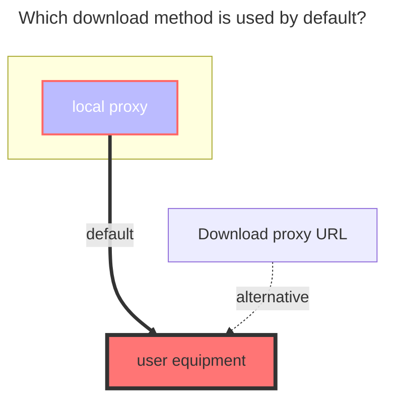
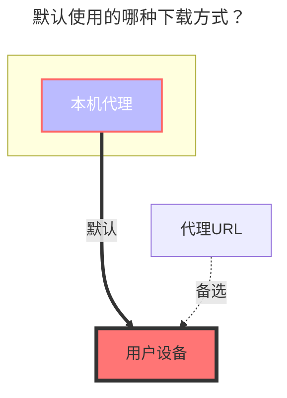

---
title:
  en: halalcloud
  zh-CN: 6盘
icon: iconfont icon-state
# This control sidebar order
top: 200
# A page can have multiple categories
categories:
  - guide
  - drivers
# A page can have multiple tags
tag:
  - Storage
  - Guide
  - '本地代理'
  - '官方'
# this page is sticky in article list
sticky: true
# this page will appear in starred articles
star: true
---

::: en

- `6盘（halalcloud）` Official website：[https://2dland.cn](https://2dland.cn/)
  - Cloud Login：https://drive.2dland.cn
- Official announcement, document address：https://2dland.yuque.com/r/organizations/homepage

::: tip
Since `6盘 (halalcloud)` uses the `IPFS` protocol for storage, the block size is limited to `1MB`, so **you can only use `local proxy` for downloading**, and the single-thread speed is slow. **When using it, please try to use multi-threaded download to increase the speed**
:::

::: zh-CN

- `6盘（halalcloud）` 官方网站：[https://2dland.cn](https://2dland.cn/)
  - 网盘登录：https://drive.2dland.cn
- 官方公告、文档地址：https://2dland.yuque.com/r/organizations/homepage

::: tip
由于`6盘（halalcloud）`采用的 `IPFS`协议存储，因此块大小被限制在`1MB`，于是**只能使用`本机代理`进行下载**，且单线程速度较慢，**使用时请尽量使用多线程下载，提升速度**
:::

## Root folder file_id { lang="en" }

## 根文件夹ID { lang="zh-CN" }

::: en
Top address bar path，Root folder file_id is：`/`
Subfolder: `/A folder/C folder/C folder`
:::
::: zh-CN
顶部地址栏路径，根文件夹是：`/`
子文件夹：`/A文件夹/C文件夹/C文件夹`
:::

## Fill in the example { lang="en" }

## 添写示例 { lang="zh-CN" }

::: en
When adding a 6盘 (halalcloud) driver for the first time, the `Refresh token` can be left blank. A red error notification will pop up in the upper right corner.

Return to the storage page and click the refresh button. The previously added driver `Click Here` area will become clickable. Click it to jump to the 6盘(halalcloud) official website to log in.

**The webpage will be closed automatically after leaving**. After logging in successfully, please copy the `RefreshToken` field parameter link in the top address bar in time.

- Or copy it to other locations and then obtain the `RefreshToken` field in the link

- After copying to other locations, it will automatically be UrlEncoded. Specifically, the `RefreshToken` field is a string starting with `"rt__` and ending with `"`^("is*encoded_to*%22)^

- You can refer to the following extraction example or borrow tools

  The blue field in the link is the `RefreshToken` we need

  Copy the link in the address bar`RefreshToken`:
  - Before decoding: https%3A%2F%2Fstatic.2dland.cn%2Fuser%2Flanding%2F%3Ftype%3Doauth2-response%26payload%3D%7B%22scope%22%3A%22openid%20profile%20email%20phone%22%2C%22refreshToken%22%3A%22rt\_\_2xxxx5_2xxxxxa-4xx7-4xxa-9xx3-exxxxxxxxxx4%22%2C%22state%22%3A%2210xxxx4d3-4cxa-4xx8-axxb-1xxxf3%22%2C%22callback%22%3A%22at_callback_d4dxxxxxxxxxxxxxxxxxxxxxxxxxef_ly8og7b8%22%7D

  - After decoding: https://static.2dland.cn/user/landing/?type=oauth2-response&payload={"scope":"openid profile email phone","refreshToken":"rt\_\_2xxxx5_2xxxxxa-4xx7-4xxa-9xx3-exxxxxxxxxx4","state":"10xxxx4d3-4cxa-4xx8-axxb-1xxxf3","callback":"at_callback_d4dxxxxxxxxxxxxxxxxxxxxxxxxxef_ly8og7b8"}

  If you really can't see it, you can use tools to decode it: <https://tool.chinaz.com/tools/urlencode.aspx>

  

:::
::: zh-CN
初次添加6盘 (halalcloud) 驱动，`Refresh token`可以留空，此时右上角会弹出红色错误通知。

返回存储页面，点击刷新按钮，之前添加的驱动 `Click Here`区域会变成可点击模式，点击后进行点击跳转到 6盘 (halalcloud) 官网进行登录。

登录成功，**离开后会自动关闭网页**，请及时复制顶部地址栏中的`RefreshToken`字段参数链接

- 或者复制到其它位置再进行获取链接中`RefreshToken`字段

- 复制到其它位置后会自动进行UrlEncode编码，具体以`RefreshToken`字段是 `"rt__`开头的，以`"`（"编码后是%22）结尾的字符串

  可以参考下面提取示例或者借用工具

  链接中蓝色字段是我们需要的`RefreshToken`

  地址栏复制链接获取<code class="text-blue-500 font-bold">RefreshToken</code>：
  - 解码前：https%3A%2F%2Fstatic.2dland.cn%2Fuser%2Flanding%2F%3Ftype%3Doauth2-response%26payload%3D%7B%22scope%22%3A%22openid%20profile%20email%20phone%22%2C%22refreshToken%22%3A%22rt\_\_2xxxx5_2xxxxxa-4xx7-4xxa-9xx3-exxxxxxxxxx4%22%2C%22state%22%3A%2210xxxx4d3-4cxa-4xx8-axxb-1xxxf3%22%2C%22callback%22%3A%22at_callback_d4dxxxxxxxxxxxxxxxxxxxxxxxxxef_ly8og7b8%22%7D

  - 解码后：https://static.2dland.cn/user/landing/?type=oauth2-response&payload={"scope":"openid profile email phone","refreshToken":"rt\_\_2xxxx5_2xxxxxa-4xx7-4xxa-9xx3-exxxxxxxxxx4","state":"10xxxx4d3-4cxa-4xx8-axxb-1xxxf3","callback":"at_callback_d4dxxxxxxxxxxxxxxxxxxxxxxxxxef_ly8og7b8"}

  如果实在看不出来可以借助工具进行解码：<https://tool.chinaz.com/tools/urlencode.aspx>

  

:::

## Other parameters { lang="en" }

## 其它参数 { lang="zh-CN" }

::: en

- `Upload thread`：upload thread (default is 3, range 1-32)
- `App id`：`Application ID` (default is filled, no need to fill in)
- `App version`：`Application version` (default is filled, no need to fill in)
- `App secret`：`Application key` (default is filled, no need to fill in)

:::
::: zh-CN

- `Upload thread`：上传线程（默认为 3，范围1-32）
- `App id`：`应用ID` （默认已给出，无需填写）
- `App version`：`应用版本`（默认已给出，无需填写）
- `App secret`：`应用密钥`（默认已给出，无需填写）

:::

### The default download method used { lang="en" }

### 默认使用的下载方式 { lang="zh-CN" }

::: en

:::
::: zh-CN

:::
