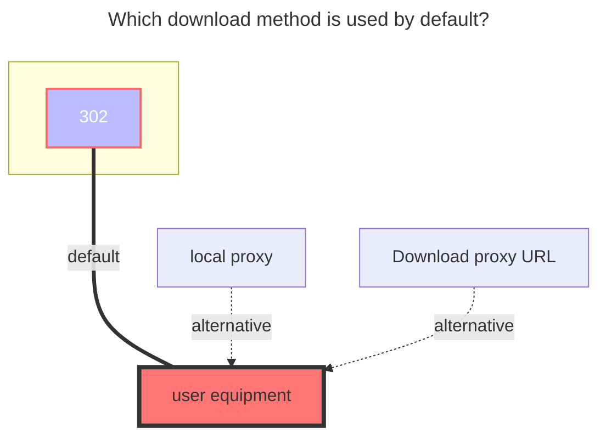
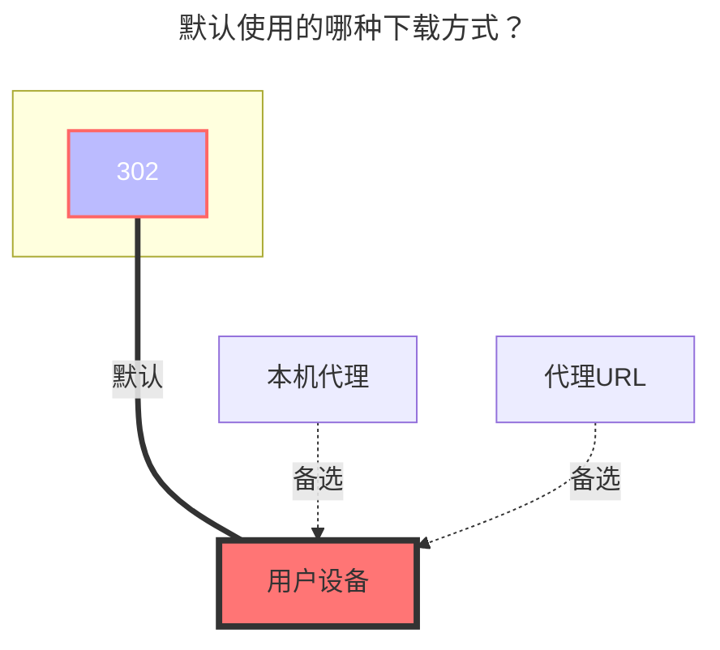

---
title:
  en: KodBox
  zh-CN: 可道云
icon: iconfont icon-state
# This control sidebar order
top: 130
# A page can have multiple categories
categories:
  - guide
  - drivers
# A page can have multiple tags
tag:
  - Storage
  - Guide
  - '302'
# this page is sticky in article list
sticky: true
# this page will appear in starred articles
star: true
---

::: en
Use this driver to mount a KodBox netdisk space to OpenList.
:::
::: zh-CN
使用本驱动可以挂载 KodBox 的网盘空间到 OpenList。
:::

## Root folder path { lang="en" }

## 根文件夹ID { lang="zh-CN" }

::: en
Suppose you have a network disk space named `My Files`. If you remount the contents of the network disk space, you need to obtain the path corresponding to `My File`; if you re-display a name in the network disk space for For the directory of `abc`, you must obtain the path corresponding to `My File/abc`, and so on.

Example: How to get the path of KodBox network disk space `My File`, the result path is `{source:5}`

Open the KodBox network disk space in the browser. In the console mode, you can see the path corresponding to the network disk space. Do not leave it blank.

:::

::: zh-CN
假设你有一个网盘空间名为 `个人空间`，如果你只想挂载该网盘空间的内容，就要获取`个人空间`对应的 path；如果你只想展示该网盘空间内一个名为 `abc` 的目录，就要获取`个人空间/abc`对应的 path ，以此类推。

示例：如何获取 KodBox 网盘空间`个人空间`的path，得出path为`{source:5}`

在浏览器中打开 KodBox 网盘空间，在控制台模式下即可看到网盘空间对应的 path，不可留空不填。

:::

## Address { lang="en" }

## 地址 { lang="zh-CN" }

::: en
Your KodBox server address, e.g.

- `https://kodcloud.cc`
- `http://192.168.1.24:8000`

:::
::: zh-CN
你的 KodBox 服务器地址，形如：

- `https://kodcloud.cc`
- `http://192.168.1.24:8000`

:::

## Username { lang="en" }

## 用户名 { lang="zh-CN" }

::: en
The email or username used to log in to your KodBox server.
:::
::: zh-CN
用于登录你的 KodBox 服务器的邮箱或用户名。
:::

## Password { lang="en" }

## 密码 { lang="zh-CN" }

::: en
The password for your email or username.
:::
::: zh-CN
邮箱或用户名对应的密码。
:::

### The default download method used { lang="en" }

### 默认使用的下载方式 { lang="zh-CN" }

::: en

:::
::: zh-CN

:::
