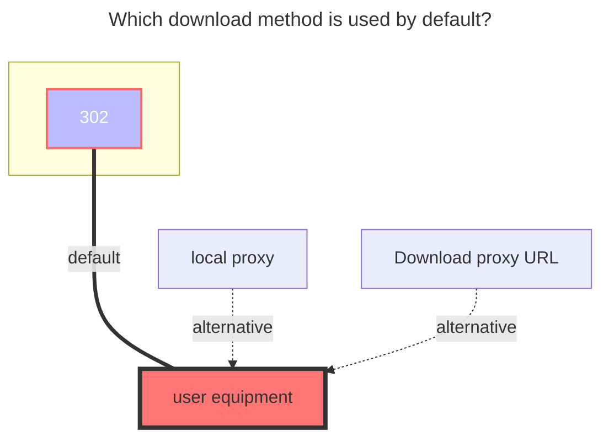
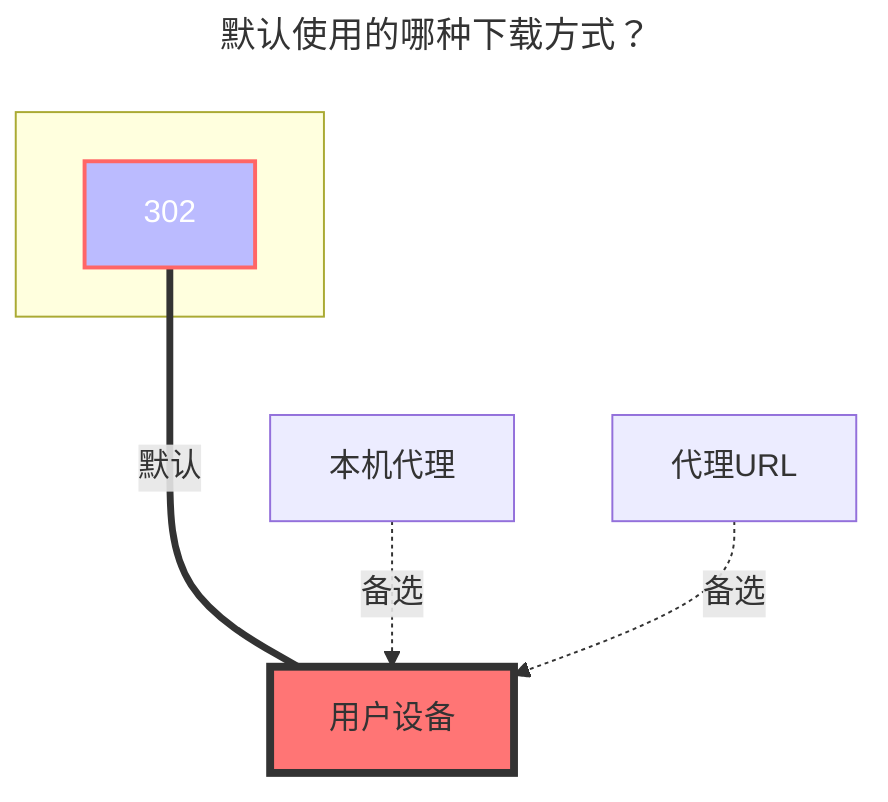

---
title:
  en: LanZou Cloud
  zh-CN: 蓝奏云盘
icon: iconfont icon-state
# This control sidebar order
top: 390
# A page can have multiple categories
categories:
  - guide
  - drivers
# A page can have multiple tags
tag:
  - Storage
  - Guide
  - '302'
# this page is sticky in article list
sticky: true
# this page will appear in starred articles
star: true
---

::: en
::: tip
Lanzuo Network Disk has three types of **modes (types)**, which are **accounts, Cookie** and **Url**

- **Account** : You can display all the files of your own cloud disk, you only need to fill in the account password, which will automatically help you refresh the cookie
- **cookie** : All files in the network disk can be displayed, but the cookie of the network disk needs to be provided
- **Url** : only display the content in the link (you can mount it without providing a cookie)
  :warning: It is recommended to use the **Account** method to mount：
- Cookie mode needs to manually update Cookie
- Using the Url mode will always cause convulsions. I don’t know what’s going on and suddenly prompts
  :::

::: zh-CN
::: tip
蓝奏网盘挂载有三种**模式（类型）**，分别是 **账户，cookie** 和 **链接**

- **账户**：可以显示自己网盘所有文件，只需要填写帐号密码，会自动帮你刷新cookie
- **cookie**：可以显示自己网盘所有文件，但是需要提供网盘的cookie
- **链接**：只能显示链接里面的内容（不需要提供cookie就可以挂载）
  :warning: 推荐使用**账户**的方式挂载：
- cookie模式需要手动更换cookie
- 用链接模式总是会抽风不知道怎么回事
  :::

## **root folder ID** { lang="en" }

## **根文件夹ID** { lang="zh-CN" }

::: en
Lanzuo cloud disk root directory ID, the default is `-1`，If you use `Url`Type to mount the root folder ID, please see the third item of [Fill in instructions](#fill-in-instructions)

- **Additional Folder ID**
  - Two ways to obtain (see the picture below)
  - 

:::

::: zh-CN
蓝奏云盘根目录ID，默认为`-1`，如果使用`链接`类型挂载根文件夹ID请看[填写说明](#填写说明)的第三条

- **其他文件夹ID**
  - 两种获取方式（看下图即可）
  - 

:::

## **Account** { lang="en" }

## **账户** { lang="zh-CN" }

::: en
Just fill in your own Lanzou Cloud Account Password
:::
::: zh-CN
只需要填写自己的蓝奏云帐号密码
:::

## **Cooike** { lang="en" }

## **Cookie** { lang="zh-CN" }

::: en
Log in to your [**Lanzuo Cloud Disk**](https://pc.woozooo.com/) account, then F12 to open the developer mode, you can find `Cookie`, there is no specific one, such as the left side of the picture Just click one and there will be `Cookie` in the blue part of the right picture.

:::
::: zh-CN
登录自己的 [**蓝奏云盘**](https://pc.woozooo.com/) 账号，然后F12打开开发者模式，就能找到 `Cookie`，没有具体的，例如图片中左侧的随便点一个然后有右图蓝色部分的 `Cookie` 即可.

:::

## **Share link and share password** { lang="en" }

## **分享链接和分享密码** { lang="zh-CN" }

::: en

- **Share link**: Randomly generate a share link in the Lanzuo cloud disk
  - Small tip: **lanzouX** in the link, the last default **X** content sometimes cannot be opened in some areas, you can try to change it yourself, for example, change to i, x, u, t, etc. Anyway, try it out for yourself.
- **Share password**: the password for the link
  :::
  ::: zh-CN
- **分享链接**：在蓝奏云盘内随便生成一个分享链接
  - 小提示 ：链接里面的 **lanzouX**，最后这个默认的 **X**内容有时候有些地区打不开，可以自己更换一下试试看比如换成 i,x,u,t 等等等反正好多自己试试看就行.
- **分享密码** ：链接的密码
  :::

## **Repair file info** { lang="en" }

## **修复文件信息** { lang="zh-CN" }

::: en
If you need **WebDav** service, you need to open it
:::
::: zh-CN
需要 **WebDav** 服务的，需要打开它
:::

## **error message** { lang="en" }

## **错误信息** { lang="zh-CN" }

::: en
Use cookie type or account type to add prompt `not find file page param` error because lanzou changed the domain name

- Solution: It is recommended to use account type to add
  - Change the sharing link to `https://wwop.lanzoul.com` and save it. If it still doesn't work, refresh the lower right corner.
  - lanzoul will also make changes in the future

:::

::: zh-CN
使用Cookie类型或者账户类型添加提示`not find file page param`错误是因为蓝奏云更换了域名

- 解决方案：建议使用账户类型添加
  - 把分享链接改成 `https://wwop.lanzoul.com`保存即可，如果还是不可以，右下角刷新一下。
  - 后续蓝奏可能还会更改。

:::

## **Fill in instructions** { lang="en" }

## **填写说明** { lang="zh-CN" }

::: en

1. **Acount mode**: Type selects `account`, fill in` account` and `password` options, and the `root folder ID` (the default is all files of the root directory)
2. **Cookie mode**: Type selects `Cookie`, fill in` Cookie`, and the `root folder ID` (the default is all files of the root directory)
3. **URL mode**: Type selects `Url`, fill in` ShareUrl` and `root folder ID` and`Share Password (if there is a password)`
   - The sharing link is :point_right: https://xxx.lanzou.com/aaabbbccc :point_left: in this format
   - Fill in `ShareUrl`: https://xxx.lanzou.com
   - Fill in `root folder ID`: aaabbbccc
   - Share Password: if there is a password
     

:::

::: zh-CN 4. **账户模式**：类型选择`账户`，填写`账户`和`密码`选项，以及`根文件夹ID`(选填,默认为根目录全部文件) 5. **Cookie模式**：类型选择`Cookie`，填写`Cookie`，以及`根文件夹ID`(选填,默认为根目录全部文件) 6. **链接模式**：类型选择`链接`，填写`分享链接`和`根文件夹ID`以及 `分享密码(如果有密码)`两个选项就可以

- 分享链接是 :point_right: https://xxx.lanzou.com/aaabbbccc :point_left: 这种格式的
- 在`分享链接`填写：https://xxx.lanzou.com
- 在`根文件夹ID`填写：aaabbbccc
- 在`分享密码`填写：有密码就写没有就不用写
  

:::

### **The default download method used** { lang="en" }

### **默认使用的下载方式** { lang="zh-CN" }

::: en

:::
::: zh-CN

:::
