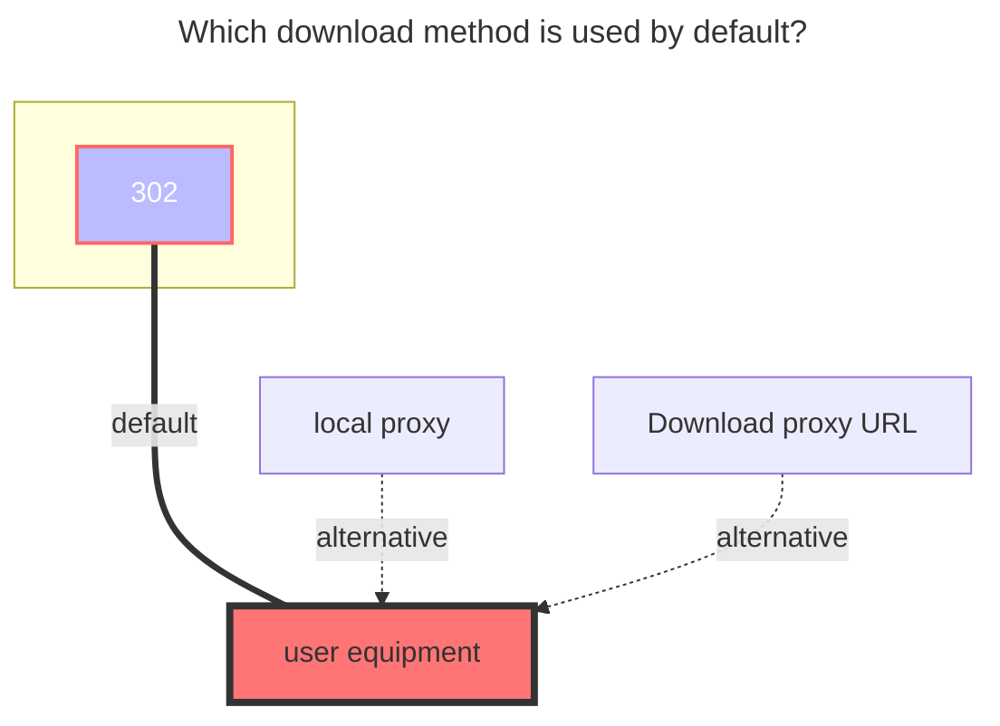
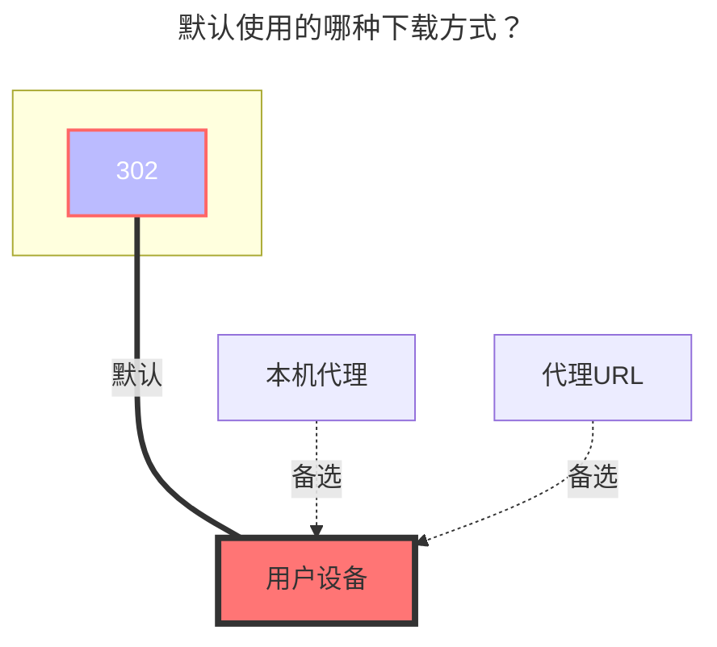

---
title:
  en: Lenovo Nas Share
  zh-CN: 联想家庭储存链接分享
icon: iconfont icon-state
# This control sidebar order
top: 260
# A page can have multiple categories
categories:
  - guide
  - drivers
# A page can have multiple tags
tag:
  - Storage
  - Guide
  - '302'
# this page is sticky in article list
sticky: true
# this page will appear in starred articles
star: true
---

::: en
Need to purchase Lenovo devices **https://pc.lenovo.com.cn**
:::

::: zh-CN
需要购买联想设备 **https://pc.lenovo.com.cn**
:::

## Root Folder ID { lang="en" }

## 根文件夹ID { lang="zh-CN" }

::: en
Root Folder ID: Leave it blank

Subfolder ID: Get as shown in the picture
:::

::: zh-CN
根文件夹：留空

子文件夹：按图片所示获取
:::

## Share ID and Share Password { lang="en" }

## 分享ID和分享密码 { lang="zh-CN" }

::: en
Example of share link: https://siot-share.lenovo.com.cn/s/#/eb.3N93ZbJsaAjerjdm4N Extraction code: `e5eu`

- **Share ID**: Fill in the sharing link and automatically extract the string `eb.3N93ZbJsaAjerjdm4N` at the end of the sharing link
- **Share Password**: The extraction code `e5eu`

:::

::: zh-CN
分享链接链接示例：https://siot-share.lenovo.com.cn/s/#/eb.3N93ZbJsaAjerjdm4N 提取码：`e5eu`

- **分享ID**：填写分享链接，自动提取分享链接中末尾的字符串 `eb.3N93ZbJsaAjerjdm4N`
- **分享密码** ：提取码 `e5eu`

:::

## Host Address { lang="en" }

## 主机地址{ lang="zh-CN" }

::: en
The default uses the public network: **https://siot-share.lenovo.com.cn**

(Not recommended) If you are using a local network, you can change it to the internal network address of the Lenovo device: **http://192.168.XX.XX**
:::

::: zh-CN
默认使用公网的：**https://siot-share.lenovo.com.cn**

（不推荐）如果你使用局域网的可以改成联想设备内网地址：**http://192.168.XX.XX**
:::

## Show Root Folder { lang="en" }

## 显示根文件夹 { lang="zh-CN" }

::: en
If unchecked and `Share ID` is empty, the folder ID of the first-level folder is automatically filled in.
Taking the above picture as an example, the contents of the `OpenList` folder are directly displayed without displaying the `OpenList` folder.
:::

::: zh-CN
若取消勾选且 `分享ID` 为空，自动填入第一级文件夹的文件夹ID。
以上图为例，直接显示 `OpenList` 文件夹中的内容，不显示 `OpenList` 文件夹。
:::

## The default download method used { lang="en" }

## 默认使用的下载方式 { lang="zh-CN" }

::: en

:::
::: zh-CN

:::
