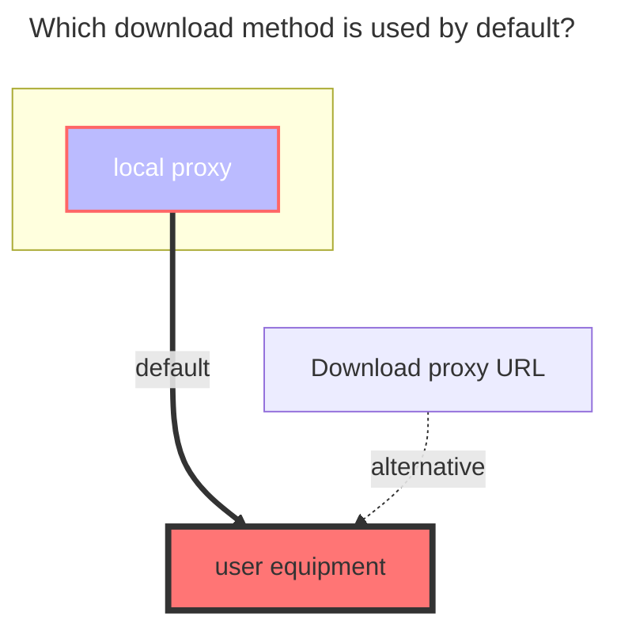
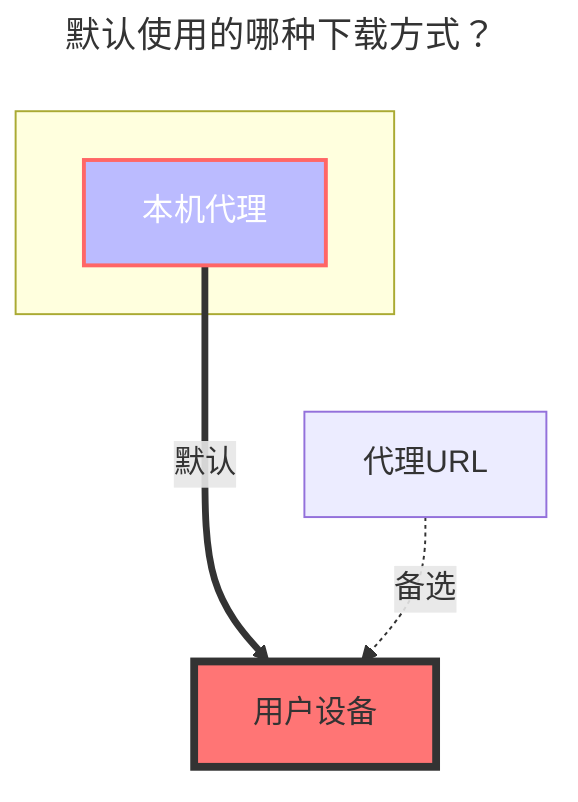

---
title:
  en: Local storage
  zh-CN: 本机存储
icon: iconfont icon-state
# This control sidebar order
top: 520
# A page can have multiple categories
categories:
  - guide
  - drivers
# A page can have multiple tags
tag:
  - Storage
  - Guide
  - '本地代理'
# this page is sticky in article list
sticky: true
# this page will appear in starred articles
star: true
---

### **Root folder path** { lang="en" }

## **根文件夹ID** { lang="zh-CN" }

::: en
The path of folder you wanted to mount. For example:

- Linux: `/root`
- Windows: `C:`
  :::
  ::: zh-CN
  您要挂载的文件夹的路径。 例如：
- Linux: `/root`
- Windows: `C:`
  :::

## **Local storage video thumbnail** { lang="en" }

## **本地存储视频封面** { lang="zh-CN" }

::: en
You need to use the `ffmpeg` tool to add, I will not (wait for replenishment) for the time being

- You need to use OpenList version ≥ [**v3.12.0**](https://github.com/alist-org/alist/releases/tag/v3.12.0)
  - Add thumbnail for video with ffmpeg - by [**@GodFinal**](https://github.com/GodFinal) and [**@Xhofe**](https://github.com/Xhofe) in [**#3556**](https://github.com/alist-org/alist/pull/3556) [**(309d6)**](https://github.com/alist-org/alist/commit/309d655)
  - Support both time and percent for video thumbnail - by [**@1024th**](https://github.com/1024th) in [**#7802**](https://github.com/AlistGo/alist/pull/7802) [(**31a74**)](https://github.com/AlistGo/alist/commit/31a74708)

:::

::: zh-CN
需要使用`ffmpeg` 工具来添加，暂时还不会（后续补充）

- 需要使用OpenList版本 ≥ [**v3.12.0**](https://github.com/alist-org/alist/releases/tag/v3.12.0)
  - Add thumbnail for video with ffmpeg - by [**@GodFinal**](https://github.com/GodFinal) and [**@Xhofe**](https://github.com/Xhofe) in [**#3556**](https://github.com/alist-org/alist/pull/3556) [**(309d6)**](https://github.com/alist-org/alist/commit/309d655)
  - Support both time and percent for video thumbnail - by [**@1024th**](https://github.com/1024th) in [**#7802**](https://github.com/AlistGo/alist/pull/7802) [(**31a74**)](https://github.com/AlistGo/alist/commit/31a74708)

:::

## **Recycle bin path** { lang="en" }

## **回收站路径** { lang="zh-CN" }

::: en
path to recycle bin, delete permanently if empty or keep 'delete permanently'
If you fill in this path, you will move the file into the folder when deleting the local storage file, so that you have a chance to regret it.
The method of filling in the above -mentioned mounting path is different from different system filling methods.
==If you do n’t know if you fill in it correctly, you can test it yourself first and then use the production environment to use it yourself.==

- Linux: `/root`
- Windows: `C:`
  :::
  ::: zh-CN
  回收站的路径，如果为空则永久删除或保持“永久删除”
  如果填写此路径在删除本地存储文件时会将文件移动到此文件夹內，让你有一次后悔的机会。
  填写方式参考上述挂载路径的方式不同系统填写方式不同。
  ==如果不知道是否填写正确，可以先自己在测试环境进行测试一下再进行生产环境使用==
- Linux: `/root`
- Windows: `C:`
  :::

### **The default download method used** { lang="en" }

### **默认使用的下载方式** { lang="zh-CN" }

::: en

:::
::: zh-CN

:::
