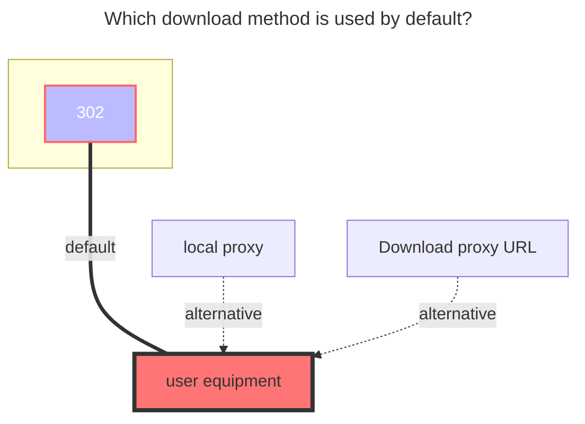
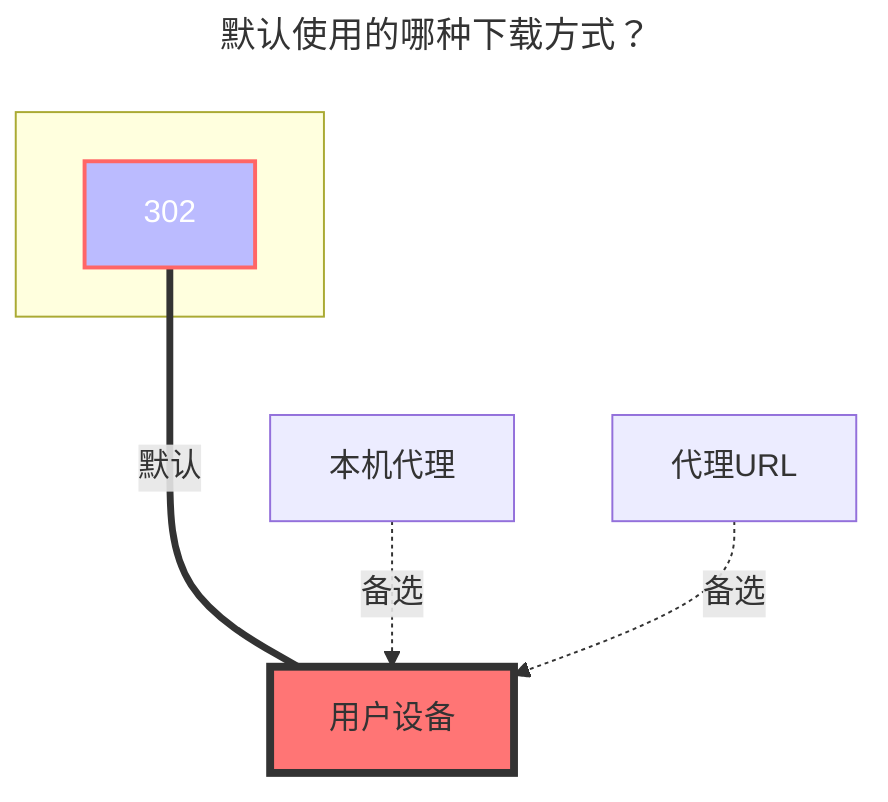

---
title:
  en: Mediatrack
  zh-CN: 分秒帧
icon: fa-solid fa-x
# This control sidebar order
top: 210
# A page can have multiple categories
categories:
  - guide
  - drivers
# A page can have multiple tags
tag:
  - Storage
  - Guide
  - '302'
# this page is sticky in article list
sticky: true
# this page will appear in starred articles
star: true
---

::: en
**https://app.mediatrack.cn**
:::
::: zh-CN
**https://app.mediatrack.cn**
:::

### **Access token** { lang="en" }

## **访问令牌** { lang="zh-CN" }

::: en
You can get it in request header after logging in

:::
::: zh-CN
登录后可以在请求头中获取

:::

### **Project id** { lang="en" }

## **项目编号** { lang="zh-CN" }

::: en
Get from official website url:

:::
::: zh-CN
从官网网址获取：

:::

### **Root folder id** { lang="en" }

## **根文件夹 ID** { lang="zh-CN" }

::: en
Get it from the request after logging in

:::
::: zh-CN
登录后从请求中获取

:::

### **The default download method used** { lang="en" }

### **默认使用的下载方式** { lang="zh-CN" }

::: en

:::
::: zh-CN

:::
