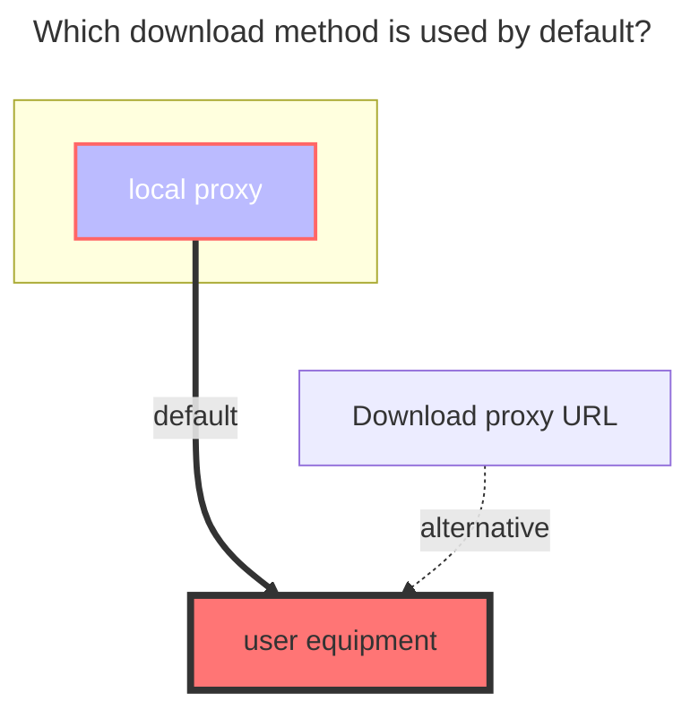
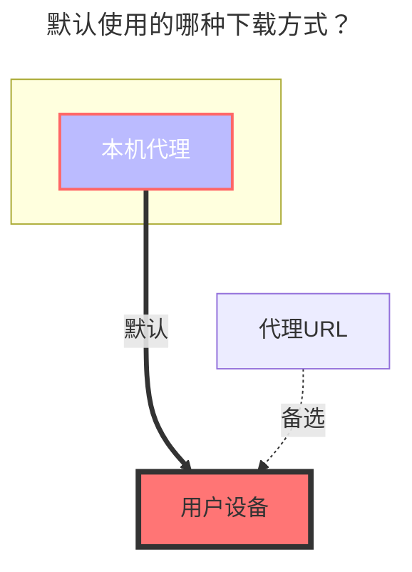

---
title:
  en: MEGA Disk
  zh-CN: MEGA Disk
icon: iconfont icon-state
# This control sidebar order
top: 160
# A page can have multiple categories
categories:
  - guide
  - drivers
# A page can have multiple tags
tag:
  - Storage
  - Guide
  - '本地代理'
  - '官方'
# this page is sticky in article list
sticky: true
# this page will appear in starred articles
star: true
---

::: en
MEGA official website: **https://mega.nz/login**
:::
::: zh-CN
MEGA官网：**https://mega.nz/login**
:::

### **Mail** { lang="en" }

### **邮箱** { lang="zh-CN" }

::: en
MEGA login account
:::
::: zh-CN
MEGA登录账号
:::

### **password** { lang="en" }

### **密码** { lang="zh-CN" }

::: en
login password
:::
::: zh-CN
登录密码
 
:::

## **2FA** { lang="en" }

## **两步验证** { lang="zh-CN" }

::: en
Non -filling options,If you open 2FA, you need to fill in it,If you don’t use 2FA, you don’t need to fill in it
:::
::: zh-CN
非必填选项，如果开启了需要填写，没开启的不需要填写
:::

### **Two fa secret** { lang="en" }

### **两步验证秘钥** { lang="zh-CN" }

::: en
**https://mega.nz/fm/account/security/two-factor-authentication**
Click to enable `Enable two-factor authentication (2FA)` and then see a QR code, there is a string of letters below the QR code, This is `Two fa secret`, please record before scanning the code and do not lose it, Should the `Two-factor authentication (2FA) secret` be lost, you can unbinding and then retrieve a new 2FA QR code for setup.

:::
::: zh-CN
**https://mega.nz/fm/account/security/two-factor-authentication**
点击启用 `启用双重验证（2FA）`然后会看到一个二维码，二维码下方有一串字母，这个就是`2FA验证秘钥`，请在扫码绑定前记录一下切勿丢失，`2FA验证秘钥`如果丢失可以解绑重新获取一个新的

:::

### **Two fa code** { lang="en" }

### **两步验证代码** { lang="zh-CN" }

::: en
To enable 2-factor authentication, you need to install a app that support 2FA (such as [Google Authenticator](https://play.google.com/store/apps/details?id=com.google.android.apps.authenticator2), [Microsoft Authenticator](https://support.microsoft.com/en-us/account-billing/download-and-install-the-microsoft-authenticator-app-351498fc-850a-45da-b7b6-27e523b8702a)), on your phone.
Then login to OpenList manage and goto `Profile` page, click `Enable 2FA` button, scan the QR code with your 2FA app, and enter the code generated by your 2FA app.
Scan the QR appearing on the screen. At the same time, this QR code is also [two-fa-secret](#two-fa-secret)

 
:::
::: zh-CN
要启用双因素身份验证，需要在手机上安装支持 TOTP 的验证器，例如 [Google Authenticator](https://play.google.com/store/apps/details?id=com.google.android.apps.authenticator2)，[Microsoft Authenticator](https://support.microsoft.com/zh-cn/account-billing/%E4%B8%8B%E8%BD%BD%E5%B9%B6%E5%AE%89%E8%A3%85microsoft-authenticator%E5%BA%94%E7%94%A8-351498fc-850a-45da-b7b6-27e523b8702a)
扫描屏幕出现的二维码就可以，同时这个二维码也是[两步验证秘钥](#两步验证秘钥)

 
:::

## Fill in example: { lang="en" }

## **填写示例** { lang="zh-CN" }

::: en

 
:::
::: zh-CN

 
:::

### **The default download method used** { lang="en" }

### **默认使用的下载方式** { lang="zh-CN" }

::: en

:::
::: zh-CN

:::
