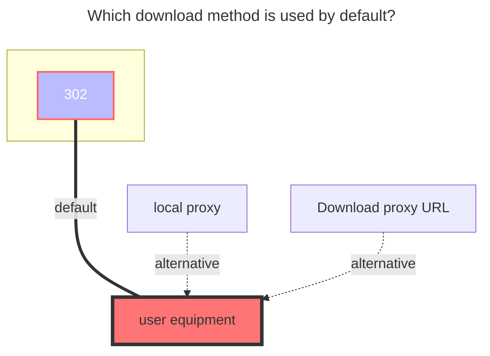
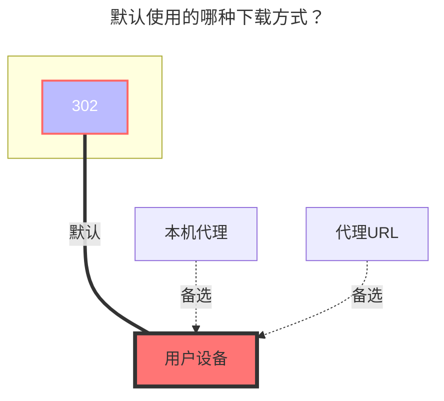

---
title:
  en: MoPan
  zh-CN: 四川电信魔盘
icon: iconfont icon-state
# This control sidebar order
top: 430
# A page can have multiple categories
categories:
  - guide
  - drivers
# A page can have multiple tags
tag:
  - Storage
  - Guide
  - '302'
# this page is sticky in article list
sticky: true
# this page will appear in starred articles
star: true
---

::: en
MoPan address：**https://mopan.sc.189.cn/mopan/#/downloadPc**

- There is no web version, only `Android`, `iOS`, `PC-Win64bit`, `iPad`, and `TV`.
- :warning: Alist version > ==3.30.0== to use this driver
   
  :::
  ::: zh-CN
  云盘官网链接：**https://mopan.sc.189.cn/mopan/#/downloadPc**
- 没有网页端，只有`Android`,`IOS`,`PC-Win64位`,`iPad`,`TV`
- :warning: OpenList版本 > ==3.30.0== 以上版本才能使用本驱动
   
  :::

## **Sms code** { lang="en" }

## **Sms code** { lang="zh-CN" }

::: en
Enter the option of the mobile phone number and password when the first addition, and then enter the `SMS Code` input ==Send==, and then click Save to send it to you.
 
:::
::: zh-CN
第一次添加时先输入 手机号和密码的选项，然后在`Sms Code`输入 ==send==，再点击保存会给你进行发短信，然后将验证码重新输入就可以添加
 
:::

## **Root folder ID** { lang="en" }

## **根文件夹ID** { lang="zh-CN" }

::: en
Do not fill in this option, it will automatically fill into the root directory

- Due to encrypted requests, an appropriate method for obtaining folder IDs has not yet been found
   
  :::
  ::: zh-CN
  留空会自动填充为根目录
- 由于请求加密，暂时未想到合适的获取文件夹ID的方法
   
  :::

### **Tips** { lang="en" }

## **提示** { lang="zh-CN" }

::: en

1. `root folder ID`,`equipment information`does not need to be filled in, will automatically help you fill
2. If you enter the send in [SMS Code] (#SMS-Code), it is found that it has been saved,Please click Edit to enter the verification code received
    
   :::
   ::: zh-CN
3. `根文件夹ID`、`设备信息`不用填写,会自动帮你填充
4. 如果在[Sms Code](#sms-code)输入验证码后已经保存了，请进入编辑输入收到的验证码
    
   :::

### **The default download method used** { lang="en" }

### **默认使用的下载方式** { lang="zh-CN" }

::: en

:::
::: zh-CN

:::
