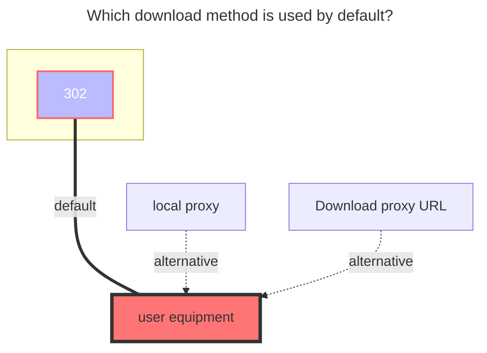
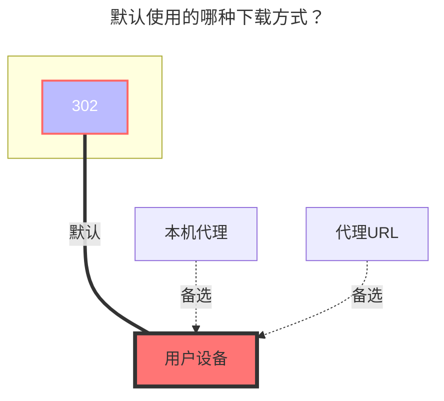
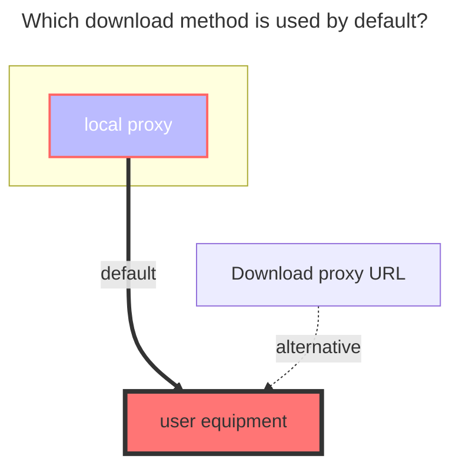
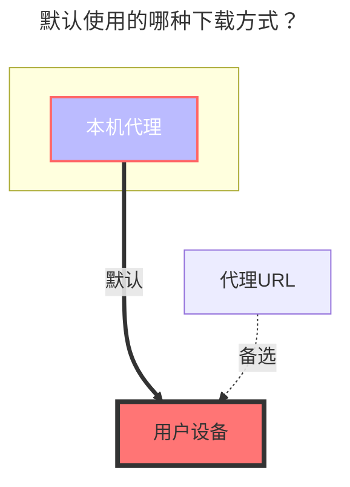

::: en
<br/>
:::
::: zh-CN
<br/>
:::

:::en
:::tip
If your account does not support the API, (for example, the school account has not verified the administrator, or the administrator has disabled the API), then you can also mount it through webdav. For details, see [webdav](webdav.md)
:::
:::zh-CN
:::tip
如果你的账号不支持 API，（比如学校账号没有验证管理员，或者管理员禁用了 API），那么你也可以通过 WebDAV 挂载。 有关详细信息，请参阅 [WebDAV 页面](webdav.md)
:::

## **OneDrive mount** { lang="en" }

## **正常 OneDrive 挂载** { lang="zh-CN" }

::: en
::: tip
If your account does not support the API, (for example, the school account has not verified the administrator, or the administrator has disabled the API), then you can also mount it through webdav. For details, see [webdav](webdav.md)
:::
::: en
First open https://api.oplist.org/
:::
::: zh-CN
::: tip
如果你的账号不支持 API，（比如学校账号没有验证管理员，或者管理员禁用了 API），那么你也可以通过 WebDAV 挂载。 有关详细信息，请参阅 [WebDAV 页面](webdav.md)
:::
::: zh-CN
首先打开 https://api.oplist.org/
:::

### **Create an application** { lang="en" }

### **创建应用** { lang="zh-CN" }

::: en

> You can also choose to skip this step and use the client provided by default, but requires the approval of the organization administrator.

- On the page that opens, select the region and click Create Application
- After logging in, select `Register Application`, enter `Name`, and select `Accounts and Individuals in Any Organization Directory` (note that you don't look at the location selection but the text here. Some people may be the middle option, don't select a single Tenant or other options, otherwise it will cause problems when logging in), enter the redirect URL as <https://api.oplist.org/onedrive/callback>, `register`, and then you can get client_id
  
- After registering the application, select `Certificate and Password`, click `New Client Password`, enter a string of passwords, select the one with the longest time, and click `Add`
  (Note: The password entered after adding will disappear, please record the value of client_secret)
  
- Select `API Permissions`, click `MicroSoft Graph`, enter file in the `Select Permissions`, and check `Files.read` (Note: Files.read is a read-only minimum permission. The permission in the figure is larger, and the same can be done ), click `Update Permission`
  

:::

::: zh-CN

> 你也可以选择跳过此步，使用默认提供的client，但是需要组织管理员批准。

- 在打开的页面，选择所在区域，点击创建应用
- 登陆后选择"注册应用程序"，输入"名称"，选择"任何组织目录中的账户和个人"（注意这里不要看位置选择而是看文字，部分人可能是中间那个选项，不要选成单一租户或者其他选项，否则会导致登陆时出现问题），输入重定向 URL 为 <https://api.oplist.org/onedrive/callback> ，点击注册即可，然后可以得到 `client_id`
  
- 注册好应用程序之后，选择"证书和密码"，点击"新客户端密码"，输入一串密码，选择时间为最长的那个，点击"添加"
  （注：在添加之后输入的密码之后会消失，请记录下来 `client_secret` 的值）
  
- 选择 "API 权限"，点击 "Microsoft Graph"，在"选择权限"中输入 `file`，勾选 `Files.read`（注：Files.read 是只读最小权限，图中权限较大，也同样可以），点击"确定"
  

:::

### **Get refresh token** { lang="en" }

### **获取刷新令牌** { lang="zh-CN" }

::: en
Fill in the client_id and client_secret obtained in the previous step into the https://alist.example.com/tool/onedrive/request page, click Get Refresh Token, you can get the refresh token
:::
::: zh-CN
将上一步骤中获得的 `client_id` 和 `client_secret` 填入 https://alist.example.com/tool/onedrive/request ，点击"获取刷新令牌"即可
:::

### **Get Sharepoint site_id** { lang="en" }

### **获取 SharePoint site_id** { lang="zh-CN" }

::: en
If you need to mount Sharepoint, after completing the previous step, an input site address will appear on the interface that displays the refresh token. After entering the site address, click Get site_id.
:::
::: zh-CN
如果需要挂载 SharePoint，完成上一步后，在显示刷新令牌的界面会出现一个输入站点地址，输入站点地址后点击获取 `site_id` 即可。
:::

### **Add storage** { lang="en" }

### **添加账号** { lang="zh-CN" }

::: en
Fill in the values ​​obtained in the above process one by one.
:::
::: zh-CN
将上述过程中获取得到的值依次填入即可。
:::

### **Root folder path** { lang="en" }

### **根文件夹ID** { lang="zh-CN" }

::: en
The default is `/`, if you need to customize, just fill in the path, starting from the root path, the same as the local path, such as `/test`
:::
::: zh-CN
默认为 `/`，如果需要自定义，就填路径就行，从根路径开始，和本地路径一样，比如 `/test`
:::

#### **The default download method used** { lang="en" }

#### **默认使用的下载方式** { lang="zh-CN" }

::: en



<br/>
:::
::: zh-CN

<br/>
:::

## **Onedrive Share Url** { lang="en" }

## **Onedrive 分享** { lang="zh-CN" }

::: en

<br/>
:::
::: zh-CN

<br/>
:::

### **Url** { lang="en" }

### **链接** { lang="zh-CN" }

::: en
The sharing link is the same as the example below and can be mounted. It can be obtained from E3, E5, A1, and A1P.

```html
https://connecthkuhk-my.sharepoint.com/:f:/g/personal/jhyang13_connect_hku_hk/EsEgHtGOWbJImxop6tF15FIBIH-ihrjuDclbrbmwWfY_RA?e=s6fitN
```

If it is OneDrive personal version, it will not work. The link is as follows

```html
https://onedrive.live.com/?cid=64EA5FCC7735E8C6&id=64EA5FCC7735E8C6%2117289
```

<br/>
:::
::: zh-CN
分享链接是这样的可以挂载，来自E3、E5、A1、A1P等
```html
https://connecthkuhk-my.sharepoint.com/:f:/g/personal/jhyang13_connect_hku_hk/EsEgHtGOWbJImxop6tF15FIBIH-ihrjuDclbrbmwWfY_RA?e=s6fitN
```
如果是OneDrive个人版的就不行，链接如下
```html
https://onedrive.live.com/?cid=64EA5FCC7735E8C6&id=64EA5FCC7735E8C6%2117289
```
<br/>
:::

### **Password** { lang="en" }

### **密码** { lang="zh-CN" }

::: en
It is the extraction code. If you have it, write it. If you don’t have it, don’t fill it in.
<br/>
:::
::: zh-CN
就是提取码，如果有就写，如果没有就不用写
<br/>
:::

#### **The default download method used** { lang="en" }

#### **默认使用的下载方式** { lang="zh-CN" }

::: en



:::
::: zh-CN



:::
