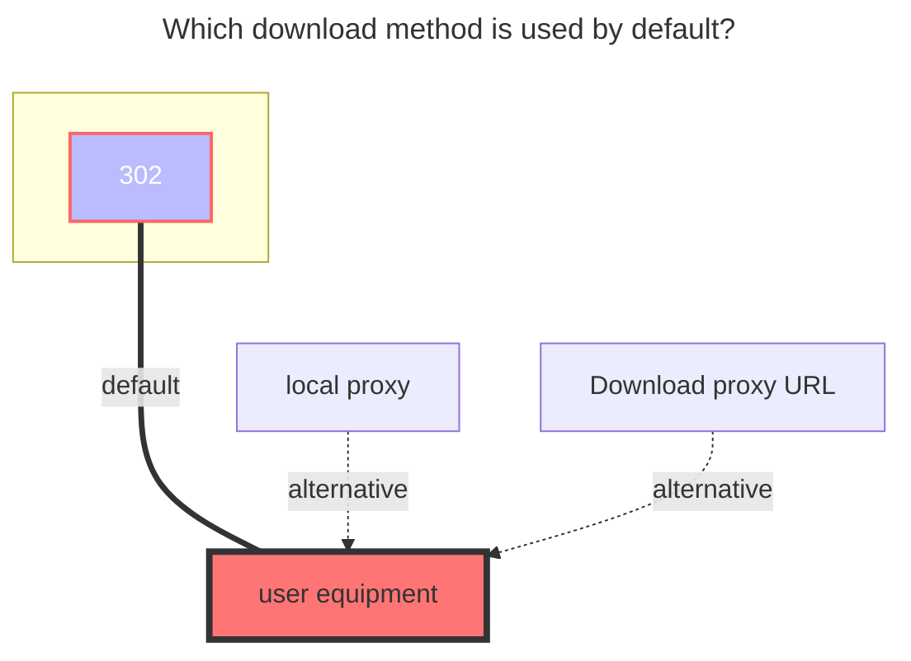
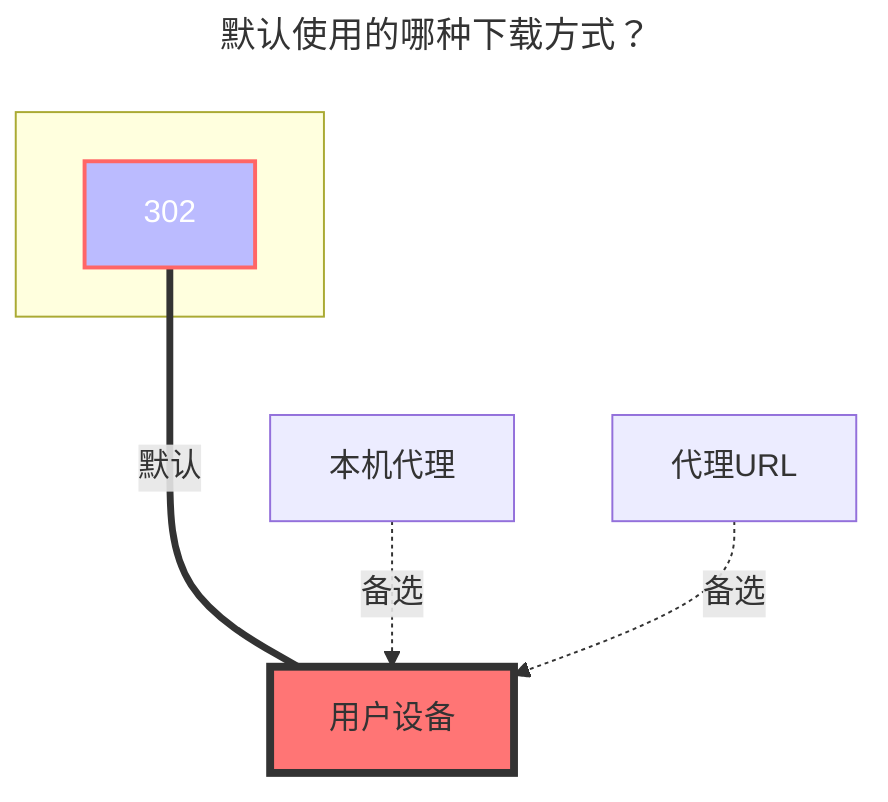

---
title:
  en: PikPak / Share
  zh-CN: PikPak / 分享
icon: iconfont icon-state
# This control sidebar order
top: 290
# A page can have multiple categories
categories:
  - guide
  - drivers
# A page can have multiple tags
tag:
  - Storage
  - Guide
  - '302'
# this page is sticky in article list
sticky: true
# this page will appear in starred articles
star: true
---

::: en
::: danger

1. `Pikpak`：Who makes the request, who can use it
   - For example, if you build an OpenList on the server with IP `1.1.1.1`, but your own IP is `2.2.2.2`, you cannot play or download it.
   - Or enable Proxy policy

---

2. `PikPak Share`：There is a size limit. After the specified file size is exceeded, only 40%~50% can be played.
   - The specific size of the file is currently unknown

:::

::: zh-CN
::: danger

1. `个人Pikpak`：谁发出请求谁能用
   - 例如你在 IP `1.1.1.1`服务器搭建的OpenList，但是你本人IP是`2.2.2.2`，无法播放下载，或者开启代理中转策略

---

2. `分享Pikpak`：有大小限制，超出指定文件大小后只能播放40%~50%
   - 具体多大文件暂时未知具体数值

:::

## **PikPak** { lang="en" }

## **PikPak挂载** { lang="zh-CN" }

### **Username** { lang="en" }

### **用户名** { lang="zh-CN" }

::: en
email or phone?
:::
::: zh-CN
邮件地址或者电话号码？
:::

### **Password** { lang="en" }

### **密码** { lang="zh-CN" }

::: en
password
 
:::
::: zh-CN
密码
 
:::

### **Root folder id** { lang="en" }

### **根文件夹ID** { lang="zh-CN" }

::: en
Can get with https://mypikpak.com/ , default `root`.

 
:::
::: zh-CN
可以通过 https://mypikpak.com/ 获取，默认为 `root`。

 
:::

### **Platform** { lang="en" }

### **平台** { lang="zh-CN" }

::: en
It is not necessary to use it under normal circumstances, but you may need to use it when you cannot log in directly with your account and password.
If you encounter other problems such as verification code

- Refer to the `Update` section in **https://github.com/alist-org/alist/pull/7024**
   
  :::
  ::: zh-CN
  正常情况下不需要使用，遇到无法直接使用帐号密码登录的情况下可能需要使用
  如果遇到验证码等其它问题
- 参考 **https://github.com/alist-org/alist/pull/7024** 这里面的 `更新` 部分的内容
   
  :::

### **Refresh token** { lang="en" }

### **刷新令牌** { lang="zh-CN" }

::: en
After filling in the account and password, select <Badge text="Oauth2" type="info" vertical="middle" /> for `Refresh token method` and then save to automatically fill in the refresh token and device information.
If you encounter other problems such as verification code

- Refer to the `Update` section in **https://github.com/alist-org/alist/pull/7024**
   
  :::
  ::: zh-CN
  填写帐号和密码后，`刷新令牌方法`选择 <Badge text="Oauth2" type="info" vertical="middle" /> 然后保存就会自动填充刷新令牌、设备信息
  如果遇到验证码等其它问题
- 参考 **https://github.com/alist-org/alist/pull/7024** 这里面的 `更新` 部分的内容
   
  :::

### **Disable media link** { lang="en" }

### **禁用媒体链接** { lang="zh-CN" }

::: en

- **https://github.com/alist-org/alist/issues/4735**
   
  :::
  ::: zh-CN
- **https://github.com/alist-org/alist/issues/4735**
   
  :::

### **Offline Download** { lang="en" }

### **离线下载** { lang="zh-CN" }

::: en
<Badge text="v3.36.0" type="info" vertical="middle" /> and above versions support calling `Pikpak` offline download function in OpenList
Select <svg fill="none" stroke-width="0" xmlns="http://www.w3.org/2000/svg" viewBox="0 0 24 24" class="toolbar-toggle hope-icon hope-c-XNyZK hope-c-PJLV hope-c-PJLV-ifkxHPo-css" height="1em" width="1em" style="overflow: visible;"><path fill="currentColor" d="M7 14a2 2 0 100-4 2 2 0 000 4zM14 12a2 2 0 11-4 0 2 2 0 014 0zM17 14a2 2 0 100-4 2 2 0 000 4z"></path><path fill="currentColor" fill-rule="evenodd" d="M24 12c0 6.627-5.373 12-12 12S0 18.627 0 12 5.373 0 12 0s12 5.373 12 12zm-2 0c0 5.523-4.477 10-10 10S2 17.523 2 12 6.477 2 12 2s10 4.477 10 10z" clip-rule="evenodd"></path></svg><svg fill="currentColor" stroke-width="0" xmlns="http://www.w3.org/2000/svg" viewBox="0 0 512 512" class="hope-icon hope-c-XNyZK hope-c-PJLV hope-c-PJLV-iipViGO-css" tips="offline_download" height="1em" width="1em" style="overflow: visible;"><path fill="none" stroke="currentColor" stroke-miterlimit="10" stroke-width="32" d="M421.83 293.82A144 144 0 00218.18 90.17M353.94 225.94a48 48 0 00-67.88-67.88"></path><path stroke-linecap="round" stroke-miterlimit="10" stroke-width="32" d="M192 464v-48M90.18 421.82l33.94-33.94M48 320h48"></path><path fill="none" stroke="currentColor" stroke-linejoin="round" stroke-width="32" d="M286.06 158.06L172.92 271.19a32 32 0 01-45.25 0L105 248.57a32 32 0 010-45.26L218.18 90.17M421.83 293.82L308.69 407a32 32 0 01-45.26 0l-22.62-22.63a32 32 0 010-45.26l113.13-113.17M139.6 169.98l67.88 67.89M275.36 305.75l67.89 67.88"></path> </svg> in the lower right corner and select `Pikpak` for offline download options

- Support: `magne`, `http`, `ed2k` links
- Also supports: X, TikTok, Facebook, TG URL links
  Only Pikpak is supported for offline download. If it is not Pikpak, the following error message will be displayed, Although the offline download prompt was successfully added, an error will be prompted in the background.
- unsupported storage driver for offline download, only Pikpak is supported
  
   
  :::
  ::: zh-CN
  <Badge text="v3.36.0" type="info" vertical="middle" /> 及以上版本支持在OpenList调用Pikpak离线下载功能
  右下角选择 <svg fill="none" stroke-width="0" xmlns="http://www.w3.org/2000/svg" viewBox="0 0 24 24" class="toolbar-toggle hope-icon hope-c-XNyZK hope-c-PJLV hope-c-PJLV-ifkxHPo-css" height="1em" width="1em" style="overflow: visible;"><path fill="currentColor" d="M7 14a2 2 0 100-4 2 2 0 000 4zM14 12a2 2 0 11-4 0 2 2 0 014 0zM17 14a2 2 0 100-4 2 2 0 000 4z"></path><path fill="currentColor" fill-rule="evenodd" d="M24 12c0 6.627-5.373 12-12 12S0 18.627 0 12 5.373 0 12 0s12 5.373 12 12zm-2 0c0 5.523-4.477 10-10 10S2 17.523 2 12 6.477 2 12 2s10 4.477 10 10z" clip-rule="evenodd"></path></svg><svg fill="currentColor" stroke-width="0" xmlns="http://www.w3.org/2000/svg" viewBox="0 0 512 512" class="hope-icon hope-c-XNyZK hope-c-PJLV hope-c-PJLV-iipViGO-css" tips="offline_download" height="1em" width="1em" style="overflow: visible;"><path fill="none" stroke="currentColor" stroke-miterlimit="10" stroke-width="32" d="M421.83 293.82A144 144 0 00218.18 90.17M353.94 225.94a48 48 0 00-67.88-67.88"></path><path stroke-linecap="round" stroke-miterlimit="10" stroke-width="32" d="M192 464v-48M90.18 421.82l33.94-33.94M48 320h48"></path><path fill="none" stroke="currentColor" stroke-linejoin="round" stroke-width="32" d="M286.06 158.06L172.92 271.19a32 32 0 01-45.25 0L105 248.57a32 32 0 010-45.26L218.18 90.17M421.83 293.82L308.69 407a32 32 0 01-45.26 0l-22.62-22.63a32 32 0 010-45.26l113.13-113.17M139.6 169.98l67.88 67.89M275.36 305.75l67.89 67.88"></path> </svg> 离线下载选项选择`Pikpak`
- 支持：`magne`、`http`、 `ed2k` 链接
- 也支持：X、TikTok、Facebook、TG的网址链接
  仅支持使用Pikpak离线下载，非Pikpak会提示如下错误，**虽然添加离线下载提示成功但是在后台会提示错误**
- unsupported storage driver for offline download, only Pikpak is supported
  
   
  :::

## **PikPak Share** { lang="en" }

## **PikPak分享挂载** { lang="zh-CN" }

::: en

::: warning
~~As of **February 4, 2023**, the sharing mount has been officially banned. Currently, you can only watch the first 4 minutes.Stay tuned for when it will be restored~~
~~**v3.12.0 fix,How long it can be used this time is unknown**~~
It is known that PIKPAK sharing can only see 40%-50% **(v3.35.0)**
:::
::: en
You only need to fill in **`Username`, `Password`, `Shared ID`** three items, **root folder ID** can be written or not, if not written, the default is the root directory (root directory)

- Root folder ID: If it is a multi-layer directory, which directory do you want to display as the root directory, you can write which root directory.
- Sharing password: if there is a password to share, write it, if not, don’t write it
  
   
  :::
  ::: zh-CN

::: warning
~~截止 **2023年2月4日** 挂载分享已被官方河蟹，目前只可以看前4分钟，后续还能不能用等待即可~~
~~**v3.12.0修复,这次能活多久未知（20240522）**~~
已知目前pikpak分享只能看40%-50% **（v3.35.0）**
:::
::: zh-CN
只需要填写 `用户名` ，`密码`，`分享ID` 三项即可 ，**根文件夹ID** 可写可不写，不写默认为root目录（根目录）

- 根文件夹ID：如果是多层目录，你想让哪个目录展示当根目录你就写哪个根目录.
- 分享密码：分享的有密码就写，没有就不写
  
   
  :::

### **Platform** { lang="en" }

### **平台** { lang="zh-CN" }

::: en
It is not necessary to use it under normal circumstances, but you may need to use it when you cannot log in directly with your account and password.
If you encounter other problems such as verification code

- Refer to the `Update` section in **https://github.com/alist-org/alist/pull/7024**
   
  :::
  ::: zh-CN
  正常情况下不需要使用，遇到无法直接使用帐号密码登录的情况下可能需要使用
  如果遇到验证码等其它问题
- 参考 **https://github.com/alist-org/alist/pull/7024** 这里面的 `更新` 部分的内容
   
  :::

### **Use transcoding address** { lang="en" }

### **使用转码地址** { lang="zh-CN" }

::: en
Not enabled by default. When enabled, the download address will use the **transcoded address**, and you can get the **complete transcoded file**

- After turning on the `Use transcoding address` option, you cannot use the `OpenList` web version to play the video, but you can **download it normally** or **use a third-party player**
   
  :::
  ::: zh-CN
  默认不启用，打开后 下载地址将使用**转码后的地址**，可获取 **完整的转码后的文件**
- 打开 `使用转码地址` 选项后，无法使用 `OpenList` 网页版播放视频，但**可正常下载**或**使用第三方播放器**
   
  :::

### **Batch add PikPak shared mounts** { lang="en" }

### **批量添加PikPak分享挂载** { lang="zh-CN" }

::: en
software used：**https://github.com/yzbtdiy/alist_batch**
Tutorial video：**[BV1Ps4y1U7Zu](https://www.bilibili.com/video/BV1Ps4y1U7Zu)**
<BiliBili bvid="BV1Ps4y1U7Zu" ratio="16:9" low-quality no-danmaku />
 
:::
::: zh-CN
使用的软件：**https://github.com/yzbtdiy/alist_batch**
<BiliBili bvid="BV1Ps4y1U7Zu" ratio="16:9" low-quality no-danmaku />
 
:::

## **Precautions** { lang="en" }

## **注意事项** { lang="zh-CN" }

::: en
**Q**: Prompt when adding storage: **Failed init storage: invalid_account_or_password** What should I do, the password I entered is correct
**A**: If the account password is not filled in incorrectly, it may be that you used Google, FB and other third-party quick registration when you registered. Although it seems that the account is a Google mailbox, you cannot log in with the mailbox, but you must use the first Three-party verification, **Alist** does not support this kind of jumping to third-party verification, **so you need to bind an email address in the account settings and set a login password**, or register a new account

---

**Q**: Prompt when adding mount: **failed get objs: failed to list objs: Sorry, sharing is not available in the current region**
**A**: Because access to ^PikPak^ is prohibited in China, just use a proxy for `OpenList`, how to make `OpenList` use a proxy [**One of the reference solutions, this method is limited to Windows build**](https://anwen-anyi.github.io/index/07-wenti.html#_41-alist%E5%A6%82%E4%BD%95-%E4%BD%BF%E7%94%A8-%E5%90%83%E5%88%B0-%E4%BB%A3%E7%90%86-proxy)
 
:::
::: zh-CN
**Q**：添加存储时提示：**Failed init storage: invalid_account_or_password** 怎么办，我输入的密码的对的
**A**：如果不是账号密码填错，可能是注册的时候使用了Google，FB等第三方快捷注册，虽然看起来账号是谷歌邮箱，但实际上是不能用邮箱登入，而必须使用第三方验证，**Alist** 现在还不支持这种跳转到第三方的验证，**所以你要在账号设置里绑定一个邮箱同时设置一下登录密码**，或者重新注册一个新账号

---

**Q**：添加挂载时提示：**failed get objs: failed to list objs: Sorry, sharing is not available in the current region**
**A**：因为在国内^PikPak^是禁止访问的，给`OpenList`使用代理即可，如何让`OpenList`使用代理[**参考方案之一,此方法仅限于Windows搭建**](https://anwen-anyi.github.io/index/07-wenti.html#_41-alist%E5%A6%82%E4%BD%95-%E4%BD%BF%E7%94%A8-%E5%90%83%E5%88%B0-%E4%BB%A3%E7%90%86-proxy)
 
:::

### **The default download method used** { lang="en" }

### **默认使用的下载方式** { lang="zh-CN" }

::: en

:::
::: zh-CN

:::
