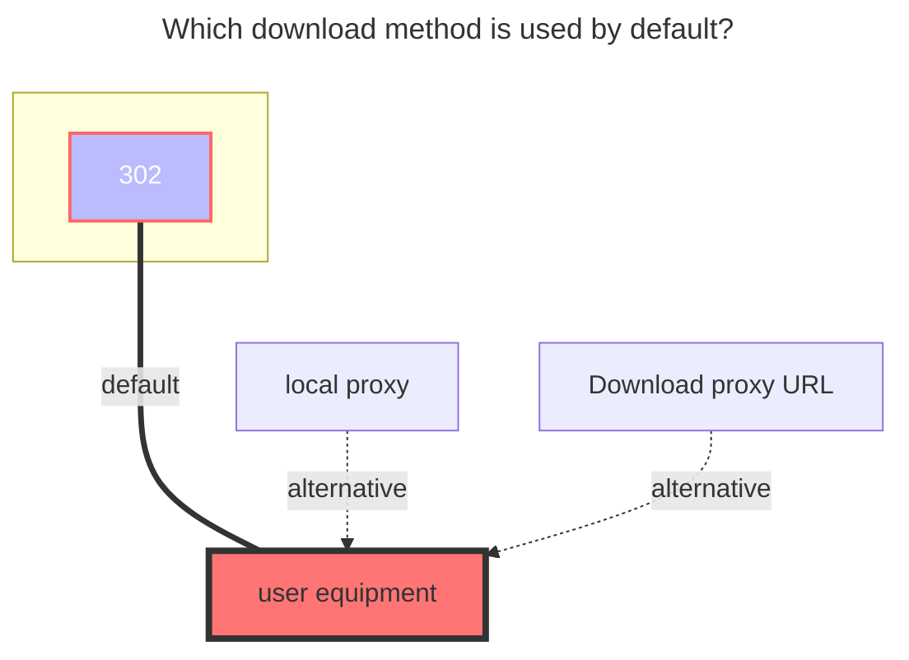
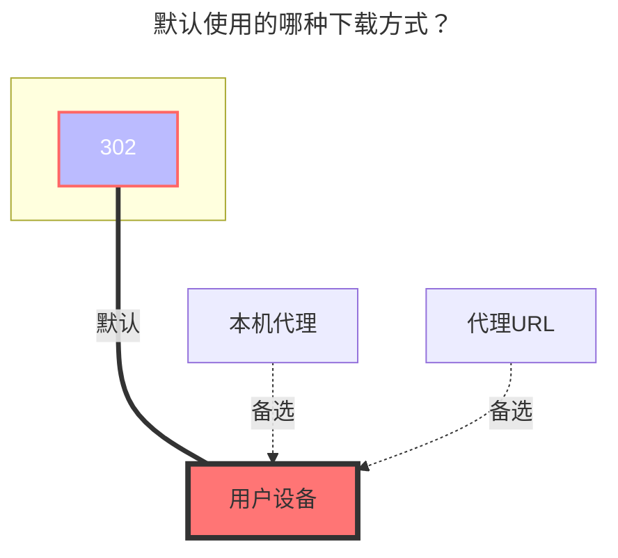

---
title:
  en: PikPak / Share
  zh-CN: PikPak / 分享
icon: iconfont icon-state
# This control sidebar order
top: 290
# A page can have multiple categories
categories:
  - guide
  - drivers
# A page can have multiple tags
tag:
  - Storage
  - Guide
  - '302'
# this page is sticky in article list
sticky: true
# this page will appear in starred articles
star: true
---

::: en
::: danger

1. `Pikpak`：Who makes the request, who can use it
   - For example, if you build an OpenList on the server with IP `1.1.1.1`, but your own IP is `2.2.2.2`, you cannot play or download it.
   - Or enable Proxy policy

2. `PikPak Share`：There is a size limit. After the specified file size is exceeded, only 40%~50% can be played.
   - The specific size of the file is currently unknown

:::

::: zh-CN
::: danger

1. `个人Pikpak`：谁发出请求谁能用
   - 例如你在 IP `1.1.1.1`服务器搭建的OpenList，但是你本人IP是`2.2.2.2`，无法播放下载
   - 或者开启代理中转策略

2. `分享Pikpak`：有大小限制，超出指定文件大小后只能播放40%~50%
   - 具体多大文件暂时未知具体数值

:::

## 1. PikPak { lang="en" }

## 1. PikPak挂载 { lang="zh-CN" }

### Username { lang="en" }

### 用户名 { lang="zh-CN" }

::: en
email or phone?
:::
::: zh-CN
邮件地址或者电话号码？
:::

### Password { lang="en" }

### 密码 { lang="zh-CN" }

::: en
password
:::
::: zh-CN
密码
:::

### Root folder id { lang="en" }

### 根文件夹ID { lang="zh-CN" }

::: en
Can get with https://mypikpak.com/ , default `root`.

:::
::: zh-CN
可以通过 https://mypikpak.com/ 获取，默认为 `root`。

:::

### Platform { lang="en" }

### 平台 { lang="zh-CN" }

::: en
It is not necessary to use it under normal circumstances, but you may need to use it when you cannot log in directly with your account and password.

- If you choose `android`, it will simulate the Android client for access. If you want to log in using the `Refresh token`, please perform packet-sniffing on the **official Android app**.

- If you choose `web`, it will simulate the official web version for access. If you want to log in using the `Refresh token`, please use the `Refresh token` obtained from the **web version**.

:::
::: zh-CN
正常情况下不需要使用，遇到无法直接使用帐号密码登录的情况下可能需要使用

- 如果选择 `android`，则会模拟 安卓客户端 进行访问，如果想使用 `Refresh token` 进行登录，请对 `官方安卓端APP` 进行抓包

- 如果选择 `web`，则会模拟 官方网页端 进行访问，如果想使用 `Refresh token` 进行登录，请使用 `Web端` 获取的 `Refresh token`

:::

### Refresh token { lang="en" }

### 刷新令牌 { lang="zh-CN" }

::: en
After filling in the account and password, select `Oauth2` for `Refresh token method` and then save to automatically fill in the refresh token and device information.
:::
::: zh-CN
填写帐号和密码后，`刷新令牌方法`选择 `Oauth2` 然后保存就会自动填充刷新令牌、设备信息
:::

#### Get Refresh Token on Web { lang="en" }

#### Web端 Refresh Token 的获取 { lang="zh-CN" }

::: en
After logging into the official website, open the F12 console and navigate to the page shown in the image below (using Chrome as an example):

Find the option that starts with `credentials`. Select it, and observe the information bar below. From there, you can retrieve the `Refresh token`, as shown in the image below:

:::
::: zh-CN
在官方网页登录后，打开F12控制台，进入下图中的页面（以 Chrome 为例）

找到以credentials开头的选项，选中后，观察下方的信息栏，从中可以获取到Refresh token，如下图所示

:::

### Disable media link { lang="en" }

### 禁用媒体链接 { lang="zh-CN" }

::: en

The OpenList interface uses the playback interface. When the file resolution is too high or the file size is too large, Pikpak will automatically transcode, which may cause synchronization errors in other applications. Enabling this option will prevent using the playback interface to obtain the address.

According to the official limitations, when the video's bitrate exceeds 40 Mbps or the file size is greater than 50 GB, the system will automatically trigger transcoding. If the video already offers other resolution options, the "original quality" resolution will not be available.

:::
::: zh-CN

OpenList 接口使用的是播放接口。当文件分辨率过高或文件过大时，Pikpak 会自动进行转码，这可能导致其他应用在同步时出现错误。启用此选项将不使用播放接口获取地址.

根据官方限制，当视频的码率超过 40 Mbps 或文件大于 50 GB 时，系统会自动触发转码。若视频已提供其他清晰度选项，则不会提供“原画”清晰度。

:::

### Offline Download { lang="en" }

### 离线下载 { lang="zh-CN" }

::: en
support calling `Pikpak` offline download function in OpenList

Select `Pikpak` in the lower right corner and select `Pikpak` for offline download options

- Support: `magne`, `http`, `ed2k` links
- Also supports: X, TikTok, Facebook, TG URL links

- Only Pikpak is supported for offline download. If it is not Pikpak, the following error message will be displayed, Although the offline download prompt was successfully added, an error will be prompted in the background.

  unsupported storage driver for offline download, only Pikpak is supported

  

:::
::: zh-CN
支持在OpenList调用`Pikpak`离线下载功能

右下角选择离线下载选项选择`Pikpak`

- 支持：`magne`、`http`、 `ed2k` 链接
- 也支持：X、TikTok、Facebook、TG的网址链接
- 仅支持使用Pikpak离线下载，非Pikpak会提示如下错误，**虽然添加离线下载提示成功但是在后台会提示错误**

  unsupported storage driver for offline download, only Pikpak is supported

  

:::

## 2. PikPak Share { lang="en" }

## 2. PikPak分享挂载 { lang="zh-CN" }

::: en
::: warning
It is known that PikPak Share can only see 40%-50%
:::
::: zh-CN
::: warning
已知目前pikpak分享只能看40%-50%
:::

::: en
You only need to fill in **`Username`, `Password`, `Shared ID`** three items, **root folder ID** can be written or not, if not written, the default is the root directory (root directory)

- Root folder ID: If it is a multi-layer directory, which directory do you want to display as the root directory, you can write which root directory.
- Sharing password: if there is a password to share, write it, if not, don’t write it

:::

::: zh-CN
只需要填写 `用户名` ，`密码`，`分享ID` 三项即可 ，**根文件夹ID** 可写可不写，不写默认为root目录（根目录）

- 根文件夹ID：如果是多层目录，你想让哪个目录展示当根目录你就写哪个根目录.
- 分享密码：分享的有密码就写，没有就不写

:::

### Use transcoding address { lang="en" }

### 使用转码地址 { lang="zh-CN" }

::: en
Not enabled by default. When enabled, the download address will use the **transcoded address**, and you can get the **complete transcoded file**

- After turning on the `Use transcoding address` option, you cannot use the `OpenList` web version to play the video, but you can **download it normally** or **use a third-party player**

:::
::: zh-CN
默认不启用，打开后 下载地址将使用**转码后的地址**，可获取 **完整的转码后的文件**

- 打开 `使用转码地址` 选项后，无法使用 `OpenList` 网页版播放视频，但**可正常下载**或**使用第三方播放器**

:::

### Batch add PikPak shared mounts { lang="en" }

### 批量添加PikPak分享挂载 { lang="zh-CN" }

::: en
software used：**https://github.com/yzbtdiy/alist_batch**
:::
::: zh-CN
使用的软件：**https://github.com/yzbtdiy/alist_batch**
:::

<BiliBili bvid="BV1Ps4y1U7Zu" ratio="16:9" low-quality no-danmaku />

## Precautions { lang="en" }

## 注意事项 { lang="zh-CN" }

::: en
**Q**: Encountering verification code issues

**A**:

- The method has now been adjusted to use `oauth2` for token refresh.
- The username and password are now only used for login to obtain the `Refresh token` and generate the `DeviceID`.
- When encountering the issue `Your operation is too frequent, please try again later`, please try logging in using **third-party authorization** (such as Google login) on the **official web version** or **official Android app**. Afterward, **obtain the `Refresh token` for mounting** — note the selection of the `Platform` at this time.

:::
::: zh-CN
**Q**：遇到验证码问题

**A**：

- 现在调整为使用 `oauth2` 方式来进行令牌的刷新
- 账号、密码 现在仅用于登录来获取 `Refresh token` 以及 `DeviceID` 的生成
- 遇到 `Your operation is too frequent, please try again later` 问题时，请尝试**在 `官方网页版` 或 `官方安卓端APP` 使用第三方授权**（例如：谷歌授权登录）进行登录，之后**获取 `Refresh token` 进行挂载**————注意 此时`Platform`的选用

:::

---

::: en
**Q**: Encountering the following situation: `Failed load storage: failed init storage: Your operation is too frequent, please try again later`

**A**: This means that the access has been too frequent, and the account/IP will be unable to log in for a period of time. Note: After this occurs, **you can log in to the official client normally using third-party authorization**. Also, **using this IP to request any account may trigger the issue again**, so you could try logging in using the `Refresh token` method (though it is not guaranteed to be effective).
:::
::: zh-CN
**Q**：出现下图情况：`Failed load storage: failed init storage: Your operation is too frequent, please try again later`

**A**：说明访问过于频繁，该账号/IP将在一段时间内无法登录。注意：出现此情况后，**使用第三方授权可正常登录官方客户端**。同时，**使用该IP请求任何账号都有几率再次出现此问题**，可尝试使用`Refresh token`方式登录（不保证有效）
:::

---

::: en
**Q**: Encountering the `Click Here` prompt

**A**: Please click on it, then open F12 or launch a packet-sniffing tool. Complete the CAPTCHA as shown in the image below, obtain the `captcha_token`, and enter it into the driver's `Captcha token` field. After saving, the driver should work normally — **this applies to cases where login is done with username and password**.

:::
::: zh-CN
**Q**：出现 `Click Here` 提示

**A**：请点击进入，然后先打开F12或启动抓包软件，然后完成滑动验证码，如下图所示，获取`captcha_token`，填入驱动的`Captcha token`字段后，保存，此时驱动应该正常工作——**适用于使用账号密码登录的情况**

:::

---

::: en
:::
::: zh-CN
**Q**：出现下面的报错：`invalid refresh token for it may be has been refreshed by other process, more info redis: nil`

**A**：情况一： 则表明 `Refresh token` 无效，请重新获取；情况二：`Platform`：选择错误，请更换选项
:::

---

::: en
**Q**: Prompt when adding storage: **Failed init storage: invalid_account_or_password** What should I do, the password I entered is correct

**A**: If the account password is not filled in incorrectly, it may be that you used Google, FB and other third-party quick registration when you registered. Although it seems that the account is a Google mailbox, you cannot log in with the mailbox, but you must use the first Three-party verification, **Alist** does not support this kind of jumping to third-party verification, **so you need to bind an email address in the account settings and set a login password**, or register a new account
:::
::: zh-CN
**Q**：添加存储时提示：**Failed init storage: invalid_account_or_password** 怎么办，我输入的密码的对的

**A**：如果不是账号密码填错，可能是注册的时候使用了Google，FB等第三方快捷注册，虽然看起来账号是谷歌邮箱，但实际上是不能用邮箱登入，而必须使用第三方验证，**Alist** 现在还不支持这种跳转到第三方的验证，**所以你要在账号设置里绑定一个邮箱同时设置一下登录密码**，或者重新注册一个新账号
:::

---

::: en
**Q**: Prompt when adding mount: **failed get objs: failed to list objs: Sorry, sharing is not available in the current region**

**A**: Because access to ^PikPak^ is prohibited in China, just use a proxy for `OpenList`, how to make `OpenList` use a proxy [**One of the reference solutions, this method is limited to Windows build**](https://anwen-anyi.github.io/index/07-wenti.html#_41-alist%E5%A6%82%E4%BD%95-%E4%BD%BF%E7%94%A8-%E5%90%83%E5%88%B0-%E4%BB%A3%E7%90%86-proxy)
:::
::: zh-CN
**Q**：添加挂载时提示：**failed get objs: failed to list objs: Sorry, sharing is not available in the current region**

**A**：因为在国内^PikPak^是禁止访问的，给`OpenList`使用代理即可，如何让`OpenList`使用代理[**参考方案之一,此方法仅限于Windows搭建**](https://anwen-anyi.github.io/index/07-wenti.html#_41-alist%E5%A6%82%E4%BD%95-%E4%BD%BF%E7%94%A8-%E5%90%83%E5%88%B0-%E4%BB%A3%E7%90%86-proxy)
:::

## The default download method used { lang="en" }

## 默认使用的下载方式 { lang="zh-CN" }

::: en

:::
::: zh-CN

:::
