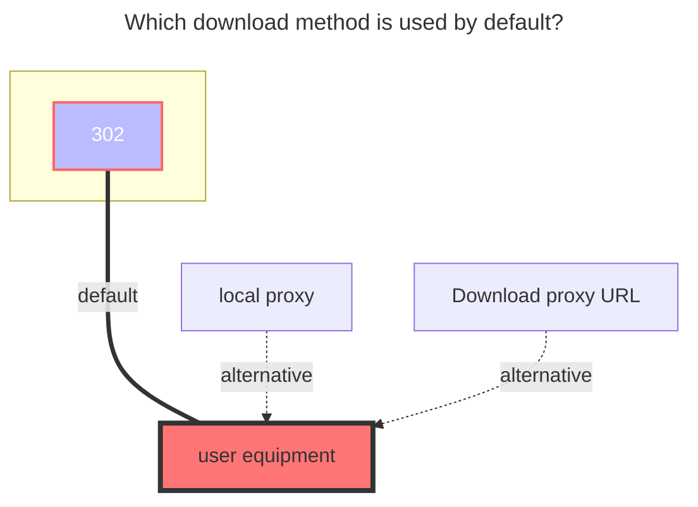
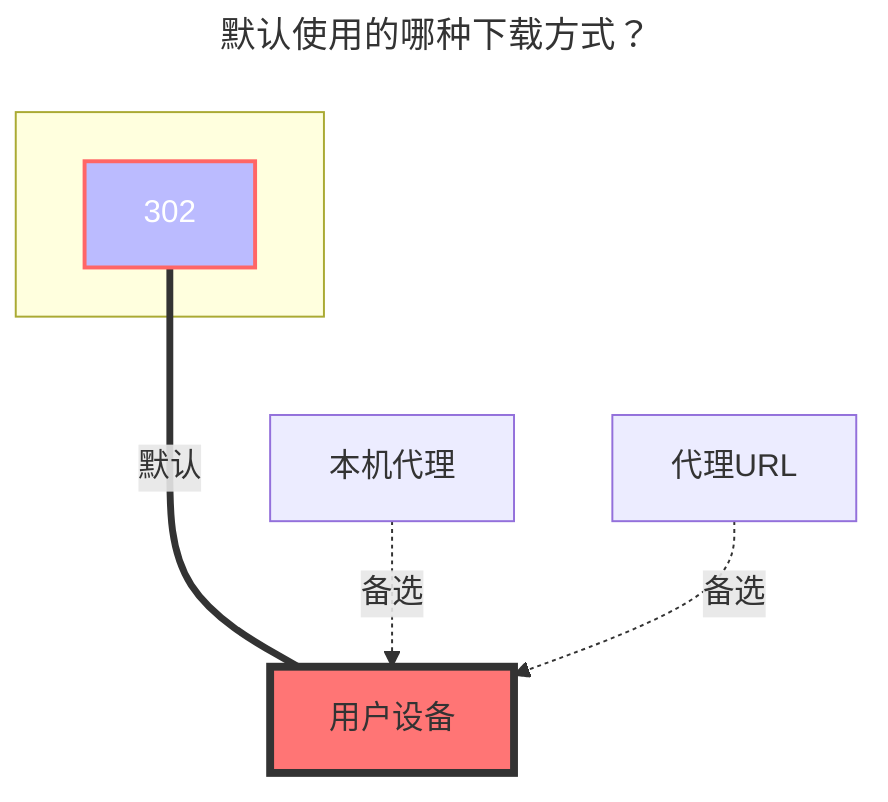

---
title:
  en: S3
  zh-CN: 对象存储（S3）
icon: iconfont icon-state
# This control sidebar order
top: 340
# A page can have multiple categories
categories:
  - guide
  - drivers
---

::: en
S3 object storage protocols, such as COS, OSS, B2, etc.
:::
::: zh-CN
S3 对象存储协议，如 COS、OSS、B2。
:::

## Bucketang="en" }

## 存储桶ang="zh-CN" }

::: en
bucket name
:::
::: zh-CN
存储桶名
:::

## Endpointang="en" }

## Endpointang="zh-CN" }

::: en
Endpoint address (If you don’t know, you can read the official documents below)
:::
::: zh-CN
Endpoint address（不知道可以看下方的官方文档）
:::

## Regionang="en" }

## 地区ang="zh-CN" }

::: en
area (If you don’t know, you can read the official documents below)
:::
::: zh-CN
地区（不知道可以看下方的官方文档）
:::

## Access key idang="en" }

## 访问密钥 idang="zh-CN" }

::: en
Access key id
:::
::: zh-CN
Access key id
:::

## Secret access keyang="en" }

## 安全访问密钥ang="zh-CN" }

::: en
Secret access key
:::
::: zh-CN
Secret access key
:::

## Session tokenang="en" }

## 会话令牌ang="zh-CN" }

::: en
Session token，Normally, the three-segment token needs to be used, and the two-segment token does not need to fill in this option.
:::
::: zh-CN
会话令牌，三段式token需要使用，正常是两段式不需要填写
:::

## Custom hostang="en" }

## 自定义 Hostang="zh-CN" }

::: en
Custom cdn acceleration domain name
:::
::: zh-CN
自定义 CDN 加速域名
:::

## Enable custom host presignang="en" }

## 启用自定义 HOST 签名ang="zh-CN" }

::: en
When "Custom host" is left blank, this option does not function.

When disabled: The returned URL does not include signature, which is suitable for cases where the custom host is a CDN.

When enabled: The returned URL includes signature, which is suitable for cases where the host and OSS are from the same data center, the Endpoint is an internal access domain within the data center, and the custom host is an external access domain.
:::
::: zh-CN
不填写“自定义 Host”时本选项无效。

关闭时：返回的URL后不接签名信息，适用于自定义Host是CDN的情况。

启用时：返回的URL后接签名信息，适用于主机和对象存储服务来自同一个机房，Endpoint是机房内部访问域名，自定义Host是外部访问域名的情况。
:::

## Sign url expireang="en" }

## 签名链接有效期ang="zh-CN" }

::: en
The validity period of the signed download address is 4 hours by default. If a custom accelerated domain name is used, this option is invalid.
:::
::: zh-CN
签名下载地址的有效期默认为 4 小时。 如果使用自定义加速域名，该选项无效。
:::

## Placeholderang="en" }

## 占位文件名ang="zh-CN" }

::: en
The name of placeholder file.
:::
::: zh-CN
占位符文件的名称。
:::

## Force path styleang="en" }

## 强制路径样式ang="zh-CN" }

::: en
If enable ForcePathStyle, usually needed for minio.
:::
::: zh-CN
是否启用 `ForcePathStyle`，通常是 minio 需要的。
:::

## List object versionang="en" }

## 列出对象版本ang="zh-CN" }

::: en
Refer to s3 sdk documents.
:::
::: zh-CN
参见 S3 的 SDK 文档。
:::

## Remove bucketang="en" }

## 移除bucketang="zh-CN" }

::: en
Remove bucket name from path when using custom host.
:::
::: zh-CN
使用自定义主机时从路径中删除bucket名称。
:::

## Add filename to dispositionang="en" }

## 添加filename到dispositionang="zh-CN" }

::: en
Add filename to Content-Disposition header.
:::
::: zh-CN
添加filename到Content-Disposition头中。
:::

## Add object storage examples and official documentsang="en" }

## 添加对象存储示例及官方文档ang="zh-CN" }

::: en
`S3 Object Storage` includes but is not limited to these. There are many more, such as Microsoft and Google, which have not been added. There are no examples here because it is difficult to register and activate and cannot provide example tutorials. If you have an account, please contact us and provide an account and I will add it.
:::
::: zh-CN
`对象存储`包含但不限于只有这些，还有很多例如微软谷歌没有添加，这里没有示例是因为注册开通困难无法提供示例教程，如果您有帐号欢迎联系提供帐号我来添加
:::

### Alibaba { lang="en" }

### 阿里云 { lang="zh-CN" }

::: en
[**Alibaba Cloud OSS Official Website**](https://oss.console.aliyun.com/)

[**Comparison Table of Endpoints in Different Regions of OSS under Public Cloud**](https://help.aliyun.com/document_detail/31837.html)
:::
::: en
::: tip
OpenList needs to skip `referer` to mount **Alibaba Cloud Disk**. If you do not allow `referer` to be empty in anti-leech, it will not work, because Alibaba Cloud Disk uses Alibaba Cloud OSS (in Beijing area)

In fact, the `Region|Region` option can be written as `Endpoint`, but for the sake of specification, let’s write it according to the comparison table.:::
:::
::: zh-CN
[**阿里云OSS官网**](https://oss.console.aliyun.com/)

[**公共云下OSS各地域Endpoint对照表**](https://help.aliyun.com/document_detail/31837.html)
:::
::: zh-CN
::: tip
OpenList 挂载**阿里云盘**需要跳过 `referer` ，若你在防盗链开启不允许 `referer` 为空的话会无法使用，因为阿里云盘用的就是阿里云OSS（北京地区的）

其实 `地区|Region` 选项写 `Endpoint` 一样的也可以用，但是为了规范还是照着对照表写吧。
:::
::: en
Fill in example:


:::
::: zh-CN
填写示例：


:::

### Tencent { lang="en" }

### 腾讯云 { lang="zh-CN" }

::: zh-CN
[**腾讯云COS官网**](https://console.cloud.tencent.com/cos)

[**公共云下COS各地域Endpoint对照表**](https://cloud.tencent.com/document/product/436/6224)

填写示例：


:::
::: en
[**Tencent Cloud COS Official Website**](https://console.cloud.tencent.com/cos)

[**Collection Table of Endpoints in Each Region of COS under the Public Cloud**](https://cloud.tencent.com/document/product/436/6224)

Fill in example:


:::

### VolcEngine { lang="en" }

### 火山引擎 { lang="zh-CN" }

::: zh-CN
[**火山引擎TOS官网**](https://console.volcengine.com/tos)

[**公共云下TOS各地域Endpoint对照表**](https://www.volcengine.com/docs/6349/107356)

填写示例：


:::
::: en
[**VolcEngine TOS Official Website**](https://console.volcengine.com/tos)

[**Collection Table of Endpoints in Each Region of COS under the Public Cloud**](https://www.volcengine.com/docs/6349/107356)

Fill in example:


:::

### Tianyi { lang="en" }

### 天翼云 { lang="zh-CN" }

::: zh-CN
[**天翼云OOS官网**](https://oos-cn.ctyun.cn/oos/ctyun/consoleBucket.html)

[**公共云下OOS各地域Endpoint对照表**](https://www.ctyun.cn/document/10026693/10027878)

填写示例：


:::
::: en
[**Tianyi Cloud OOS Official Website**](https://oos-cn.ctyun.cn/oos/ctyun/consoleBucket.html)

[**Comparison Table of Endpoints of OOS Regions under Public Cloud**](https://www.ctyun.cn/document/10026693/10027878)

Fill in example:


:::

### Baidu { lang="en" }

### 百度云 { lang="zh-CN" }

::: zh-CN
[**百度云BOS官网**](https://console.bce.baidu.com/bos)

[**自行配置Bucket的Referer白名单权限**](https://cloud.baidu.com/doc/BOS/s/Bk6kqu8eq#设置referer白名单)

[**公共云下BOS各地域Region和Endpoint对照表**](https://cloud.baidu.com/doc/BOS/s/akrqd2wcx)

**兼容AWS S3的Endpoint对照表**[**点击查看具体**](https://cloud.baidu.com/doc/BOS/s/xjwvyq9l4)

填写示例：


:::
::: en
[**Baidu Cloud BOS official website**](https://console.bce.baidu.com/bos)

[**Self-configure Bucket’s Referer whitelist permissions**](https://cloud.baidu.com/doc/BOS/s/Bk6kqu8eq#Setrefererwhitelist)

[**comparison table of Region and Endpoint of BOS under public cloud**](https://intl.cloud.baidu.com/doc/BOS/s/xjwvyq9l4-en)

**Endpoint comparison table compatible with AWS S3**[**Click to view details**](https://cloud.baidu.com/doc/BOS/s/xjwvyq9l4)

Fill in example:


:::

### Qiniu { lang="en" }

### 七牛云 { lang="zh-CN" }

::: zh-CN
[**七牛云Kodo官网**](https://portal.qiniu.com/kodo/bucket)

[**公共云下Kodo各地域Region和Endpoint对照表**](https://developer.qiniu.com/kodo/4088/s3-access-domainname)

填写示例：


:::
::: en
[**Qiniu Cloud Kodo official website**](https://portal.qiniu.com/kodo/bucket)

[**Region and Endpoint comparison table of Kodo under the public cloud**](https://developer.qiniu.com/kodo/4088/s3-access-domainname)

Fill in example:


:::

### Huawei { lang="en" }

### 华为云 { lang="zh-CN" }

::: zh-CN

[**华为云OBS官网**](https://console.huaweicloud.com/console/#/obs/manager/buckets)

[**公共云下OBS各地域Region和Endpoint对照表自行查看**](https://developer.huaweicloud.com/endpoint?OBS)对应的

秘钥AK/SK[获取](https://console.huaweicloud.com/iam/?region=cn-north-4&locale=zh-cn#/mine/accessKey)自行设置

填写示例：


:::
::: en
[**HUAWEI CLOUD OBS Official Website**](https://www.huaweicloud.com/intl/en-us/)

[**Check the Region and Endpoint comparison table of OBS under the public cloud**](https://developer.huaweicloud.com/intl/en-us/endpoint), the secret key AK/SK[acquire](https://console.huaweicloud.com/iam/?region=cn-north-4#/mine/accessKey) to set by yourself.

Fill in example:


:::

### JD { lang="en" }

### 京东云 { lang="zh-CN" }

::: zh-CN
[**京东云OSS官网**](https://www.jdcloud.com/cn/products/object-storage-service)

优点：[免费10G](https://www.jdcloud.com/cn/activity/oss)，支持IPV6

缺点：需要预充值100元才能开通，不推荐尝试，但是预存开通对象存储后提现依旧可以用。

[**公共云下OSS各地域Region和Endpoint对照表**](https://docs.jdcloud.com/cn/object-storage-service/oss-endpont-list)

填写示例：


:::
::: en
[**JD CLOUD OBS Official Website**](https://www.jdcloud.com/cn/products/object-storage-service)

Advantages: [free 10G](https://www.jdcloud.com/cn/activity/oss), support IPV6

Disadvantages: need to precharge 100 to open，However, after the pre-deposit is completed, the object storage is activated, and the pre-deposited amount can still be used after withdrawal.

[**Region and Endpoint comparison table of Kodo under the public cloud**](https://docs.jdcloud.com/cn/object-storage-service/oss-endpont-list)

Fill in example:


:::

### Doge { lang="en" }

### 多吉云 { lang="zh-CN" }

::: zh-CN
[**多吉云OSS官网**](https://www.dogecloud.com/product/oss)，如果要添加多吉云，请使用单独的`多吉云`驱动添加，请勿使用`对象存储`驱动

地区代码：

```json
// 0: 上海（华东），1: 北京（华北），2: 广州（华南），3: 成都（西南）
```


:::
::: en
[**Doge Cloud OSS Official Website**](https://www.dogecloud.com/product/oss)，If you want to add Doge, use a separate `DogeCloud` driver to add, please do not use the `S3` the driver

Region Code：

```json
// 0: 上海（华东），1: 北京（华北），2: 广州（华南），3: 成都（西南）
```


:::

### 139 { lang="en" }

### 移动云 { lang="zh-CN" }

::: zh-CN
[**移动云EOS官网**](https://console.ecloud.10086.cn/api/page/eos-console-web/CIDC-RP-00/eos/bucket?productType=os&v=new)

[**公共云下OSS各地域Region和Endpoint对照表**](https://ecloud.10086.cn/op-help-center/doc/article/48082)

填写示例：


:::
::: en
[**139 CLOUD EOS Official Website**](https://console.ecloud.10086.cn/api/page/eos-console-web/CIDC-RP-00/eos/bucket?productType=os&v=new)

[**Region and Endpoint comparison table of Kodo under the public cloud**](https://ecloud.10086.cn/op-help-center/doc/article/48082)

Fill in example:


:::

### upyun { lang="en" }

### 又拍云 { lang="zh-CN" }

::: zh-CN
[**又拍云USS官网**](https://console.upyun.com/services/file/)：[点击这里进行配置USS](./uss.md)
:::
::: en
[**Yupyun USS Official Website**](https://console.upyun.com/services/file/):[Click here to configure USS](./uss.md)
:::

### Amazon { lang="en" }

### 亚马逊 { lang="zh-CN" }

::: zh-CN
[**亚马逊S3官网**](https://s3.console.aws.amazon.com/s3/)

端点 URL 包含存储桶所在的区域名称

例1，如果您的存储桶位于美国东部（俄亥俄）区域

则 Endpoint (终端节点) URL 的格式为 **`s3.us-east-2.amazonaws.com/your-bucket-name`**

Region (地区)参数：**`us-east-2`**

存储桶名称：**`your-bucket-name`**（你自己的存储桶名称）

例2，我的的存储桶是`东京`的，存储桶名字叫 `cdn-aw`，那么完整的参数填写就是如下

1.  **Endpoint** ：s3.ap-northeast-1.amazonaws.com
2.  **地区**：ap-northeast-1
3.  **存储桶名称**：cdn-aw

下面我们看一下完整的参数填写示例吧

填写示例


:::

::: en
[**Amazon S3 Official Website**](https://s3.console.aws.amazon.com/s3/)

The endpoint URL contains the name of the region where the bucket is located

Example 1, if your bucket is in the US East (Ohio) region

Then the format of the Endpoint URL is **`s3.us-east-2.amazonaws.com/your-bucket-name`**

Region parameter: **`us-east-2`**

Bucket name: **`your-bucket-name`** (your own bucket name)

Example 2, my storage bucket is `Tokyo`, and the name of the storage bucket is `cdn-aw`, then the complete parameter filling is as follows

1.  **Endpoint**: s3.ap-northeast-1.amazonaws.com
2.  **Region**: ap-northeast-1
3.  **Bucket Name**: cdn-aw

Let's take a look at the complete parameter filling example

Fill in example:


:::

### Cloudflare R2 { lang="en" }

### Cloudflare R2 { lang="zh-CN" }

::: zh-CN
[**Cloudflare R2官网**](https://dash.cloudflare.com/)

**Endpoint**：S3 端点可通过 **`https://<ACCOUNT_ID>.r2.cloudflarestorage.com`** 端点使用

**`ACCOUNT_ID`** 就是你的账号ID，随处可见例如顶部地址栏链接后面的ID就是你账号ID

填写示例：


:::
::: en
[**Cloudflare R2 Official Website**](https://dash.cloudflare.com/)

**Endpoint**: The S3 endpoint is available via the **`https://<ACCOUNT_ID>.r2.cloudflarestorage.com`** endpoint.

**`ACCOUNT_ID`**: This account ID can be seen everywhere, and the simplest is the position at the top of the browser. The string of IDs behind the website link is your account ID.

填写示例：


:::

### Backblaze B2 { lang="en" }

### Backblaze B2 { lang="zh-CN" }

::: zh-CN
[**Backblaze官网**](https://secure.backblaze.com/b2_buckets.htm)

全称 **`Backblaze`**，不需要验证信息，说是前10G免费。

填写示例：


:::
::: en
[**B2 Official Website**](https://secure.backblaze.com/b2_buckets.htm)

The full name is **`Backblaze`**, no verification information is required, and it is said that the first 10G is free.

Fill in example:


:::

### Scaleway { lang="en" }

### Scaleway { lang="zh-CN" }

::: zh-CN
[**Scaleway官网**](https://console.scaleway.com/object-storage/buckets)

需要卡验证信息

[**公共云下Scaleway各地域Region和Endpoint对照表**](https://www.scaleway.com/en/docs/storage/object/concepts/#object-storage)

填写示例：


:::
::: en
[**Scaleway Official Website**](https://console.scaleway.com/object-storage/buckets)

Card required, verification information

[**Region and Endpoint comparison table of Kodo under the public cloud**](https://www.scaleway.com/en/docs/storage/object/concepts/#object-storage)

Fill in example:


:::

### Minio { lang="en" }

### Minio { lang="zh-CN" }

::: zh-CN
使用`Minio`自建对象存储的应该都知道，ID和秘钥如何获取，这里就不说了

只需要填写存储桶名称，访问秘钥ID，安全访问秘钥，Endpoint 这四个选项，地区空着即可

**Endpoint：`http(s)://your-server:9001/`**，可以使用IP也可以使用域名

最后记得打开 **`强制路径样式`** 才能使用，否则无法使用[点击查看详情](https://github.com/alist-org/alist/discussions/4920#discussioncomment-6635452)

填写示例：


:::
::: en
Those who use `Minio` self-built object storage should know how to obtain the ID and secret key, so I won’t talk about it here.

You only need to fill in the four options of bucket name, access key ID, security access key, and Endpoint, and leave the region empty.

**Endpoint：`http(s)://your-server:9001/`**, You can use IP or domain name

Finally, remember to enable **`Force Path Style`** to use, otherwise it cannot be used [Click to view details](https://github.com/alist-org/alist/discussions/4920#discussioncomment-6635452)

Fill in example:


:::

### Google Cloud { lang="en" }

::: en
I assume you already have a Google Cloud account, so let’s go directly to the Google Cloud Storage settings page: <https://console.cloud.google.com/storage/settings;tab=interoperability>

Then you will enter the following page:


You can see Endpoint and Access Key on this page, you need to select an account and create an Access Key


Access Key/Secret will be displayed on the new page, They will only be displayed this time. Please save them properly.


At this point, the EndPoint, access key Id, and security access key required by OpenList have been obtained. Please view the remaining buckets and regions in the corresponding buckets.


:::

### Google Cloud { lang="zh-CN" }

::: zh-CN
默认你已经有Google Cloud的账号了，那么我们直接进入 Google Cloud Storage的设置页面：<https://console.cloud.google.com/storage/settings;tab=interoperability>

然后会进入下面这个页面


在这个页面我们可以很明显的看到 Endpoint 和 Access Key，我这里因为已经创建的有一个AK/SK了，如果你没有，直接点下面的创建即可，点了创建，会提示你执行账户，我这因为账号问题，有两个，正常情况下只有一个，你选了账户后，点创建


然后就会出现Access Key/Secret 了，它俩分别对应OpenList的 访问密钥 Id 和 安全访问密钥，这个只显示一次，一定要复制并保存到本地


到这里，OpenList所需要的 EndPoint 、访问密钥 Id、安全访问密钥 就获取到了，剩余的 存储桶和地区，请在存储桶里面查看


:::

### Intranet accessang="en" }

### 内网接入ang="zh-CN" }

::: en
The server and object storage need to be in the same region, currently only supports `Alibaba Cloud OSS`. For example, if you are `Alibaba Cloud Hangzhou Server` and `Alibaba OSS in Hangzhou`, you can use it.

- Previous behavior (taking Aliyun OSS as an example):
  - Download link without custom host (using internal endpoint):

    ```
    https://<bucket-name>.oss-cn-beijing-internal.aliyuncs.com/<filename>?X-Amz-Algorithm=***&X-Amz-Credential=***...
    ```

  - Download link within custom host (using external endpoint, the following link is **invalid**):

    ```
    https://<bucket-name>.oss-cn-beijing.aliyuncs.com/<filename>
    ```

- Current behavior when `EnableCustomHostPresign` is `false`: Same as previous

- Current behavior when `EnableCustomHostPresign` is `true` :
  - Download link within custom host (using external endpoint, the following link is **valid**):

    ```
    https://<bucket-name>.oss-cn-beijing.aliyuncs.com/<filename>?X-Amz-Algorithm=***&X-Amz-Credential=***...
    ```

:::
::: zh-CN
服务器和对象存储需要同一地域，目前仅支持`阿里云OSS`。例如你是`阿里云杭州服务器` 和 `杭州地区的对象存储` 就可以使用。

- 之前的行为（以阿里云 OSS 为例）：
  - 没有自定义主机的下载链接（使用内部端点）：

    ```
    https://<bucket-name>.oss-cn-beijing-internal.aliyuncs.com/<filename>?X-Amz-Algorithm=***&X-Amz-Credential=***...
    ```

  - 使用自定义主机的下载链接（使用外部端点，以下链接**无效**）：

    ```
    https://<bucket-name>.oss-cn-beijing.aliyuncs.com/<filename>
    ```

- 当前行为，当 `EnableCustomHostPresign` 为 `false` 时：与之前相同

- 当前行为，当 `EnableCustomHostPresign` 为 `true` 时：
  - 使用自定义主机的下载链接（使用外部端点，以下链接**有效**）：

    ```
    https://<bucket-name>.oss-cn-beijing.aliyuncs.com/<filename>?X-Amz-Algorithm=***&X-Amz-Credential=***...
    ```

:::

### How to solve the problem of files with the same name as the folderang="en" }

### 出现和文件夹同名文件如何解决ang="zh-CN" }

::: en
After mounting the object storage and opening the folder, there is always a file with the same name as the folder that cannot be deleted or opened

- The solution is to change the `List object version` in the configuration to V2, as shown in the following figure
  

:::
::: zh-CN
挂载对象存储后打开文件夹后总是会出现一个和文件夹名一样的文件无法删除也无法打开

- 解决办法把配置里面的 `列出对象版本` 换成V2就可以，参考如下图所示
  

:::

### The default download method usedang="en" }

### 默认使用的下载方式ang="zh-CN" }

::: en



:::
::: zh-CN



:::
