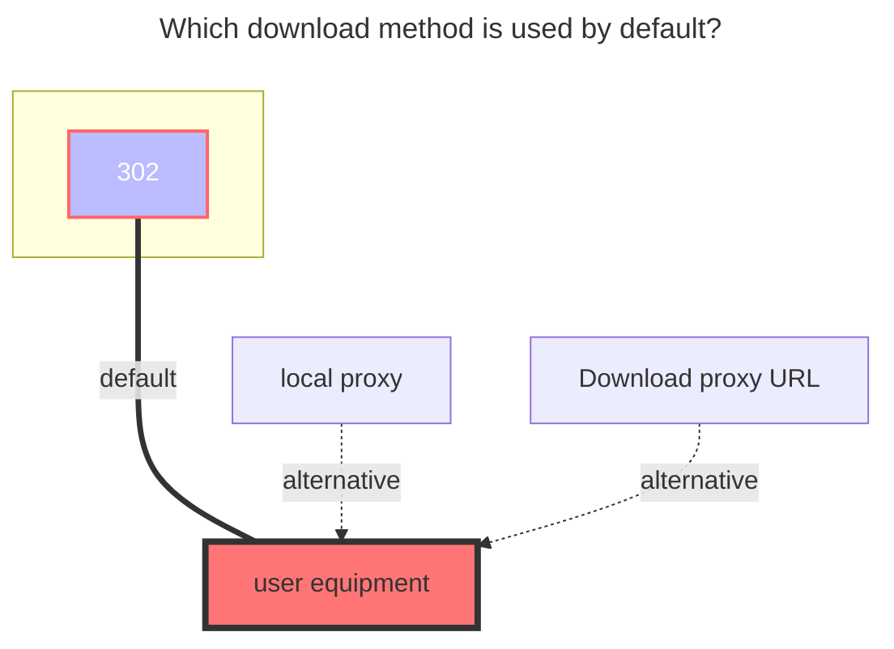
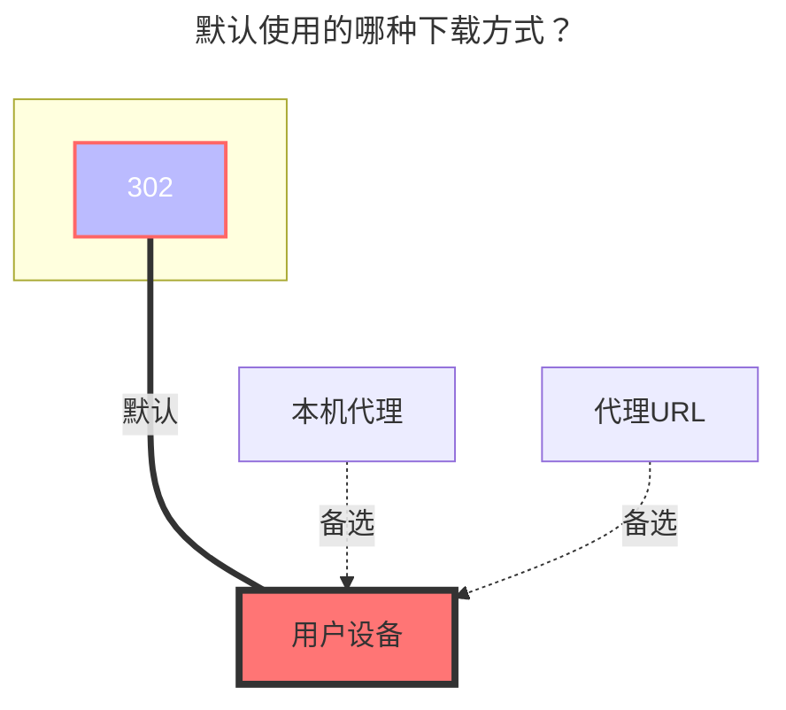

---
title:
  en: Seafile
  zh-CN: Seafile
icon: iconfont icon-state
# This control sidebar order
top: 150
# A page can have multiple categories
categories:
  - guide
  - drivers
# A page can have multiple tags
tag:
  - Storage
  - Guide
  - '302'
# this page is sticky in article list
sticky: true
# this page will appear in starred articles
star: true
---

::: en
Seafile uses libraries as a unit for version control and synchronization.
Use this driver to mount a Seafile repository to Alist, encrypted libraries are supported.
:::
::: zh-CN
Seafile 是以资料库为单位进行版本控制和同步的开源云盘。
使用本驱动可以挂载 Seafile 的资料库到 Alist，已支持访问加密资料库。
:::

## **Root folder path** { lang="en" }

## **根文件夹ID** { lang="zh-CN" }

::: en

1. If the `RepoId` is not set, this configuration specifies the name and sub-path of the library to access, defaulting to the root path: `/`, indicating displaying all libraries. Suppose you have a library named `example`, if you only want to mount the contents of this library, you can set this item to `/example`; if you only want to display a directory named `abc` within this library, you can set this item to `/example/abc`, and so on.
2. If the `RepoId` is set, this configuration is used to set the directory within the specified library, defaulting to the root directory: `/`.
   :::
   ::: zh-CN
   1、如果未设置资料库ID（RepoId），则该配置可指定要访问的资料库的名称与子路径，默认为根路径：`/`，表示展示所有资料库。假设你有一个资料库名为 `example`，如果你只想挂载该资料库的内容，可以将本项设为 `/example`；如果你只想展示该资料库内一个名为 `abc` 的目录，则可以将本项设置为 `/example/abc` ，以此类推。
   2、如果设置了资料库ID（RepoId），则该配置用来设置指定资料库内的目录，默认为根目录：`/`。
   :::

## **Address** { lang="en" }

## **地址** { lang="zh-CN" }

::: en
Your Seafile server address, e.g.

- `https://seacloud.cc`
- `http://192.168.1.24:8000`
  :::
  ::: zh-CN
  你的 Seafile 服务器地址，形如：
- `https://seacloud.cc`
- `http://192.168.1.24:8000`
  :::

## **Username** { lang="en" }

## **用户名** { lang="zh-CN" }

::: en
The email or username used to log in to your Seafile server.
:::
::: zh-CN
用于登录你的 Seafile 服务器的邮箱或用户名。
:::

## **Password** { lang="en" }

## **密码** { lang="zh-CN" }

::: en
The password for your email or username.
:::
::: zh-CN
邮箱或用户名对应的密码。
:::

## **RepoId (Library ID)** { lang="en" }

## **RepoId（资料库ID）** { lang="zh-CN" }

::: en
Seafile library ID, such as: `86fc6316-3f2a-4c64-b6f5-d4d2b341bc9a`

> Open the Seafile library in a browser, and you can see the library ID in the address bar.
> Can be left empty, if left empty, all visible libraries for the specified account will be displayed.
> :::
> ::: zh-CN
> Seafile 资料库ID，形如：`86fc6316-3f2a-4c64-b6f5-d4d2b341bc9a`
> 在浏览器中打开Seafile资料库，即可在地址栏中看到资料库ID。
> 可留空不填，不填则展示指定账号所有可见的资料库。
> :::

## **RepoPwd (Library Password)** { lang="en" }

## **RepoPwd（资料库密码）** { lang="zh-CN" }

::: en
Set the password used to access encrypted libraries, leave blank if no encrypted libraries are present.
After configuring this item, Alist will use this password to access all encrypted libraries for the specified account, without affecting access to unencrypted libraries. If you have multiple encrypted libraries using the same password, they can all be accessed normally.
Different passwords for different libraries within a storage are not currently supported. If you have such a requirement, you can add multiple Seafile storage to achieve this, allowing you to specify different passwords for accessing different encrypted libraries.

> If you still cannot access files within encrypted libraries after setting the library password, please check if the password and other configurations above are correct. It is recommended to restart Alist after modifying this password configuration to avoid caching issues.
> :::
> ::: zh-CN
> 设置用来访问加密资料库的密码，如果没有加密资料库请留空。
> 配置该项后 Alist 将会用此密码访问指定账号所有已加密的资料库，不会影响未加密资料库的访问。如果你有多个加密资料库使用了相同的密码则均可以正常访问。
> 暂不支持在一个存储内对不同的资料库配置不同的密码进行访问，如果你有这种需求，可以添加多个 Seafile 存储来实现，这样就可以对不同的加密资料库指定不同的密码进行访问。
> 如果设置了资料库密码后仍无法访问加密资料库内的文件，请检查密码及上面的其他配置是否有误，建议修改此密码配置后重新启动 Alist，避免缓存的影响。
> :::

### **The default download method used** { lang="en" }

### **默认使用的下载方式** { lang="zh-CN" }

::: en

:::
::: zh-CN

:::
