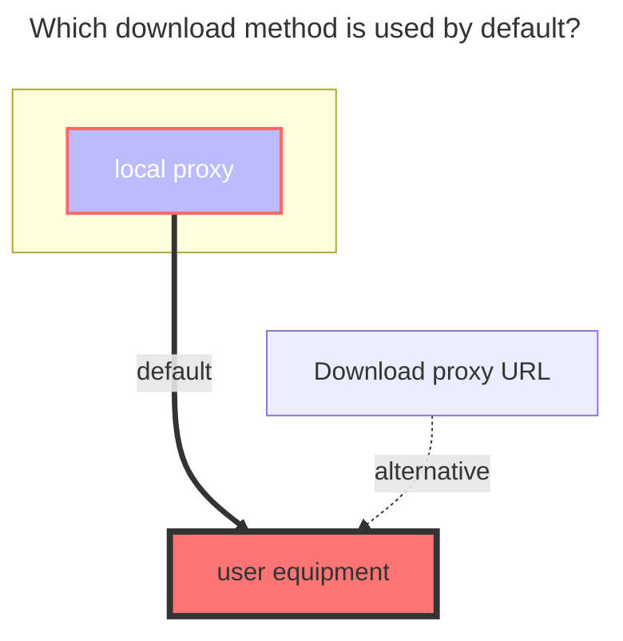
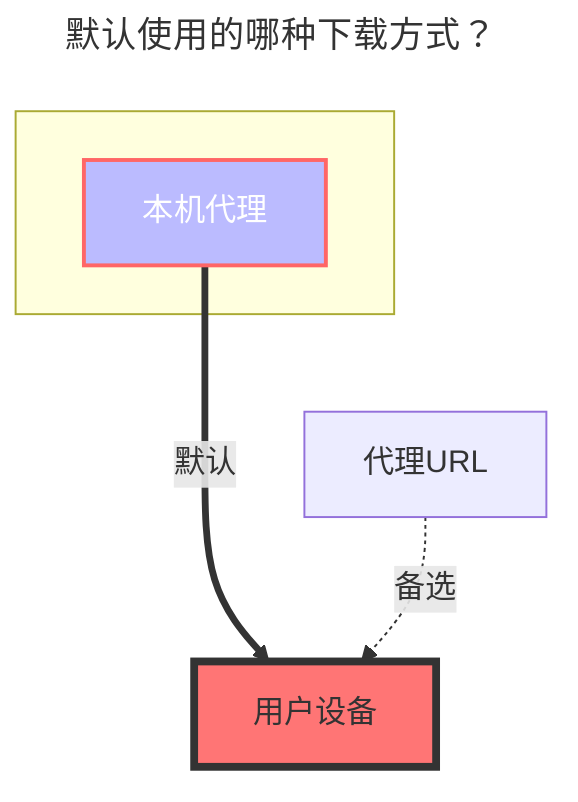

---
title:
  en: SMB
  zh-CN: SMB
icon: iconfont icon-state
# This control sidebar order
top: 190
# A page can have multiple categories
categories:
  - guide
  - drivers
# A page can have multiple tags
tag:
  - Storage
  - Guide
  - '本地代理'
# this page is sticky in article list
sticky: true
# this page will appear in starred articles
star: true
---

::: en
It is to mount smb to Alist, instead of sharing Alist through smb, instead of sharing smb like webdav.
Because there are no related equipment and services, it is impossible to test. You can test it yourself according to the method provided in the **`GitHub Discussions`** discussion
**https://github.com/alist-org/alist/discussions/2215#discussioncomment-4104018**
Wait for the more detailed tutorials to be supplemented after the relevant equipment or services are available, or wait for the PR of the boss who has no problem with the test.
:::
::: zh-CN
是把smb挂载到Alist，而不是Alist通过smb共享出来，而不是smb能像webdav共享出来。
因无相关设备和服务，无法测试，可以根据 **GitHub Discussions** 讨论中提供的办法自行测试一下
**https://github.com/alist-org/alist/discussions/2215#discussioncomment-4104018**
等待有了相关设备或服务后更详情的教程再进行补充，或者等待测试没问题的大佬pr。
:::

### **The default download method used** { lang="en" }

### **默认使用的下载方式** { lang="zh-CN" }

::: en

:::
::: zh-CN

:::
