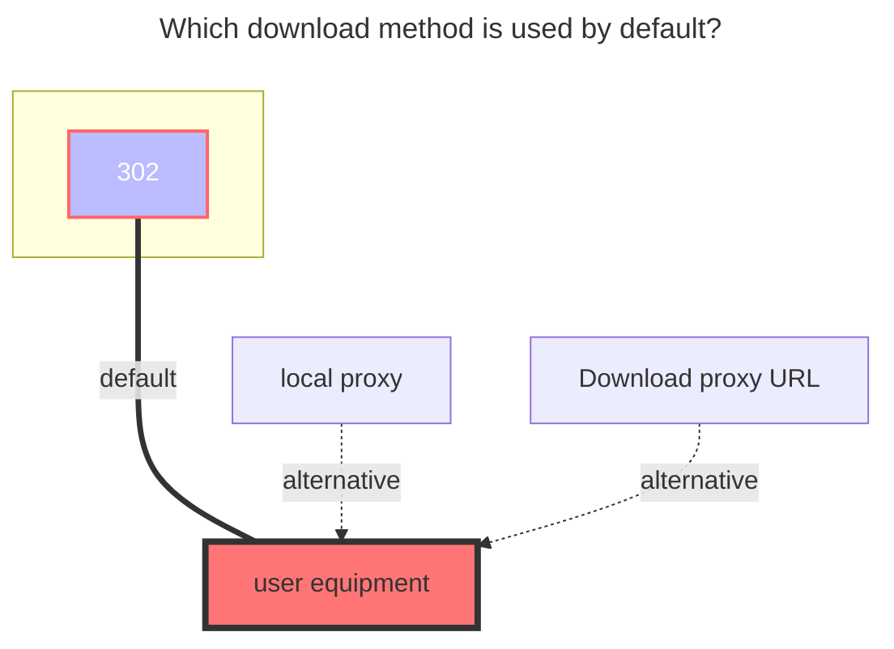
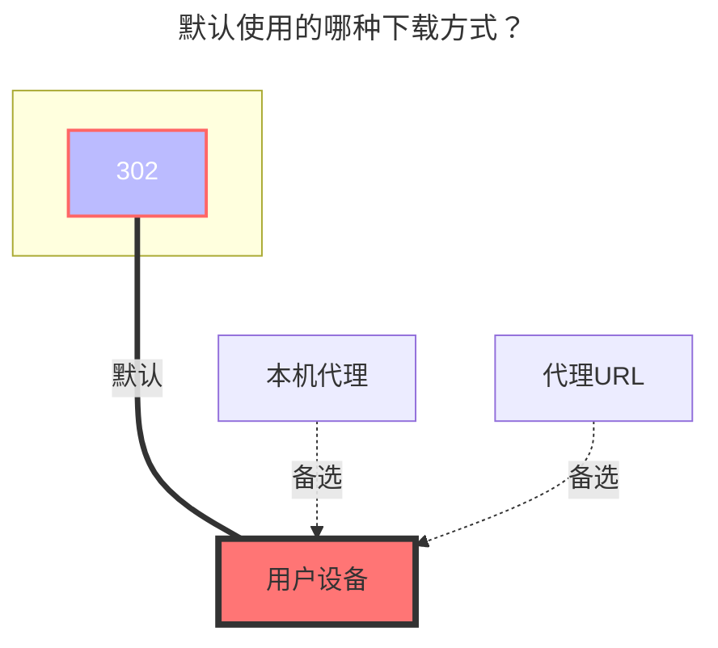

---
title:
  en: Terabox
  zh-CN: Terabox(海外百度)
icon: iconfont icon-state
# This control sidebar order
top: 40
# A page can have multiple categories
categories:
  - guide
  - drivers
# A page can have multiple tags
tag:
  - Storage
  - Guide
  - '302'
# this page is sticky in article list
sticky: true
# this page will appear in starred articles
star: true
---

## **refresh token** { lang="en" }

## **刷新令牌** { lang="zh-CN" }

::: en
~~[**Click here to log in**](https://www.terabox.com/) to obtain a refresh token~~
Since F12 is currently disabled on the web page, we can first open F12 on another page and turn on the `Network` → `Preserve log` option.
<br/>
Then enter https://www.terabox.com in the address bar of this tab to enter the webpage, you can see the reserved request, and then find **`Cookie`** from the reserved request.

<br/>
:::
::: zh-CN
~~[**点此登录**](https://www.terabox.com/)进行获取刷新令牌，随意找一个请求即可找到 **`Cookie`**~~
由于目前网页端已经禁用了F12，我们可以先在别的页面打开F12将 `网络` → `保留日志` 选项打开
<br/>
然后在从这个标签页地址栏输入 https://www.terabox.com 进入网页，就能看到保留的请求，再从保留的请求找找到 **`Cookie`**

<br/>
:::

## **Download api** { lang="en" }

## **下载接口** { lang="zh-CN" }

::: en
**Download api needs to choose ==`Crack`==** ，before you can use ^(v3.29)^
<br/>
:::
::: zh-CN
**下载接口需要选择 ==`非官方`==** ，才可以使用 ^(v3.29)^
<br/>
:::

## **Root folder id** { lang="en" }

## **根文件夹ID** { lang="zh-CN" }

::: en

- Root folder id is `/`
- Mount other single subdirectories, put a picture for reference
  - 
            <br/>

:::

::: zh-CN

- 根目录为 `/`
- 挂载其他单个子目录，放一张图参考一下吧
  - 
            <br/>

:::

## **Download error using Proxy Url link** { lang="en" }

## **使用Proxy Url链接下载错误** { lang="zh-CN" }

::: en
Using [**Proxy Url**](common.md#download-proxy-url) to download error

```json
{
  "error_code": 31211,
  "error_msg": "access denied"
}
```

View specific reasons：**[https://github.com/alist-org/alist/issues/6508](https://github.com/alist-org/alist/issues/6508#issuecomment-2171762705)**
<br/>
:::
::: zh-CN
使用了[**Proxy Url**](common.md#下载代理-url)进行下载报错

```json
{
  "error_code": 31211,
  "error_msg": "access denied"
}
```

具体原因查看：**[https://github.com/alist-org/alist/issues/6508](https://github.com/alist-org/alist/issues/6508#issuecomment-2171762705)**
<br/>
:::

### **The default download method used** { lang="en" }

### **默认使用的下载方式** { lang="zh-CN" }

::: en



:::
::: zh-CN



:::
