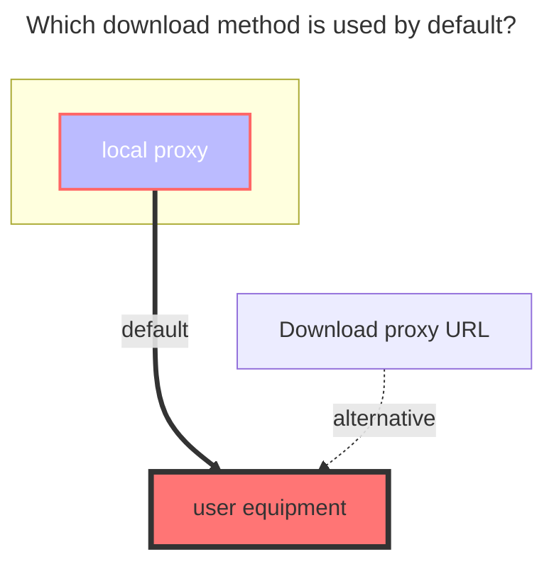
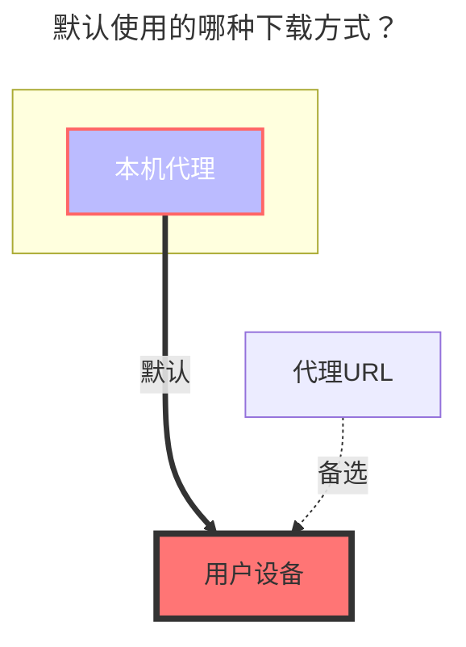
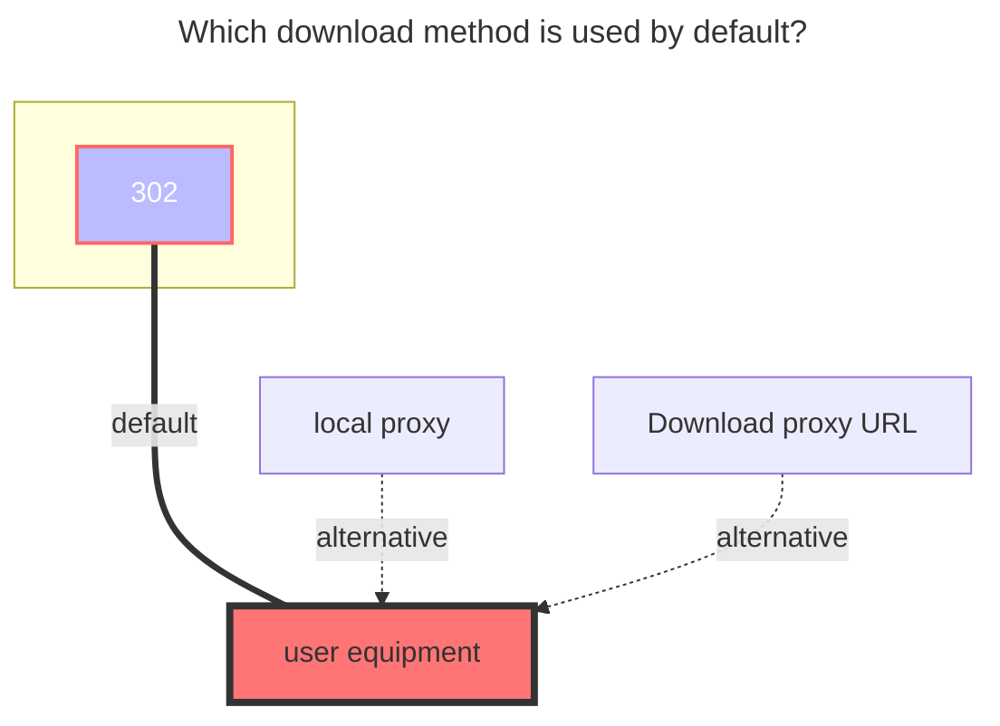
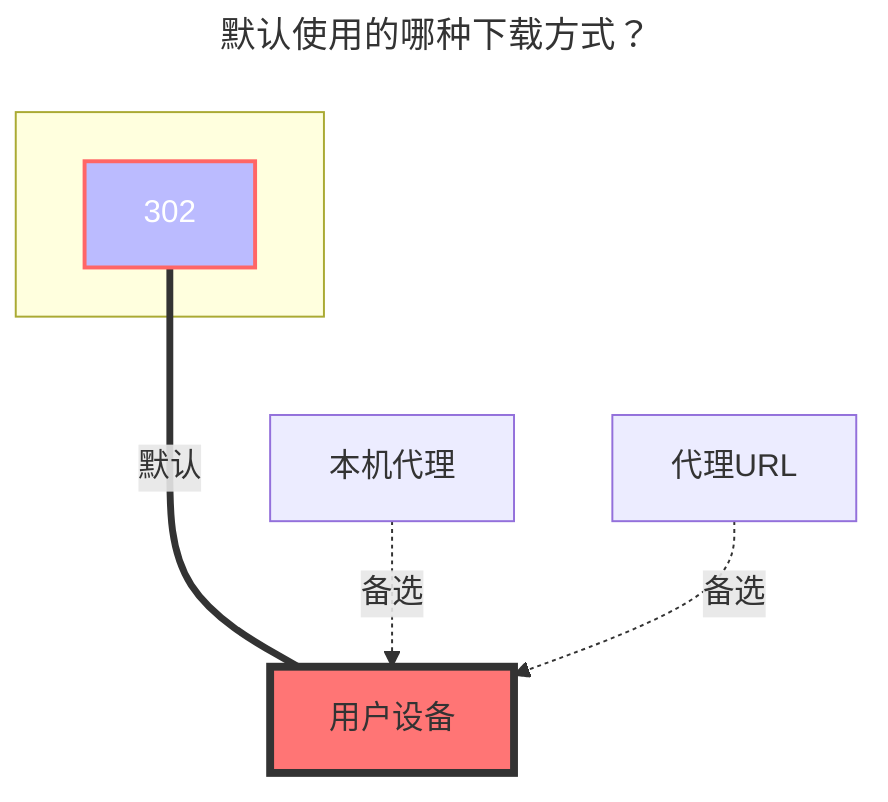

---
title:
  en: Thunder Cloud Disk
  zh-CN: 迅雷云盘 / X / 浏览器
icon: iconfont icon-state
# This control sidebar order
top: 270
# A page can have multiple categories
categories:
  - guide
  - drivers
---

::: en
::: tip
Please use Thunder directly instead of ThunderExpert if you are not good at it.
ThunderExpert mainly provides more free settings and realizes more login methods

---

Thunder X serves overseas users. As of the time of document release, only the Android version is available. Other versions have not yet been released.

- Thunder X has sufficient speed even without membership. Future changes are unknown.
- Using the APP may require a proxy, but not when mounted on OpenList.

---

Thunder Browser：Currently only supports mobile phones (Android, iOS)

- **https://x.xunlei.com/**
- If you log in to OpenList, the mobile phone will be kicked offline. On the contrary, if you log in to OpenList first and then log in to the mobile phone, OpenList will be kicked offline but there will be no prompt
  :::
  :::
  ::: zh-CN
  ::: tip
  迅雷 前两个是服务国内用户
  小白请直接使用 迅雷不要使用 `迅雷专家版`
  `迅雷专家版`主要提供更自由的设置,实现更多登录方式

---

迅雷 X 服务海外用户，截止文档发布时只有 安卓版其它版本暂未发布

- 迅雷 X 目前未开启会员的速度也符合使用情况，后期更改暂时未知
- 使用APP可能需要 Proxy，挂载在OpenList不需要

---

迅雷浏览器：目前仅支持手机端（Android、iOS）

- **https://x.xunlei.com/**
- 如果在OpenList登录后会将手机端踢下线，反之如果先在OpenList登录再登录手机，会将OpenList踢下线但是没有提示
  :::

## 1.Thunder { lang="en" }

## 1.迅雷 { lang="zh-CN" }

### **username** { lang="en" }

### **用户名** { lang="zh-CN" }

::: en
That is, the mobile phone number, email, and username used for login (there is a probability that you cannot log in, you need to try)

- You need to bring the `+86` area code, for example +8613722223333 fill in like this
  :::
  ::: zh-CN
  即用于登陆的手机号,邮箱,用户名(有概率无法登录,需要尝试)

1. 在获取验证码之前填写手机号先不要携带 `+86` 区号
2. 获取验证码后填写需要携带 `+86` 区号，例如 +8613722223333 这样填写
   :::
   <br/>

### **密码** { lang="zh-CN" }

### **password** { lang="en" }

::: en
password for login
:::
::: zh-CN
即用于登陆的密码
:::
<br/>

### **信用密钥** { lang="zh-CN" }

### **Credit Key** { lang="en" }

::: en
After saving for the first time, an error will occur. This is normal. Please go to the storage management interface.

Copy all the content above.
[Click here to enter](https://i.xunlei.com/xlcaptcha/android.html)
After entering, open the developer tools (usually by pressing F12), go to the console, and enter `reviewCb()`. **Paste all the previously copied content, including the curly braces,** inside the parentheses, as shown below:

Move the cursor to **after the parentheses** and press Enter.

The webpage will automatically redirect to the mobile number verification page.
After completing the verification, the page **will not** refresh automatically. Please check the console. The `creditkey` shown below is the required key.

Copy it to the storage management, and you can mount it normally.
<br/>
:::
::: zh-CN
在第一次保存后会产生报错，这是正常的，请返回存储管理界面

复制以上所有内容
[点我进入](https://i.xunlei.com/xlcaptcha/android.html)
进入之后，打开开发者界面（一般来说按F12），进入控制台，输入`reviewCb()`,在括号间**粘贴全部包括大括号**在内的之前所有复制内容，如下图所示

将光标移动至**括号后面**再按回车。

网页会自动转至手机号验证界面，
完成验证后，网页**不会**自动刷新，请在控制台中检查，如下图所示的`creditkey`就是需要的密钥。

将其复制到存储管理后即可正常挂载
<br/>
:::

### **默认使用的下载方式** { lang="zh-CN" }

### **The default download method used** { lang="en" }

::: en



:::

::: zh-CN



:::

## 2.迅雷专家版 { lang="zh-CN" }

## 2.ThunderExpert { lang="en" }

:::tip
If Xunlei needs to download, you must specify UserAgent (same as DownUserAgent below)
Or use the proxy function in this program to transfer.
:::
::: zh-CN
::: tip
迅雷如果需要下载必须指定 UserAgent(同下 DownUserAgent)
或使用本程序中的代理功能进行中转。
:::

### **登录类型** { lang="zh-CN" }

### **Login Type** { lang="en" }

::: en

1. When selecting User, you only need to fill in the username and password
   - User You need to bring the `+86` area code, for example +8613722223333 fill in like this
2. **RefreshToken**: Just fill in RefreshToken when selecting RefreshToken
   :::
   ::: zh-CN
3. 选择 `用户名` 时填用户名和密码
   - 用户名需要携带 `+86` 区号，例如 +8613722223333 这样填写
4. 选择 `刷新令牌`时只需填写 `刷新令牌`
   :::
   <br/>

### **签名类型** { lang="zh-CN" }

### **Signature Type** { lang="en" }

::: en
**Algorithms**：When selecting Algorithms, just fill in the Algorithms (it is difficult to obtain, and needs to be reversed)
**Captcha sign**: Only fill in CaptchaSign and Timestamp when selecting CaptchaSign

```
//signature algorithm
str = ClientID + ClientVersion + PackageName + DeviceID + Timestamp
for (Algorithm in Algorithms) {
    str = md5(str + Algorithm)
}
CaptchaSign = "1." + str
```

Login type and Sign type recommended options

<br/>
:::
::: zh-CN
选择 `算法` 时需填写 `算法`(比较难获取,需要逆向)
选择 `验证码签名` 时只需填写 `验证码签名` 和 `时间戳`

```
//签名算法
str = ClientID + ClientVersion + PackageName + DeviceID + Timestamp
for (Algorithm in Algorithms) {
    str = md5(str + Algorithm)
}
CaptchaSign = "1." + str
```

登录类型(Login type) 和 签名类型(Sign type) 推荐选择选项

<br/>
:::

### **设备ID** { lang="zh-CN" }

### **DeviceID** { lang="en" }

::: en
The value calculated by md5 is used to determine the logged in device
:::

::: zh-CN
通过 MD5 计算的值，用于判断登录的设备
:::

### **客户端ID, 客户端秘钥, 客户端版本, 包名** { lang="zh-CN" }

### **ClientID, ClientSecret, ClientVersion, PackageName** { lang="en" }

::: en
It is related to the signature, fill in according to the actual situation
:::
::: zh-CN
与签名有关，根据实际情况填写
:::

### **用户代理** { lang="zh-CN" }

### **UserAgent** { lang="en" }

::: en
UserAgent used by API requests, may be inaccessible or speed limited if the setting is incorrect
:::
::: zh-CN
API 请求使用的 UserAgent，设置错误可能无法访问或限速
:::

### **下载用户代理** { lang="zh-CN" }

### **DownUserAgent** { lang="en" }

::: en
The User Agent used for downloading, if the setting is wrong, it will not be downloaded (it will be used when the agent is turned on) Fixed parameters:
**Mozilla/5.0 (Windows NT 10.0; Win64; x64) AppleWebKit/537.36 (KHTML, like Gecko) Chrome/67.0.3396.99 Safari/537.36**
<br/>
:::
::: zh-CN
下载时用到的 User Agent，如果设置错误会无法下载(开启代理会使用) 固定参数：
`Mozilla/5.0 (Windows NT 10.0; Win64; x64) AppleWebKit/537.36 (KHTML, like Gecko) Chrome/67.0.3396.99 Safari/537.36`
<br/>
:::

### **关键数据获取流程** { lang="zh-CN" }

### **Key data acquisition process** { lang="en" }

::: en
Obtain Xunlei request data through network analysis tools (packet capture tools) --- Please read the following information carefully
Open Xunlei and log in to your account (the picture below uses the PC client to operate, and the web terminal is also available)
Included in the request https://xluser-ssl.xunlei.com/v1/shield/captcha/init
CaptchaSign, Timestamp, DeviceID, ClientID, ClientVersion, PackageName, User-Agent
**Note**: After obtaining the information of the two pictures, slowly select the data from the two data captured and fill in it
After logging in to Thunder and opening the packet capture tool, it is possible that the information of **v1/shield/captcha/init** cannot be immediately obtained at this time.
Do not close the Xunlei PC client and the packet capture tool, just wait, it will refresh automatically after **5 minutes**
You will see the parameters as shown in the figure below, and you can fill in it according to the acquisition (if you can't see it clearly, you can right-click to copy the picture and link it to the browser to open a new window)
See **v1/shield/captcha/init** and grab it, please **immediately don't delay for a second** Right-click Xunlei in the taskbar in the lower right corner to exit, exit completely and then reopen to get \* \*Figure II**

Restarting Thunder will refresh the token
The request to https://xluser-ssl.xunlei.com/v1/auth/token contains RefreshToken (please use the returned value), ClientSecret (does not exist on the web side)

Figure 1 contains **7** parameters | Figure 1 contains **2** parameters | a fixed parameter (Down UserAgent), ten parameters and 3 options and a mount path, just write and save, before saving Remember to check~
<br/>
:::
::: zh-CN
通过网络分析工具(抓包工具)获取迅雷请求数据
打开迅雷并登录账号（下图使用的是 PC 客户端来操作的，Web 端也可以）
请求 https://xluser-ssl.xunlei.com/v1/shield/captcha/init 中包含
CaptchaSign、Timestamp、DeviceID、ClientID、ClientVersion、PackageName、User-Agent
注：获取好两张图信息后再慢慢的从抓到的两条数据内挑选数据填进去
登录迅雷 打开抓包工具后，这时候可能，不能立马获取到 `v1/shield/captcha/init` 的信息，
迅雷 PC 客户端 和抓包工具不要关闭，等待即可，**5 分钟左右** 就会自动刷新
就会看到如下图的参数 照着获取填写即可(看不清的话可以右键复制图片链接到浏览器新开个窗口打开)
看到 `v1/shield/captcha/init` 抓取到后 请**立刻马上不要耽误一秒钟** 把迅雷在右下角任务栏的迅雷右键点击退出，彻底退出 然后重新打开 获取到**图二**

重启迅雷会刷新 token
请求 https://xluser-ssl.xunlei.com/v1/auth/token 中包含 RefreshToken（请使用返回的值）、ClientSecret（web 端不存在）

图一包含 **7 条** 参数 | 图一包含 **2 条\*\* 参数 | 一条固定参数(Down UserAgent) ，十条参数 和 3 个选项 以及一个挂载路径，写好保存即可，保存前记得检查喔~~
<br/>
:::

### **使用视频URL** { lang="zh-CN" }

::: zh-CN

- **https://github.com/AlistGo/alist/pull/6464#issuecomment-2124306443**
  <br/>
  :::

### **迅雷专家版 完整的参数填演示图** { lang="zh-CN" }

### **ThunderExpert complete parameter filling demo:** { lang="en" }

::: en

<br/>
:::
::: zh-CN

<br/>
:::

### **默认使用的下载方式** { lang="zh-CN" }

### **The default download method used** { lang="en" }

::: en



:::
::: zh-CN



## 3.Thunder X { lang="en" }

## 3.迅雷 X { lang="zh-CN" }

::: zh-CN
::: danger
目前官方对于频繁调用接口行为会进行封号处理，请谨慎使用，后果自负。
:::
::: en
::: danger
At present, the official will ban frequent API calls. Please use with caution and bear the consequences.
:::

### **用户名、密码** { lang="zh-CN" }

### **username、password** { lang="en" }

::: en
The mailbox and password used for login
<br/>
:::
::: zh-CN
即用于登陆的邮箱和密码
<br/>
:::

### **验证码** { lang="zh-CN" }

### **CaptchaToken** { lang="en" }

::: en
It will be filled automatically without filling in manually
<br/>
:::
::: zh-CN
会自动填充，不用自己填写
<br/>
:::

### **根文件夹ID** { lang="zh-CN" }

### **Root folder id** { lang="en" }

::: en
The default is the full directory of the empty display, If you want to use a subfolder to make the root directory, grab the request to get it

- In the request in the package`https://api-pan.xunleix.com/drive/v1/files?parent_id=&page_token=&filters=`，you can get the following parameters
  - `文件夹ID（id）`
  - `文件夹名称（name）`
  - `父文件夹ID（parent_id）`
- The `folder ID` obtained in the root directory (for example : `我接收的文件`、`我的云盘`、`高速云下载`), **This will change with different account numbers, there is no the same value, In the request in the package**
  
  <br/>
  :::
  ::: zh-CN
  默认为空展示全部目录，如果想用子文件夹做根目录请抓包获取
- 抓包请求中的`https://api-pan.xunleix.com/drive/v1/files?parent_id=&page_token=&filters=`，可以得到下面参数
  - `文件夹ID（id）`
  - `文件夹名称（name）`
  - `父文件夹ID（parent_id）`
- 根目录下获取的`文件夹ID（Folder id）`（例如：`我接收的文件`、`我的云盘`、`高速云下载`），**这个会随着账号不同而变动，没有通用的值，自己抓包获取**
  
  <br/>
  :::

### **使用视频URL** { lang="zh-CN" }

### **Use video url** { lang="en" }

::: en

- **https://github.com/AlistGo/alist/pull/6464#issuecomment-2124306443**
  <br/>
  :::
  ::: zh-CN
- **https://github.com/AlistGo/alist/pull/6464#issuecomment-2124306443**
  <br/>
  :::

### **默认使用的下载方式** { lang="zh-CN" }

### **The default download method used** { lang="en" }

::: en


:::
::: zh-CN


:::

## 4.迅雷 X 专家版 { lang="zh-CN" }

## 4.Thunder X Expert { lang="en" }

::: en
::: danger
At present, the official will ban frequent API calls. Please use with caution and bear the consequences.
:::
::: zh-CN
::: danger
目前官方对于频繁调用接口行为会进行封号处理，请谨慎使用，后果自负。
:::

### **用户名、密码** { lang="zh-CN" }

### **username、password** { lang="en" }

::: en
The mailbox and password used for login
<br/>
:::
::: zh-CN
即用于登陆的邮箱和密码
<br/>
:::

### **验证码** { lang="zh-CN" }

### **CaptchaToken** { lang="en" }

::: en
It will be filled automatically without filling in manually
<br/>
:::
::: zh-CN
会自动填充，不用自己填写
<br/>
:::

### **根文件夹ID** { lang="zh-CN" }

### **Root folder id** { lang="en" }

::: en
The default is the full directory of the empty display, If you want to use a subfolder to make the root directory, grab the request to get it

- In the request in the package`https://api-pan.xunleix.com/drive/v1/files?parent_id=&page_token=&filters=`，you can get the following parameters
  - `文件夹ID（id）`
  - `文件夹名称（name）`
  - `父文件夹ID（parent_id）`
- The `folder ID` obtained in the root directory (for example : `我接收的文件`、`我的云盘`、`高速云下载`), **This will change with different account numbers, there is no the same value, In the request in the package**
  
  <br/>
  :::
  ::: zh-CN
  默认为空展示全部目录，如果想用子文件夹做根目录请抓包获取
- 抓包请求中的`https://api-pan.xunleix.com/drive/v1/files?parent_id=&page_token=&filters=`，可以得到下面参数
  - `文件夹ID（id）`
  - `文件夹名称（name）`
  - `父文件夹ID（parent_id）`
- 根目录下获取的`文件夹ID（Folder id）`（例如：`我接收的文件`、`我的云盘`、`高速云下载`），**这个会随着账号不同而变动，没有固定一样的值，自己抓包获取**
  
  <br/>
  :::

### **登录类型** { lang="zh-CN" }

### **Login Type** { lang="en" }

::: en

- `User`: Only fill in the username and password
- `Refresh token`: Just fill in`RefreshToken`
  <br/>
  :::
  ::: zh-CN
- `用户`：选择 `用户`时填`用户名和密码`
- `刷新令牌`：选择 `刷新令牌` 时只需填写 `刷新令牌`
  <br/>
  :::

### **签名类型** { lang="zh-CN" }

### **Sign Type** { lang="en" }

::: en

- `Algorithms`：Choose `Algorithms` Just fill in `Algorithms` (It has been automatically filled. You do n’t have to fill in it yourself. You only need to fill in the username and password.When the algorithm is not invalidated)
- `Captcha sign`: Choose `Captcha sign` Just fill in `Captcha sign` and `Timestamp`
  <br/>
  :::

::: zh-CN

- `算法`：选择 `算法（Algorithms）` 时需填写 `算法（Algorithms）`
- `验证码签名`：选择 `验证码签名（Captcha sign）` 时只需填写 `验证码签名（Captcha sign）` 和 `时间戳（Timestamp）`
  <br/>
  :::

### **部分参数抓包说明** { lang="zh-CN" }

### **Part of parameter Packet Capture description** { lang="en" }

::: en

- `Captcha token` ：No need to fill in
- `Device id`：The value calculated by MD5 is used to judge the login device
- `Client id`, `Client secret`, `Client version`, `Package name`：It related to the signature, fill in according to the actual situation

---

- `User agent`：API requests `User agent`, setting errors may not access or speed limit
- `Download user agent`：When downloading, use the `user agent `,If the setting error cannot be downloaded (the agent will use it)
  - `User agent` and `Download user agent`：You can fill it out by yourself. If you don’t know how to fill it out, you can leave it blank and it will be automatically filled in.

---

In the request in the package `https://xluser-ssl.xunleix.com/v1/shield/captcha/init`，you can get the following parameters^6^

- `Client id`、`Device id`、`Captcha sign`
- `Package name`、`Client version`、`Timestamp`
  
  In the request in the package `https://xluser-ssl.xunleix.com/v1/auth/signin`, you can get the following parameters^2^
  - `Client id`、`Client secret`
    
    <br/>

:::

::: zh-CN

- `验证码` ：无需填写
- `设备id`：通过 MD5 计算的值，用于判断登录的设备
- `客户端ID`, `客户端密钥`, `客户端版本`, `包名`：与签名有关，根据实际情况填写

---

- `用户代理`：API 请求使用的 `用户代理`，设置错误可能无法访问或限速
- `下载用户代理`：下载时用到的 `用户代理`，如果设置错误会无法下载(开启代理会使用)
  - `用户代理` 和 `下载用户代理` 可以自己填写，如果不知道如何填写可以留空会自动填充

---

抓包请求中的`https://xluser-ssl.xunleix.com/v1/shield/captcha/init`，可以得到下面参数^6个^

- `客户端ID（Client id）`、`设备id（Device id）`、`验证码签名（Captcha sign）`
- `包名（Package name）`、`客户端版本（Client version）`、`时间戳（Timestamp）`
  
  抓包请求中的`https://xluser-ssl.xunleix.com/v1/auth/signin`，可以得到下面的参数^2个^
- `客户端ID（Client id）`、`客户端密钥（Client secret）`
  
  <br/>
  :::

### **使用视频URL** { lang="zh-CN" }

### **Use video url** { lang="en" }

::: en

- **https://github.com/AlistGo/alist/pull/6464#issuecomment-2124306443**
  <br/>
  :::
  ::: zh-CN
- **https://github.com/AlistGo/alist/pull/6464#issuecomment-2124306443**
  <br/>
  :::

### **默认使用的下载方式** { lang="zh-CN" }

### **The default download method used** { lang="en" }

::: en


:::
::: zh-CN


:::

## 5.迅雷浏览器 { lang="zh-CN" }

## 4.Thunder Browser { lang="en" }

### **用户名、密码** { lang="zh-CN" }

### **username、password** { lang="en" }

::: en
Mobile phone number, email, username, and password used to log in

- When filling in the mobile phone number, please bring the `+86` area code, for example `+8613822334455`
  <br/>
  :::
  ::: zh-CN
  即用于登陆的手机号,邮箱,用户名，以及密码
- 填写手机号要携带 `+86` 区号，例如 `+8613822334455`
  <br/>
  :::

### **验证码** { lang="zh-CN" }

### **CaptchaToken** { lang="en" }

::: en
It will be filled automatically without filling in manually
<br/>
:::
::: zh-CN
会自动填充，不用自己填写
<br/>
:::

### **根文件夹ID** { lang="zh-CN" }

### **Root folder id** { lang="en" }

::: en
The default is the full directory of the empty display, If you want to use a subfolder to make the root directory, grab the request to get it

- In the request in the package`https://x-api-pan.xunlei.com/drive/v1/files?parent_id&page_token&space=`，you can get the following parameters
  - `文件夹ID（id）`
  - `文件夹名称（name）`
  - `父文件夹ID（parent_id）`
- The `folder ID` obtained in the root directory (for example : `来自分享`、`超级保险箱`), **This will change with different account numbers, there is no the same value, In the request in the package**
  
  <br/>
  :::
  ::: zh-CN
  默认为空展示全部目录，如果想用子文件夹做根目录请抓包获取
- 抓包请求中的`https://x-api-pan.xunlei.com/drive/v1/files?parent_id&page_token&space=`，可以得到下面参数
  - `文件夹ID（id）`
  - `文件夹名称（name）`
  - `父文件夹ID（parent_id）`
- 根目录下获取的`文件夹ID（Folder id）`（例如：`来自分享`、`超级保险箱`），**这个会随着账号不同而变动，没有固定一样的值，自己抓包获取**
  
  <br/>
  :::

### **保险箱密码** { lang="zh-CN" }

### **Safe password** { lang="en" }

::: en
Thunder Browser Safe password

- Files in Safe password can only be deleted directly and cannot be deleted to the recycle bin, so the [**Deletion method**](#remove-way) below has nothing to do with this configuration.
  <br/>
  :::
  ::: zh-CN
  迅雷浏览器云盘的保险箱密码
- 超级保险箱內文件只能直接删除 无法删除到回收站，所以下方[**删除方式**](#删除方式)与此配置无关
  <br/>
  :::

### **删除方式** { lang="zh-CN" }

### **Remove way** { lang="en" }

::: en
**Trash**：Use OpenList to delete files and then move them to the Recycle Bin. If you delete them accidentally, you can restore them through Thunder Cloud Disk.
**Delete**：Deleting it directly cannot restore it.
<br/>
:::

### **Use video url** { lang="en" }

::: en

- When `Use video url` is turned on, some types of files may not be accessible properly.
- **https://github.com/AlistGo/alist/pull/6464#issuecomment-2124306443**
  <br/>
  :::
  ::: zh-CN
  **回收站**：在OpenList删除后移除到回收站，如果有误删可以通过迅雷云盘恢复
  **删除**：直接删除不可以恢复找回
  <br/>
  :::

### **使用视频URL** { lang="zh-CN" }

::: zh-CN

- 开启 `视频视频URL` 可能会遇到部分类型的文件无法正常访问
- **https://github.com/AlistGo/alist/pull/6464#issuecomment-2124306443**
  <br/>
  :::

### **默认使用的下载方式** { lang="zh-CN" }

### **The default download method used** { lang="en" }

::: en


:::
::: zh-CN


:::

## 6.迅雷浏览器专家版 { lang="zh-CN" }

## 6.Thunder Browser Expert { lang="en" }

### **用户名、密码** { lang="zh-CN" }

### **username、password** { lang="en" }

::: en
Mobile phone number, email, username, and password used to log in

- When filling in the mobile phone number, please bring the `+86` area code, for example `+8613822334455`
  <br/>
  :::
  ::: zh-CN
  即用于登陆的手机号,邮箱,用户名，以及密码
- 填写手机号要携带 `+86` 区号，例如 `+8613822334455`
  <br/>
  :::

### **验证码** { lang="zh-CN" }

### **CaptchaToken** { lang="en" }

::: en
It will be filled automatically without filling in manually
<br/>
:::
::: zh-CN
会自动填充，不用自己填写
<br/>
:::

### **根文件夹ID** { lang="zh-CN" }

### **Root folder id** { lang="en" }

::: en
The default is the full directory of the empty display, If you want to use a subfolder to make the root directory, grab the request to get it

- In the request in the package`https://x-api-pan.xunlei.com/drive/v1/files?parent_id&page_token&space=`，you can get the following parameters
  - `文件夹ID（id）`
  - `文件夹名称（name）`
  - `父文件夹ID（parent_id）`
- The `folder ID` obtained in the root directory (for example : `来自分享`、`超级保险箱`), **This will change with different account numbers, there is no the same value, In the request in the package**
  
  <br/>
  :::

::: zh-CN
默认为空展示全部目录，如果想用子文件夹做根目录请抓包获取

- 抓包请求中的`https://x-api-pan.xunlei.com/drive/v1/files?parent_id&page_token&space=`，可以得到下面参数
  - `文件夹ID（id）`
  - `文件夹名称（name）`
  - `父文件夹ID（parent_id）`
- 根目录下获取的`文件夹ID（Folder id）`（例如：`来自分享`、`超级保险箱`），**这个会随着账号不同而变动，没有固定一样的值，自己抓包获取**
  
  <br/>
  :::

### **保险箱密码** { lang="zh-CN" }

### **Safe password** { lang="en" }

::: en
Thunder Browser Safe password

- Files in Safe password can only be deleted directly and cannot be deleted to the recycle bin, so the [**Deletion method**](#remove-way-1) below has nothing to do with this configuration.
  <br/>
  :::
  ::: zh-CN
  迅雷浏览器云盘的保险箱密码
- 超级保险箱內文件只能直接删除 无法删除到回收站，所以下方[**删除方式**](#删除方式-1)与此配置无关
  <br/>
  :::

### **删除方式** { lang="zh-CN" }

### **Remove way** { lang="en" }

::: en
**Trash**：Use OpenList to delete files and then move them to the Recycle Bin. If you delete them accidentally, you can restore them through Thunder Cloud
**Delete**：Deleting it directly cannot restore it.
<br/>
:::
::: zh-CN
**回收站**：在OpenList删除后移除到回收站，如果有误删可以通过迅雷云盘恢复
**删除**：直接删除不可以恢复找回
<br/>
:::

### **登录类型** { lang="zh-CN" }

### **Login Type** { lang="en" }

::: en

- `User`: Only fill in the username and password
- `Refresh token`: Just fill in`RefreshToken`
  <br/>
  :::
  ::: zh-CN
- `用户`：选择 `用户`时填`用户名和密码`
- `刷新令牌`：选择 `刷新令牌` 时只需填写 `刷新令牌`
  <br/>
  :::

### **签名类型** { lang="zh-CN" }

### **Sign Type** { lang="en" }

::: en

- `Algorithms`：Choose `Algorithms` Just fill in `Algorithms` (It has been automatically filled. You do n’t have to fill in it yourself. You only need to fill in the username and password.When the algorithm is not invalidated)
- `Captcha sign`: Choose `Captcha sign` Just fill in `Captcha sign` and `Timestamp`
  <br/>
  :::
  ::: zh-CN
- `算法`：选择 `算法（Algorithms）` 时需填写 `算法（Algorithms）`
- `验证码签名`：选择 `验证码签名（Captcha sign）` 时只需填写 `验证码签名（Captcha sign）` 和 `时间戳（Timestamp）`
  <br/>
  :::

### **部分参数抓包说明** { lang="zh-CN" }

### **Part of parameter Packet Capture description** { lang="en" }

::: en

- `Captcha token` ：No need to fill in
- `Device id`：The value calculated by MD5 is used to judge the login device
- `Client id`, `Client secret`, `Client version`, `Package name`：It related to the signature, fill in according to the actual situation

---

- `User agent`：API requests `User agent`, setting errors may not access or speed limit
- `Download user agent`：When downloading, use the `user agent `,If the setting error cannot be downloaded (the agent will use it)
  - `User agent` and `Download user agent`：You can fill it out by yourself. If you don’t know how to fill it out, you can leave it blank and it will be automatically filled in.

---

In the request in the package `https://xluser-ssl.xunlei.com/v1/shield/captcha/init`，you can get the following parameters^6个^

- `Client id`、`Device id`、`Captcha sign`
- `Package name`、`Client version`、`Timestamp`
  
  In the request in the package `https://xluser-ssl.xunlei.com/v1/auth/signin/token`, you can get the following parameters^3^
  - `Client id`、`Client secret`、`Refresh token`
    
    <br/>

:::

::: zh-CN

- `验证码` ：无需填写
- `设备id`：通过 MD5 计算的值，用于判断登录的设备
- `客户端ID`, `客户端密钥`, `客户端版本`, `包名`：与签名有关，根据实际情况填写

---

- `用户代理`：API 请求使用的 `用户代理`，设置错误可能无法访问或限速
- `下载用户代理`：下载时用到的 `用户代理`，如果设置错误会无法下载(开启代理会使用)
  - `用户代理` 和 `下载用户代理` 可以自己填写，如果不知道如何填写可以留空会自动填充

---

抓包请求中的`https://xluser-ssl.xunlei.com/v1/shield/captcha/init`，可以得到下面参数^6个^

- `客户端ID（Client id）`、`设备id（Device id）`、`验证码签名（Captcha sign）`
- `包名（Package name）`、`客户端版本（Client version）`、`时间戳（Timestamp）`
  
  抓包请求中的`https://xluser-ssl.xunlei.com/v1/auth/signin/token`，可以得到下面的参数^3个^
- `客户端ID（Client id）`、`客户端密钥（Client secret）`、`刷新令牌（Refresh token）`
  
  <br/>
  :::

### **使用视频URL** { lang="zh-CN" }

### **Use video url** { lang="en" }

::: en

- Open `Use video url` 可能会遇到部分类型的文件无法正常访问
- **https://github.com/AlistGo/alist/pull/6464#issuecomment-2124306443**
  <br/>
  :::
  ::: zh-CN
- 开启 `视频视频URL` 可能会遇到部分类型的文件无法正常访问
- **https://github.com/AlistGo/alist/pull/6464#issuecomment-2124306443**
  <br/>
  :::

### **The default download method used** { lang="en" }

### **默认使用的下载方式** { lang="zh-CN" }

::: zh-CN


:::

::: en


:::
