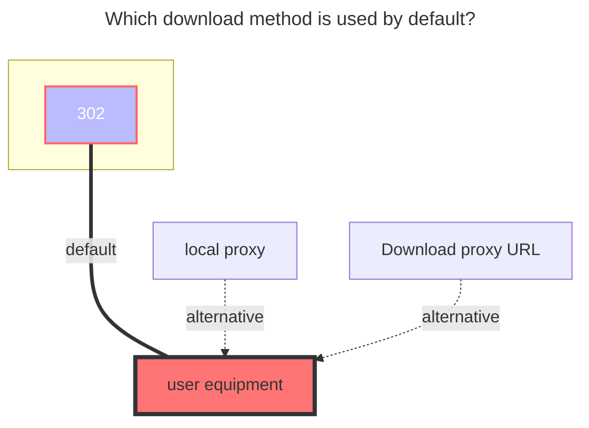
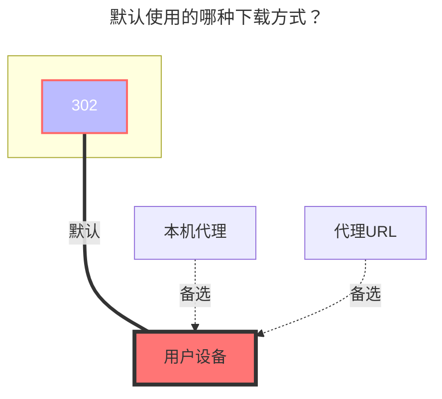

::: en
**Trainbit** official website：https://trainbit.com/
:::
::: zh-CN
**Trainbit** 官网：https://trainbit.com/
:::

## **AUSHELLPORTAL ，Apikey** { lang="en" }

## **AUSHELLPORTAL ，Apikey** { lang="zh-CN" }

::: en
After entering the Trainbit webpage, press F12 to open the developer mode, open any refreshed data in the network option, and then find the one with the Cookie option.
**AUSHELLPORTAL**：`.AUSHELLPORTAL` ` .AUSHELLPORTALws` These two parameters have the same value
**Apikey**：`retkeyapi`
(For specific filling, you can view [fill in the schematic diagram for details](#fill-in-the-example))
:::
::: zh-CN
进入 Trainbit网页后，按F12打开开发者模式 在网络选项中随便打开一个刷新出来的数据，然后找到带有Cookie选项的都可以
填写参数对应的值即可
**AUSHELLPORTAL**：`.AUSHELLPORTAL` ` .AUSHELLPORTALws` 这两个参数的值都一样
**Apikey**：`retkeyapi`
(具体填写可以查看[详情填写示意图](#详情填写示意图))
:::

## **Root folder id** { lang="en" }

## **根文件夹 ID** { lang="zh-CN" }

::: en

- `<directory ID>_<q parameter of directory uploadurl>`
  We open the home page and press F12, open the developer mode, select the network, search the list in the search bar, you can see "`listoffiles`", click, and then select the response to format the value in it yourself (you can also format it without formatting Find it slowly by yourself) [fill in the schematic diagram for details](#fill-in-the-example)
- How to format: search your own browser for json online formatting
  :::
  ::: zh-CN
- `<目录ID>_<目录uploadurl的q参数>`
  我们打开首页按F12，打开开发者模式，选择网络，搜索栏搜索 list，就能看到 "`listoffiles`"，点击，然后选择响应将里面的值，自己去格式化一下（不格式化也能用自己慢慢的寻找）[详情填写示意图](#详情填写示意图)
- 如何格式化：自行浏览器搜索 json在线格式化
  :::

## **matters needing attention** { lang="en" }

## **注意事项** { lang="zh-CN" }

::: en

1. If you uploaded from `OpenList` to `trainbit`, a `.delete_suffix` will be added after the file suffix, don’t worry
2. The official website says that the free user files will be deleted after 15 days of downloading, but the files are not deleted now, just in case, do not store important files, and the files will be lost when the time comes
   :::
   ::: zh-CN
3. 如果你是从`OpenList` 上传到 `trainbit` 的文件后缀后面会增加一个 `.delete_suffix`，不用担心
4. 官网说免费用户文件下载15天后会删除文件，但是现在未进行文件删除，以防万一请勿存放重要文件，到时候导致文件丢失
   :::

## **Fill in the example** { lang="en" }

## **详情填写示意图** { lang="zh-CN" }

::: en

:::
::: zh-CN

:::

### **The default download method used** { lang="en" }

### **默认使用的下载方式** { lang="zh-CN" }

::: en

:::
::: zh-CN

:::
