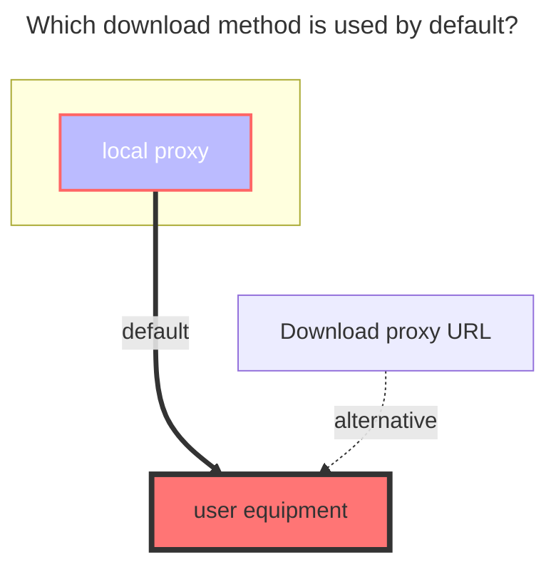
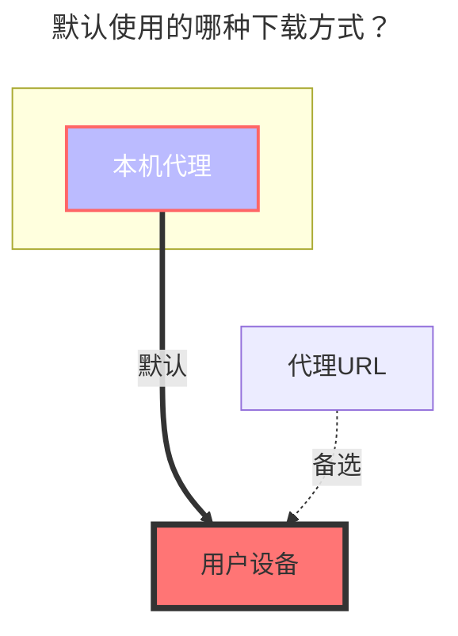
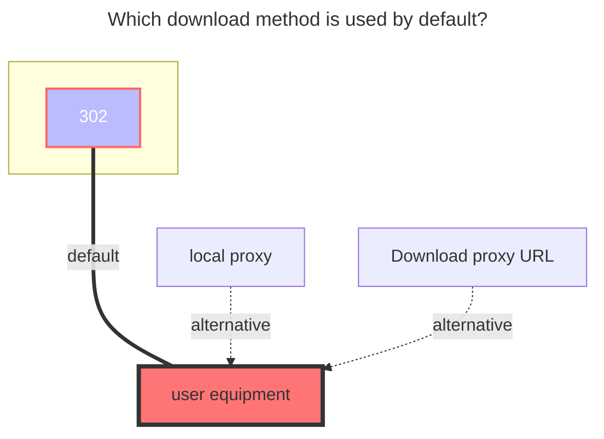
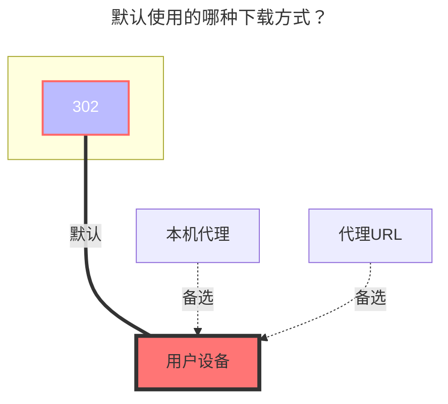

---
title:
  en: UC / TV
  zh-CN: UC / TV
icon: iconfont icon-state
# This control sidebar order
top: 230
# A page can have multiple categories
categories:
  - guide
  - drivers
# A page can have multiple tags
tag:
  - Storage
  - Guide
  - '本地代理'
  - '302'
# this page is sticky in article list
sticky: true
# this page will appear in starred articles
star: true
---

## **UC Cloud** { lang="en" }

## **UC 网盘** { lang="zh-CN" }

::: en
**https://drive.uc.cn/**
 
:::
::: zh-CN
**https://drive.uc.cn/**
 
:::

### **Cookie** { lang="en" }

### **Cookie** { lang="zh-CN" }

::: en
Press F12 to open "Debug", select "Network", select any request on the left, and find the one with the `Cookie` parameter.

 
:::
::: zh-CN
在 `F12`任意请求中找到携带 `Cookie` 的值

 
:::

### **Root Folder ID** { lang="en" }

### **根文件夹ID** { lang="zh-CN" }

::: en
Root Folder ID is `0`

- After entering the folder, get the directory ID in the top address bar. If the subdirectory is deeper, the directory ID will be at the back of the address bar. Just write the subdirectory ID you want to mount.
  
   
  :::
  ::: zh-CN
  根目录ID为 `0`
- 子文件夹ID进入文件夹后顶部地址栏获取目录ID，如果子目录越深目录ID在地址栏越靠后，想挂载哪个子目录就写那个子目录ID就可以
  
   
  :::

### **The default download method used** { lang="en" }

### **默认使用的下载方式** { lang="zh-CN" }

::: en

:::
::: zh-CN

:::

## **UC TV** { lang="en" }

## **UC TV** { lang="zh-CN" }

::: en
The TV version supports `302`, but only `List` and `Download` operations are supported. Other operations are not supported (the interface does not support it).
 
:::
::: zh-CN
TV 版支持 `302`，但是只能 `访问` 和 `下载` 两个操作，其它操作不支持(接口不支持)
 
:::

### **Add method** { lang="en" }

### **添加方式** { lang="zh-CN" }

::: en

1. Select the `UC TV` driver, fill in the mounting path, and then save
2. Return to the all driver page and use the mobile APP to scan the QR code (If the QR code is not displayed, click on `Table Layout` in the upper right corner of the driver to switch from list mode to table mode)
3. After scanning the QR code to confirm, disable the driver, then enable the `driver` to use it.
   - `Refresh token`、`Device id`、`Query token`,It will be filled in automatically, no manual filling is required - Please do not edit manually and modify it
     
      

:::

::: zh-CN 4. 选择 `UCTV` 驱动，填写挂载路径，然后保存5. 返回全部驱动页面，使用手机APP扫描二维码（如果不显示二维码，驱动右上角点击点击`表格布局` 从列表模式切换成表格模式）6. 扫码确认后，禁用驱动，再启用`驱动`即可使用

- `Refresh token 刷新令牌`、`Device id 设备ID `、`Query token` 会自动填充，不需要人工填写 - 请不要进行编辑手动修改
  
   

:::

### **Root Folder ID** { lang="en" }

### **根文件夹ID** { lang="zh-CN" }

::: en
Root Folder ID is `0`

- After entering the folder, get the directory ID in the top address bar. If the subdirectory is deeper, the directory ID will be at the back of the address bar. Just write the subdirectory ID you want to mount.
  
   
  :::
  ::: zh-CN
  要挂载的根文件夹，默认为`0`
- 子文件夹ID进入文件夹后顶部地址栏获取目录ID，如果子目录越深目录ID在地址栏越靠后
  
   
  :::

### **The default download method used** { lang="en" }

### **默认使用的下载方式** { lang="zh-CN" }

::: en

:::
::: zh-CN

:::
